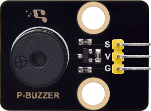
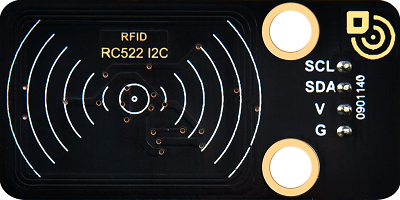
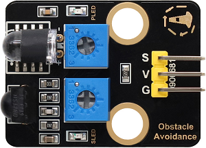
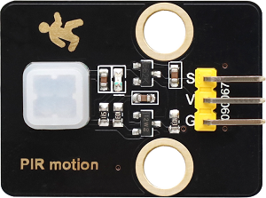
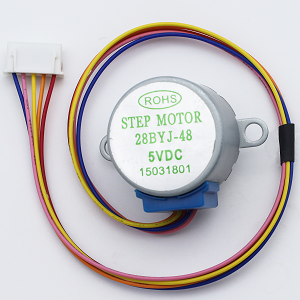
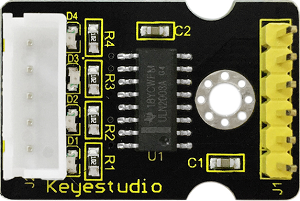
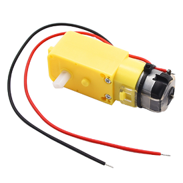
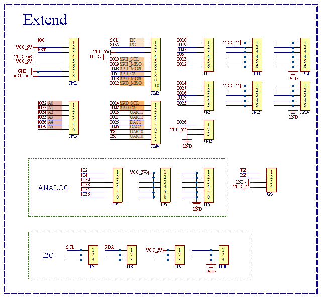
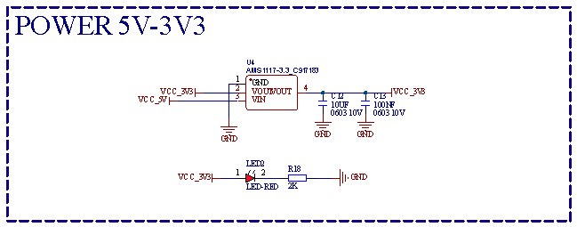

## 1. Introduction

### 1.1 Introduction

The Smart School Learning Kit is a STEAM educational kit specially designed for primary and secondary school students, which perfectly integrates traditional woodcraft with modern electronic technology. Students can learn the application of sensors, the principles of the Internet of Things and smart control technology by building a miniature basswood school model by themselves, and experience the charm of technology in the process of creation.

### 1.2 Kit List

| N.O. |                             NAME                             | QTY  |                     PIC                      |
| :--: | :----------------------------------------------------------: | :--: | :------------------------------------------: |
|  1   |                      development board                       |  1   |                   |
|  2   |                         6812 RGB LED                         |  1   |                   |
|  3   |                        passive buzzer                        |  1   |                   |
|  4   |            AHT20 temperature and humidity sensor             |  1   |                   |
|  5   |                       white LED module                       |  1   |                   |
|  6   |                        button module                         |  1   |                   |
|  7   |                        photoresistor                         |  1   |                   |
|  8   |                         RFID module                          |  1   |                   |
|  9   |                          180° servo                          |  1   |                     |
|  10  |                  obstacle avoidance sensor                   |  1   |                   |
|  11  |                  ENS160 air quality sensor                   |  1   |                   |
|  12  |                         OLED module                          |  1   |                     |
|  13  |                      PIR motion sensor                       |  1   |                   |
|  14  |                    28BYJ-48 stepper motor                    |  1   |               |
|  15  |                  stepper motor drive board                   |  1   |                   |
|  16  |                            motor                             |  1   |                   |
|  17  |                      motor drive board                       |  1   |                   |
|  18  |                     servo control module                     |  1   |                     |
|  19  |                            camera                            |  1   |                   |
|  20  |                        battery holder                        |  1   |                   |
|  21  |                           IC card                            |  1   |               |
|  22  |                      3P F-F wire 200mm                       |  5   |                       |
|  23  |                      3P F-F wire 250mm                       |  2   |                       |
|  24  |                      4P M-F wire 150mm                       |  1   |                       |
|  25  |                      4P F-F wire 200mm                       |  2   |                       |
|  26  |                      4P F-F wire 350mm                       |  1   |                       |
|  27  |                      4P F-F wire 400mm                       |  1   |                       |
|  28  |                    4P HX-2.54 wire 150mm                     |  1   |                     |
|  29  |               2P M-F wire 200mm (random color)               |  1   |                       |
|  30  |               6P F-F wire 150mm (random color)               |  1   |                       |
|  31  |                     Phillips screwdriver                     |  1   |         |
|  32  |                    flat head screwdriver                     |  1   |         |
|  33  |                         rubber belt                          |  2   |                     |
|  34  |                          sticker 1                           |  1   |                         |
|  35  |                          sticker 2                           |  1   |                         |
|  36  |                           tweezers                           |  1   |                 |
|  37  |                          card paper                          |  1   |                   |
|  38  |                        basswood board                        |  1   |                         |
|  39  |                       acrylic board 1                        |  1   |                 |
|  40  |                       acrylic board 2                        |  1   |                 |
|  41  |                  M1.2*4 self tapping screw                   |  4   |                     |
|  42  |                         M2*8MM screw                         |  3   |                         |
|  43  |                         M3*6MM screw                         |  8   |                         |
|  44  |                            M2 nut                            |  2   |                           |
|  45  |                    M3*10MM copper pillar                     |  4   |                       |
|  46  |                            wheel                             |  3   |                         |
|  47  |                            shaft                             |  3   |                       |
|  48  |                         shaft shield                         |  2   |                           |
|  49  |                      R4060 nylon rivet                       |  22  |                     |
|  50  |                      R3550 nylon rivet                       |  2   |        |
|  51  |                      R3075 nylon rivet                       |  4   |                       |
|  52  |                      R3065 nylon rxivet                      |  2   |                     |
|  53  |                       mini basketball                        |  1   |           |
|  54  |                        auxiliary part                        |  1   |  |
|  55  | AA battery provide for yourself |  6   |                   |

### 1.3 Parameters

#### Description

Based on ESP32, this development board integrates ESP32-WROOM-32 module, a universal WIFI and Bluetooth development board with pins compatible with Arduino. It comes with a rich array of peripherals, including Hall sensors, high-speed SDIO/SPI, UART, I2S and I2C, etc. Besides, it can be equipped the freeRTOS operating system, making it highly suitable for IoT and smart home.

#### Parameters

| Parameter                        | Specification      |
| -------------------------------- | ------------------ |
| Output voltage                   | 3.3V-5V            |
| Output current                   | MAX: 1.2A          |
| Maximum power                    | maximum output 10W |
| Operating temperature            | -10~50             |
| Dimensions                       | 70 * 53 * 14.5mm   |
| Weights                          | 25.5g              |
| Environment protection attribute | ROHS               |

* Introduce the interfaces of the development board and the expansion board.
* The sensor parameters of sensors and modules are placed in their respective tutorials.
* Precautions are included when necessary to prevent accidental damage to the product.

#### Pin Diagram

#### Schematic Diagram

