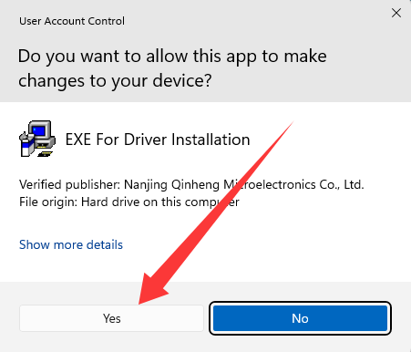
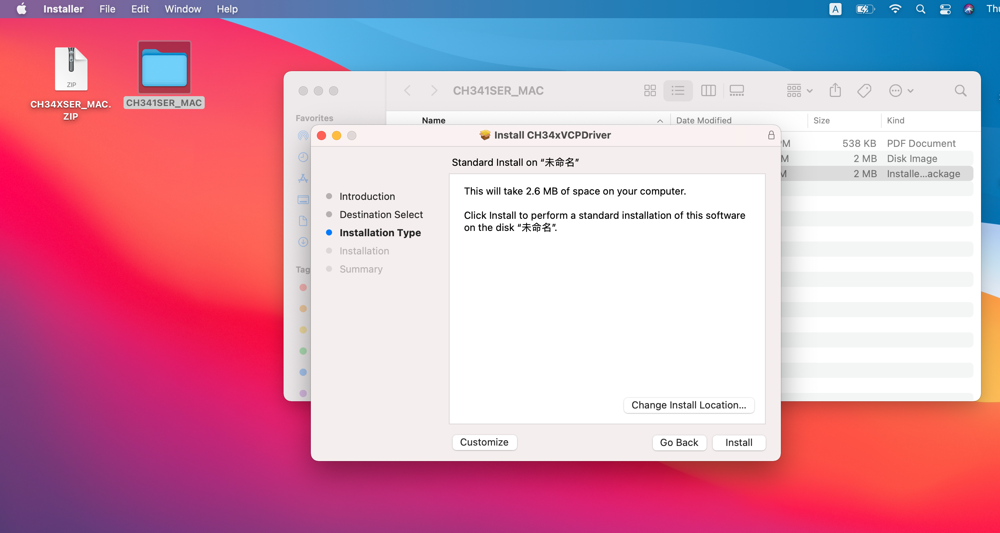

# 3. Driver Installation (Optional)

*This section is not mandatory. It should only be used when the main board cannot be recognized by your computer. If it is, just skip this part!*

(Note: If the main board cannot be recognized in Arduino or kidsblock projects, please check whether the board is connected properly, or try other USB port on your computer. If it still does not work, follow these steps to install driver.)

## 3.1 For Windows System

Connect the main board to the computer:

Open “Device Manager”.

As shown below, once the computer has automatically installed the driver, you can skip this step.

While this figure indicates that the computer does not install the driver so you need to install it manually.

1\. After downloading the driver, extract it.

Click to download the [Windows Driver](./Windows.7z).

2\. Open the folder and click “SETUP”.

3\. “ YES ”.

4\. “ INSTALL ”.

5\. The driver is installed.

## 3.2 For Mac System

Click to download the [Mac Driver](./Mac.7z).

1\. After downloading the driver, click the “**.pkg**” file.

2\. “**Continue**”.

3\. “**Install**”.

4\. Enter your lock screen password to “**Install Software**”.

5\. Wait for a while. The driver is installed.

