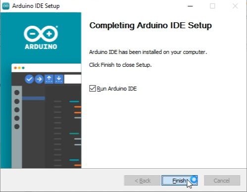
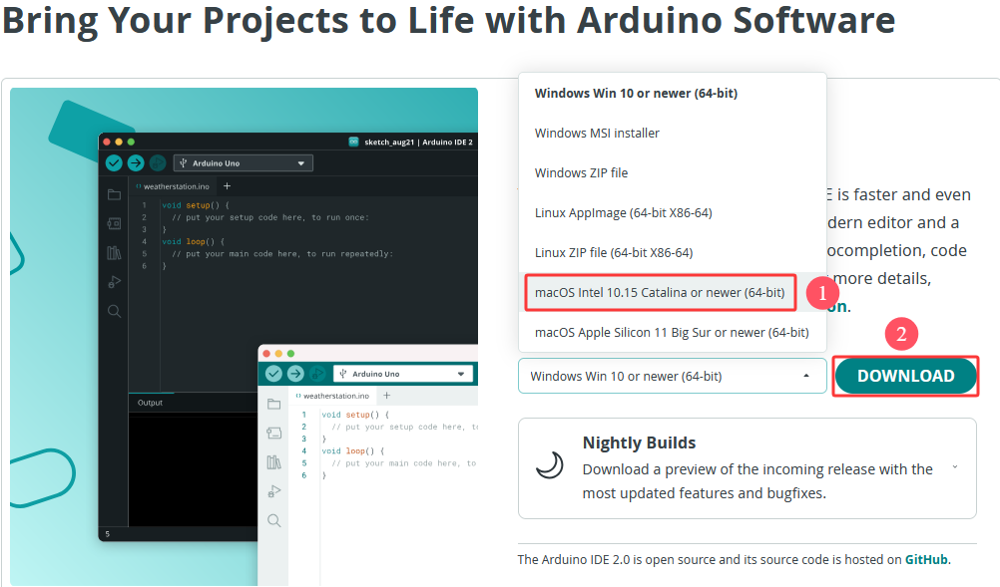
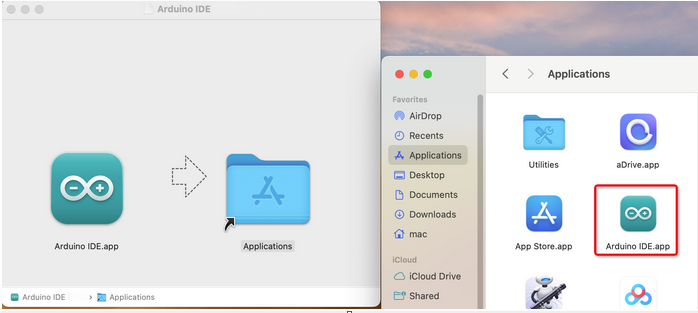
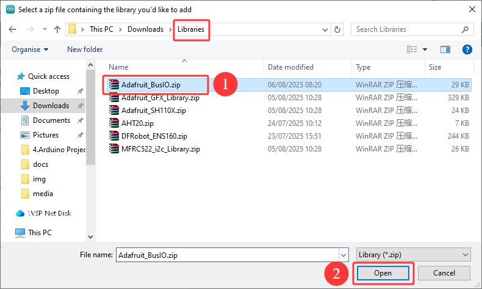

## 1. About Arduino IDE

Arduino IDE is an integrated development environment dedicated to Arduino which is an open-source electronics platform based on easy-to-read interface and simplified programming process, aimed at students without a background in electronics. 

Its clear interface, syntax highlighting and auto-completion functions make the programming process easy and enjoyable. It also offers a wealth of tutorials, sample codes, and community support to help beginners get started quickly and solve practical  problems.

Importantly, it is published as an open source tool. Therefore,  it not only accelerates users own learning process by utilizing and referring others’ works, it is also available for extension experienced programmers to freely access, modify and distribute codes.

In one word, Arduino IDE is easy-to-use for beginners, yet flexible enough for advanced users to take advantage of as well.

## 2. For Windows

**Attention please, the Arduino IDE version used here is 2.3.6. For other versions, the provided codes may not be compiled or uploaded.** 

### 2.1 Download Arduino IDE

Enter Arduino official to download [Software | Arduino](https://www.arduino.cc/en/software/).

Arduino boasts multiple versions such as Widows, mac and Linux(as shown below), please ensure that the one you download is compatible with your computer.

Here, we will take **Windows Win 10 or newer(64-bit)** as an example to introduce how to download it. You may also choose the **Windows ZIP file**.


Two versions are provided for Windows: for installing(Windows Win 10 or newer(64-bit)) and for downloading(Windows ZIP file, a zipped file, no need to install).

### 2.2 Install Arduino IDE

1\. Save the .exe file downloaded from the software page to your hard drive and simply run the file.


2\. Read the License Agreement and agree it.


3\. Choose the installation options.


4\. Choose the installation location.


5\. Click “finish” and run Arduino IDE.



## 3. For MacOS

### 3.1 Download Arduino IDE

Enter Arduino official to download [Software | Arduino](https://www.arduino.cc/en/software/).

Similar to Windows, here we will take **macOS Intel 10.15 Catalina or newer(64-bit)** as an example to introduce how to download it. You may also choose the **macOS Apple Silicon 11 Big Sur or newer(64-bit)**.



### 3.2 Install Arduino IDE

After then, click the file `arduino_ide_xxxx.dmg` and follow the instruction: copy and pastes the  **Arduino IDE.app** into **Applications**. A couple of seconds later, you can see the Arduino IDE icon.



## 4. Arduino IDE Language

⚠️ **Note that for different systems such as Windows and MAC, the language setting methods are not the same. The followings can be used as a reference.**

1\. Open Arduino IDE.


2\. Click “**File** ——>**Preferences...**”. In **Preferences**, click “**English**” to select a familiar language and “**OK**”.


## 5. Arduino IDE Page


1. **File** - includes new Sketch, open Sketch, open recently used code, open sample code, close the IDE, save code, preferences, advanced Settings, etc.
2. **Edit** - includes copy, paste, automatic formatting, font size, etc. (shortcut keys are recommended).
3. **Sketch** - includes verify\compile, upload code, import library and so on.
4. **Tools** - The most important two are development board and port.
5. **Help** - Views the IDE version and official reference documents.
6. **Open Serial Plotter** - displays serial data in a method of line graph
7. **Open Serial Monitor** - opens the Serial Monitor tool, as a new tab in the console.
8. **Verify** - compiles your code to your Arduino Board.
9. **Verify / Upload** - compiles and uploads your code to your Arduino Board.
10. **Sketchbook** - here you will find all of your sketches locally stored on your computer. Additionally, you can sync with the Arduino Cloud, and also obtain your sketches from the online environment.
11. **Boards Manager** - install or remove Arduino Boards .
12. **Library Manager** - browse through thousands of Arduino libraries or import local libraries
13. **Debugger** - test and debug programs in real time.
14. **Search** - search for keywords in your code.
15. **Code editing area**
16. **IDE prompt area** (Uploading fails or succeeds) & **Serial monitor display area**

## 6. Import Library (Important)

⚠️ **Note: For different systems such as Windows and MAC, the methods for importing library files are similar and can be referred to each other. Here, we take the Windows as an example.**

### 6.1 What are Libraries?

A library is a collection of codes, and it facilitates the connection of sensors, displays and modules. 

When you see “No such file or directory”, oops, libraries are missing! 

### 6.2 How to Install the Libraries?

We take “Adafruit_BusIO” as an example.

1\. Click **“Sketch” --> “Include Library” --> “Add .ZIP Library...”**


2\. Locate in the directory of library files (Download the file from `4.1 Resources Download`) and open `libraries` folder to select `Adafruit_BusIO.zip` file.



3\. After that, you will see “**Library installed**”. You can use this library directly next time you need it.


4\. Import the rest libraries as well.

## 7. Install ESP32 Board(Important)

⚠️ **Attention: a VPN is required for domestic users when they are downloading and installing the ESP32 development board. In this way, it will be easier to download.**

### 7.1 For Windows

We cannot find the ESP32 development board in “Tools”→ “Development Board” because we haven’t added this board. 

**Install ESP32 board:**

1\. Open Arduino IDE.


2\. Click “**File → Preferences**”. Add the link `https://espressif.github.io/arduino-esp32/package_esp32_index.json` in **Additional boards manager URLs** and click **OK**.


3\. “**OK**”.


4\. Select the icon of board manager.


5\. Search for “**ESP32**” and install the latest version. The installation progress can be seen in the lower right corner. **Please keep the network stable during the installation. If the installation fails, please repeat the above steps and reinstall the development board.**

⚠️ **Note that here we adopt ESP32 3.2.1 version of the ESP32. Codes may be Incompatible if you choose other versions.**


⚠️ **If you are unable to download and install the ESP32 development board due to network issues, we also provide a package of it**. 

**ESP32 package download**: [https://pan.baidu.com/s/10mfU2_aNru2dizP0vAFXlw?pwd=95ih](https://pan.baidu.com/s/10mfU2_aNru2dizP0vAFXlw?pwd=95ih) 

**Passwords: 95ih**

**After downloading and decompressing, add this folder along the following path. The ESP32 development board generally needs to be stored in the following path to be installed properly.**

- **Windows** : C:\Users\your username\AppData\Local\Arduino15\packages. 

	Among them, AppData is a hidden folder so you need to enable “Show Hidden Files, Folders and Drives” to view it.

⚠️ **Note:** “your username” refers to the user name you set when installing the computer. If it is not set, it is usually Administrator.

- **MacOS** : ~/Library/Arduino15/packages. 

	Library is also a hidden folder. You can access it by the shortcut key Command + Shift + G in “**Finder**” and then entering the path.

- **Linux** : ~/.arduino15/packages.

6\. After installation, restart the Arduino IDE, and then click “**Tools**” → “**Board:**”. And you can see the installed ESP32 development board as shown below.


### 7.2 For MAC

Now let’s install ESP32 board on Arduino IDE.

**Install ESP32 board:**

1\. Open Arduino IDE. 

Click “**File → Preferences**”. Add the link `https://espressif.github.io/arduino-esp32/package_esp32_index.json` in **Additional boards manager URLs** and click **OK**.


3\. And “**OK**”


4\. Click “**Tools**” ——> “**Board**”  ——> “**Board Manager...**”.


5\. Search for “**ESP32**” and install the latest version. The installation progress can be seen in the lower right corner. **Please keep the network stable during the installation. If the installation fails, please repeat the above steps and reinstall the development board.**

⚠️ **Note that here we adopt ESP32 3.2.1 version of the ESP32. Codes may be Incompatible if you choose other versions.**


6\. After installation, restart the Arduino IDE, and then click “**Tools**” → “**Board:**”. And you can see the installed ESP32 development board as shown below.


## 8. Upload Code on Arduino IDE

Connect ESP32 board to your computer via the USB cable.


Open Arduino IDE to select ESP32 board.


Choose COM port. You may check your port number at Device Manager. If there are many COM ports, unplug the cable of board to see which port disappears. Then that one is the port ready to use. If there is no COM port, please check whether driver is installed.


Herein, our COM port is COM25. Click “Tools” → “Port” → “COM25”.


When the board is connected, both of these places appear its model. Here we provide a sample code that prints “Hello Keyestudio!” once per second in the serial monitor.

Copy and paste the following code to Arduino IDE.

```c
void setup() {  
    // Put your setting code here and run it once:
    Serial.begin(9600);  //Set the serial port baud rate to 9600
}

void loop() {  
    // Place the main code here for repeated running:
    Serial.println("Hello Keyes!");  //Serial port printing
 	delay(1000);  //Delay by 1 second
}
```


Click  to compile and upload code. Two prompts will appear after upload is successful:


After that, click  to show serial monitor and set baud rate to **9600**. You will see “**Hello Keyes!**” on the monitor.


1. **Toggle Auto-scroll** - Sets whether the prints scroll automatically
2. **Toggle Timestamp** - Sets whether to display print time
3. **Clear Output** - Clears printed messages
4. **Serial Input**
5. **Serial Output Format**
6. **Baud Rate** - Sets the baud rate you need
7. **Printing Window**

---------------