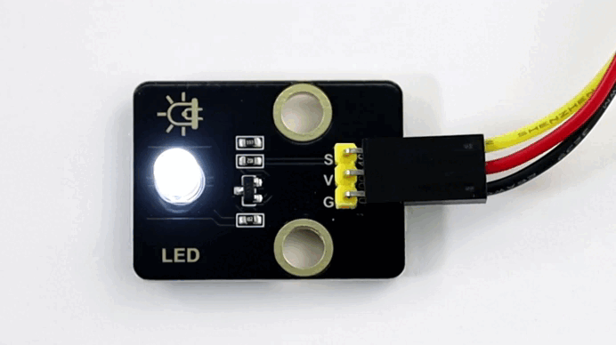
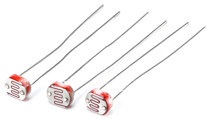
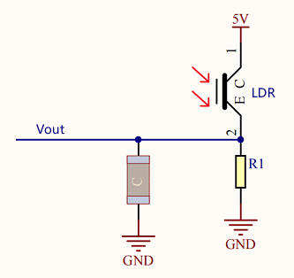

## 1. School Smart Energy-saving Lamp

In this project, we use an LED and a photoresistor to build a model of an smart energy-saving street lamp. Herein, we will explore the principle of light control and experience how technology contributes to a green school.

### 1.1 White LED Module

LED (Light-Emitting Diode) can efficiently convert electrical energy into light energy and is a commonly used light-emitting device.


#### Parameters

Operating voltage: DC 3.3-5V

Operating current: 1.5mA (peak 2.3mA)

Maximum power: 0.07W

Control signal: Digital signal

Dimensions: 32 x 23 x 12mm

Positioning hole: Diameter of 4.8mm

Interface: 3-pin curved pin interface spacing 2.54mm


#### Principle

For this kind of simple LED module, high and low levels of the main board can directly control its on and off.

**Turn on LED at high:**

- When the input signal is at a high level (3.3V or 5V), the drive circuit will be conducted, lighting up the LED.

**Turn off LED at low:**

- When the input signal is at a low level (0V), the drive circuit will be cut off, so the power supply will be severed to turn off the LED.


#### Test Code

```c++
int ledPin = 12;  // Define the variable ledPin, connect LED to pin 12

void setup() {
  pinMode(ledPin, OUTPUT);  // Set pin 12 to output mode
}

void loop() {
  digitalWrite(ledPin, HIGH);  // Turn on the LED
  delay(1000);                 // Delay 1s
  digitalWrite(ledPin, LOW);   // Turn off the LED
  delay(1000);                 // Delay 1s
}
```


#### Code Explanation

**1. Pin Definition**

``` 
int ledPin = 12;
```

- Define the variable `ledPin`, which means that we connect the LED to pin GPIO12.

<br>

**2.   Initialization (setup runs only once)**

```c++
pinMode(ledPin, OUTPUT);
```

- Set `ledPin`(pin GPIO12) to output mode to control the LED.

<br>

**3.  Main Loop (loop)**

```c++
digitalWrite(ledPin, HIGH);
```

- Output a high level to `ledPin` to turn on the LED.

```c++
digitalWrite(ledPin, LOW);
```

- Output a low level to `ledPin` to turn off the LED.

```c++
delay(1000);
```

- Delay the program for 1 second to maintain the state of the LED(on or off).


#### Test Result

After uploading the code, the white LED will flash with an interval of 1 second:

- On for 1s → Off for 1s → On for 1s → Off for 1s → …in a loop.



---

### 1.2 Photoresistor Module

A photoresistor is an electronic component that detects the intensity of ambient light. It can convert the light intensity into an electrical signal, so it is often used in scenarios such as automatic lighting control and environment monitoring.


#### Parameters

Operating voltage: DC 3.3-5V

Current: 20 mA

Maximum power: 0.1W

Operating temperature: -10°C to +50°C

Output signal: Analog signal

Dimensions: 32 x 23 x 8mm

Positioning hole size: Diameter of 4.8mm

Interface: 3-pin curved pin interface spacing 2.54mm


#### Principle



The photoresistor outputs **analog** signals (continuously varying voltage), while the ESP32 needs to convert them into **digital** ones through an **ADC** for processing by the program.

- **What is ADC?**

	An ADC is a device that converts analog signals (continuous) into digital ones (discrete). In an MCU system, it converts signals from sensors or other analog devices into digital data that the MCU can process.

	

**Signal output of the photoresistor**

A photoresistor module typically includes:

- **photoresistor (the brighter the light is, the lower the resistance will be)**
- Voltage divider circuit (convert resistance changes into voltage ones)

**Working principle of a voltage divider circuit**



- The output voltage (Vout) at both ends of the photoresistor:

  <font face="courier New" color="black" size=5.5>$Vout = VCC ×（\frac {R_{LDR}}{R_1 + R_{LDR}}）$ </font> 

- Ambient light changes → R_light changes → V_out changes:

  - Get brighter → $R_{LDR}$ ↓ → $V_{out}$ ↓ 
  - Get darker → $R_{LDR}$ ↑ → $V_{out}$ ↑


#### Test Code

```c++
// Define the analog pin of the photoresistor
const int lightSensorPin = 34;

void setup() {
  // Set baud rate to 115200
  Serial.begin(115200);
}

void loop() {
  // Read the analog value of the photoresistor（0~4095）
  int sensorValue = analogRead(lightSensorPin);

  // Convert the analog value to voltage value（0~3.3V）
  float voltage = sensorValue * (3.3 / 4095.0);

  // Print the read value on the serial monitor
  Serial.print("light intensity value: ");
  Serial.print(sensorValue);
  Serial.print("\t voltage value: ");
  Serial.println(voltage);

  // Delay 500 ms to avoid too fast refreshing
  delay(500);
}
```


#### Code Explanation

**1. Pin Definition**

```c++
const int lightSensorPin = 34;
```

- Define the analog pin of the photoresistor to pin 34

  `const` indicates that this value will not change during the whole program.

<br>

**2.   Initialization (setup runs only once)**

```c++
Serial.begin(115200);
```

- Initialize the serial communication and set the baud rate to 115200

  This function runs only once when the development board is powered on or reset.

  Note: It needs to be consistent with the baud rate of the serial monitor.

<br>

**3.  Main Loop (loop)**

```c++
void loop() {
  // Read the analog value of the photoresistor（0~4095）
  int sensorValue = analogRead(lightSensorPin);

  // Convert the analog value to voltage value（0~3.3V）
  float voltage = sensorValue * (3.3 / 4095.0);

  // Print the read value on the serial monitor
  Serial.print("light intensity value: ");
  Serial.print(sensorValue);
  Serial.print("\t voltage value: ");
  Serial.println(voltage);

  // Delay 500 ms to avoid too fast refreshing
  delay(500);
}
```

```c++
int sensorValue = analogRead(lightSensorPin);
```

- `analogRead()` calls the ADC of ESP32 and returns the digital value(0 to 4095) of the output voltage of the photoresistor voltage divider circuit after conversion by the ADC.
- `sensorValue` is the quantization of the ADC on the analog signal of the module. The value is inversely proportional to the light intensity (the brighter the light is, the smaller the value will be).

```c++
sensorValue * (3.3 / 4095.0)
```

- Convert the digital value to the actual voltage value.

- Convert the digital value read by the ADC(`sensorValue`) to the actual voltage value(`voltage`):

  <font face="courier New" color="black" size=5.5>$voltage = sensorValue ×（\frac {Reference Voltage}{ADCmax}）$ </font> 

  For our main board:

  - Reference voltage = 3.3V
  - ADC maximum value = 4095

  

```c++
Serial.print("light intensity value: ");
```

- Send the string `"light intensity value: "` to the serial monitor. Output the data *without wrapping*.

  

```c++
Serial.print(sensorValue);
```

- Send the variable `sensorValue` to the serial monitor. Output the data *without wrapping*.

  

```c++
Serial.print("\t voltage value: ");
```

- Send the string `"\t voltage value: "` to the serial monitor. Output the data *without wrapping*.

  `\t` is a TAB character used to insert a space in the output, aligning the data to make the output neater and more readable.
  
  
  
   

```c++
Serial.print(voltage);
```

- Send the variable `voltage` to the serial monitor. Output the data with wrapping so that the next output can start from a new line.

  


#### Test Result

After uploading the code, open the serial monitor and set the baud rate to 115200.

Cover the photoresistor with your hand and then slowly move away, and you will see the serial monitor shows:


Summary:

- When the light intensity increases, the analog value(0-4095) output by the sensor increases, so do the voltage value(0-3.3V).
- When the light intensity decreases, the analog value and voltage value output by the sensor also decrease.

---

### 1.3 Smart Energy-saving Lamp

In the previous two sections, we have already learned the basic principles and usage methods of LED module and photoresistor. Now, let’s combine them to make a smart energy-saving street lamp for the school by ourselves! Herein, we will realize an intelligent system that can automatically adjust the lighting according to the intensity of the ambient light, which is both energy-saving and environment-friendly, as well as full of a sense of technology.

Next, we will gradually complete the code writing and debugging to ultimately create a practical prototype of a smart street lamp. Now let’s embark on this journey full of creativity and challenges together!

==Photos of basswood boards==


#### Code Flow


#### Test Code

```c++
const int lightSensorPin = 34;  // Photoresistor pin
const int ledPin = 12;          // LED pin
const int threshold = 2000;     // Light intensity threshold

void setup() {
  Serial.begin(115200);
  pinMode(ledPin, OUTPUT);  // Set LED pin to output mode
}

void loop() {
  int sensorValue = analogRead(lightSensorPin);  // Read the light intensity value

  Serial.printf("light intensity value: %d \t voltage value: %.2f\n", sensorValue, voltage);

  // Control the LED according to the light intensity
  if (sensorValue < threshold) {
    digitalWrite(ledPin, HIGH);  // Turn on LED
  } else {
    digitalWrite(ledPin, LOW);   // Turn off LED
  }

  delay(500);
}
```


#### Code Explanation

```c++
Serial.printf("light intensity value: %d \t voltage value: %.2f\n", sensorValue, voltage);
```

- This is a line of code based on formatted output, which is used to output the values of multiple variables to the serial monitor in the specified format by serial communication.

- ① `Serial.printf()`

  - Function: Format output function.
  - Parameters:
    - The first parameter is a formatting string, which is used to specify the format of the output.
    - The parameters following are the variables to be output, corresponding one-to-one with the placeholders in the formatted string.
  - Return value: None.
  
  ② Format string
  
  - `"light intensity value: %d \t voltage value: %.2f\n"`
    - `%d`: Placeholder, indicating the output of an integer (`int`)
    - `%f`: Placeholder, indicating the output of a floating-point number (`float`)
    - `%.2f`: The output floating-point number is retained to two decimal places
    - `\t`: TAB character, used to insert a space in the output (align data)
    - `\n`: A newline character, used to break lines after output

```c++
   if (sensorValue < threshold) {
       digitalWrite(ledPin, HIGH);  // Turn on LED
     } else {
       digitalWrite(ledPin, LOW);   // Turn off LED
     }
```

   - This is a simple conditional control statement, which is used to compare the value read by the sensor(`sensorValue`) with the set threshold(`threshold`), thereby controlling the on/off of the LED. The threshold can be adjusted according to the actual situation.
     - When the light intensity is below the threshold, the LED will automatically light up.
     - When it exceeds the threshold, the LED will automatically turn off.


#### Test Result

After uploading the code, turn on the LED when the light intensity  is below the threshold; Turn off the LED when the light intensity exceeds the threshold, so as to save energy.

==动图==

The smart energy-saving street lamp is now complete. Let’s combine technology to green school together and contribute to environment protection!