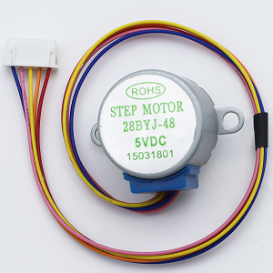
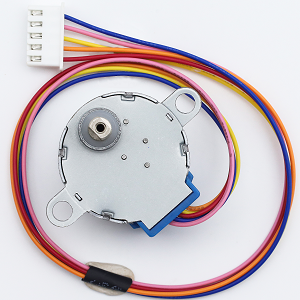
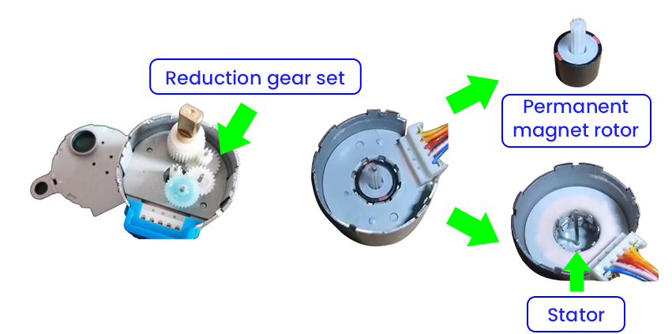
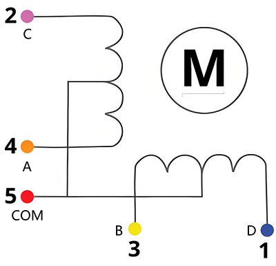
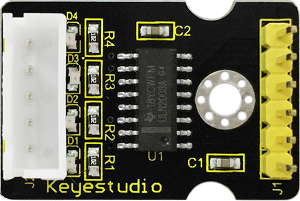
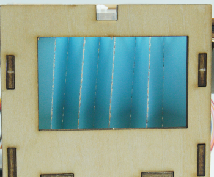
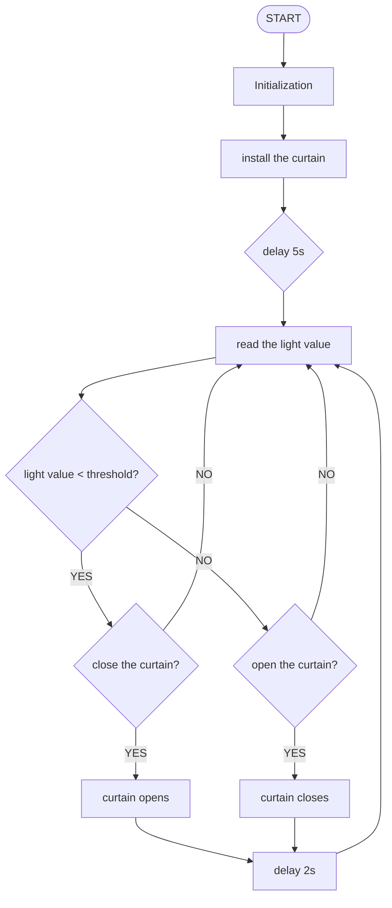

## 10. Light Control Automatic Curtain

In this project, we are going to make a light-controlled automatic curtain system. When the light becomes brighter, the photoresistor will detect the change like sharp eyes, and the stepper motor will open the curtain. When the light dims, it will quietly close the curtains, just like a considerate little light butler!

### 10.1 Stepper Motor

28BYJ-48 is an economical and practical 5-wire 4-phase reduction stepper motor with a built-in 1/64 reduction gearbox. It is able to provide high torque and precise stepper control, so is often used in smart homes, teaching experiments, and small automation projects.




#### Parameters

Operating voltage: DC 5V

Phase: 4 phases (5-wire system: 4 phases +1 common terminal)

Winding resistance: 50Ω±10% (per phase)

Drive mode: Unipolar drive

Reduction ratio: 1:64

Output shaft step angle: 5.625°

Theoretical steps: 64 steps (input shaft) →4096 steps per turn (output shaft)

Actual common number of steps: 2038 steps per turn (engineering approximation due to gear clearance)

Motor diameter: 28mm

Shaft length: 8mm (output shaft)

Wire sequence: Red(COM), orange(A), yellow(B), pink(C), blue(D)


#### Principle

**1. The basic structure of the motor**



28BYJ-48 is a unipolar permanent magnet stepper motor (with a reduction gear set), including:

- Stator: 4 groups of coils (8 wires)
- Rotor: Permanent magnet (Decelerated output through gear set)
- Reduction ratio: 1:64 (For each full rotation of the actual output shaft, the rotor needs to rotate 64 times.)
- Step angle: 5.625°/64 ≈ 0.088°/step (After deceleration)

**2. Core of the driving principle**

Generate a rotating magnetic field by alternately exciting the stator coils, so the permanent magnet rotor is attracted to rotate:

**Coil connection method (unipolar 5-wire) :**



There are a total of 5 wires: 4 coil ends + 1 common end.

**Working mode:**

Full-step mode: Only one coil is activated each time(2048 steps/turn), with a step angle of 5.625°, 64 steps/turn(rotor).

- e.g. A → B → C → D → A... (Forward rotation)

	e.g. A → D → C → B → A... (Reverse rotation)

1. Avoid blockage: It may burn out the coil
2. Minimum speed limit: Vibration may occur if below 5RPM
3. It requires a circuit for jitter elimination: There is hysteresis in the mechanical gears
4. Do not directly (un)plug the wires: it may generate a counter electromotive force


#### ULN2003 Drive Module



Since driving the 28BYJ-48 stepper motor requires a large current of over 300mA, while the GPIO pins of the ESP32 board can only output a maximum current of 40mA, the ULN2003 drive board is adopted to amplify the current signal and protect the main board.


#### Test Code

```c++
#include <Stepper.h>             // provide the basic functions for controlling stepper motor

// motor parameters（28BYJ-48）
const int STEPS_PER_REV = 2038;  // Actual steps/turn (may vary by motor)
const int MOTOR_PIN1 = 14;       // IN1
const int MOTOR_PIN2 = 27;       // IN2
const int MOTOR_PIN3 = 16;       // IN3
const int MOTOR_PIN4 = 17;       // IN4

// User-adjustable parameters
int motorSpeed = 10;      // Rotational speed(RPM). It is recommended to set it at 5-12. If it exceeds 15, it is very likely to get stuck.
int rotationCount = 2;    // the number of rotation turns
bool reverseDirection = false; // Reverse flag position

// Initialize the stepper motor (note the pin sequence: IN1-IN3-IN2-IN4)
Stepper myStepper(STEPS_PER_REV, MOTOR_PIN1, MOTOR_PIN3, MOTOR_PIN2, MOTOR_PIN4);

void setup() {
  Serial.begin(115200);
}

void loop() {
  // reversal test
  Serial.println("Open curtain");
  rotateMotor(rotationCount, true);
  delay(1000);

  // forward test
  Serial.println("Close curtain");
  rotateMotor(rotationCount, false);
  delay(1000);  // pause for 1s
}

// Motor rotation function
void rotateMotor(int turns, bool reverse) {
  myStepper.setSpeed(motorSpeed);
  int steps = STEPS_PER_REV * turns * (reverse ? -1 : 1);
  myStepper.step(steps);
}
```


#### Code Explanation

**1. Header files and parameters**

```c++
#include <Stepper.h>             // provide the basic functions for controlling stepper motor

// motor parameters（28BYJ-48）
const int STEPS_PER_REV = 2038;  // Actual steps/turn (may vary by motor)
const int MOTOR_PIN1 = 14;       // IN1
const int MOTOR_PIN2 = 27;       // IN2
const int MOTOR_PIN3 = 16;       // IN3
const int MOTOR_PIN4 = 17;       // IN4

// User-adjustable parameters
int motorSpeed = 10;      // Rotational speed(RPM). It is recommended to set it at 5-12. If it exceeds 15, it is very likely to get stuck.
int rotationCount = 2;    // the number of rotation turns
bool reverseDirection = false; // Reverse flag position

// Initialize the stepper motor (note the pin sequence: IN1-IN3-IN2-IN4)
Stepper myStepper(STEPS_PER_REV, MOTOR_PIN1, MOTOR_PIN3, MOTOR_PIN2, MOTOR_PIN4);
```

<br>

**2. Main loop (loop)**

```c++
void loop() {
  // reversal test
  Serial.println("Open curtain");
  rotateMotor(rotationCount, true);
  delay(1000);

  // forward test
  Serial.println("Close curtain");
  rotateMotor(rotationCount, false);
  delay(1000);  // pause for 1s
}
```

- First, reversely rotate the specified number of turns and pause for 1 second
- Then, forward rotate the specified number of turns and pause for 1 second
- Execute the above process in a loop


**3. Motor rotation function**

```c++
void rotateMotor(int turns, bool reverse) {
  myStepper.setSpeed(motorSpeed);
  int steps = STEPS_PER_REV * turns * (reverse ? -1 : 1);
  myStepper.step(steps);
}
```

**Parameter description:**

- `turns`: Define the number of rotations to be made (integer)
- `reverse`: Boolean value, used to define the direction of rotation (`true` for reverse; `false` for forward.

<br>

**Set the motor speed**

```c++
myStepper.setSpeed(motorSpeed);
```

- Set the rotation speed to the value of the global variable `motorSpeed`. It is recommended to set it to 5-12. If it exceeds 15, it is very likely to stuck.

**Calculate the total number of steps**

```c++
int steps = STEPS_PER_REV * turns * (reverse ? -1 : 1);
```

1. `STEPS_PER_REV`(Steps per turn, 2038) × `turns` → the total number of steps

2. Determine the rotation direction according to `reverse`:

   - forward rotation: positive step value (e.g. 2038×2=4076)

   - reverse rotation: negative step value (e.g. 2038×2×-1=-4076)
   
     <br>
   
     `reverse ? -1 : 1` is a ternary operator, whose syntax is as follows:
   
   ```
   Condition ? Statement 1 : Statement 2
   ```
   
   - Condition: A Boolean with a result of `true` or `false`.
   - Statement 1: If `true`, return the value of `Statement 1`.
   - Statement 2: If `false`, return the value of `Statement 2`.

**Drive the motor to rotate**

```c++
myStepper.step(steps);
```


#### Test Result

<span style="color: rgb(200, 70, 100);">Please adjust the curtain to the position shown below before uploading the code.</span>




After uploading the code, the following operations will be executed in a loop:

- The stepper motor rotates to close the curtain, with a pause of 1 second.
- The stepper motor rotates to open the curtain, with a pause of 1 second.

==动图==


#### FAQ

1. The motor does not rotate.
   - Check whether the power supply is sufficient and whether the pins are correctly connected
2. The motor shakes.
   - Appropriately reduce the rotation speed
4. The motor is overheating seriously.
   - Reduce the continuous operation time


### 10.2 Light Control Automatic Curtain

In the previous section, we have mastered how photoresistor detect light intensity and how stepper motor rotates. Next, we will build an intelligent light-controlled curtain system! We use the photoresistor to monitor the real-time light intensity in the classroom. When strong sunlight is detected, the system will control the stepper motor to close the curtain. If the light weakens, the curtain will then open. 

Don’t you think it is like a considerate classroom administrator, which can not only protect teachers and students from strong light interference, but also manage the indoor lighting conditions. So what are you waiting for? Let’s create this practical and technological system together!


#### Code Flow




#### Test Code

```c++
#include <Stepper.h>

// Motor parameters（28BYJ-48）
const int STEPS_PER_REV = 2038;  // Actual steps/turn
const int MOTOR_PIN1 = 14;       // IN1
const int MOTOR_PIN2 = 27;       // IN2 
const int MOTOR_PIN3 = 16;       // IN3
const int MOTOR_PIN4 = 17;       // IN4

// Photoresistor
const int LIGHT_SENSOR_PIN = 34; // Connect the photoresistor to GPIO34
const int LIGHT_THRESHOLD = 2000; // Light threshold (adjust according to actual conditions)

// Motor control parameters
const int MOTOR_SPEED = 10;      // Rotation speed(RPM)
bool isCurtainOpen = true;       // Set the default initial state of the curtain to open
const int TURNS = 2;             // Set the turns of rotations to 2

Stepper myStepper(STEPS_PER_REV, MOTOR_PIN1, MOTOR_PIN3, MOTOR_PIN2, MOTOR_PIN4);

void setup() {
  Serial.begin(115200);
  pinMode(LIGHT_SENSOR_PIN, INPUT);
  myStepper.setSpeed(MOTOR_SPEED);
}

void loop() {
  int lightValue = analogRead(LIGHT_SENSOR_PIN);
  Serial.print("light value: ");
  Serial.println(lightValue);

  if(lightValue < LIGHT_THRESHOLD && !isCurtainOpen) {
    // When there is insufficient light and the curtain is closed, open the curtain
    openCurtain();
  } 
  else if(lightValue >= LIGHT_THRESHOLD && isCurtainOpen) {
    // When there is sufficient light and the curtain is opened, close the curtain
    closeCurtain();
  }
  
  delay(2000); // Check every two seconds
}

void openCurtain() {
  myStepper.step(-STEPS_PER_REV * TURNS); // Reverse rotate two turns
  isCurtainOpen = true;
}

void closeCurtain() {
  myStepper.step(STEPS_PER_REV * TURNS); // forward rotate two turns
  isCurtainOpen = false;
}
```


#### Code Explanation

**1. Initialization (setup)**

```c++
void setup() {
  Serial.begin(115200);
  pinMode(LIGHT_SENSOR_PIN, INPUT);
  myStepper.setSpeed(MOTOR_SPEED);
}
```

- Serial port initialization
- Set the pin of the photoresistor to input mode
- Set the motor rotation speed to 10

<br>

**2. Main loop (loop)**

```c++
void loop() {
  int lightValue = analogRead(LIGHT_SENSOR_PIN);
  Serial.print("light value: ");
  Serial.println(lightValue);

  if(lightValue < LIGHT_THRESHOLD && !isCurtainOpen) {
    openCurtain();
  } 
  else if(lightValue >= LIGHT_THRESHOLD && isCurtainOpen) {
    closeCurtain();
  }
  delay(2000); // Detection interval
}
```

- Read the real-time light intensity value.
- Two conditions ensure that the action is taken only when the state needs to change:
  - Only when the light intensity value is less than 2000 and the curtain is closed will the motor reversely rotate by 2 turns.
  - Only when the light intensity value is greater than 2000 and the curtain is opened will the motor forward rotate by 2 turns.
- Refresh every two seconds.

<br>

**3. Motor rotation function**

**Curtain opening function**

```c++
void openCurtain() {
  myStepper.step(-STEPS_PER_REV * TURNS); // reverse
  isCurtainOpen = true;
  Serial.println("curtained opened");
}
```

- Calculate the total number of steps the motor rotates, reversely rotate.
- Update the status to ensure that the software status is synchronized with the actual physical one

So does the curtain closing function.


#### Test Result

<span style="color: rgb(200, 70, 100);">Please adjust the curtain to the position shown below before uploading the code.</span>


After uploading the code, the curtain will close or open according to the light value of the classroom:

- When there is insufficient light and the curtain is closed, open the curtain.
- When there is sufficient light and the curtain is opened, close the curtain.