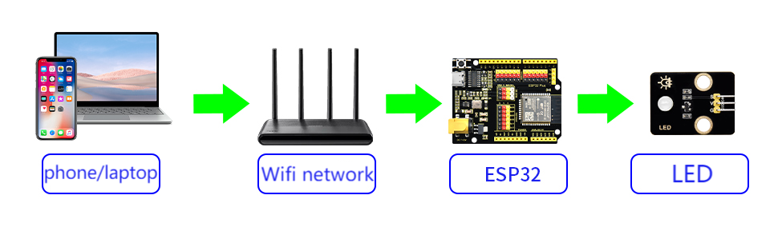
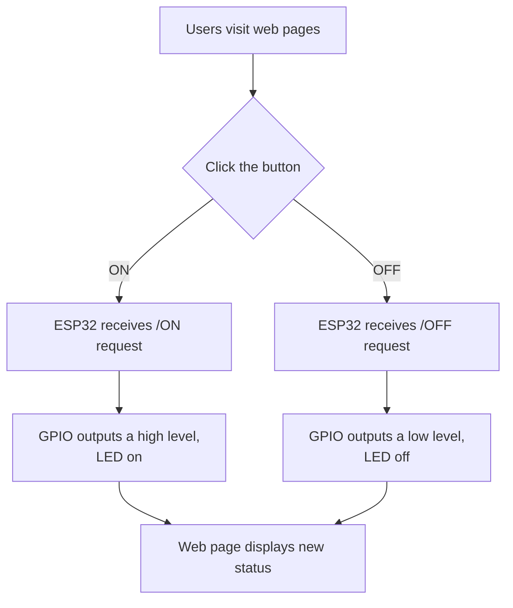
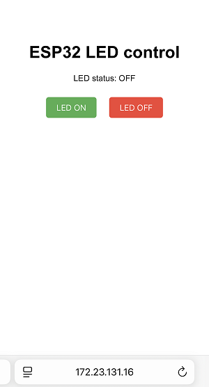

## 11. Web Page Remote Control LED

In this project, we remotely control an LED by web page as a micro-practice of the Internet of Things in smart school. A Web server is built through ESP32 to enable remote control of LED by a browser, directly mapping real scenarios such as intelligent lighting and equipment management in the school.

We will lead you to explore the wonderful world of the Internet of Things! By writing code through the ESP32 development board, you can remotely control the on/off of LED via a mobile web page. Now let’s do your first “Smart school” Internet of Things project!

==补手机页面和结构的图==


#### Principle

**Note: Here covers extracurricular knowledge of HTML, CSS, and JS, so we only provide a brief introduction.**



**Key steps:**

**(1) ESP32 as a mini server**

- After connecting to WiFi, ESP32 can be considered as a **mini Web server** (just like a super mini computer).
- It will be assigned with a local area network IP address (like `172.23.131.16`). All devices connected to the **same WiFi** can access it.

**(2) Web interaction**

- ESP32 hosts a simple web page with two buttons:
   “ON” button → click to send `/ON` request
   “OFF” button → click to send `/OFF` request

**(3) Request processing**

1. Click the web page button → The browser sends a request to ESP32
2. The ESP32 receives the request
2. After receiving the request, ESP32 controls the LED by the GPIO pins:
   - Turn on: The pin outputs a high level → LED is powered on and emits light
   - Turn off: The pin output a low level → LED is powered off and goes out

**(4) Real-time feedback**

The web page dynamically updates their status through JavaScript without refreshing the page (like the instant response when you browse your phone).

<br>

**Three technical elements**

| Element                 | Function                                                     | Analogy                                         |
| ----------------------- | ------------------------------------------------------------ | ----------------------------------------------- |
| **WiFi communication**  | Enable the browser and ESP32 to communicate                  | Two people are communicating via walkie-talkies |
| **Web server**          | Host web pages and handle button-click requests              | A restaurant waiter accepts your order          |
| **GPIO digital output** | Transform web page instructions into actual current to control LED | You press the physical button with your hand    |


#### Code Flow




#### Test Code

<span style="color: rgb(200, 70, 100);">Please replace the WiFi name and password in the code with yours.</span>

```c++
#include <WiFi.h>
#include <WebServer.h>

// set the WiFi name and password
const char* ssid = "YourWiFiSSID";     // your WiFi name
const char* password = "YourWiFiPassword"; // your WiFi password

// set LED pin
const int ledPin = 12;  // GPIO12

WebServer server(80);  // Create a Web server object on port 80

// HTML web page content
const char* htmlContent = R"rawliteral(
<!DOCTYPE HTML>
<html>
<head>
  <meta name="viewport" content="width=device-width, initial-scale=1">
  <title>ESP32 LED control</title>
  <style>
    body { 
      font-family: Arial, sans-serif; 
      text-align: center; 
      margin: 0 auto; 
      padding-top: 50px; 
    }
    .button {
      padding: 10px 20px;
      font-size: 16px;
      margin: 10px;
      cursor: pointer;
      background-color: #4CAF50;
      color: white;
      border: none;
      border-radius: 5px;
    }
    .button-off {
      background-color: #f44336;
    }
  </style>
</head>
<body>
  <h1>ESP32 LED control</h1>
  <p>LED status: <span id="ledState">%LEDSTATE%</span></p>
  <p>
    <button class="button" onclick="controlLED('ON')">LED ON</button>
    <button class="button button-off" onclick="controlLED('OFF')">LED  OFF</button>
  </p>
  <script>
    function controlLED(state) {
      var xhr = new XMLHttpRequest();
      xhr.open("GET", "/" + state, true);
      xhr.send();
      
      // Update the page status display
      document.getElementById("ledState").innerHTML = (state === 'ON') ? 'ON' : 'OFF';
    }
  </script>
</body>
</html>
)rawliteral";

void handleRoot() {
  // Get the current LED status
  String ledState = (digitalRead(ledPin)) ? "on" : "off";
  
  // Replace placeholders in HTML
  String html = htmlContent;
  html.replace("%LEDSTATE%", ledState);
  
  server.send(200, "text/html", html);
}

void handleLEDOn() {
  digitalWrite(ledPin, HIGH);
  server.send(200, "text/plain", "LED ON");
}

void handleLEDOff() {
  digitalWrite(ledPin, LOW);
  server.send(200, "text/plain", "LED OFF");
}

void handleNotFound() {
  server.send(404, "text/plain", "404: Not found");
}

void setup() {
  Serial.begin(115200);
  pinMode(ledPin, OUTPUT);
  digitalWrite(ledPin, LOW);  // Initially turn off the LED

  // connect to WiFi
  WiFi.begin(ssid, password);
  Serial.println("connecting to WiFi...");
  
  while (WiFi.status() != WL_CONNECTED) {
    delay(500);
    Serial.print(".");
  }
  
  Serial.println("");
  Serial.println("WiFi is connected.");
  Serial.println("IP: ");
  Serial.println(WiFi.localIP());

  // Set server routing
  server.on("/", handleRoot);
  server.on("/ON", handleLEDOn);
  server.on("/OFF", handleLEDOff);
  server.onNotFound(handleNotFound);
  
  // Start the server
  server.begin();
  Serial.println("The HTTP server has been started.");
}

void loop() {
  server.handleClient();  // Handle client requests
}
```


#### Code Explanation

**Here covers extracurricular knowledge of HTML, CSS, and JS, so we only provide a brief introduction.**

**1. Basic settings**

```c++
#include <WiFi.h>
#include <WebServer.h>

const char* ssid = "YourWiFiSSID";         // your WiFi name
const char* password = "YourWiFiPassword"; // your WiFi password
const int ledPin = 12;  // GPIO pin connected to Led (GPIO12 for ESP32)
WebServer server(80);   // Create a Web server object on port 80
```

- Introduce the necessary libraries, set the WiFi name and password, define the LED pin, and initialize the Web server.

<span style="color: rgb(200, 70, 100);">Please replace the WiFi name and password in the code with yours.</span>

<br>

**2. Initialization (setup)**

```c++
void setup() {
  Serial.begin(115200);
  pinMode(ledPin, OUTPUT);     // Set the LED pin to output mode
  digitalWrite(ledPin, LOW);   // Initially turn off the LED

  WiFi.begin(ssid, password);  // connect to WiFi
  while (WiFi.status() != WL_CONNECTED) {
    delay(500);
    Serial.print(".");
  }
  
  Serial.println("\nWiFi connected");
  Serial.print("IP address: ");
  Serial.println(WiFi.localIP()); // Print the IP address of the ESP32

  // Bind the path and the processing function
  server.on("/", handleRoot);
  server.on("/ON", handleLEDOn);
  server.on("/OFF", handleLEDOff);
  server.onNotFound(handleNotFound);
  
  server.begin(); // Start the Web server
  Serial.println("HTTP server enabled");
}
```

1. Initialize the serial port (for debugging the output).
2. Set the LED pin and initialize to the off state.
3. Connect to WiFi, wait for the connection and then print the IP address.
4. Bind the URL path to the corresponding processing function.
5. Start the Web server.

<br>

**3. Main loop (loop)**

```c++
void loop() {
  server.handleClient(); // Handle client (browser) requests
}
```

- Continuously listen for HTTP requests from browsers and call the corresponding processing functions, such as `handleRoot` and `handleLEDOn`, etc.

<br>

**4. HTML webpage content**

```c++
const char* htmlContent = R"rawliteral(
<!DOCTYPE HTML>
...
</html>
)rawliteral";
```

- The code of HTML web page. There are two buttons on the page: **Turn on LED**(send `/ON` request) and **Turn off LED**(send `/OFF` request). 

<br>

**5. Handle HTTP requests**

**Request of root path (Display web page)**

```c++
void handleRoot() {
  String ledState = (digitalRead(ledPin)) ? "on" : "off"; // Read the LED status
  String html = htmlContent;
  html.replace("%LEDSTATE%", ledState); // Dynamically update the LED status on the web page
  server.send(200, "text/html", html);  // Send the web page to the client
}
```

- When accessing the IP address of the ESP32, return the HTML web page and display the current LED status.

**Request of controlling LED**

```c++
void handleLEDOn() {
  digitalWrite(ledPin, HIGH);  // turn on LED
  server.send(200, "text/plain", "LED ON"); // Return response
}

void handleLEDOff() {
  digitalWrite(ledPin, LOW);   // turn off LED
  server.send(200, "text/plain", "LED OFF");
}
```

- **Function** : When the web page button is clicked, the ESP32 receives a `/ON` or `/OFF` request to control the on/off of the LED.


#### Test Result

1. After uploading the code, open the serial monitor and set the baud rate to 115200. You can see the printed IP information:

   

2. Enter the IP address on the serial monitor into your mobile phone/computer browser and you will see a simple control page.

   <span style="color: rgb(200, 70, 100);">Note: Make sure your mobile phone/computer and ESP32 are connected to the same WiFi.</span>

   

3. Click the “LED ON” or “LED OFF” button to control the status of the LED.


#### FAQ

1. If nothing is printed on the serial monitor, please press the reset button on the board.

   

2. If the ESP32 has not been able to obtain an IP address, it is usually because the WiFi connection has failed. Solutions:
   - Make sure that the WiFi name and password in the code have been replaced with yours.
   - Make sure your WiFi network is 2.4GHz. ESP32 does not support 5GHz WiFi.
3. If there is no page when entering the IP address,
   - Make sure the IP address is entered correctly.
   - Check whether your mobile phone/computer is on the same network as the ESP32.

