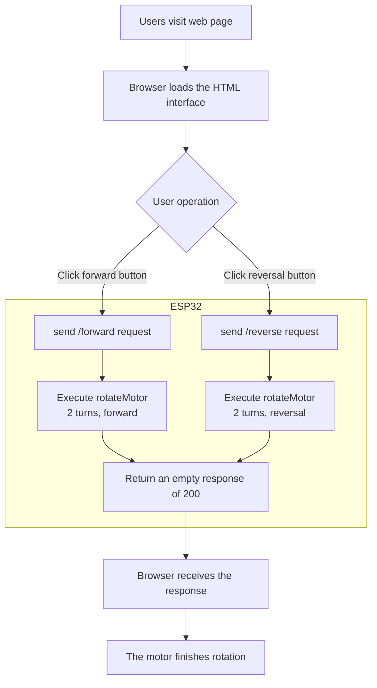
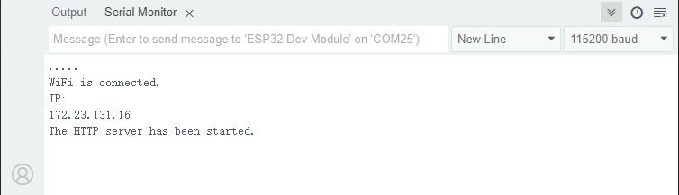
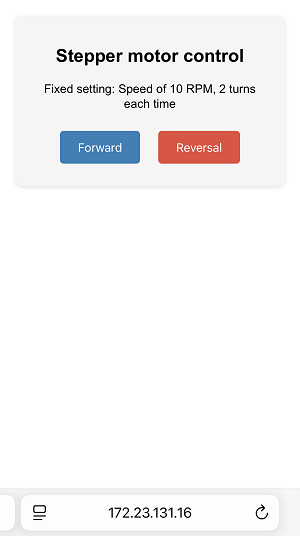

## 12. Web Page Remote Control Curtain

In the construction of smart school, Internet of Things is gradually changing the traditional management model. Here we do a practical project of web page remote control curtain to explore the application of Internet of Things in school life.

Through this project, you will not only be able to create a “compliant” curtain, but also master the core logic of the IoT system - “perception - decision - execution”, opening a window for the innovation of smart school.

==补手机页面和结构的图==


#### Principle

**Mobile browser → WiFi → ESP32 → Control the motor to rotate 2 turns → curtain open/close**

==补图==


1. **Mobile/Computer** Open the web page (enter the IP address of ESP32)
2. **Click the button** (forward/reverse)
3. **ESP32 receives instructions** (via WiFi)
4. **Motor rotation** (Rotate 2 turns, the curtain moves a corresponding distance)
5. **Curtain movement** (The motor drives the curtain through gears)


#### Code Flow




#### Test Code

```c++
#include <Stepper.h>   // stepper motor control library
#include <WiFi.h>      // ESP32 WiFi function library
#include <WebServer.h> // Web server library

// Motor parameters（28BYJ-48）
const int STEPS_PER_REV = 2038;  // Actual steps per turn
const int MOTOR_PIN1 = 14;       // IN1
const int MOTOR_PIN2 = 27;       // IN2
const int MOTOR_PIN3 = 16;       // IN3
const int MOTOR_PIN4 = 17;       // IN4

// default parameters
int motorSpeed = 10;      // The default rotation speed is 10 turns per minute
int rotationCount = 2;    // By default, it rotates 2 turns

// set the WiFi name and password
const char* ssid = "YourWiFiSSID";     // your WiFi name
const char* password = "YourWiFiPassword"; // your WiFi password

// Initialize the stepper motor (note the pin sequence: IN1-IN3-IN2-IN4)
Stepper myStepper(STEPS_PER_REV, MOTOR_PIN1, MOTOR_PIN3, MOTOR_PIN2, MOTOR_PIN4);

WebServer server(80);  // Create a Web server on port 80

void setup() {
  Serial.begin(115200);
  
  // Connect to WiFi
  WiFi.begin(ssid, password);
  Serial.print("Connecting to WiFi...");
  while (WiFi.status() != WL_CONNECTED) {
    delay(500);
    Serial.print(".");
  }
  Serial.println("");
  Serial.println("WiFi connected");
  Serial.print("IP address: ");
  Serial.println(WiFi.localIP()); // Print the obtained IP address
  
  // Set the route
  server.on("/", handleRoot);           // Root directory request
  server.on("/control", handleControl); // Control request
  
  server.begin(); // Start the Web server
  Serial.println("HTTP server started");
}

void loop() {
  server.handleClient(); // Handle client request
}

// Motor rotation function
void rotateMotor(int turns, bool reverse) {
  myStepper.setSpeed(motorSpeed); // Set the rotation speed
  int steps = STEPS_PER_REV * turns * (reverse ? -1 : 1); // Calculate the total number of steps (the direction is determined by reverse)
  myStepper.step(steps); // rotate
}

// Handle root directory request
void handleRoot() {
  String html = R"=====(
<!DOCTYPE html>
<html>
<head>
  <meta name="viewport" content="width=device-width, initial-scale=1">
  <title>ESP32 Stepper motor control</title>
  <style>
    body { font-family: Arial; text-align: center; margin: 0 auto; padding: 20px; }
    .control { margin: 20px; padding: 15px; background: #f0f0f0; border-radius: 10px; }
    input, button { padding: 10px; margin: 5px; }
    button { background: #4CAF50; color: white; border: none; cursor: pointer; }
    button:hover { background: #45a049; }
  </style>
</head>
<body>
  <h1>ESP32 Stepper motor control</h1>
  <div class="control">
    <h2>Motor control</h2>
    <button onclick="controlMotor('forward')">Forward rotation</button>
    <button onclick="controlMotor('reverse')">Reverse rotation</button>
  </div>
  <div class="control">
    <h2>Parameter setting</h2>
    <label for="speed">Rotation speed (RPM): </label>
    <input type="number" id="speed" value=")"=====" + String(motorSpeed) + R"=====(" min="1" max="15"><br>
    <label for="turns">Number of rotations: </label>
    <input type="number" id="turns" value=")"=====" + String(rotationCount) + R"=====(" min="1" max="10"><br>
    <button onclick="updateSettings()">Update settings</button>
  </div>
  <script>
    function controlMotor(direction) {
      fetch('/control?dir=' + direction)
        .then(response => response.text())
        .then(data => console.log(data));
    }
    function updateSettings() {
      let speed = document.getElementById('speed').value;
      let turns = document.getElementById('turns').value;
      fetch('/control?speed=' + speed + '&turns=' + turns)
        .then(response => response.text())
        .then(data => console.log(data));
    }
  </script>
</body>
</html>
)=====";
  
  server.send(200, "text/html", html);  // Send the complete HTML page
}

// Handle control requests
void handleControl() {
  // Process direction control
  if (server.hasArg("dir")) {          // Check if there are direction parameters
    String direction = server.arg("dir"); // Obtain the parameter values
    if (direction == "forward") {
      rotateMotor(rotationCount, false); // forward
      server.send(200, "text/plain", "forward rotation " + String(rotationCount) + " turn");
    } else if (direction == "reverse") {
      rotateMotor(rotationCount, true); // reverse
      server.send(200, "text/plain", "reverse rotation " + String(rotationCount) + " turn");
    }
  }
  
  // Handle parameter settings
  if (server.hasArg("speed") || server.hasArg("turns")) {
    if (server.hasArg("speed")) {
      motorSpeed = server.arg("speed").toInt();
      motorSpeed = constrain(motorSpeed, 1, 15); // limit within 1-15 RPM
    }
    if (server.hasArg("turns")) {
      rotationCount = server.arg("turns").toInt();
      rotationCount = constrain(rotationCount, 1, 10); // limit within 1-10 turns
    }
    server.send(200, "text/plain", "Parameters updated: rotation speed=" + String(motorSpeed) + " RPM, turns=" + String(rotationCount));
  }
}
```


#### Code Explanation

**Here covers extracurricular knowledge of HTML, CSS, and JS, so we only provide a brief introduction.**

**1. Basic settings**

```c++
#include <Stepper.h>   // stepper motor control library
#include <WiFi.h>      // ESP32 WiFi function library
#include <WebServer.h> // Web server library

// Motor parameters（28BYJ-48）
const int STEPS_PER_REV = 2038;  // Actual steps per turn
const int MOTOR_PIN1 = 14;       // IN1
const int MOTOR_PIN2 = 27;       // IN2
const int MOTOR_PIN3 = 16;       // IN3
const int MOTOR_PIN4 = 17;       // IN4

// default parameters
int motorSpeed = 10;      // The default rotation speed is 10 turns per minute
int rotationCount = 2;    // By default, it rotates 2 turns

// set the WiFi name and password
const char* ssid = "YourWiFiSSID";     // your WiFi name
const char* password = "YourWiFiPassword"; // your WiFi password

// Initialize the stepper motor (note the pin sequence: IN1-IN3-IN2-IN4)
Stepper myStepper(STEPS_PER_REV, MOTOR_PIN1, MOTOR_PIN3, MOTOR_PIN2, MOTOR_PIN4);

WebServer server(80);  // Create a Web server on port 80
```

- Introduce the necessary libraries, set the WiFi napassword, define the stepper motor pin, and initialize the Web server.

<br>

**2. Initialization (setup)**

**Connect to the WiFi network**

```c++
WiFi.begin(ssid, password);
Serial.print("Connecting to WiFi...");
while (WiFi.status() != WL_CONNECTED) {
    delay(500);
    Serial.print(".");
}
Serial.println("");
Serial.println("WiFi connected");
Serial.print("IP address: ");
Serial.println(WiFi.localIP()); // Print the obtained IP address
```

**Start the Web server**

```c++
server.on("/", handleRoot);           // Root directory request
server.on("/control", handleControl); // Control request
  
server.begin(); // Start the Web server
Serial.println("HTTP server started");
```

<br>

**3. Main loop (loop)**

```c++
void loop() {
  server.handleClient(); // Handle client requests
}
```

- Continuously listen for HTTP requests from browsers and call the corresponding processing functions (such as `handleRoot` and `handleControl`).

<br>

**4. HTML web page content**

**Server returns the control page**

```c++
  String html = R"=====(
...
)=====";
  
  server.send(200, "text/html", html);  // Send the complete HTML page
```

- The code of an HTML web page. The page includes forward and reversal control buttons and a parameter setting interface, and interacts with the ESP32 backend via JavaScript.

**User clicks the button and the browser sends the request**

```javascript
// JavaScript code in HTML
function controlMotor(direction) {
  fetch('/control?dir=' + direction)  // Send a GET request to /control
    .then(response => response.text())
    .then(data => console.log(data));
}
```

<br>

**5. Motor control stage**

**Execute the motor rotation**

```c++
if (direction == "forward") {
  rotateMotor(rotationCount, false); // forward
} else if (direction == "reverse") {
  rotateMotor(rotationCount, true);  // reverse
}
```


#### Test Result

1. After uploading the code, open the serial monitor and set the baud rate to 115200. You can see the printed IP information:

   

2. Enter the IP address on the serial monitor into your mobile phone/computer browser and you will see a simple control page.

   <span style="color: rgb(200, 70, 100);">Note: Make sure your mobile phone/computer and ESP32 are connected to the same WiFi.</span>

   

3. Click “Forward” or “Reversal” button to control the rotation of the motor.

   - When the motor reverses, open the curtain
   - The motor rotates forward, close the curtain


#### FAQ

1. If nothing is printed on the serial monitor, please press the reset button on the board.

	

2. If the ESP32 has not been able to obtain an IP address, it is usually because the WiFi connection has failed. Solutions:

	- Make sure that the WiFi name and password in the code have been replaced with yours.
	- Make sure your WiFi network is 2.4GHz. ESP32 does not support 5GHz WiFi.

3. If there is no page when entering the IP address,

	- Make sure the IP address is entered correctly.
	- Check whether your mobile phone/computer is on the same network as the ESP32.