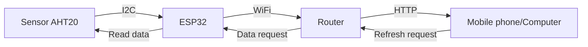
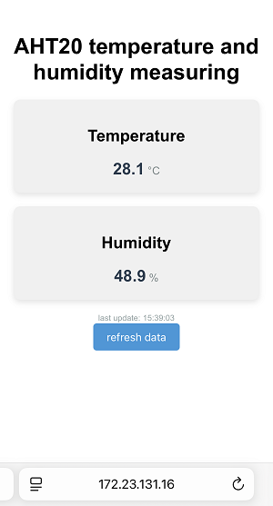

## 13. Web Page Remote Monitor Temperature and Humidity

In smart school, environment perception is an important foundation for green, comfortable and intelligent teaching spaces. Here we will guide you to develop a lightweight monitoring system that enables remote supervision of classroom environment quality by ESP32 and AHT20 sensor.

Let’s make school environment management smarter!

==补手机页面和结构的图==


#### Principle

1. Data collection

	AHT20 sensor → ESP32 (via I2C)

2. Data transmission

	ESP32 → Router → Mobile phone/Computer

3. Data display

	Browser request → Server response → Update web page


#### Code Flow




#### Test Code

```c++
#include <WiFi.h>
#include <WebServer.h>
#include <Wire.h>
#include <AHT20.h>

// set the WiFi name and password
const char* ssid = "YourWiFiSSID";
const char* password = "YourWiFiPassword";

WebServer server(80);  // Create a Web server object on port 80
AHT20 aht20;           // Create an AHT20 sensor object

void setup() {
  Serial.begin(115200);

  Wire.begin(); // Initialize the I2C bus
  
  // Check whether the AHT20 is connected properly
  if (aht20.begin() == false) {
    Serial.println("AHT20 not detected. Please check wiring.");
    while (1);
  }
  Serial.println("AHT20 acknowledged");

  // Connect to WiFi
  WiFi.begin(ssid, password);
  Serial.print("Connecting to WiFi...");
  while (WiFi.status() != WL_CONNECTED) {
    delay(500);
    Serial.print(".");
  }
  Serial.println("");
  Serial.println("WiFi is connected");
  Serial.print("IP: ");
  Serial.println(WiFi.localIP());

  // Set server routing
  server.on("/", handleRoot);       // Root path
  server.on("/data", handleData);   // Data API path

  // Start the server
  server.begin();
  Serial.println("The HTTP server has been started.");
}

void loop() {
  server.handleClient();  // Handle client requests
}

// Handle root path requests
void handleRoot() {
  String html = R"=====(
<!DOCTYPE html>
<html>
<head>
  <meta name="viewport" content="width=device-width, initial-scale=1">
  <title>AHT20 temperature and humidity measuring</title>
  <style>
    body { font-family: Arial, sans-serif; text-align: center; margin: 0; padding: 20px; }
    .container { max-width: 600px; margin: 0 auto; }
    .data-box { 
      background-color: #f0f0f0; 
      border-radius: 10px; 
      padding: 20px; 
      margin: 20px 0; 
      box-shadow: 0 4px 8px rgba(0,0,0,0.1);
    }
    .value { font-size: 24px; font-weight: bold; color: #2c3e50; }
    .unit { font-size: 16px; color: #7f8c8d; }
    .updated { font-size: 12px; color: #95a5a6; margin-top: 10px; }
    button { 
      background-color: #3498db; 
      color: white; 
      border: none; 
      padding: 10px 20px; 
      border-radius: 5px; 
      cursor: pointer; 
      font-size: 16px;
    }
    button:hover { background-color: #2980b9; }
  </style>
</head>
<body>
  <div class="container">
    <h1>AHT20 temperature and humidity measuring</h1>
    
    <div class="data-box">
      <h2>Temperature</h2>
      <div><span id="temp-value" class="value">--</span> <span class="unit">&deg;C</span></div>
    </div>
    
    <div class="data-box">
      <h2>Humidity</h2>
      <div><span id="humi-value" class="value">--</span> <span class="unit">%</span></div>
    </div>
    
    <div class="updated" id="last-updated">last update: --</div>
    
    <button onclick="refreshData()">refresh data</button>
  </div>

  <script>
    function refreshData() {
      fetch('/data')
        .then(response => response.json())
        .then(data => {
          document.getElementById('temp-value').textContent = data.temperature.toFixed(1);
          document.getElementById('humi-value').textContent = data.humidity.toFixed(1);
          const now = new Date();
          document.getElementById('last-updated').textContent = 
            `last update: ${now.toLocaleTimeString()}`;
        })
        .catch(error => console.error('Obtain data failed:', error));
    }
    
    // Obtain data when the page is loading
    window.onload = refreshData;
    
    // Refresh the data every 5 seconds
    setInterval(refreshData, 5000);
  </script>
</body>
</html>
)=====";

  server.send(200, "text/html", html);
}

// Handle data API requests
void handleData() {
  // Obtain temperature and humidity data
  float temperature = aht20.getTemperature();
  float humidity = aht20.getHumidity();
  
  // Create a JSON response
  String json = "{";
  json += "\"temperature\":" + String(temperature) + ",";
  json += "\"humidity\":" + String(humidity);
  json += "}";
  
  server.send(200, "application/json", json);
}
```


#### Code Explanation

**Here covers extracurricular knowledge of HTML, CSS, and JS, so we only provide a brief introduction.**

**1.Hardware initialization**

```c++
Wire.begin(); // Initialize the I2C bus

// Check whether the AHT20 is connected properly
if (aht20.begin() == false) {
    Serial.println("AHT20 not detected. Please check wiring.");
    while (1);
}
Serial.println("AHT20 acknowledged");
```

- Communicate with the sensor via the I2C protocol. If the sensor is not connected, the program will keep detecting.

<br>

**2. Network service**

**WiFi connectioin**

```c++
WiFi.begin(ssid, password);
  Serial.print("Connecting to WiFi...");
  while (WiFi.status() != WL_CONNECTED) {
    delay(500);
    Serial.print(".");
  }
  Serial.println("");
  Serial.println("WiFi is connected");
  Serial.print("IP: ");
  Serial.println(WiFi.localIP());
```

- After connection, the serial port will print the local area network IP of the ESP32

**Server initialization**

```c++
WebServer server(80);  // Create an HTTP server on port 80

// Route registration
server.on("/", handleRoot);      // Root path → Return to HTML page
server.on("/data", handleData);  // Data path → Return JSON data

server.begin();  // Start the server
Serial.println("HTTP server started");
```

- `/` : Return the HTML of the visual web page
- `/data` : Return sensor data in JSON format

<br>

**3. Data processing**

```c++
float temperature = aht20.getTemperature();
float humidity = aht20.getHumidity();
String json = "{\"temperature\":" + String(temperature) + "...";
```

- Obtain floating-point data directly from the sensor
- Manually concatenate JSON strings


**4. Dynamic update**

```javascript
setInterval(refreshData, 5000); // 5-second polling
function refreshData() {
  fetch('/data') // Asynchronous request
    .then(response => response.json())
    .then(data => {
      document.getElementById("temp-value").textContent = data.temperature.toFixed(1);
      // Update DOM elements
    });
}
```

- data update without refreshing through the Fetch API of JavaScript
- toFixed(1) retains one decimal place
- Automatically update the timestamp


#### Test Result

1. After uploading the code, open the serial monitor and set the baud rate to 115200. You can see the printed IP information:

	

2. Enter this IP address in the browser of your mobile phone or computer to access the temperature and humidity monitoring page.

	- Automatic update: Data is obtained immediately when the page is opened, and the page automatically refreshes with data updated every 5 seconds.

	- Manual update: Click the refresh button to update immediately. New data will be displayed immediately after the operation.

	<span style="color: rgb(200, 70, 100);">Note: Make sure your mobile phone/computer and ESP32 are connected to the same WiFi.</span>




#### FAQ

1. If nothing is printed on the serial monitor, please press the reset button on the board.

	

2. If the ESP32 has not been able to obtain an IP address, it is usually because the WiFi connection has failed. Solutions:

	- Make sure that the WiFi name and password in the code have been replaced with yours.
	- Make sure your WiFi network is 2.4GHz. ESP32 does not support 5GHz WiFi.

3. If there is no page when entering the IP address,

	- Make sure the IP address is entered correctly.
	- Check whether your mobile phone/computer is on the same network as the ESP32.
