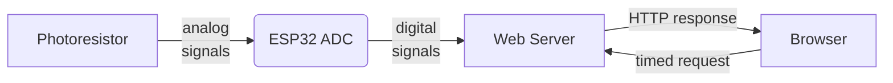
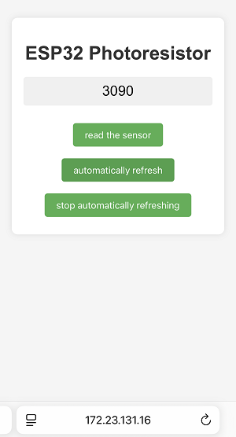

## 15. Web Page Remote Monitor Light Value

Environment monitoring is a crutial part to enhance the comfort of the teaching and optimize energy management. Thereinto, intensity of light directly affects students’ learning efficiency and visual health. So ,reasonable regulation of classroom lighting can not only save energy and reduce emissions but also create a more suitable learning environment.

In this project, we will monitor and visualize indoor light conditions in real time through Internet of Things, which provides basic solutions for applications such as intelligent lighting and energy-saving management, and contributes to the construction of green and smart school.

==补手机页面和结构的图==


#### Principle

1. Data collection

	Voltage division by photoresistor → The ADC pins of ESP32 (analog-to-digital)

2. Data processing

	ESP32 → Router → Mobile phone/Computer

3. Web page interaction

	Browser request → Server response → Return the light value and refresh the display


#### Code Flow




#### Test Code

```c++
#include <WiFi.h>
#include <WebServer.h>

// Replace with your WiFi name and passwords
const char* ssid = "YourWiFiSSID";
const char* password = "YourWiFiPassword";

WebServer server(80);

// The pins connected to the photoresistor
const int lightSensorPin = 34;

// Store sensor value
int sensorValue = 0;

void setup() {
  Serial.begin(115200);
  
  // Connect to WiFi
  WiFi.begin(ssid, password);
  Serial.println("Connecting to WiFi...");
  
  while (WiFi.status() != WL_CONNECTED) {
    delay(500);
    Serial.print(".");
  }
  
  Serial.println("");
  Serial.println("WiFi connected");
  Serial.println("IP address: ");
  Serial.println(WiFi.localIP());

  // Set the route
  server.on("/", handleRoot);
  server.on("/readLight", handleLightRead);
  
  // Start the server
  server.begin();
  Serial.println("The HTTP server has been started.");
}

void loop() {
  server.handleClient();
}

void handleRoot() {
  String html = R"=====(
<!DOCTYPE html>
<html>
<head>
  <meta name="viewport" content="width=device-width, initial-scale=1">
  <title>ESP32 Photoresistor</title>
  <style>
    body {
      font-family: Arial, sans-serif;
      text-align: center;
      margin: 0;
      padding: 20px;
      background-color: #f5f5f5;
    }
    .container {
      max-width: 600px;
      margin: 0 auto;
      background-color: white;
      padding: 20px;
      border-radius: 10px;
      box-shadow: 0 0 10px rgba(0,0,0,0.1);
    }
    h1 {
      color: #333;
    }
    .sensor-value {
      font-size: 24px;
      margin: 20px 0;
      padding: 10px;
      background-color: #f0f0f0;
      border-radius: 5px;
    }
    button {
      background-color: #4CAF50;
      color: white;
      border: none;
      padding: 10px 20px;
      text-align: center;
      text-decoration: none;
      display: inline-block;
      font-size: 16px;
      margin: 10px 2px;
      cursor: pointer;
      border-radius: 5px;
    }
    button:hover {
      background-color: #45a049;
    }
  </style>
</head>
<body>
  <div class="container">
    <h1>ESP32 Photoresistor</h1>
    <div class="sensor-value" id="sensorValue">--</div>
    <button onclick="readSensor()">read the sensor</button>
    <button onclick="startAutoRead()">automatically refresh</button>
    <button onclick="stopAutoRead()">stop automatically refreshing</button>
  </div>
  
  <script>
    let autoReadInterval;
    
    function readSensor() {
      fetch('/readLight')
        .then(response => response.text())
        .then(data => {
          document.getElementById('sensorValue').innerText = data;
        });
    }
    
    function startAutoRead() {
      stopAutoRead(); // First, stop any existing automatic refreshes
      readSensor();   // Read once immediately
      autoReadInterval = setInterval(readSensor, 2000); // Read once every 2 seconds
    }
    
    function stopAutoRead() {
      if (autoReadInterval) {
        clearInterval(autoReadInterval);
        autoReadInterval = null;
      }
    }
  </script>
</body>
</html>
)=====";

  server.send(200, "text/html", html);
}

void handleLightRead() {
  sensorValue = analogRead(lightSensorPin);
  String valueStr = String(sensorValue);
  server.send(200, "text/plain", valueStr);
  Serial.println("photoresistor value: " + valueStr);
}
```


#### Code Explanation

**Here covers extracurricular knowledge of HTML, CSS, and JS, so we only provide a brief introduction.**

**1. Initialization**

```c++
#include <WiFi.h>
#include <WebServer.h>
const char* ssid = "YourWiFiSSID";     // WiFi name
const char* password = "YourWiFiPassword";  // WiFi passwords
WebServer server(80);                    // Create a Web server (port 80)
const int lightSensorPin = 34;          // Connect the photoresistor to GPIO34
```

- Introduce WiFi and WebServer libraries, and configure network and hardware pins.

<br>

**2. Main program logic**

```c++
void setup() {
  // Initialize the serial port and WiFi connection
  WiFi.begin(ssid, password); 
  
  // Set two routes
  server.on("/", handleRoot);          // Return to the HTML page
  server.on("/readLight", handleLightRead); // Return sensor data
  server.begin();                     // Start the server
}

void loop() {
  server.handleClient();  // Continuously handle client requests
}
```

- After starting the server, the web page requests are processed repeatedly.

<br>

**3. Web page interaction**

**HTML page**

```c++
server.on("/", handleRoot);
```

```c++
void handleRoot() {
  String html = R"=====(
<!DOCTYPE html>
...
</body>
</html>
)=====";
```

- The code of an HTML web page. There are three buttons on the page: read the sensor, automatically refresh (2 seconds), and stop automatically refreshing

**Dynamic update**

```javascript
fetch('/readLight').then(response => response.text())
```

- Request data through JavaScript `fetch()`.

**Data interface**

```c++
server.on("/readLight", handleLightRead);
```

```c++
void handleLightRead() {
  sensorValue = analogRead(lightSensorPin);  // Read the light value
  String valueStr = String(sensorValue);
  server.send(200, "text/plain", valueStr); // Return plain text data
  Serial.println("photoresistor value: " + valueStr);
}
```

- When a web page requests the `/readLight` path, the ESP32 reads the analog value of the photoresistor, returns this value in plain text to the web page, and simultaneously prints the current sensor value in the serial monitor.


#### Test Result

After uploading the code, open the serial monitor and set the baud rate to 115200. You can see the printed IP information:


Enter this IP address in the browser of your mobile phone or computer to access the indoor light value monitoring page. The value is refreshed every 2 seconds.

<span style="color: rgb(200, 70, 100);">Note: Make sure your mobile phone/computer and ESP32 are connected to the same WiFi.</span>




#### FAQ

1. If nothing is printed on the serial monitor, please press the reset button on the board.

   

2. If the ESP32 has not been able to obtain an IP address, it is usually because the WiFi connection has failed. Solutions:

   - Make sure that the WiFi name and password in the code have been replaced with yours.
   - Make sure your WiFi network is 2.4GHz. ESP32 does not support 5GHz WiFi.

3. If there is no page when entering the IP address,

	- Make sure the IP address is entered correctly.
	- Check whether your mobile phone/computer is on the same network as the ESP32.
