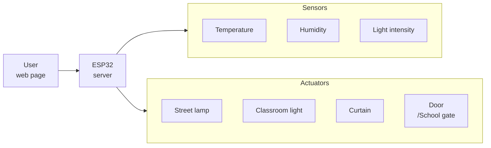
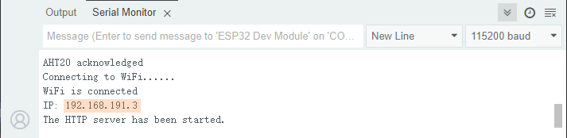
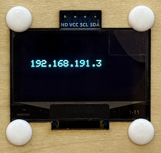
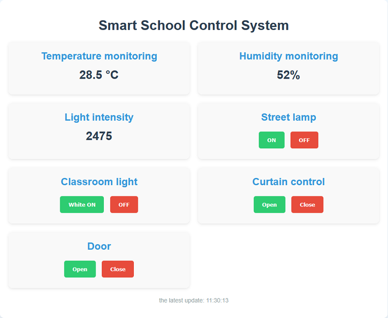
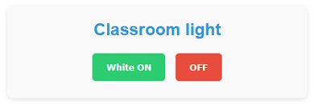
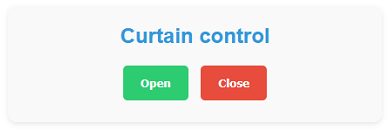
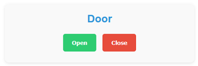

## 16. Smart School

In this smart school, we will guide you to develop an Internet of Things application system that integrates environmental monitoring and equipment control. In this system, we can monitor environment conditions such as temperature, humidity and light intensity in the classroom in real time through the web. It also supports remote control of the opening/closing of curtain, the on/off of classroom light and street lamp, as well as the status of the school gate. Now let’s join hands to contribute to the construction of green and smart school!


#### Code Flow




#### Test Code

```c++
#include <WiFi.h>
#include <WebServer.h>
#include <Wire.h>
#include <AHT20.h>
#include <Stepper.h>
#include <ESP32Servo.h>
#include <Adafruit_GFX.h>
#include <Adafruit_SH110X.h>
#include <Adafruit_NeoPixel.h>

// Replac with your WiFi name and passwords
const char* ssid = "YourWiFiSSID";
const char* password = "YourWiFiPassword";

// OLED configuration
#define SCREEN_WIDTH 128
#define SCREEN_HEIGHT 64
#define OLED_RESET -1  // Share I2C reset
#define I2C_ADDRESS 0x3C  // Default address of SH1106

// Define pins
#define LIGHT_SENSOR_PIN 34
#define LED_PIN 12
#define RGB_LED_PIN 4
#define SERVO_PIN 32

// Configure RGB
#define RGB_LED_COUNT 4
Adafruit_NeoPixel rgbLeds(RGB_LED_COUNT, RGB_LED_PIN, NEO_GRB + NEO_KHZ800);

// Create a display object
Adafruit_SH1106G display(SCREEN_WIDTH, SCREEN_HEIGHT, &Wire, OLED_RESET);

// Set stepper motor
const int STEPS_PER_REV = 2038;  // Actual steps per turn
const int MOTOR_PIN1 = 14;       // IN1
const int MOTOR_PIN2 = 27;       // IN2  
const int MOTOR_PIN3 = 16;       // IN3
const int MOTOR_PIN4 = 17;       // IN4

// Initialize the stepper motor (note the pin sequence: IN1-IN3-IN2-IN4)
Stepper myStepper(STEPS_PER_REV, MOTOR_PIN1, MOTOR_PIN3, MOTOR_PIN2, MOTOR_PIN4);

// Servo
Servo myservo;
int servoAngle = 180;

// Sensor instance
AHT20 aht20;

// Web server instance
WebServer server(80);

// Set the RGB to white
void setRGBWhite() {
  for (int i = 0; i < RGB_LED_COUNT; i++) {
    rgbLeds.setPixelColor(i, rgbLeds.Color(255, 255, 255));
  }
  rgbLeds.show();
}

// Turn off RGB
void setRGBOff() {
  for (int i = 0; i < RGB_LED_COUNT; i++) {
    rgbLeds.setPixelColor(i, rgbLeds.Color(0, 0, 0));
  }
  rgbLeds.show();
}

void setup() {
  Serial.begin(115200);

  // Initialize the pin
  pinMode(LED_PIN, OUTPUT);
  digitalWrite(LED_PIN, LOW);
  
  // Initialize the RGB strips
  rgbLeds.begin();
  rgbLeds.setBrightness(100);
  setRGBOff(); // The initial state is off
  
  // Initialize the speed of the stepper motor
  myStepper.setSpeed(10);
  
  // Initialize the servo
  myservo.attach(SERVO_PIN);
  myservo.write(servoAngle);

  Wire.begin(); // Initialize I2C bus
  
  // Check whether the AHT20 is connected properly
  if (aht20.begin() == false) {
    Serial.println("AHT20 not detected. Please check wiring.");
    while (1);
  }
  Serial.println("AHT20 acknowledged");

  // Initialize OLED
  if(!display.begin(I2C_ADDRESS, true)) {  // true is 128x64 resolution
    Serial.println("SH1106 initialization failed");
    while(1);  // Stuck and not continuing
  }

  // Clear the screen and set the text properties
  display.clearDisplay();
  display.setTextSize(1);      // text size
  display.setTextColor(SH110X_WHITE);  // Monochrome display
  display.setCursor(10, 25);   // Set the starting position (center)

  // Connect to WiFi
  WiFi.begin(ssid, password);
  Serial.print("Connecting to WiFi...");
  while (WiFi.status() != WL_CONNECTED) {
    delay(500);
    Serial.print(".");
  }
  Serial.println("");
  Serial.println("WiFi is connected");
  Serial.print("IP: ");
  Serial.println(WiFi.localIP());
  display.println(WiFi.localIP());
  display.display();

  // Set server routing
  server.on("/", handleRoot);       // Root path
  server.on("/data", handleData);   // Data API path
  server.on("/control", handleControl); // Control path

  // Start the server
  server.begin();
  Serial.println("The HTTP server has been started.");
}

void loop() {
  server.handleClient();  // Handle client requests
}

// Handle root path requests
void handleRoot() {
  String html = R"=====(
<!DOCTYPE html>
<html>
<head>
  <meta charset="UTF-8">
  <meta name="viewport" content="width=device-width, initial-scale=1">
  <title>Smart School Control System</title>
  <style>
    body { 
      font-family: Arial, sans-serif; 
      text-align: center; 
      margin: 0; 
      padding: 20px; 
      background: #f0f8ff;
    }
    .container { 
      max-width: 1000px; 
      margin: 0 auto; 
      background: white; 
      padding: 20px; 
      border-radius: 10px; 
      box-shadow: 0 4px 8px rgba(0,0,0,0.1);
    }
    h1 { 
      color: #2c3e50; 
      margin-bottom: 20px;
    }
    .dashboard {
      display: grid;
      grid-template-columns: repeat(auto-fit, minmax(300px, 1fr));
      gap: 20px;
      margin: 20px 0;
    }
    .card {
      background: #f9f9f9;
      padding: 20px;
      border-radius: 10px;
      box-shadow: 0 2px 5px rgba(0,0,0,0.1);
    }
    .card h2 {
      color: #3498db;
      margin-top: 0;
      margin-bottom: 15px;
    }
    .value {
      font-size: 28px;
      font-weight: bold;
      color: #2c3e50;
      margin: 10px 0;
    }
    .btn {
      padding: 12px 20px;
      margin: 5px;
      border: none;
      border-radius: 5px;
      cursor: pointer;
      font-weight: bold;
    }
    .btn-on {
      background: #2ecc71;
      color: white;
    }
    .btn-off {
      background: #e74c3c;
      color: white;
    }
    .update-time {
      color: #95a5a6;
      margin-top: 20px;
      font-size: 14px;
    }
  </style>
</head>
<body>
  <div class="container">
    <h1>Smart School Control System</h1>
    
    <div class="dashboard">
      <div class="card">
        <h2>Temperature monitoring</h2>
        <div class="value" id="temperature">--</div>
      </div>
      
      <div class="card">
        <h2>Humidity monitoring</h2>
        <div class="value" id="humidity">--</div>
      </div>
      
      <div class="card">
        <h2>Light intensity</h2>
        <div class="value" id="light-value">--</div>
      </div>
      
      <div class="card">
        <h2>Street lamp</h2>
        <div>
          <button class="btn btn-on" onclick="controlDevice('led', 'on')">ON</button>
          <button class="btn btn-off" onclick="controlDevice('led', 'off')">OFF</button>
        </div>
      </div>
      
      <div class="card">
        <h2>Classroom light</h2>
        <div>
          <button class="btn btn-on" onclick="controlDevice('rgb', 'on')">White ON</button>
          <button class="btn btn-off" onclick="controlDevice('rgb', 'off')">OFF</button>
        </div>
      </div>
      
      <div class="card">
        <h2>Curtain control</h2>
        <div>
          <button class="btn btn-on" onclick="controlDevice('stepper', 'forward')">Open</button>
          <button class="btn btn-off" onclick="controlDevice('stepper', 'reverse')">Close</button>
        </div>
      </div>
      
      <div class="card">
        <h2>Door</h2>
        <div>
          <button class="btn btn-on" onclick="controlDevice('servo', '90')">Open</button>
          <button class="btn btn-off" onclick="controlDevice('servo', '180')">Close</button>
        </div>
      </div>
    </div>
    
    <p class="update-time">the latest update:  <span id="update-time">--</span></p>
  </div>

  <script>
    function controlDevice(device, state) {
      fetch('/control?device=' + device + '&state=' + state)
        .then(response => response.text())
        .then(data => console.log(data))
        .catch(error => console.error('Control error:', error));
    }

    function refreshData() {
      fetch('/data')
        .then(response => response.json())
        .then(data => {
          document.getElementById('temperature').innerHTML = data.temperature.toFixed(1) + ' &deg;C';
          document.getElementById('humidity').textContent = data.humidity.toFixed(0) + '%';
          document.getElementById('light-value').textContent = data.light;
          
          const now = new Date();
          document.getElementById('update-time').textContent = now.toLocaleTimeString();
        })
        .catch(error => console.error('Obtain dara failed:', error));
    }
    
    // Obtain data when the page is loading
    window.onload = refreshData;
    
    // Refresh the data every 2 seconds
    setInterval(refreshData, 2000);
  </script>
</body>
</html>
)=====";

  server.send(200, "text/html", html);
}

// Handle data API requests
void handleData() {
  // Obtain sensor data
  float temperature = 0;
  float humidity = 0;
  int lightValue = 0;
  
  // Directly read the data from the AHT20 sensor
  temperature = aht20.getTemperature();
  humidity = aht20.getHumidity();
  
  lightValue = analogRead(LIGHT_SENSOR_PIN);
  
  // Create a JSON response
  String json = "{";
  json += "\"temperature\":" + String(temperature) + ",";
  json += "\"humidity\":" + String(humidity) + ",";
  json += "\"light\":" + String(lightValue);
  json += "}";
  
  server.send(200, "application/json", json);
}

// Handle control requests
void handleControl() {
  if (server.hasArg("device") && server.hasArg("state")) {
    String device = server.arg("device");
    String state = server.arg("state");
    
    if (device == "led") {
      if (state == "on") {
        digitalWrite(LED_PIN, HIGH);
        server.send(200, "text/plain", "OK");
      } else if (state == "off") {
        digitalWrite(LED_PIN, LOW);
        server.send(200, "text/plain", "OK");
      }
    }
    else if (device == "rgb") {
      if (state == "on") {
        setRGBWhite();
        server.send(200, "text/plain", "OK");
      } else if (state == "off") {
        setRGBOff();
        server.send(200, "text/plain", "OK");
      }
    }
    else if (device == "stepper") {
      if (state == "forward") {
        // forward 2 turns
        myStepper.step(STEPS_PER_REV * 2);
        server.send(200, "text/plain", "OK");
      } else if (state == "reverse") {
        // reverse 2 turns
        myStepper.step(STEPS_PER_REV * -2);
        server.send(200, "text/plain", "OK");
      }
    }
    else if (device == "servo") {
      servoAngle = state.toInt();
      myservo.write(servoAngle);
      server.send(200, "text/plain", "OK");
    }
  }
}
```


#### Code Explanation

**Here covers extracurricular knowledge of HTML, CSS, and JS, so we only provide a brief introduction.**

**Network function**

- WiFi connection
- Web server (port 80)

**Sensor data monitoring**

- Temperature monitoring: The AHT20 sensor monitors the ambient temperature in real time
- Humidity monitoring: The AHT20 sensor monitors the ambient humidity in real time
- Light monitoring: The photoresistor detects the intensity of ambient light

**Device control**

- Street lamp control: Control the on and off of the LED through pin GPIO 12
- Classroom light control: Turn on/off the white light of RGB LED strip
- Curtain control: Open/close the curtain by the forward/reverse rotation of the stepper motor
- Door control: Open/close the school gate by the servo (servo rotates to 90° to open the gate and 180° to close it)

**User interface**

- Web interface: Responsive page that supports access on both computers and mobile phones
- OLED display: Local display of the IP address


#### Test Result

After uploading the code, open the serial monitor and set the baud rate to 115200. You can see the printed IP information:



The IP address will also be printed on the OLED at the same time.



Enter **your IP address** in the browser of your mobile phone/computer to access the smart school page.

<span style="color: rgb(200, 70, 100);">Note: Make sure your mobile phone/computer and ESP32 are connected to the same WiFi.</span>



We can see the temperature values, humidity values and indoor light values in real time on the web page, which is convenient for us to monitor the situation in the classroom.


- Press **ON** to turn on the street lamp; Press **OFF** to turn off the lamp.



- Press **White ON** to turn on the classroom light; Press **OFF** to turn off the light.



- Press **Open** to open the curtain; Press **Close** to close the curtain.



- Press **Open** to open the school gate; Press **Close** to close the gate.


#### FAQ

1. If nothing is printed on the serial monitor, please press the reset button on the board.

   

2. If the ESP32 has not been able to obtain an IP address, it is usually because the WiFi connection has failed. Solutions:

   - Make sure that the WiFi name and password in the code have been replaced with yours.
   - Make sure your WiFi network is 2.4GHz. ESP32 does not support 5GHz WiFi.

3. If there is no page when entering the IP address,

	- Make sure the IP address is entered correctly.
	- Check whether your mobile phone/computer is on the same network as the ESP32.

