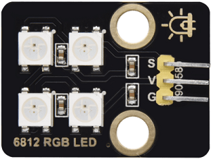
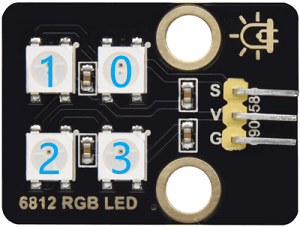
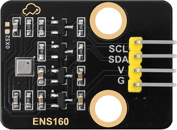
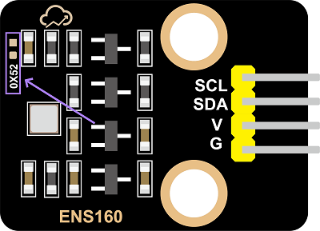
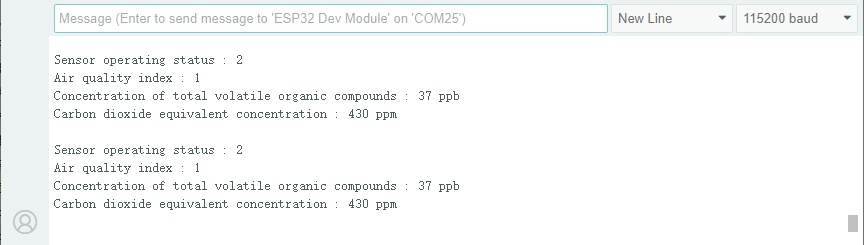
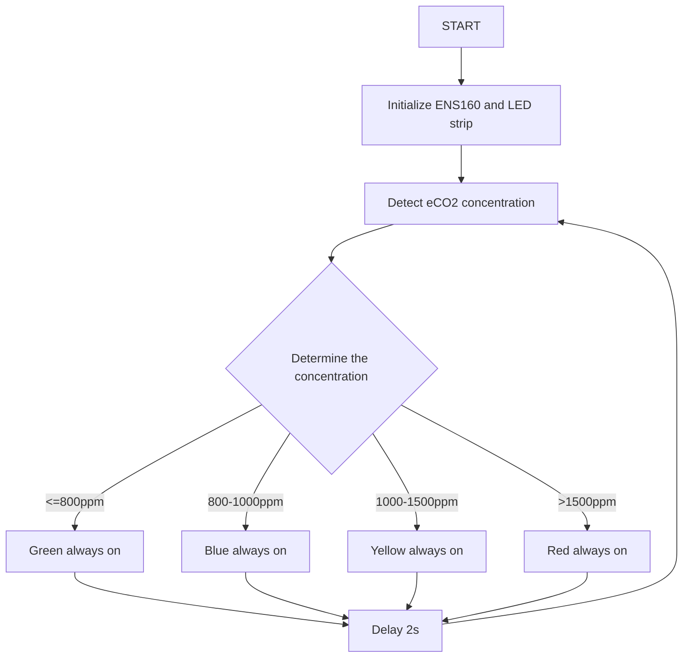
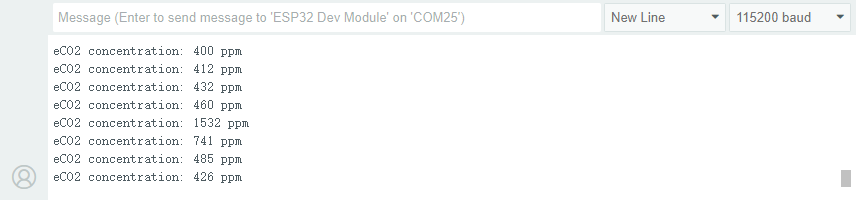

## 2. Classroom Smart Air Quality Monitoring System

Let’s build an intelligent air quality monitoring system by a ENS160 sensor module and a 6812 RGB LED. When the air quality is poor, the RGB will issue an alarm, so we can create a healthy and comfortable learning environment for teachers and students!

### 2.1 6812 RGB LED Module

Our 6812 RGB LED module integrates four programmable RGB LEDs, supporting multiple colors and dynamic effects, so it can achieve rich lighting effects by simple signal control.




#### Parameters

Operating voltage: DC 3.3-5V

Maximum power: 1W

IC model: 4 pixels /SK6812

Gray scale level: 25

Emission Angle: 180°

Emission colors: Adjustable colors of white, red, yellow, blue, green, etc. through the controller

Operating temperature: -10°C to +50°C

Dimensions: 32 x 23 x 8mm

Positioning hole: Diameter of 4.8mm

Interface: 3-pin curved pin interface spacing 2.54mm


#### Principle

The 6812 RGB LED module adopts a single-line serial communication protocol. Each LED pixel is equipped with an internal driver IC, which transmits signals step by step through data lines, so their brightness can be independently controlled, creating dynamic light effects.

Each LED pixel contains three colors: red (R), green (G), and blue (B). Any color can be mixed by adjusting the brightness of the three.

Serial number of LED pixels:




#### Test Code

```c#
#include <Adafruit_NeoPixel.h>

#define LED_PIN 4      // control signal pin
#define LED_COUNT 4    // LED pixel number

// Create NeoPixel object
Adafruit_NeoPixel leds(LED_COUNT, LED_PIN, NEO_GRB + NEO_KHZ800);

void setup() {
  leds.begin();           // initialize the LED strip
  leds.show();            // turn off all led
  leds.setBrightness(50); // set brightness（0~255）
}

void loop() {
  // Set the first LED pixel to red
  leds.setPixelColor(0, 255, 0, 0);
  // Set the second LED pixel to green
  leds.setPixelColor(1, 0, 255, 0);
  // Set the third LED pixel to blue
  leds.setPixelColor(2, 0, 0, 255);
  // Set the forth LED pixel to white
  leds.setPixelColor(3, 255, 255, 255);
  // refresh
  leds.show();
  delay(1000);

  // turn off all led
  leds.clear();
  leds.show();
  delay(1000);
}
```


#### Code Explanation

**1. Hardware and library**

```c++
#include <Adafruit_NeoPixel.h>
```

- Import Adafruit_NeoPixel library to control the SK6812 programmable RGB LED strip.

```c++
#define LED_PIN 4
```

- Define the control signal pin as the IO4 pin of the board.

```c++
#define LED_COUNT 4
```

- Define the number of LED pixels as 4.

```c++
Adafruit_NeoPixel leds(LED_COUNT, LED_PIN, NEO_GRB + NEO_KHZ800);
```

- Create a NeoPixel object and name it  `leds`.
- Parameter description:
  - `LED_COUNT`: Number of LED pixels (4).
  - `LED_PIN`: Control signal pin (IO4).
  - `NEO_GRB + NEO_KHZ800`: Specify the color sequence (red - green - blue) and communication frequency (800kHz) of the LED pixels.

<br>

**2. Initialization (setup)**

```c++
leds.begin();
```

- Initialize the LED light strip, set the pin mode and communication protocol.

```c++
leds.show();
```

- Update the display status of the LED strip. Since no color is set at this time, all the LED pixels will be turned off.

```c++
leds.setBrightness(50);
```

- Set the brightness of the LED pixels within the range of 0 (darkest) to 255 (brightest).

<br>

**3. Main Loop (loop)**

```c++
leds.setPixelColor(index, red, green, blue);
```

- Set the color of the lamp pixels with the specified serial number.
- Parameter description:

  - `index`: The serial number of the lamp pixels (starting from 0)
  - `red`: Parameter  of red (0~255)
  - `green`: Parameter  of green (0~255)
  - `blue`: Parameter  of blue (0~255)

```
leds.show();
```

- Update the display status of the LED strip to light up the LED in the set color.

```
delay(1000);
```

- Delay for 1 second to maintain the current state of the pixels.

```
leds.clear();
```

- Turn off all the LED pixels (set the color of all LED pixels to 0).

```
leds.show();
```

- Update the display status and turn off all the LED pixels.

```
delay(1000);
```

- Delay for 1 second to keep the LED pixels off.


#### Test Result

After uploading the code, you can see a loop:

- Four LEDs will light up in sequence as red, green, blue and white for one second. Due to its changing speed, human eyes may not be able to see the process of them lighting up one by one.
- Then all the LED pixels turn off for 1 second.

==动图==

---


### 2.2 ENS160 Air Quality Sensor

ENS160 is a high-precision digital air quality sensor capable of real-time detection of volatile organic compounds (VOCs), carbon dioxide (CO₂), and air quality index (IAQ) in the air. It is widely used in environment monitoring, smart homes, and health devices.




#### Parameters

Operating voltage: DC 3.3-5V

Operating current: 29 mA

Preheating time: <3 minutes

Communication interface: I2C

I2C address: 0x53 by default, can be modified to 0x52

Operating temperature: -10°C to +50°C

Operating humidity: 5% RH to 95% RH

eCO₂ measurement range: 400 ppm~65000 ppm

TVOC measurement range: 0 ppb~65000 ppb

Dimensions: 32 x 23 x 8mm

Positioning hole: Diameter of 3.2mm

Interface: 4-pin curved pin interface spacing 2.54mm


#### Principle

**Working Principle of ENS160**

The ENS160 detects the gas composition in the air through its built-in metal oxide semiconductor sensor. Its working principle is as follows:

**VOCs detection**:

- **Detection principle**

  The metal oxide on the sensor surface undergoes a chemical reaction with VOCs in the air, causing a change in its resistance. The concentration of VOCs can be detected by measuring the resistance change.

  However, it cannot distinguish exactly which type of VOCs it is. Instead, it **converts** all detectable VOCs mixed signals into **total volatile organic compounds(TVOC) concentrations** (in ppb) for output.

  Therefore, ENS160 directly provides **TVOC data** rather than individual VOCs components, which is suitable for quickly assessing the overall air pollution level and cannot precisely analyze specific gas types.

- **TVOC detection range**

  Output unit: ppb(parts per billion)

  Detection range: 0~65,000 ppb (The actual effective accuracy is usually 0~10,000 ppb)

- **TVOC level reference**

  | **TVOC concentration (ppb)** | **Level**              | **Health impacts and suggestions**                           |
  | ---------------------------- | ---------------------- | ------------------------------------------------------------ |
  | 0-250                        | Great                  | The air quality is excellent and has no impact on the human body, and is suitable for a long stay |
  | 250-500                      | Good                   | The air quality is good, but sensitive people may experience mild discomfort. It is recommended to ventilate moderately |
  | 500-1000                     | Mild pollution         | The air quality is acceptable. Long-term exposure may cause headaches and fatigue, so ventilation needs to be enhanced |
  | 1000-3000                    | Middle level pollution | Poor air quality may cause eye and throat irritation and drowsiness. It is recommended to reduce exposure and investigate pollution sources |
  | >3000                        | Severe pollution       | Severe pollution may cause damage to the nervous system and liver and kidney toxicity. Immediate ventilation or evacuation is necessary |

<br>

**CO₂ estimation**:

- **Estimation principle**

  ENS160 cannot directly measure CO₂. Instead, it estimates eCO₂(equivalent carbon dioxide) by detecting the concentration of VOCs(volatile organic compounds) in the air with a built-in algorithm. eCO₂ is an indirect approximation of CO₂. It is suitable for trend monitoring, yet its accuracy is not as good as that of professional CO₂ sensors.

- **eCO₂ output range**

	Unit: ppm(parts per million)

	Detection range: 400~65,000 ppm (The actual effective accuracy is usually 400~5,000 ppm)

- **eCO₂ level reference**

	| eCO₂      | Level            | Suggestions                                                  |
	| --------- | ---------------- | ------------------------------------------------------------ |
	| 400-600   | Great            | The air quality is excellent with good ventilation. <br />It is suitable for a long stay |
	| 600-800   | Good             | The air quality is acceptable. <br />It is recommended to ventilate moderately |
	| 800-1000  | Mild pollution   | Air quality has declined and ventilation needs to be enhanced |
	| 1000-1500 | Severe pollution | There is a distinct sense of oppression and turbidity. <br />It is recommended to reduce the density of people or enforce ventilation |
	| >1500     | Dangerous        | It is a severely oxygen-deficient environment. <br />Ventilation or evacuation must be carried out immediately |


**IAQ calculation**:

- **Calculation principle**

  Based on the concentrations of TVOC and eCO₂, calculate the indoor air quality Index (IAQ) by the built-in algorithm.

- **AQI level reference**

  | AQI  | AQI level     | Health impact                                                |
  | ---- | ------------- | ------------------------------------------------------------ |
  | 1    | Great         | The air is fresh and there are no health risks               |
  | 2    | Good          | It's basically safe here. Sensitive people may feel mild discomfort |
  | 3    | Middle level  | An unpleasant smell can be detected, which may cause headaches and fatigue |
  | 4    | Bad           | It obviously irritates the eyes and throat, and long-term exposure is harmful to health |
  | 5    | Extremely bad | It causes intense discomfort and has a high risk of acute health problems |

<br>

**ENS160 control principle**

The control principle of ENS160 is based on the **I²C communication protocol**, which controls the sensor and reads the measurement results by sending and receiving specific commands and data.

**I²C communication address**

I²C communication address is `0x53` by default.

If you need to change it to `0x52`, solder a 0603 package 0Ω resistor at `0X52` empty pad of the module, and **modify the device address in the code** at the same time.




#### Test Code

```c++
#include <DFRobot_ENS160.h>
#include <Wire.h>

// For I2C communication, the default address is 0x53
DFRobot_ENS160_I2C ENS160(&Wire, 0x53);

void setup(void)
{
  Serial.begin(115200);

  // Initialize the sensor
  while(NO_ERR != ENS160.begin()) {
    Serial.println("Communication with device failed, please check connection");
    delay(3000);
  }
  Serial.println("Begin ok!");

  // Set the power mode to standard gas sensing mode
  ENS160.setPWRMode(ENS160_STANDARD_MODE);

  // Set the ambient temperature and humidity for calibration (sample: 25°C, 50%RH)
  ENS160.setTempAndHum(25.0, 50.0);
}

void loop()
{
  // Obtain the working status of the sensor
  uint8_t Status = ENS160.getENS160Status();
  Serial.print("Sensor operating status: ");
  Serial.println(Status);

  // Obtain the air quality index(1-5)
  uint8_t AQI = ENS160.getAQI();
  Serial.print("Air quality index: ");
  Serial.println(AQI);

  // Obtain the TVOC concentration(0-65000 ppb)
  uint16_t TVOC = ENS160.getTVOC();
  Serial.print("TVOC concentration: ");
  Serial.print(TVOC);
  Serial.println(" ppb");

  // Obtain the equivalent CO2 concentration(400-65000 ppm)
  uint16_t ECO2 = ENS160.getECO2();
  Serial.print("eCO2 concentration: ");
  Serial.print(ECO2);
  Serial.println(" ppm");

  Serial.println();
  delay(1000);
}
```


#### Code Explanation

**1. Header file import and library initialization**

```c++
#include <DFRobot_ENS160.h>
#include <Wire.h>

DFRobot_ENS160_I2C ENS160(&Wire, 0x53);
```

- `DFRobot_ENS160_I2C ENS160(&Wire, 0x53)`: Create an ENS160 sensor object
  - Use I2C communication (&Wire)
  - The sensor address is 0x53 (default address)

<br>

**2. Initialization (setup)**

```c++
void setup(void) {
  Serial.begin(115200);
  
  // Initialize the sensor
  while(NO_ERR != ENS160.begin()) {
    Serial.println("Communication with device failed, please check connection");
    delay(3000);
  }
  Serial.println("Begin ok!");

  ENS160.setPWRMode(ENS160_STANDARD_MODE);
  ENS160.setTempAndHum(25.0, 50.0);
}
```

**Initialization of sensor**:

- `ENS160.begin()`: Try to initialize the sensor
- Keep trying using the while loop until the initialization is successful
- Wait for 3 seconds after each failure (`delay(3000)`)

**Working mode**:

- `setPWRMode(ENS160_STANDARD_MODE)`: Set the sensor to the standard working mode

**Environment parameters**:

- `setTempAndHum(25.0, 50.0)`: Provide ambient temperature and humidity for sensor calibration and compensation

<br>

**3. Main Loop (loop)**

```c++
void loop() {
  // Obtain the working status of the sensor
  uint8_t Status = ENS160.getENS160Status();
  Serial.print("Sensor operating status: ");
  Serial.println(Status);

  // Obtain the air quality index(1-5)
  uint8_t AQI = ENS160.getAQI();
  Serial.print("Air quality index: ");
  Serial.println(AQI);

    // Obtain the TVOC concentration(0-65000 ppb)
  uint16_t TVOC = ENS160.getTVOC();
  Serial.print("TVOC concentration: ");
  Serial.print(TVOC);
  Serial.println(" ppb");

  // Obtain the equivalent CO2 concentration(400-65000 ppm)
  uint16_t ECO2 = ENS160.getECO2();
  Serial.print("eCO2 concentration: ");
  Serial.print(ECO2);
  Serial.println(" ppm");

  Serial.println();
  delay(1000);
}
```

- First, obtain the working status of the sensor by `getENS160Status()` to ensure the normal operation of the device

- Then read the three key parameters in sequence:

  `getAQI()` obtains the comprehensive IAQ of levels 1 to 5

  `getTVOC()` detects the concentration of VOCs

  `getECO2()` measures the eCO2 value

- Finally, all the data are displayed on the serial monitor and the frequency of data collection per second is controlled by `delay(1000)`, forming a complete air quality monitoring cycle.


#### Test Result

After uploading the code, open the serial monitor and set the baud rate to 115200.

The sensor needs to be preheated for 1 ~2 minutes after being powered on for the first time for stabilization. After that, the values are printed on the serial monitor.



---

### 2.3 Smart Air Quality Monitoring System

In the previous sections, we have already mastered the color control principle of the 6812 RGB module and the data acquisition method of the ENS160 air quality sensor. Now, let’s make an smart air quality monitoring system for our classroom!

Here we will implement an intelligent device capable of monitoring the eCO₂ concentration in the classroom in real time. When the air quality deteriorates (eCO₂ concentration is too high), the system will trigger a red alert on the RGB to remind that teachers and students need to exchange air in time to ensure a healthy learning environment.

Let's build this practical and technological monitoring system together!

#### Code Flow




#### Test Code

```c++
#include <DFRobot_ENS160.h>
#include <Adafruit_NeoPixel.h>

// Hardware configuration
#define LED_PIN     4       // RGB control pin
#define LED_COUNT   4       // LED pixel number
#define I2C_ADDR    0x53    // ENS160 default I2C address

// eCO2 concentration level threshold (ppm)
#define ECO2_EXCELLENT   400
#define ECO2_GOOD       800
#define ECO2_MODERATE   1000
#define ECO2_POOR       1500

// Create an object
DFRobot_ENS160_I2C ENS160(&Wire, I2C_ADDR);
Adafruit_NeoPixel leds(LED_COUNT, LED_PIN, NEO_GRB + NEO_KHZ800);

void setup() {
  Serial.begin(115200);
  
  // Initialize ENS160
  while (NO_ERR != ENS160.begin()) {
    Serial.println("Communication with device failed, please check connection");
    delay(3000);
  }
  Serial.println("Begin ok!");
  
  // Set the sensor mode
  ENS160.setPWRMode(ENS160_STANDARD_MODE);
  ENS160.setTempAndHum(25.0, 50.0);  // Set calibration temperature and humidity

  // Initialize the RGB strip
  leds.begin();
  leds.show();  // Initially clear the light strip
  leds.setBrightness(100);  // Medium brightness
}

void loop() {
  // Obtain the eCO2 concentration
  uint16_t eco2 = ENS160.getECO2();
  Serial.print("eCO2 concentration: ");
  Serial.print(eco2);
  Serial.println(" ppm");

  // Control leds based on air quality
  updateAirQualityLED(eco2);

  delay(2000);  // Updated every two seconds
}

// Air quality visualization function
void updateAirQualityLED(uint16_t eco2) {
  if (eco2 <= ECO2_GOOD) {
    // Great/Good (Green always on)
    setAllLEDs(0, 255, 0);
  } 
  else if (eco2 <= ECO2_MODERATE) {
    // Normal (blue always on)
    setAllLEDs(0, 0, 255);
  }
  else if (eco2 <= ECO2_POOR) {
    // bad（yellow always on)
    setAllLEDs(255, 255, 0);
  }
  else {
    // Severe（red always on)
    setAllLEDs(255, 0, 0);
  }
}

// Set all LED colors
void setAllLEDs(uint8_t r, uint8_t g, uint8_t b) {
  for (int i = 0; i < LED_COUNT; i++) {
    leds.setPixelColor(i, leds.Color(r, g, b));
  }
  leds.show();
}
```


#### Code Explanation

**1. Hardware configuration and object initialization**

**Hardware and parameters**

```c++
// Hardware configuration
#define LED_PIN     4       // RGB control pin
#define LED_COUNT   4       // LED pixel number
#define I2C_ADDR    0x53    // ENS160 default I2C address

// eCO2 concentration level threshold (ppm)
#define ECO2_EXCELLENT   400
#define ECO2_GOOD       800
#define ECO2_MODERATE   1000
#define ECO2_POOR       1500
```

- Define the hardware connection method and key parameters
- Set four eCO2 concentration threshold levels

**Object initialization**

```c++
DFRobot_ENS160_I2C ENS160(&Wire, I2C_ADDR);
Adafruit_NeoPixel leds(LED_COUNT, LED_PIN, NEO_GRB + NEO_KHZ800);
```

- Create an ENS160 sensor object and initialize the NeoPixel LED strip

<br>

**2. Initialization (setup)**

```c++
void setup() {
  Serial.begin(115200);
  
  // Initialize ENS160
  while (NO_ERR != ENS160.begin()) {
    Serial.println("Communication with device failed, please check connection");
    delay(3000);
  }
  Serial.println("Begin ok!");
  
  // Set the sensor mode
  ENS160.setPWRMode(ENS160_STANDARD_MODE);
  ENS160.setTempAndHum(25.0, 50.0);  // Set calibration temperature and humidity

  // Initialize the RGB strip
  leds.begin();
  leds.show();  // Initially clear the light strip
  leds.setBrightness(100);  // Medium brightness
}
```

- Complete all hardware initialization
- Set the working mode and calibration parameters of the sensor
- Configure the RGB LED module

<br>

**3. Main Loop (loop)**

**eCO₂ concentration reading**

```c++
uint16_t eco2 = ENS160.getECO2();
```

- Read the eCO₂ concentration value from the ENS160 sensor

**Output monitoring data on serial port**

```c++
Serial.print("eCO2 concentration: ");
Serial.print(eco2);
Serial.println(" ppm");
```

- Output the concentration value through the serial port

**LED visualization control**

```c++
updateAirQualityLED(eco2);
```

- Call the LED display function to update the status and control the LED display status based on the eCO₂ concentration value

**Loop delay control**

```c++
delay(2000);  // Updated every two seconds
```

- Avoid frequent reading of the sensor to prevent unstable data and ensure that the LED effect has sufficient time to display

<br>

**4. Core function**

**LED visualization function**

```c++
void updateAirQualityLED(uint16_t eco2) {
  if (eco2 <= ECO2_GOOD) {
    // Great/Good (Green always on)
    setAllLEDs(0, 255, 0);
  } 
  else if (eco2 <= ECO2_MODERATE) {
    // Normal (blue always on)
    setAllLEDs(0, 0, 255);
  }
  else if (eco2 <= ECO2_POOR) {
    // bad（yellow always on)
    setAllLEDs(255, 255, 0);
  }
  else {
    // Severe（red always on)
    setAllLEDs(255, 0, 0);
  }
}
```

- Select different display effects based on eCO₂ concentration. Four display modes correspond to four air quality levels:

1. Excellent/Good (Green always on)

2. Normal (blue always on)

3. Bad (yellow always on)

4. Extremely bad (red always on)


**Set all LED color functions**

```c++
void setAllLEDs(uint8_t r, uint8_t g, uint8_t b) {
  for (int i = 0; i < LED_COUNT; i++) {
    leds.setPixelColor(i, leds.Color(r, g, b));
  }
  leds.show();
}
```


#### Test Result

After uploading the code, the ENS160 sensor reads the eCO₂ concentration value every two seconds.

According to the eCO₂ concentration value, it is divided into four levels, and the current air quality can be visually displayed through RGB LED:

- Excellent/Good(≤800ppm): Green always on
- Normal(≤1000ppm): blue always on
- Bad(≤1500ppm): yellow always on
- Extremely bad(>1500ppm): red always on

You can simulate changes in air quality by taking a deep breath and then exhaling slowly onto the ENS160 sensor. At this time, the eCO₂ concentration value will rise, and you can observe the color of the RGB LED changing accordingly.



==动图==
