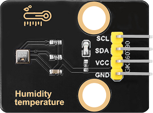
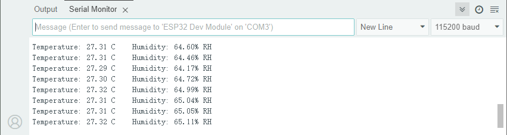
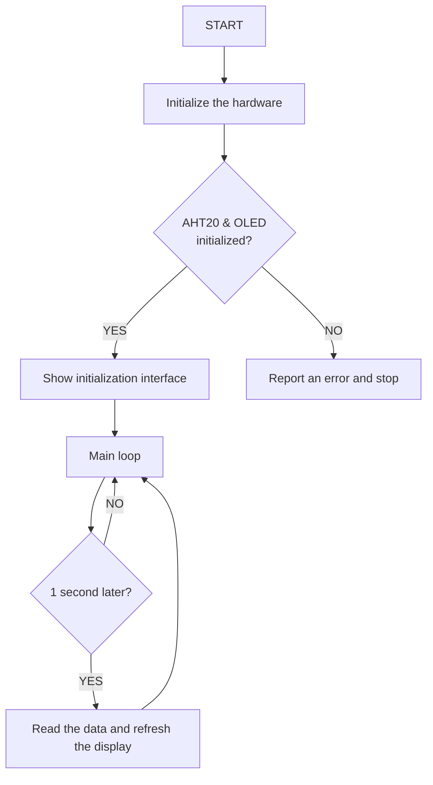

## 3. Classroom Smart Temperature & Humidity Meter

Let’s build an intelligent temperature and humidity monitoring system with an AHT20 temperature and humidity sensor and an OLED. It will display environment data in real time to create a comfortable and healthy learning environment for teachers and students!


### 3.1 AHT20 Temperature and Humidity Sensor

Based on the principles of capacitive humidity and thermistor temperature measurement, the AHT20 can detect the environment temperature and humidity in real time and then output the data through the I²C interface, which provides precise data support for environment monitoring and smart control.




#### Parameters

Operating voltage: DC 3.3-5V

Communication interface: I2C

I2C address: 0x38

Temperature range: -10°C ~ +50°C

Humidity range: 0% ~ 100% RH

Dimensions: 32 x 23 x 8mm

Positioning hole: Diameter of 3.2mm

Interface: 4-pin curved pin interface spacing 2.54mm


#### Principle

AHT20 principles of **capacitive humidity** and **thermistor temperature** measurement:

- Humidity measurement: The humidity changes in the air are detected by capacitive sensor, and the capacitance value will vary with the humidity.
- Temperature measurement: The ambient temperature is detected by a thermistor, and the resistance value changes with the temperature.
- Digital output: The sensor integrates an ADC (analog-to-digital converter) and a calibration circuit, which converts analog signals into digital signals and outputs them by I²C interface.


#### Test Code

```c++
#include <Wire.h>
#include <AHT20.h>
AHT20 aht20;

void setup()
{
  Serial.begin(115200);

  Wire.begin(); //Join I2C bus
  //Check if the AHT20 will acknowledge
  if (aht20.begin() == false)
  {
    Serial.println("AHT20 not detected. Please check wiring.");
    while (1);
  }
  Serial.println("AHT20 acknowledged.");
}

void loop()
{
  //Get the new temperature and humidity value
  float temperature = aht20.getTemperature();
  float humidity = aht20.getHumidity();

  //Print the results
  Serial.print("Temperature: ");
  Serial.print(temperature, 2);
  Serial.print(" C\t");
  Serial.print("Humidity: ");
  Serial.print(humidity, 2);
  Serial.print("% RH");

  Serial.println();

  //The AHT20 can respond with a reading every ~50ms. However, increased read time can cause the IC to heat around 1.0C above ambient.
  //The datasheet recommends reading every 2 seconds.
  delay(2000);
}
```


#### Code Explanation

**1. Hardware and library**

```c++
#include <Wire.h>
#include <AHT20.h>
AHT20 aht20;
```

- Import I²C communication library and AHT20 sensor library, create an AHT20 object and name it  `aht20` for operating the sensor.

<br>

**2. Initialization(setup)**

```c++
void setup()
{
  Serial.begin(115200);

  Wire.begin(); //Join I2C bus
  //Check if the AHT20 will acknowledge
  if (aht20.begin() == false)
  {
    Serial.println("AHT20 not detected. Please check wiring. Freezing.");
    while (1);
  }
  Serial.println("AHT20 acknowledged.");
}
```

- Initialize serial communication (115200 baud rate)

- Initialize the I2C bus

- Check whether the AHT20 sensor is connected properly

  If the detection fails, the program will stop and prompt to check the wiring

  If it is detected, a confirmation message will be displayed

<br>

**3.  Main Loop (loop)**

```c++
aht20.getTemperature()
aht20.getHumidity()
```

- Read the current temperature value and return a floating-point number (unit: °C);
- Read the current humidity value and return a floating-point number (unit: % RH).

```c++
void loop()
{
  //Get the new temperature and humidity value
  float temperature = aht20.getTemperature();
  float humidity = aht20.getHumidity();

  //Print the results
  Serial.print("Temperature: ");
  Serial.print(temperature, 2);
  Serial.print(" C\t");
  Serial.print("Humidity: ");
  Serial.print(humidity, 2);
  Serial.print("% RH");

  Serial.println();

  //The AHT20 can respond with a reading every ~50ms. However, increased read time can cause the IC to heat around 1.0C above ambient.
  //The datasheet recommends reading every 2 seconds.
  delay(2000);
}
```

- Read the current temperature and humidity data and return a floating-point number.

- Output the format data through the serial monitor.

  In the `Serial.print(temperature, 2);`, `2` indicates that the value is retained to two decimal places. 

- Delay 2 seconds (the minimum read interval recommended in the sensor data manual).


#### Test Result

After uploading the code, open the serial monitor and set the baud rate to 115200. The temperature and humidity values will be updated every two seconds.



---


### 3.2 1.3-inch  IIC  OLED Display

OLED display adopts a self-luminous display DS technology. It features high contrast, wide viewing Angle and low power consumption and can show clear images and text. So it is widely used in smart devices, wearable devices and industrial control and so on.

==图==


#### Parameters

Operating voltage: DC 3.3-5V

Driver chip: SH1106

Communication interface: I2C

Resolution: 128*64

Dimensions: 37 x 34 x 6mm

Positioning hole: 30.5mm(length) * 29mm (width)

Interface: 4-pin curved pin interface spacing 2.54mm


#### Principle

**OLED working principle**

- **Self-luminescence** : Each pixel of the OLED is composed of organic luminescent materials. When current passes through, pixels emit light without backlighting.
- **Pixel Control** : By controlling the current of each pixel, their brightness can be adjusted, thereby achieving image display.
- **Driver Chip** : Built-in driver chip SH1106 is responsible for receiving control signals and driving pixels.

**OLED control principle**

The control principle of OLED is based on **video memory(GRAM)** and **communication protocols**:

- **Video memory(GRAM)**:
  - The OLED is equipped with video memory for storing the current displayed image data.
  - The screen content can be updated by writing data to the video memory.
- **Communication protocol**:
  - Commands and data are sent through the I²C interface to control the working mode and video memory content of the OLED.
  - Common commands include initialization, screen clearing, cursor position setting, data writing, etc.


#### Test Code

```c++
#include <Wire.h>
#include <Adafruit_GFX.h>
#include <Adafruit_SH110X.h>

// OLED configuration
#define SCREEN_WIDTH 128
#define SCREEN_HEIGHT 64
#define OLED_RESET -1  // Share I2C reset
#define I2C_ADDRESS 0x3C  // Default address of SH1106

// Create a display object
Adafruit_SH1106G display(SCREEN_WIDTH, SCREEN_HEIGHT, &Wire, OLED_RESET);

void setup() {
  // Initialize the serial port
  Serial.begin(115200);
  
  // Initialize OLED
  if(!display.begin(I2C_ADDRESS, true)) {  // true is 128x64 resolution
    Serial.println("SH1106 initialization failed");
    while(1);  // Stuck and not continuing
  }
  
  // Clear the screen and set the text properties
  display.clearDisplay();
  display.setTextSize(1);      // text size
  display.setTextColor(SH110X_WHITE);  // Monochrome display
  display.setCursor(10, 25);   // Set the starting position (center)
  
  // show "Hello world!"
  display.println("Hello world!");
  
  // Update display
  display.display();
}

void loop() {
  // There is no need for looping content
  delay(1000);
}
```


#### Code Explanation

**1. Hardware and library**

**Header file import**

```c++
#include <Wire.h>               // I2C communication library
#include <Adafruit_GFX.h>      // Adafruit graphics core library
#include <Adafruit_SH110X.h>   // SH1106 dedicated driver library
```

**OLED parameter configuration**

```c++
#define SCREEN_WIDTH 128       // Screen width (pixels)
#define SCREEN_HEIGHT 64       // Screen height (pixels)
#define OLED_RESET -1          // Reset pin (-1 indicates shared I2C reset)
#define I2C_ADDRESS 0x3C       // I2C device address (7-bit address)
```

**Create a display object**

```c++
Adafruit_SH1106G display(SCREEN_WIDTH, SCREEN_HEIGHT, &Wire, OLED_RESET);
```

<br>

**2. Initialization(setup)**

```c++
void setup() {
  // Initialize the serial port
  Serial.begin(115200);
  
  // Initialize OLED
  if(!display.begin(I2C_ADDRESS, true)) {  // true is 128x64 resolution
    Serial.println("SH1106 initialization failed");
    while(1);  // Stuck and not continuing
  }
  
  // Clear the screen and set the text properties
  display.clearDisplay();
  display.setTextSize(1);      // text size
  display.setTextColor(SH110X_WHITE);  // Monochrome display
  display.setCursor(10, 25);   // Set the starting position (center)
  
  // show "Hello world!"
  display.println("Hello world!");
  
  // Update display
  display.display();
}
```

- Initialize the serial communication
- Initialize OLED
- Configuration displays parameters
- Output “Hello world!”
- Update display content

<br>

**3.  Main Loop (loop)**

```c++
delay(1000);
```

- `delay(1000)` pauses execution for 1 second to prevent it from idling too frequently.


#### Test Result

After uploading the code, you can see “Hello world!” in the middle of the OLED screen.

==图==

The display content will be refreshed every 1000 milliseconds.


#### FAQ

1. The code upload failed?
   - Make sure the library files are added
   - Make sure the IIC wiring is correct

---


### 3.3 Smart Temperature & Humidity Meter

In the previous study, we have become familiar with the text display of OLED and mastered the data acquisition method of the AHT20 sensor. Now, let’s deeply integrate these two to create a temperature and humidity meter!

Herein, we will build an intelligent monitoring station that can track the classroom temperature and relative humidity in real time. This system will clearly display them on the OLED:

- Real-time temperature value (℃)
- Current humidity percentage (%)

Now, let’s embark on this practical journey of environment perception!


#### Code Flow




#### Test Code

```c++
#include <Wire.h>
#include <AHT20.h>
#include <Adafruit_GFX.h>
#include <Adafruit_SH110X.h>

// OLED configuration
#define SCREEN_WIDTH 128
#define SCREEN_HEIGHT 64
#define OLED_RESET -1
#define I2C_ADDRESS 0x3C

Adafruit_SH1106G display(SCREEN_WIDTH, SCREEN_HEIGHT, &Wire, OLED_RESET);
AHT20 aht20;

// Last update time
unsigned long lastUpdate = 0; // Record last update time
const unsigned long updateInterval = 2000; // Update interval of 2 seconds

void setup() {
  Serial.begin(115200);
  
  Wire.begin();
  
  // Initialize the AHT20 sensor
  if(!aht20.begin()) {
    Serial.println("AHT20 not detected! Please check the wiring");
    while(1); // An error is reported only through the serial port
  }

  // Initialize OLED
  if(!display.begin(I2C_ADDRESS, true)) {
    Serial.println("OLED initialization failed");
    while(1); // An error is reported only through the serial port
  }

  // Clear the screen to display the initial information
  display.clearDisplay();
  display.setTextSize(1);
  display.setTextColor(SH110X_WHITE);
  display.setCursor(10, 30);
  display.println("Initializing...");
  display.display();
  delay(1000);
}

void loop() {
  if(millis() - lastUpdate >= updateInterval) {
    lastUpdate = millis();
    
    float temperature = aht20.getTemperature();
    float humidity = aht20.getHumidity();
    
    // Streamlined display updates
    display.clearDisplay();
    display.setTextSize(1);

    // Draw the title bar
    display.setTextSize(1);
    display.setCursor(0, 0);
    display.println("Hygrothermograph");
    display.drawLine(0, 10, SCREEN_WIDTH, 10, SH110X_WHITE);
    
    // Temperature display (optimized symbol display)
    display.setCursor(0, 25);
    display.print("T: ");
    display.print(temperature, 1);
    display.cp437(true);
    display.write(248); // °
    display.println("C");
    
    // Humidity display
    display.setCursor(0, 45);
    display.print("RH: ");
    display.print(humidity, 1);
    display.println("%");
    
    display.display();
  }
}
```


#### Code Explanation

**1. Hardware configuration and timing control module**

**Hardware initialization**

```c++
#include <Wire.h>
#include <AHT20.h>
#include <Adafruit_GFX.h>
#include <Adafruit_SH110X.h>

// OLED configuration 
#define SCREEN_WIDTH 128
#define SCREEN_HEIGHT 64
#define OLED_RESET -1
#define I2C_ADDRESS 0x3C

Adafruit_SH1106G display(SCREEN_WIDTH, SCREEN_HEIGHT, &Wire, OLED_RESET);
AHT20 aht20;
```

**Timing control variable**

```c++
unsigned long lastUpdate = 0; // Record last update time
const unsigned long updateInterval = 2000; // Update interval of 2 seconds
```

Update every 2 seconds, following the minimum read interval recommended by the sensor data manual.

<br>

**2. Initialization(setup)**

```c++
void setup() {
  Serial.begin(115200);
    
  Wire.begin();
  
  // Initialize the AHT20 sensor
  if(!aht20.begin()) {
    Serial.println("AHT20 not detected! Please check the wiring");
    while(1); // An error is reported only through the serial port
  }

  // Initialize OLED
  if(!display.begin(I2C_ADDRESS, true)) {
    Serial.println("OLED initialization failed");
    while(1); // An error is reported only through the serial port
  }

  // Clear the screen to display the initial information
  display.clearDisplay();
  display.setTextSize(1);
  display.setTextColor(SH110X_WHITE);
  display.setCursor(10, 30);
  display.println("Initializing...");
  display.display();
  delay(1000);
}
```

- Complete all hardware initializations
- Display the start-up message “Initializing...” on the OLED.

`display-println()` only modifies the image data in memory. The display will be actually updated only after calling `display()`.

<br>

**3.  Main Loop (loop)**

**Timing control**

```c++
if(millis() - lastUpdate >= updateInterval) {
  lastUpdate = millis();
  // ...Subsequent code
}
```

Realize non-blocking timing sampling

- Update the data once every `updateInterval`(1000ms)
- Use `millis()` for timing to avoid program blocking caused by `delay()`
- `lastUpdate` records the timestamp of the last update

**Sensor data acquisition**

```c++
float temperature = aht20.getTemperature(); // Obtain temperature (unit: ℃)
float humidity = aht20.getHumidity();     // Obtain humidity (unit: %RH）
```

**OLED display update**

```c++
    // Streamlined display updates
    display.clearDisplay();
    display.setTextSize(1);

    // Draw the title bar
    display.setTextSize(1);
    display.setCursor(0, 0);
    display.println("Hygrothermograph");
    display.drawLine(0, 10, SCREEN_WIDTH, 10, SH110X_WHITE);
    
    // Temperature display (optimized symbol display)
    display.setCursor(0, 25);
    display.print("T: ");
    display.print(temperature, 1);
    display.cp437(true);
    display.write(248); // °
    display.println("C");
    
    // Humidity display
    display.setCursor(0, 45);
    display.print("RH: ");
    display.print(humidity, 1);
    display.println("%");
    
    display.display();
```

- Screen initialization

- Draw the title bar

- Temperature and humidity display

- Screen refresh

#### Test Result

After uploading the code, AHT20 sensor reads the temperature and humidity values every 2 seconds and displays them on the OLED.

==图==
