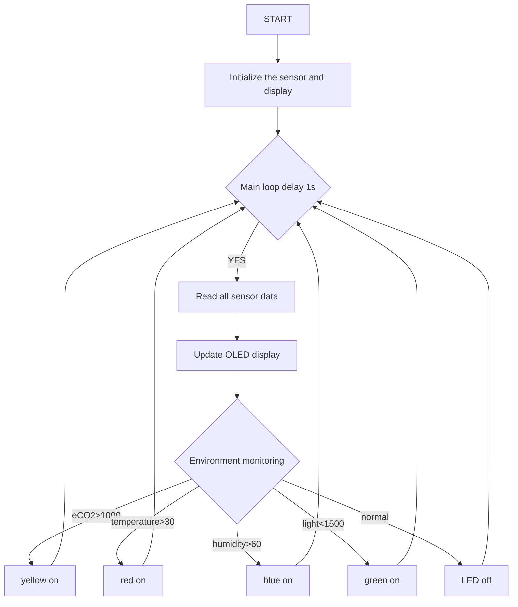
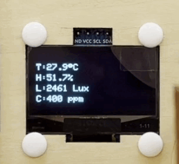

## 4. Classroom Environment Monitoring Display and Alarm

### 4.1 Environment Monitoring Display and Alarm

Previously, we have learned the usage methods of photoresistor, ENS160 air quality sensor, 6812 RGB module and OLED. Now, let’s integrate them to develop a smart environment monitoring system for our classroom!

Functions:

- Real-time monitoring: Display light, temperature and humidity, and air quality (eCO₂) on OLED
- Intelligent alarm: When parameters are abnormal, the RGB automatically switches colors to prompt:
  - Excessive concentration of eCO₂ → yellow
  - Increasing temperature → red
  - Excessive humidity → blue
  - Abnormal lighting → green

Since this system integrates monitoring, display and intelligent alarm, it can reveal the classroom conditions by visual alarms by colors, helping teachers and students quickly identify environment problems. Now, let’s do it!


#### Code Flow




#### Test Code

```c++
#include <Wire.h>
#include <AHT20.h>
#include <Adafruit_GFX.h>
#include <Adafruit_SH110X.h>
#include <DFRobot_ENS160.h>
#include <Adafruit_NeoPixel.h>

// Hardware configuration
#define SCREEN_WIDTH 128
#define SCREEN_HEIGHT 64
#define OLED_RESET -1
#define I2C_ADDRESS 0x3C
#define LED_PIN 4
#define LED_COUNT 4

// Environment threshold
#define LIGHT_THRESHOLD 1500
#define TEMP_THRESHOLD 30
#define HUMI_THRESHOLD 60
#define ECO2_THRESHOLD 1000

// Create an object
AHT20 aht20;
DFRobot_ENS160_I2C ENS160(&Wire, 0x53);
Adafruit_NeoPixel leds(LED_COUNT, LED_PIN, NEO_GRB + NEO_KHZ800);
Adafruit_SH1106G display(SCREEN_WIDTH, SCREEN_HEIGHT, &Wire, OLED_RESET);

// Update time control
unsigned long lastUpdate = 0;
const unsigned long updateInterval = 2000;

const int lightSensorPin = 34;

void setup() {
  Serial.begin(115200);
  Wire.begin();
  
  // Initialize OLED
  display.begin(I2C_ADDRESS, true);
  display.clearDisplay();
  display.setTextSize(1);
  display.setTextColor(SH110X_WHITE);
  
  // Initialize sensor
  aht20.begin();
  ENS160.begin();
  ENS160.setPWRMode(ENS160_STANDARD_MODE);
  
  // Initialize RGB
  leds.begin();
  leds.setBrightness(100);
  leds.show();
}

void loop() {
  if(millis() - lastUpdate >= updateInterval) {
    lastUpdate = millis();
    
    // Read sensor data
    float temperature = aht20.getTemperature();
    float humidity = aht20.getHumidity();
    int illum = analogRead(lightSensorPin);
    uint16_t eco2 = ENS160.getECO2();
    
    // Update display
    display.clearDisplay();
    display.setCursor(0, 12);
    display.print("T:");
    display.print(temperature, 1);
    display.cp437(true);
    display.write(248); // °
    display.println("C");
    
    display.setCursor(0, 24);
    display.print("H:");
    display.print(humidity, 1);
    display.println("%");
    
    display.setCursor(0, 36);
    display.print("L:");
    display.print(illum);
    display.println(" Lux");
    
    display.setCursor(0, 48);
    display.print("C:");
    display.print(eco2);
    display.println(" ppm");
    
    display.display();
    
    // control LED
    setAllLEDs(0, 0, 0); // off
    
    if(eco2 > ECO2_THRESHOLD) {
      setAllLEDs(255, 255, 0); // yellow
    } 
    else if(temperature > TEMP_THRESHOLD) {
      setAllLEDs(255, 0, 0);   // red
    }
    else if(humidity > HUMI_THRESHOLD) {
      setAllLEDs(0, 0, 255);   // blue
    }
    else if(illum < LIGHT_THRESHOLD) {
      setAllLEDs(0, 255, 0);   // green
    }
  }
}

// set LED color
void setAllLEDs(uint8_t r, uint8_t g, uint8_t b) {
  for (int i = 0; i < LED_COUNT; i++) {
    leds.setPixelColor(i, leds.Color(r, g, b));
  }
  leds.show();
}
```


#### Code Explanation

**1. Initialization(setup)**

```c++
void setup() {
  // Communication protocol initialization
  Serial.begin(115200);    // Serial port debugging
  Wire.begin();            // Initialize I2C 
  
  // Peripheral initialization sequence
  display.begin(0x3C, true);  // Initialize OLED
  aht20.begin();              // Temperature and humidity sensor
  ENS160.begin();             // Air quality sensor
  leds.begin();               // RGB strip
}
```

**2. Main Loop(loop)**

Timed update: Do a complete monitoring once every two seconds

 1. **Data acquisition** : Read all sensor data
   - `aht20.getTemperature()` → Temperature(℃)
   - `aht20.getHumidity()` → Humidity(%)
   - `analogRead(lightSensorPin)` → Illumination/light intensity
   - `ENS160.getECO2()` → eCO2(ppm)
 2. **Data processing** : Formatting and unit conversion
 3. **Display update**: Refresh the display on the OLED
 4. **Status judgment** : Compare with environment parameter thresholds
 5. **Alarm trigger** : RGB lighting feedback:
   - High eCO2 (>1000ppm) → yellow on (`255,255,0`)
   - High temperature (>30℃) → red on (`255,0,0`)
   - High humidity (>60%) → blue on (`0,0,255`)
   - Dark light (<1500) → green on (`0,255,0`)


#### Test Result

After uploading the code, the environment data is collected in real time by the AHT20 sensor, ENS160 sensor and photoresistor and updated on the OLED display every 2 seconds, while visual feedback is provided by RGB LED.

- High eCO2 (>1000ppm) → yellow on
- High temperature (>30℃) → red on
- High humidity (>60%) → blue on
- Dark light (<1500) → green on


