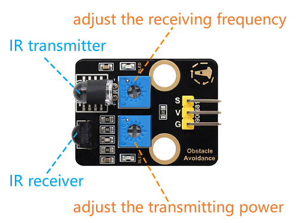

## 6. Smart Basketball Scoreboard

Let’s make a basketball scoreboard with infrared obstacle avoidance sensor and OLED. It will accurately detect goals and display the score in real time. What a perfect combination of technology and sports!

### 6.1 Infrared Obstacle Avoidance Sensor

This infrared obstacle avoidance sensor is a detection device based on infrared principles, which is capable of perceiving the distance of obstacles ahead in real time. It is widely used in robots, smart cars and automatic obstacle avoidance systems.


#### Parameters

Operating voltage: DC 5V

Current: 50 mA

Maximum power: 0.3W

Operating temperature: -10°C ~ +50°C

Output signal: Digital signal

Sensing distance: 2 ~ 40 cm

Dimensions: 32 x 23 x 12mm

Positioning hole size: Diameter of 4.8mm

Interface: 3-pin curved pin interface spacing 2.54mm


#### Principle



**Working principle:**

1. Emit infrared light:
	  - An infrared emitter emits a beam of infrared light.
2. Receive reflected light:
	  - If there is an obstacle ahead, the infrared light will be reflected back and received by the infrared receiver.

3. Signal processing:

	  - The circuit inside the sensor determines the distance of the obstacle based on the intensity of the reflected light received.

	  - The output signal is a digital signal (high or low level).


Infrared obstacle avoidance sensor is greatly disturbed by ambient light and have a relatively short detection distance (usually 2cm ~ 30cm).

**Adjust the sensor sensitivity:**

The potentiometer on the module can be used to change its sensitivity and detection distance. Here are the adjustment steps and precautions for you to adjust the detection distance to the **maximum**.

<span style="color: rgb(200, 70, 100);">Note: When adjusting, keep the front of the sensor probe **away from obstacles** or **no obstacles** blocking it.</span>

First, adjust the two potentiometers to the middle position (default state).

Adjust the transmission power: Turn the potentiometer clockwise to the end, and then slowly turn it counter-clockwise just till the SLED is going to be on (it is <span style="color: rgb(10, 10, 200);">off</span> finally).


Set the receiving frequency: Similarly, turn the potentiometer clockwise to the end, and then slowly turn it counter-clockwise just till the SLED is going to be on (it is still <span style="color: rgb(10, 10, 200);">off</span> finally). At this time the detection distance is the farthest.


After that, we can put it into use. Test it by your hand and you can see the SLED lights on.


#### Test Code

```c++
int val = 0;
void setup() {
  Serial.begin(115200);   
  pinMode(18, INPUT);    
}

void loop() {
  val = digitalRead(18);  //Read the digital level
  Serial.print(val);     //Print the read level signal
  if (val == 0) {  //Obstacle detection
    Serial.println("\t There are obstacles");
    delay(100);
  }
  else {  //No obstacles were found.
    Serial.println("\t All going well");
    delay(100);
  }
}
```


#### Code Explanation

- Read the output signal of the infrared obstacle avoidance sensor:

  - `0`: An obstacle is detected.

  - `1`: No obstacle is detected.

- Determine whether there are obstacles based on the signal:

  - If an obstacle is detected, output `There are obstacles`.
  - If no obstacle is detected, output `All going well`.

- The detection results are displayed in real time on the serial monitor.


#### Test Result

Open the serial monitor and set the baud rate to 115200:

- If no obstacle is detected, output `1` and `All going well`.
- If an obstacle is detected, output `0` and `There are obstacles`.


---


### 6.2 Smart Basketball Scoreboard

In the last experiment, we have already learned the basic principles and usage methods of infrared obstacle avoidance sensor and OLED. Now, let’s make a basketball scoreboard! It can accurately detect goals and display the score in real time, which not only enhances the game experience but also is full of a sense of technology.

Next, we will connect hardware, write code and debug, and ultimately create a basketball scoreboard. Now let’s embark on this journey full of creativity and challenges together!


#### Code Flow


#### Test Code

```c++
#include <Wire.h>
#include <Adafruit_GFX.h>
#include <Adafruit_SH110X.h>

#define SCREEN_WIDTH 128
#define SCREEN_HEIGHT 64
#define OLED_RESET -1  // Share I2C reset
#define I2C_ADDRESS 0x3C  // Default address of SH1106

// Create a display object
Adafruit_SH1106G display(SCREEN_WIDTH, SCREEN_HEIGHT, &Wire, OLED_RESET);

const int sensorPin = 18;
volatile int goalCount = 0;  // Use volatile to ensure interrupt safety
unsigned long lastDetectTime = 0;
const int debounceTime = 50; // eliminate jitter(ms)

void setup() {
  Serial.begin(115200);

  // Initialize OLED
  if(!display.begin(I2C_ADDRESS, true)) {  // true is 128x64 resolution
    Serial.println("SH1106 initialization failed");
    while(1);  // Stuck and not continuing
  }

  // Clear the screen and set the text properties
  display.clearDisplay();
  display.setTextSize(3);      // Text size
  display.setTextColor(SH110X_WHITE);
  
  pinMode(sensorPin, INPUT);
  attachInterrupt(digitalPinToInterrupt(sensorPin), detectCallback, FALLING);
}

void detectCallback() {
  if (millis() - lastDetectTime > debounceTime) {
    goalCount++;
    lastDetectTime = millis();
  }
}

void loop() {
  // display
  display.clearDisplay();
  display.setCursor(40, 20);  
  display.println(goalCount);
  display.display();
}
```


#### Code Explanation

**1. Header files, constant and variable definition**

```c++
#include <Wire.h>                // I2C communication library
#include <Adafruit_GFX.h>        // Adafruit graphics library
#include <Adafruit_SH110X.h>     // SH1106 OLED driver library

#define SCREEN_WIDTH 128         // OLED width (pixels)
#define SCREEN_HEIGHT 64         // OLED height (pixels)
#define OLED_RESET -1            // Shared I2C reset (no hardware reset)
#define I2C_ADDRESS 0x3C         // SH1106 default I2C address

Adafruit_SH1106G display(SCREEN_WIDTH, SCREEN_HEIGHT, &Wire, OLED_RESET); // OLED display object

const int sensorPin = 18;        // Infrared sensor connection pin
volatile int goalCount = 0;      // Interrupt the safe counter variable
unsigned long lastDetectTime = 0; // Last detection time (for debouncing)
const int debounceTime = 50;     // eliminate jitter(ms)
```

- OLED-related: Defined the screen size, I2C address, and created the display object.
- Sensor-related: Specify the infrared sensor pin and set the counter variable (`volatile` ensures interrupt safety).
- Debouncing(eliminate jitter) processing: Prevent false triggering caused by signal jitter by `lastDetectTime` and `debounceTime`. 

<br>

**2. Initialization(setup)**

```c++
void setup() {
  Serial.begin(115200);  // Initialize the serial port (for debugging)

  // Initialize OLED
  if(!display.begin(I2C_ADDRESS, true)) {  // true is 128x64 resolution
    Serial.println("SH1106 initialization failed");
    while(1);  // Stuck and not continuing
  }

  // Clear the screen and set the text properties
  display.clearDisplay();
  display.setTextSize(3);       // Large font
  display.setTextColor(SH110X_WHITE); // White text
  
  // Configure infrared sensor
  pinMode(sensorPin, INPUT);
  attachInterrupt(digitalPinToInterrupt(sensorPin), detectCallback, FALLING);
}
```

- Initialize OLED.

- Display settings: Clear the screen, set large white font (suitable for displaying numbers).

- Sensor configuration:

  Set the falling edge by `attachInterrupt` to trigger an interrupt (execute `detectCallback` when an object is detected).

<br>

**3. Interrupt the callback function**

```c++
void detectCallback() {
  if (millis() - lastDetectTime > debounceTime) {
    goalCount++;
    lastDetectTime = millis();
  }
}
```

`millis()` is a very important time function in Arduino programming. Its role is to **return the number of milliseconds that have elapsed since the program started running**.

1. When the sensor detects an object, it generates a falling edge signal (level 1→0), enabling `detectCallback()` interrupt service function
2. **time difference debouncing** (50ms interval):
   - If the interval between two triggers is > 50ms → it is considered valid, `goalCount++`
   - Otherwise, it is regarded as jitter noise and this trigger will be ignored
3. Update the last valid trigger timestamp `lastDetectTime`


<br>

**4. Main Loop(loop)**

```c++
void loop() {
  // OLED display count
  display.clearDisplay();
  display.setCursor(40, 20);  // Display in the center
  display.println(goalCount);
  display.display();          // Refresh the screen
}
```

- OLED display: Clear the screen and then show the current count.


#### Test Result

After uploading the code, we throw the basketball into the basket. When the goal is scored:

- Add 1 to the score.

- The OLED displays the current score in real time.

**ATTENTION**: Infrared obstacle avoidance sensor is sensitive to ambient light. Please use them in an environment with stable light.


---

