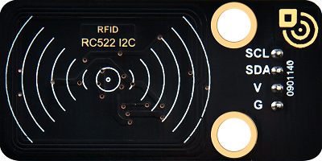
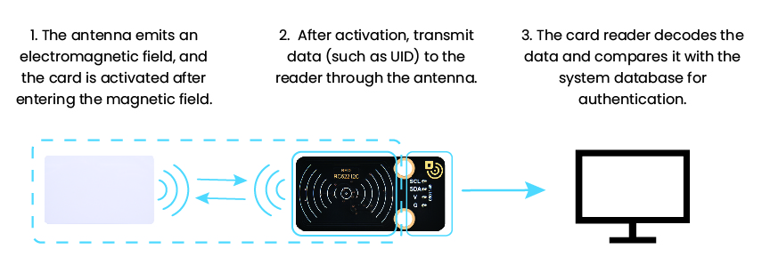
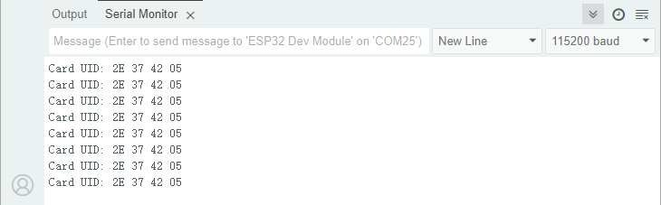
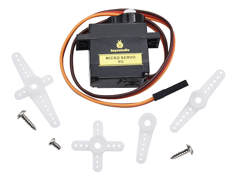
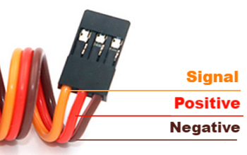
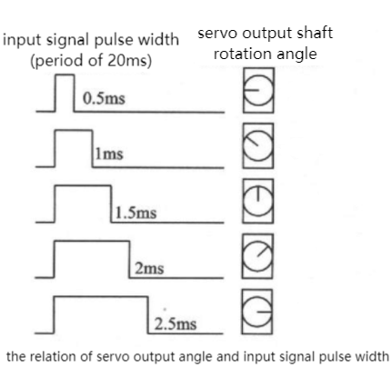
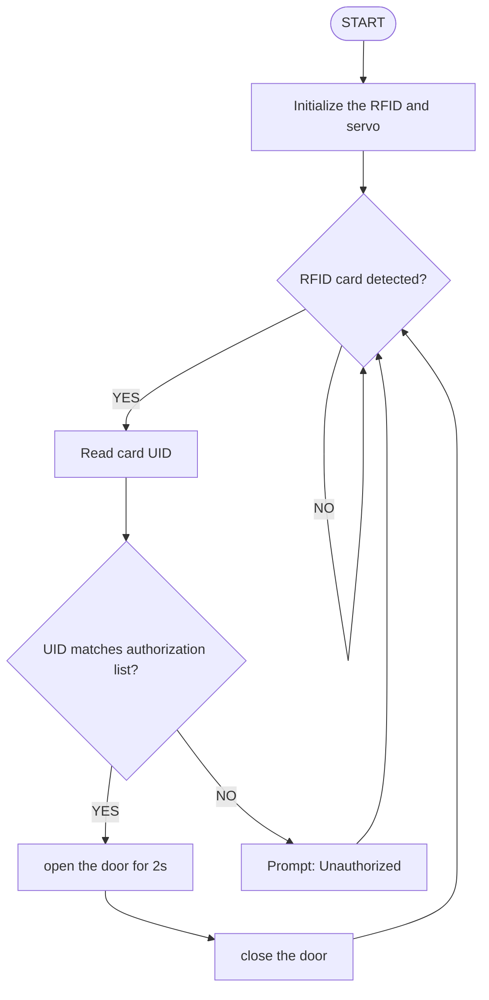

## 7. School Smart Access Control

Let’s make a smart access control system with RFID module and servo. By scanning card, it can recognize identities and automatically control the door lock opening and closing, so that we can experience a safe and convenient smart school life!

### 7.1 RFID Card Module

The RFID module is a non-contact card reading device based on radio frequency identification. It can quickly scan the identity information in IC cards or electronic tags so is widely used in access control, attendance and payment systems.




#### Parameters

Operating voltage: DC 5V

Operating current: 13 ~ 100 mA /DC 5V 

Idle current: 10 ~ 13 mA /DC 5V

Sleep current: < 80 uA

Peak current: < 100 mA

Operating frequency: 13.56 MHz

Maximum power: 0.5W

Data transmission rate: Maximum 10Mbit/s

Operating temperature: -10°C ~ +50°C

Dimensions: 48 x 24 x 8 mm

Positioning hole: Diameter of 4.8mm

Interface: 4-pin curved pin interface spacing 2.54mm


#### Principle

**Workflow**



**(1) Energy transmission**

- The antenna of the card reader emits an electromagnetic field → provide energy for passive RFID cards (without batteries).

**(2) Data interaction**

- After the card enters the magnetic field, it is activated → the data within the card (such as UID) is transmitted back to the card reader through load modulation.

**(3) Identity verification**

- The card reader decodes the data → it is compared with the system database for authentication.


#### Test Code

```c++
#include <Wire.h>         // I2C communication library
#include "MFRC522_I2C.h"  // I2C driver library of MFRC522
MFRC522 mfrc522(0x28);    // Create an MFRC522 object and set I2C address to 0x28

void setup() {
  Serial.begin(115200);   // Initialize the serial port (for debugging)
  Wire.begin();           // Initialize the I2C bus (default SDA=GPIO21, SCL=GPIO22)
  mfrc522.PCD_Init();     // Initialize the MFRC522 card reader
  ShowReaderDetails();    // Display the version information of the card reader
  Serial.println(F("Scan PICC to see UID, type, and data blocks..."));
}

void loop() {
  // Check if there are new cards and whether the card data can be successfully read
  if ( ! mfrc522.PICC_IsNewCardPresent() || ! mfrc522.PICC_ReadCardSerial() ) {
    delay(50);  // Reduce polling frequency and decrease CPU usage
    return;     // Exit when there is no card or the card reading fails
  }
  
  // Print the card UID (hexadecimal format)
  Serial.print(F("Card UID:"));
  for (byte i = 0; i < mfrc522.uid.size; i++) {
    Serial.print(mfrc522.uid.uidByte[i] < 0x10 ? " 0" : " ");
    Serial.print(mfrc522.uid.uidByte[i], HEX);
  } 
  Serial.println();
}

void ShowReaderDetails() {
  //  Obtain the MFRC522 software
  byte v = mfrc522.PCD_ReadRegister(mfrc522.VersionReg);
  Serial.print(F("MFRC522 Software Version: 0x"));
  Serial.print(v, HEX);

  // Version judgment
  if (v == 0x91)
    Serial.print(F(" = v1.0"));
  else if (v == 0x92)
    Serial.print(F(" = v2.0"));
  else
    Serial.print(F(" (unknown)"));
  Serial.println("");

  // When communication fault detection returns 0x00 or 0xFF, it may indicate that the communication signal transmission has failed
  if ((v == 0x00) || (v == 0xFF)) {
    Serial.println(F("WARNING: Communication failure, is the MFRC522 properly connected?"));
  }
}
```


#### Code Explanation

**1. Header files and object initialization**

```c++
#include <Wire.h>         // I2C communication library
#include "MFRC522_I2C.h"  // I2C driver library of MFRC522
MFRC522 mfrc522(0x28);    // Create an MFRC522 object and set I2C address to 0x28
```

- `MFRC522_I2C.h`: The dedicated I2C driver library for the MFRC522 module.

- `MFRC522 mfrc522(0x28)`: Initialize the MFRC522 object and set the I2C address to `0x28`.

<br>

**2. Initialization(setup)**

```c++
void setup() {
  Serial.begin(115200);   // Initialize the serial port (for debugging)
  Wire.begin();           // Initialize the I2C bus (default SDA=GPIO21, SCL=GPIO22)
  mfrc522.PCD_Init();     // Initialize the MFRC522 card reader
  ShowReaderDetails();    // Display the version information of the card reader
  Serial.println(F("Scan PICC to see UID, type, and data blocks..."));
}
```

- `mfrc522.PCD_Init()`: Configure the radio frequency parameters and communication protocol of the card reader.
- `ShowReaderDetails()`: Verify whether the hardware connection is normal.

<br>

**3. Main Loop(loop)**

```c++
void loop() {
  // Check if there are new cards and whether the card data can be successfully read
  if ( ! mfrc522.PICC_IsNewCardPresent() || ! mfrc522.PICC_ReadCardSerial() ) {
    delay(50);
    return;  // Exit when there is no card or the card reading fails
  }

  // Print the card UID (hexadecimal format)
  Serial.print(F("Card UID:"));
  for (byte i = 0; i < mfrc522.uid.size; i++) {
    Serial.print(mfrc522.uid.uidByte[i] < 0x10 ? " 0" : " ");
    Serial.print(mfrc522.uid.uidByte[i], HEX);
  } 
  Serial.println();
}
```

- `mfrc522.PICC_IsNewCardPresent()`: Detect whether there is a card entering the radio frequency field.
- `mfrc522.PICC_ReadCardSerial()`: Activate the card and read the UID.


**4. ShowReaderDetails() Function**

```c++
void ShowReaderDetails() {
  byte v = mfrc522.PCD_ReadRegister(mfrc522.VersionReg);
  Serial.print(F("MFRC522 Software Version: 0x"));
  Serial.print(v, HEX);
  // Version judgment
  if (v == 0x91) Serial.print(F(" = v1.0"));
  else if (v == 0x92) Serial.print(F(" = v2.0"));
  else Serial.print(F(" (unknown)"));
  
  // Communication fault detection
  if ((v == 0x00) || (v == 0xFF)) {
    Serial.println(F("WARNING: Communication failure, is the MFRC522 properly connected?"));
  }
}
```

- `mfrc522.PCD_ReadRegister(mfrc522.VersionReg)`: Read the version number of MFRC522.

  `0x91` → v1.0

  `0x92` → v2.0

- If `0x00` or `0xFF` is returned, it indicates that the I2C communication has failed.

- When the address is incorrect, `ShowReaderDetails()` will report a communication failure.


#### Test Result

After uploading the code, place the RFID card within the magnetic field for detection. The card reader will print the UID in hexadecimal on the serial monitor.


==放一张卡片在磁场范围的图片==




#### FAQ

1. **The card cannot be read**
   - Check whether the I2C address is correct.
   - Check the power supply voltage (5V) and the card type.
2. **The version displays `0x00` or `0xFF`**
   - Check whether the I2C(SDA/SCL) is connected in reverse.
   - Ensure the stability of the power supply voltage.

---


### 7.2 Servo

A servo is a motor that precisely controls the rotation angle by receiving control signals.



The servo we use comes with three external wires. The brown one is for ground, the red is power positive, and the orange is for signal.




#### Parameters

Operating voltage: DC 3.3 ~ 5V 

Operating temperature: -10°C ~ +50°C

Dimensions: 32.25 x 12.25 x 30.42mm

Interface: 3-pin female interface spacing 2.54mm


#### Principle

**1. Working principle of servo**

A servo is a closed-loop controlled position servo motor. The ESP32 controls its angle by **PWM (Pulse Width Modulation) signals**. Core working principle is as follows:

**PWM signal input**:

- ESP32 generates a 50Hz (period 20ms) PWM signal

- **The pulse width (high-level time) determines the angle**:

  - **0.5ms(500μs)→ 0°**

  - **1.5ms(1500μs)→ 90°** (Middle position)

  - **2.5ms(2500μs)→ 180°**

    

**Pin restriction**:

- Avoid using the following pins (with special functions) :
  - GPIO0(Download Mode)
  - GPIO2(Internal pull up)
  - GPIO12(Level sensitive at startup)


#### Test Code

<span style="color: rgb(200, 70, 100);">Please ensure that the servo has been initialized before assembly; otherwise, it may get stuck and be damaged.</span>

```c++
#include <ESP32Servo.h>

Servo myservo;  // Create a servo object
const int servoPin = 32; // GPIO32

void setup() {
  myservo.attach(servoPin); // Initialize the servo
}

void loop() {
  myservo.write(180);    // 180°
  delay(1000);
  myservo.write(135);   // 135°
  delay(1000);
  myservo.write(90);  // 90°
  delay(1000);
}
```


#### Code Explanation

1. Initialize the servo (GPIO32 pin)
2. Loop execution
   - rotate to 180° → delay 1s
   - rotate to 135° → delay 1s
   - rotate to 90° → delay 1s
   - Repeat the loop


#### Test Result

<span style="color: rgb(200, 70, 100);">Warning: The servo must be correctly installed and fixed before powering on and working; otherwise, it may get stuck and be damaged.</span>

<span style="color: rgb(200, 70, 100);">For details, please refer to the product installation guide. The servo must be **initialized** first before installation.</span>

After uploading the code, the servo will rotate according to the following rules:

1. **rotate to 180° immediately** (Leftmost/minimum angle position) → maintain the state for 1s
2. **rotate to 135°** (Middle position) → maintain the state for 1s
3. **rotate to 90°** (Rightmost/maximum angle position) → maintain the state for 1s
4. **Repeat these actions** (180°→135°→90°→180°...)

==动图==

---


### 7.3 Smart Access Control

In the previous sections, we have mastered how to recognize identity by RFID module and how servo works. Now, we will integrate them to create an access control system with automatic card (un)locking function. It not only enhances school security but also showcases the charm of technology.

In the system, it can identify the RFID cards of authorized personnel and open/close the door by the servo. Now let’s build this stable and reliable system starting from flowchart and program writing. Are you ready? Start right now!


#### Code Flow




#### Test Code

<span style="color: rgb(200, 70, 100);">Please ensure that the servo has been initialized before assembly; otherwise, it may get stuck and be damaged.</span>

```c++
#include <Wire.h>
#include "MFRC522_I2C.h"
#include <ESP32Servo.h>

MFRC522 rfid(0x28);  // RFID card reader
Servo doorLock;      // Door lock servo
const int servoPin = 32;

// Authorized card UID (Replace with your own card number)
byte allowedCard[] = {0x2E, 0x37, 0x42, 0x05};

void setup() {
  Serial.begin(115200);
  Wire.begin();
  rfid.PCD_Init();
  doorLock.attach(servoPin);
}

void loop() {
  if (rfid.PICC_IsNewCardPresent() && rfid.PICC_ReadCardSerial()) { // A new card has been detected?
    if (memcmp(rfid.uid.uidByte, allowedCard, 4) == 0) { // Check if it is authorized
      doorLock.write(90);  // Open the door (90°)
      delay(2000);         // Keep the door open for 2 seconds
      doorLock.write(180); // Close the door (180°)
    }
    rfid.PICC_HaltA();     // Stop reading the card
  }
  delay(100);              
}
```


#### Code Explanation

**1. Authorized card settings**

```c
byte allowedCard[] = {0x2E, 0x37, 0x42, 0x05}; // Replace with your RFID card UID
```

Only one card can be authorized here. **The UID needs to be replaced with your own RFID card number**.

<br>

**2. Initialization(setup)**

```c++
void setup() {
  Serial.begin(115200);    // Serial communication (for debugging)
  Wire.begin();            // Initialize I2C
  rfid.PCD_Init();         // Initialize RFID card reader
  doorLock.attach(servoPin); // Initialize servo
}
```


**3. Main Loop(loop)**

```c++
void loop() {
  if (rfid.PICC_IsNewCardPresent() && rfid.PICC_ReadCardSerial()) { // A new card has been detected?
    if (memcmp(rfid.uid.uidByte, allowedCard, 4) == 0) { // Check if it is authorized
      doorLock.write(90);  // Open the door (90°)
      delay(2000);         // Keep the door open for 2 seconds
      doorLock.write(180); // Close the door (180°)
    }
      rfid.PICC_HaltA();     // Stop reading the card
  }
  delay(100);              // Eliminate jitter & Reduce CPU usage
}
```

- `PICC_IsNewCardPresent()`: Check if there are any new cards approaching.
- `PICC_ReadCardSerial()`: Read the UID of the card.
- `memcmp()`: Compare whether the read UID matches the `allowedCard`.
  - Match → Open the door (`90°`), and close the door after 2 seconds (`180°`)
  - Mismatch → No operation (the door remains closed).
- `PICC_HaltA()`: Stop reading the current card and get ready to check the next one.


#### Test Result

<span style="color: rgb(200, 70, 100);">Warning: The servo must be correctly installed and fixed before powering on and working; otherwise, it may get stuck and be damaged.</span>

<span style="color: rgb(200, 70, 100);">For details, please refer to the product installation guide. The servo must be **initialized** first before installation.</span>

After uploading the code, the access control system begins to circulate:

- Card available → Read UID → Match succeeded → Open the door → Delay 2s → Close the door
- Card available → Read UID → Match failed → Prompt unauthorized
- No card → Continue the detection

==动图==


#### FAQ

1. The card cannot be detected
   - Check if the I2C address is incorrect and if the wiring is loose
2. The servo does not rotate
   - Check the power supply voltage and connect an external power supply
   - Make sure the servo has been initialized before assembly
3. The serial port outputs messy codes
   - Make sure the serial monitor is set to 115200