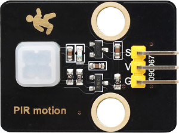
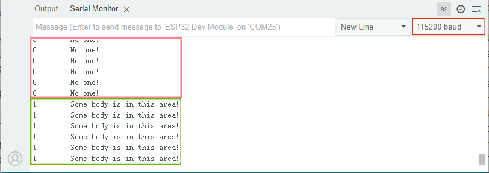
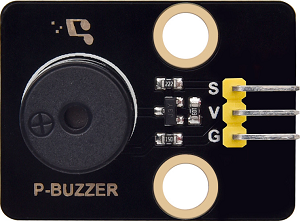
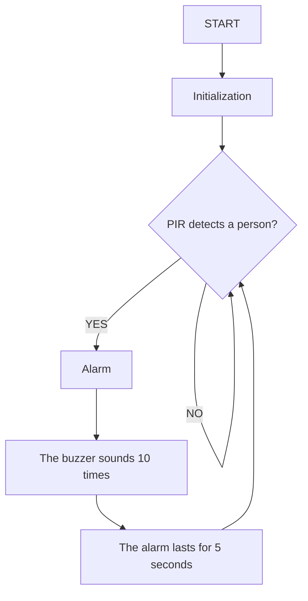

## 8. School Intrusion Alarm System

Here we are going to make a school intrusion alarm system. When someone secretly climbs over the wall and enters the school, the PIR motion sensor will immediately detect it and make the buzzer sound an alarm, just like a little electronic security guard!

### 8.1 PIR Motion Sensor

PIR motion sensor is an electronic device used to detect infrared signals emitted by the human body or animals, thereby sensing their movement or presence.




#### Parameters

Operating voltage: DC 3.3 ~ 5V 

Operating current: 50 mA

Maximum power: 0.3W

Static current: <50 μ A

Operating temperature: -10°C ~ +50°C

Control signal: Digital signal

Trigger mode: L Non-repeatable trigger /H Repeatable trigger

Maximum detection distance: 7 meters

Sensing angle: <100 degrees cone Angle

Dimensions: 32 x 23 x 8mm

Positioning hole: Diameter of 4.8mm

Interface: 3-pin curved pin interface spacing 2.54mm


#### Principle

**1. Pyroelectric effect**

The core of a PIR sensor is a **pyroelectric material** (such as lithium tantalate). When it receives **infrared radiation (with a wavelength of approximately 8-14μm)** emitted by the human body or animals, it will generate a weak charge change. After amplification by the internal circuit, an electrical signal is output.

**2. Fresnel lens enhanced detection**

A **Fresnel lens** is usually installed in front of the sensor, which can focus infrared signals over a large area onto the sensor and simultaneously divide them into multiple detection zones. When the target moves, the sensor triggers a signal due to temperature changes.

**3. Signal processing**

The comparator inside the sensor will filter out ambient noise (such as sunlight and heating interference), and only **output high and low level** signals for **infrared changes** that conform to human characteristics.

The PIR sensor outputs a transient high level (is triggered when someone **moves**, and lasts for a few seconds before returning to a low level).

- When someone is detected moving, a high level is output and the LED on the module goes out
- Otherwise, it outputs a low level and the LED on the module lights up


#### Test Code

```c++
int val = 0;
int PIRPin = 25;   //Define the pin of the PIR sensor as GPIO25
void setup() {
  Serial.begin(115200);   //set baud rate to 115200
  pinMode(PIRPin, INPUT);    //Set the sensor to input mode
}

void loop() {
  val = digitalRead(PIRPin);    //Read the sensor value
  Serial.print(val);    //Print the sensor value
  if (val == 1) {    //If there is someone moving nearby, output a high level
    Serial.println("\t Some body is in this area!");
    delay(100);
  }
  else {    //If no one is moving nearby, output a low level
    Serial.println("\t No one!");
    delay(100);
  }
}
```


#### Code Explanation

- Read the output signal of the PIR sensor:

  - `0`: someone is moving nearby

  - `1`: no one is moving nearby

- Determine whether someone is moving based on the signal:

  - If someone is detected moving, output `Some body is in this area!`.
  - If no one is detected moving, output `No one!`.

- Display the results in real time on the serial port monitor.


#### Test Result

After uploading the code, it detects in real time whether someone is moving.

Wave our hands to imitate someone passing by. Since the PIR sensor is sensitive to **temperature changes**, as long as a hand moves within the detection area (even slowly), it can be detected.

- If you stay still, it outputs `0`.
- If you move your hand, it outputs `1`.

==动图==



---


### 8.2 Passive Buzzer

A passive buzzer is an electronic component that requires an external PWM signal to drive it to produce sound, and its tone is determined by the frequency of the input square wave.




#### Parameters

Operating voltage: DC 3.3 ~ 5V 

Operating temperature: -10°C ~ +50°C

Control signal: Digital signal

Dimensions: 32 x 23 x 12 mm (without housing)

Positioning hole: Diameter of 4.8mm

Interface: 3-pin curved pin interface spacing 2.54mm


#### Principle

**Working principle of passive buzzer:**

1. **Core features**
   - **No internal oscillation source** : Only when a square wave (PWM signal) of a specific frequency is input can it produce sound. The frequency determines the tone (for example, 2kHz emits high-frequency beeping).
2. **Drive logic**
   - Directly connecting to direct current (such as 5V) will only produce a “click” sound (the mechanical response of instant power-on).
   - **Continuous sounding requires PWM** : For example, if a 1kHz square wave is input, the buzzer vibrates at a frequency of 1kHz to generate the corresponding tone.

**Seven tones:**

Music is an invisible art. It is a language that narrates emotions and thoughts. The foundation of music, as we all know, is note. We can compose a variety of melodies and rhythms with different notes. Of all the notes, the most basic are seven: C, D, E, F, G, A, B.

Like the alphabet of music, we can create countless wonderful pieces of music by their variation.


#### Test Code

```c++
#define BUZZER_PIN 19  // The buzzer is connected to GPIO19 (it must be a pin that supports PWM).

void setup() {
  pinMode(BUZZER_PIN, OUTPUT);
  Serial.begin(115200);
}

void loop() {
  // Test 1: Emit a 1kHz beeping sound (lasting for 1 second)
  tone(BUZZER_PIN, 1000);  // Frequency of 1000Hz
  delay(1000);
  noTone(BUZZER_PIN);      // Turn off the buzzer
  delay(1000);

  // Test 2: Emit a 2kHz beeping sound (lasting for 0.5 seconds)
  tone(BUZZER_PIN, 2000);  // Frequency of 2000Hz
  delay(500);
  noTone(BUZZER_PIN);
  delay(1000);

  // Test 3: Play a simple melody (Do-Re-Mi)
  int melody[] = {262, 294, 330};  // C4, D4, E4 frequency
  for (int i = 0; i < 3; i++) {
    tone(BUZZER_PIN, melody[i]);
    delay(300);
    noTone(BUZZER_PIN);
    delay(50);
  }
  delay(2000);  // Wait for 2 seconds and then loop
}
```


#### Code Explanation

1. Pin definition: Connect the buzzer to GPIO19 (PWM must be supported).
2. setup(): Initialize the buzzer pin to output mode and enable serial communication (baud rate of 115200).
3. loop():
   - Test 1: Play 1kHz sound for 1 second and then mute for 1 second.
   - Test 2: Play 2kHz sound for 0.5 second and then mute for 1 second.
   - Test 3: Play the melody “Do(262Hz)-Re(294Hz)-Mi(330Hz)” in sequence, with each note lasting for 0.3 seconds, an interval of 0.05 seconds, and wait for 2 seconds at the end.

4. The function used:
   - `tone(pin, frequency)`: Output a PWM signal of a specific frequency on the specified pin.
   - `noTone(pin)`: Stop the PWM signal output.


#### Test Result

After uploading the code, the buzzer plays in sequence:

- 1kHz (1 second) → 2kHz (0.5 second) → Do-Re-Mi melody

---


### 8.3 Intrusion Alarm System

In the previous study, we have mastered the movement detection principle of the PIR motion sensor and the sounding function of the passive buzzer. Next, we will combine them and make a real small security system by ourselves! 

The PIR sensor will be used to detect whether anyone has climbed over the school fence. Once an intruder is detected, the passive buzzer will immediately sound an alarm, which not only enables you to learn electronic knowledge, but also enhances your safety awareness. Come and join us in safeguarding school!


#### Code Flow




#### Test Code

```c++
#define PIR_PIN 25     // Signal pin of PIR motion sensor
#define BUZZER_PIN 19  // Buzzer control pin

// Alarm sound parameters
const int alarmTone = 2000;  // Alarm frequency (Hz)
const int beepDuration = 200; // Single sound duration (ms)
const int pauseDuration = 100; // Sound interval (ms)

void setup() {
  Serial.begin(115200);
  pinMode(PIR_PIN, INPUT);
  pinMode(BUZZER_PIN, OUTPUT);
}

void loop() {
  if (digitalRead(PIR_PIN) == HIGH) {
    triggerAlarm();
    delay(5000); // The alarm lasts for 5 seconds
  }
}

// trigger alarm
void triggerAlarm() {
  for (int i = 0; i < 10; i++) { // Reapeat 10 times of rapid alarm sound
    tone(BUZZER_PIN, alarmTone);
    delay(beepDuration);
    noTone(BUZZER_PIN);
    delay(pauseDuration);
  }
}
```


#### Code Explanation

**1. Main Loop(loop)**

```c++
void loop() {
  if (digitalRead(PIR_PIN) == HIGH) {  // Human movement was detected
    triggerAlarm();    // trigger alarm
    delay(5000);      // Reset after continuous alarm for 5 seconds
  }
}
```

- Continuously detect the PIR sensor signal (`digitalRead(PIR_PIN)`)
  - If `HIGH` (someone approaching) is detected, call `triggerAlarm()` to play an alarm sound.
  - Each time only triggers the alarm for 5 seconds to avoid prolonged noise interference. The alarm will automatically stop after lasting for 5 seconds and then re-enter the monitoring state.


**2. Alarm Function**

```c++
void triggerAlarm() {
  for (int i = 0; i < 10; i++) {  // Cycle 10 times
    tone(BUZZER_PIN, alarmTone);   // Produce a sound of 2000Hz
    delay(beepDuration);           // last 200ms
    noTone(BUZZER_PIN);            // Stop sounding
    delay(pauseDuration);          // interval of 100ms
  }
}
```

- **Alarm effect** : The buzzer cycles 10 times at a rhythm of **200ms on/100ms off **, generating a rapid “beep”, a warning sound similar to that of a real security system, which generates a sense of urgency.


#### Test Result

After uploading the code, continuously check the PIR sensor signal:

- HIGH level → Intrusion → Trigger the alarm
- LOW level → No one → Continue detection

==动图==