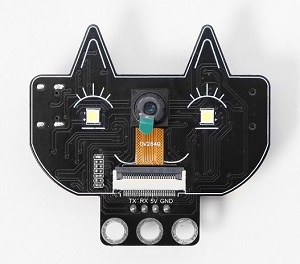
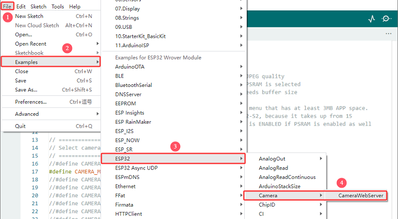
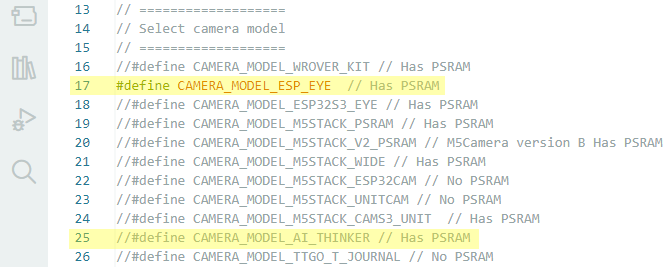
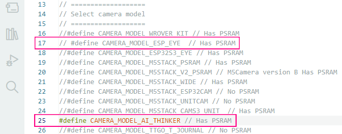
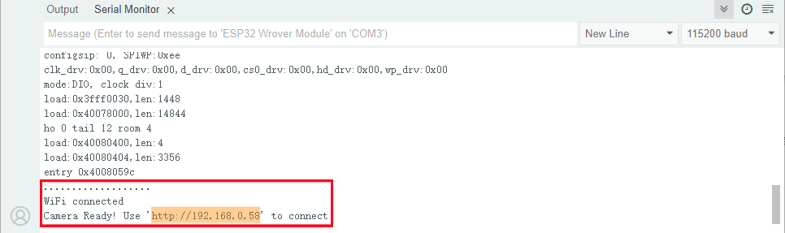
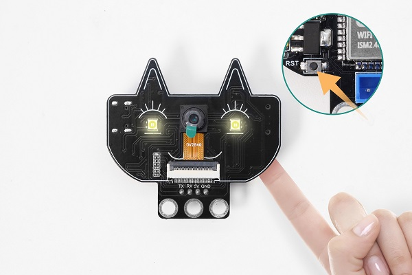
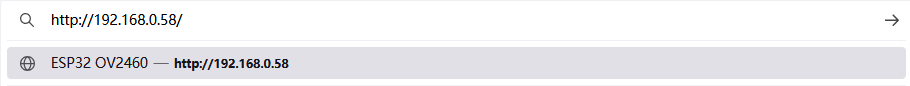
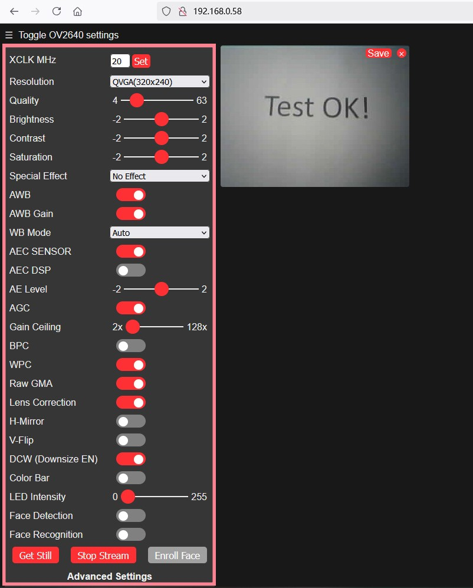

## 9. School Security Monitoring System

This is a low-cost AI vision development module integrating ESP32-S module and the OV2640 camera. It supports Wi-Fi video transmission so is suitable for Internet of Things vision applications such as smart monitoring.



#### Parameters

Power supply: 5V

Working current: 0.21A

Product dimensions: 55 * 51 * 15.5mm

It adopts a low-power, dual-core 32-bit CPU and can be used as an application processor.

The main frequency is up to 240MHz, and the computing power reaches 600 DMIPS.

It comes with built-in 520 KB of SRAM and external 8MB PSRAM.


#### Test Code

Open File  ->  Examples  ->  ESP32  ->  Camera  ->  CameraWebServer



Modify the camera type: Comment out `#define CAMERA_MODEL_ESP_EYE` , and enable `\#define CAMERA_MODEL_AI_THINKER`.



Modified:



Replace the WiFi name and password with yours.


```c++
#include "esp_camera.h"
#include <WiFi.h>

//
// WARNING!!! PSRAM IC required for UXGA resolution and high JPEG quality
//            Ensure ESP32 Wrover Module or other board with PSRAM is selected
//            Partial images will be transmitted if image exceeds buffer size
//
//            You must select partition scheme from the board menu that has at least 3MB APP space.
//            Face Recognition is DISABLED for ESP32 and ESP32-S2, because it takes up from 15
//            seconds to process single frame. Face Detection is ENABLED if PSRAM is enabled as well

// ===================
// Select camera model
// ===================
//#define CAMERA_MODEL_WROVER_KIT // Has PSRAM
// #define CAMERA_MODEL_ESP_EYE  // Has PSRAM
//#define CAMERA_MODEL_ESP32S3_EYE // Has PSRAM
//#define CAMERA_MODEL_M5STACK_PSRAM // Has PSRAM
//#define CAMERA_MODEL_M5STACK_V2_PSRAM // M5Camera version B Has PSRAM
//#define CAMERA_MODEL_M5STACK_WIDE // Has PSRAM
//#define CAMERA_MODEL_M5STACK_ESP32CAM // No PSRAM
//#define CAMERA_MODEL_M5STACK_UNITCAM // No PSRAM
//#define CAMERA_MODEL_M5STACK_CAMS3_UNIT  // Has PSRAM
#define CAMERA_MODEL_AI_THINKER // Has PSRAM
//#define CAMERA_MODEL_TTGO_T_JOURNAL // No PSRAM
//#define CAMERA_MODEL_XIAO_ESP32S3 // Has PSRAM
// ** Espressif Internal Boards **
//#define CAMERA_MODEL_ESP32_CAM_BOARD
//#define CAMERA_MODEL_ESP32S2_CAM_BOARD
//#define CAMERA_MODEL_ESP32S3_CAM_LCD
//#define CAMERA_MODEL_DFRobot_FireBeetle2_ESP32S3 // Has PSRAM
//#define CAMERA_MODEL_DFRobot_Romeo_ESP32S3 // Has PSRAM
#include "camera_pins.h"

// ===========================
// Enter your WiFi credentials
// ===========================
const char *ssid = "**********";
const char *password = "**********";

void startCameraServer();
void setupLedFlash(int pin);

void setup() {
  Serial.begin(115200);
  Serial.setDebugOutput(true);
  Serial.println();

  camera_config_t config;
  config.ledc_channel = LEDC_CHANNEL_0;
  config.ledc_timer = LEDC_TIMER_0;
  config.pin_d0 = Y2_GPIO_NUM;
  config.pin_d1 = Y3_GPIO_NUM;
  config.pin_d2 = Y4_GPIO_NUM;
  config.pin_d3 = Y5_GPIO_NUM;
  config.pin_d4 = Y6_GPIO_NUM;
  config.pin_d5 = Y7_GPIO_NUM;
  config.pin_d6 = Y8_GPIO_NUM;
  config.pin_d7 = Y9_GPIO_NUM;
  config.pin_xclk = XCLK_GPIO_NUM;
  config.pin_pclk = PCLK_GPIO_NUM;
  config.pin_vsync = VSYNC_GPIO_NUM;
  config.pin_href = HREF_GPIO_NUM;
  config.pin_sccb_sda = SIOD_GPIO_NUM;
  config.pin_sccb_scl = SIOC_GPIO_NUM;
  config.pin_pwdn = PWDN_GPIO_NUM;
  config.pin_reset = RESET_GPIO_NUM;
  config.xclk_freq_hz = 20000000;
  config.frame_size = FRAMESIZE_UXGA;
  config.pixel_format = PIXFORMAT_JPEG;  // for streaming
  //config.pixel_format = PIXFORMAT_RGB565; // for face detection/recognition
  config.grab_mode = CAMERA_GRAB_WHEN_EMPTY;
  config.fb_location = CAMERA_FB_IN_PSRAM;
  config.jpeg_quality = 12;
  config.fb_count = 1;

  // if PSRAM IC present, init with UXGA resolution and higher JPEG quality
  //                      for larger pre-allocated frame buffer.
  if (config.pixel_format == PIXFORMAT_JPEG) {
    if (psramFound()) {
      config.jpeg_quality = 10;
      config.fb_count = 2;
      config.grab_mode = CAMERA_GRAB_LATEST;
    } else {
      // Limit the frame size when PSRAM is not available
      config.frame_size = FRAMESIZE_SVGA;
      config.fb_location = CAMERA_FB_IN_DRAM;
    }
  } else {
    // Best option for face detection/recognition
    config.frame_size = FRAMESIZE_240X240;
#if CONFIG_IDF_TARGET_ESP32S3
    config.fb_count = 2;
#endif
  }

#if defined(CAMERA_MODEL_ESP_EYE)
  pinMode(13, INPUT_PULLUP);
  pinMode(14, INPUT_PULLUP);
#endif

  // camera init
  esp_err_t err = esp_camera_init(&config);
  if (err != ESP_OK) {
    Serial.printf("Camera init failed with error 0x%x", err);
    return;
  }

  sensor_t *s = esp_camera_sensor_get();
  // initial sensors are flipped vertically and colors are a bit saturated
  if (s->id.PID == OV3660_PID) {
    s->set_vflip(s, 1);        // flip it back
    s->set_brightness(s, 1);   // up the brightness just a bit
    s->set_saturation(s, -2);  // lower the saturation
  }
  // drop down frame size for higher initial frame rate
  if (config.pixel_format == PIXFORMAT_JPEG) {
    s->set_framesize(s, FRAMESIZE_QVGA);
  }

#if defined(CAMERA_MODEL_M5STACK_WIDE) || defined(CAMERA_MODEL_M5STACK_ESP32CAM)
  s->set_vflip(s, 1);
  s->set_hmirror(s, 1);
#endif

#if defined(CAMERA_MODEL_ESP32S3_EYE)
  s->set_vflip(s, 1);
#endif

// Setup LED FLash if LED pin is defined in camera_pins.h
#if defined(LED_GPIO_NUM)
  setupLedFlash(LED_GPIO_NUM);
#endif

  WiFi.begin(ssid, password);
  WiFi.setSleep(false);

  Serial.print("WiFi connecting");
  while (WiFi.status() != WL_CONNECTED) {
    delay(500);
    Serial.print(".");
  }
  Serial.println("");
  Serial.println("WiFi connected");

  startCameraServer();

  Serial.print("Camera Ready! Use 'http://");
  Serial.print(WiFi.localIP());
  Serial.println("' to connect");
}

void loop() {
  // Do nothing. Everything is done in another task by the web server
  delay(10000);
}

```


#### Code Explanation

**1. Hardware configuration**

```c++
#define CAMERA_MODEL_AI_THINKER // AI Thinker development board
#include "camera_pins.h"
```

- Select the AI Thinker ESP32-CAM module
- Include the corresponding pin definition files

**2. Network configuration**

```c++
const char *ssid = "**********";      // your WiFi name
const char *password = "**********";  // your WiFi password
```

- **You need to replace the asterisk with your WiFi name and password**

**3. Camera configuration**

Detailed camera parameters are set in the code:

```c++
camera_config_t config;
config.ledc_channel = LEDC_CHANNEL_0;
config.pin_d0 = Y2_GPIO_NUM;
// ... Other pin configurations
config.xclk_freq_hz = 20000000;      // 20MHz clock
config.frame_size = FRAMESIZE_UXGA;  // Maximum resolution
config.pixel_format = PIXFORMAT_JPEG;// JPEG, suitable for streaming media
config.jpeg_quality = 12;            // JPEG quality (0-63. The smaller it is, the better the quality will be)
config.fb_count = 1;                 // The number of frame buffers
```

**4. PSRAM optimization configuration**

```c++
if (psramFound()) {
  config.jpeg_quality = 10;          // Improve quality when PSRAM is available
  config.fb_count = 2;               // Increase the frame buffer
  config.grab_mode = CAMERA_GRAB_LATEST; // Get the latest frame
}
```

- Automatically detect PSRAM and optimize configuration
- When there is no PSRAM, the resolution will be reduced to ensure operation

PSRAM is a special type of memory that combines the features of DRAM (Dynamic RAM) and SRAM (static RAM).

The advantages of PSRAM: support for high resolution, improvement of image quality, and enhancement of smoothness.

**5. WiFi connection process**

```c++
WiFi.begin(ssid, password);
WiFi.setSleep(false);  // Disable WiFi sleep to enhance stability

while (WiFi.status() != WL_CONNECTED) {
  delay(500);
  Serial.print(".");
}
```

**6. Server startup**

```c++
startCameraServer();  // Start the camera server
Serial.print("Camera Ready! Use 'http://");
Serial.print(WiFi.localIP());  // Display the obtained IP address
Serial.println("' to connect");
```


#### Test Result

After uploading the code, if the serial monitor shows the following content, it indicates that the WiFi is connected:



If there is no content displayed on the serial monitor, press the reset button.



First, connect the computer to the same WIFI as the development board. Then, enter the IP address on the serial monitor in Google or Firefox (other browsers may be incompatible), and access the page.



Set parameters referring to that in the red box in the following picture, and then click Start Stream. The camera starts to work and the picture is clearly displayed.

During this process, the WIFI module gets hot and the serial port will display a large amount of communication data. Please do not worry, this is normally working. Please place the module in a well-ventilated position as much as possible.



If the input power of the module is insufficient, Moiré effect will appear in the picture, as shown below:


