## 1. School Smart Energy-saving Lamp

In this project, we use an LED and a photoresistor to build a model of an smart energy-saving street lamp. Herein, we will explore the principle of light control and experience how technology contributes to a green school.

### 1.1 White LED Module

LED (Light-Emitting Diode) can efficiently convert electrical energy into light energy and is a commonly used light-emitting device.

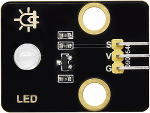

#### Parameters

Operating voltage: DC 3.3-5V

Operating current: 1.5mA (peak 2.3mA)

Maximum power: 0.07W

Control signal: Digital signal

Dimensions: 32 x 23 x 12mm

Positioning hole: Diameter of 4.8mm

Interface: 3-pin curved pin interface spacing 2.54mm

#### Principle

For this kind of simple LED module, high and low levels of the main board can directly control its on and off.

**Turn on LED at high:**

- When the input signal is at a high level (3.3V or 5V), the drive circuit will be conducted, lighting up the LED.

**Turn off LED at low:**

- When the input signal is at a low level (0V), the drive circuit will be cut off, so the power supply will be severed to turn off the LED.

Test Code

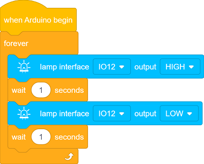

#### Code Explanation

**1.   Initialization**

- This code block is an event trigger. When the program starts running, this code will **execute once first**, whose function is similar to Arduino `setup()`.

 

**2.  Main Loop**

- This code block is an infinite loop control block, whose function is similar to Arduino `void loop()`. It makes the internal code **execute repeatedly without stopping** until the program is manually terminated or the device is powered off.

- Output a high level to IO12 to light up the LED.

- Pause the program for 1 second to keep the LED on for 1 second.

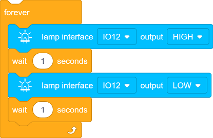

- This code block makes the LED on IO12 perform a loop: on for 1 second and off for 1 second.

#### Test Result

After uploading the code, the white LED will flash with an interval of 1 second:

- On for 1s → Off for 1s → On for 1s → Off for 1s → …in a loop.

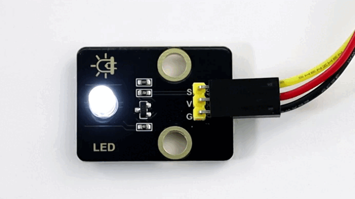

---

### 1.2 Photoresistor Module

A photoresistor is an electronic component that detects the intensity of ambient light. It can convert the light intensity into an electrical signal, so it is often used in scenarios such as automatic lighting control and environment monitoring.

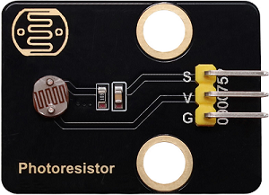

#### Parameters

Operating voltage: DC 3.3-5V

Current: 20 mA

Maximum power: 0.1W

Operating temperature: -10°C to +50°C

Output signal: Analog signal

Dimensions: 32 x 23 x 8mm

Positioning hole size: Diameter of 4.8mm

Interface: 3-pin curved pin interface spacing 2.54mm

#### Principle

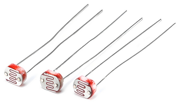

The photoresistor outputs **analog** signals (continuously varying voltage), while the ESP32 needs to convert them into **digital** ones through an **ADC** for processing by the program.

- **What is ADC?**

	An ADC is a device that converts analog signals (continuous) into digital ones (discrete). In an MCU system, it converts signals from sensors or other analog devices into digital data that the MCU can process.

	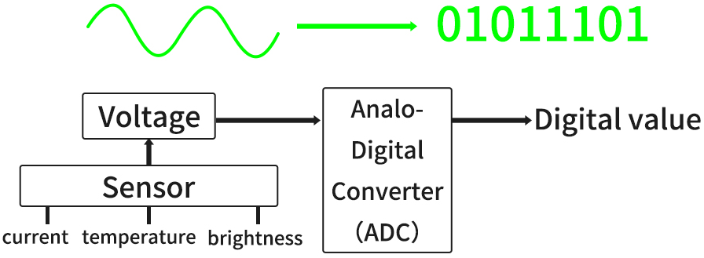

**Signal output of the photoresistor**

A photoresistor module typically includes:

- **photoresistor (the brighter the light is, the lower the resistance will be)**
- Voltage divider circuit (convert resistance changes into voltage ones)

**Working principle of a voltage divider circuit**

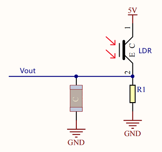

- The output voltage (Vout) at both ends of the photoresistor:

  $Vout = VCC ×（\frac {R_{LDR}}{R_1 + R_{LDR}}）$  

- Ambient light changes → R_light changes → V_out changes:

  - Get brighter → $R_{LDR}$ ↓ → $V_{out}$ ↓ 
  - Get darker → $R_{LDR}$ ↑ → $V_{out}$ ↑

#### Test Code

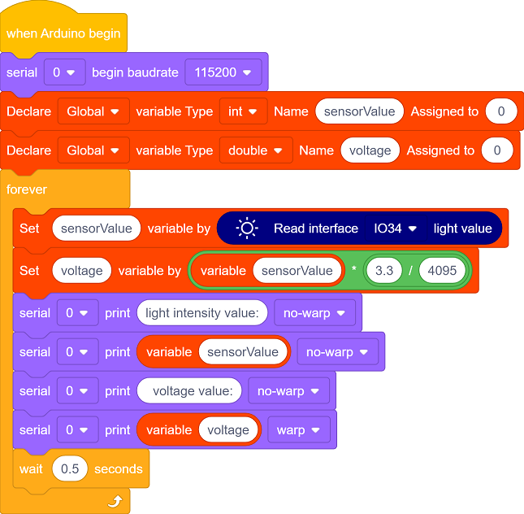

#### Code Explanation

**1.   Initialization**

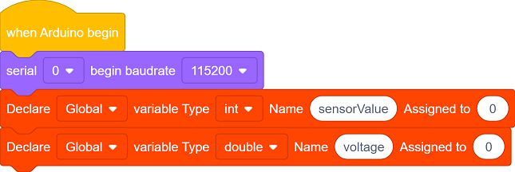

- Initialize the serial communication and set the baud rate to 115200.
- Define an int type variable sensorValue and a double type variable voltage.

 

**2.  Main Loop**

- Read the analog value of the photoresistor (0 - 4095).

- Convert the analog value to a voltage value (0 - 3.3V).

- Convert the digital value read by the ADC(`sensorValue`) to the actual voltage value(`voltage`):

  $voltage = sensorValue ×（\frac {Reference Voltage}{ADCmax}）$  

  For our main board:

  - Reference voltage = 3.3V
  - ADC maximum value = 4095

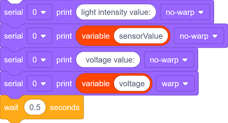

- Print the read values to the serial monitor and update them every 0.5 seconds.

#### Test Result

After uploading the code, click  to set the baud rate to 115200.

Cover the photoresistor with your hand and then slowly move away, and you will see the serial monitor shows:

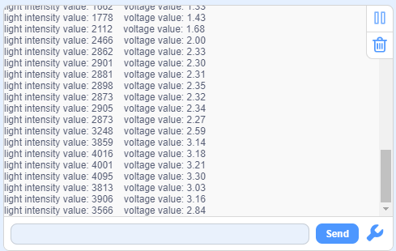

Summary:

- When the light intensity increases, the analog value(0-4095) output by the sensor increases, so do the voltage value(0-3.3V).
- When the light intensity decreases, the analog value and voltage value output by the sensor also decrease.

---

### 1.3 Smart Energy-saving Lamp

In the previous two sections, we have already learned the basic principles and usage methods of LED module and photoresistor. Now, let’s combine them to make a smart energy-saving street lamp for the school by ourselves! Herein, we will realize an intelligent system that can automatically adjust the lighting according to the intensity of the ambient light, which is both energy-saving and environment-friendly, as well as full of a sense of technology.

Next, we will gradually complete the code writing and debugging to ultimately create a practical prototype of a smart street lamp. Now let’s embark on this journey full of creativity and challenges together!

==椴木板实拍图==

#### Code Flow

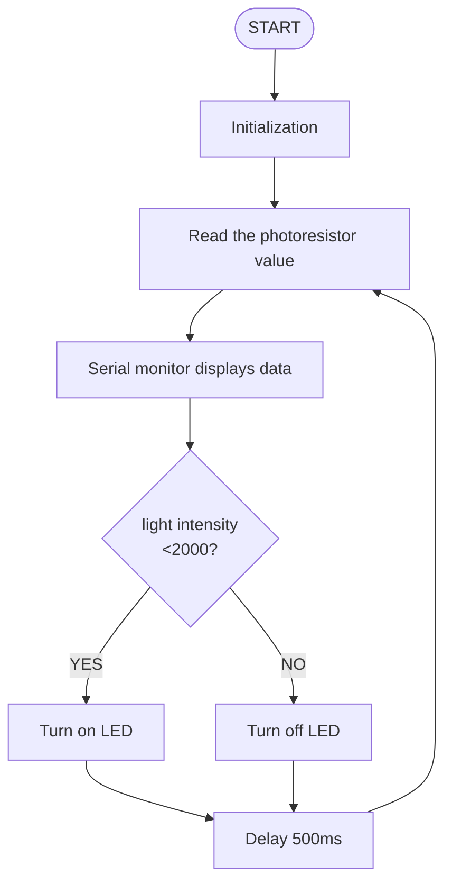

#### Test Code

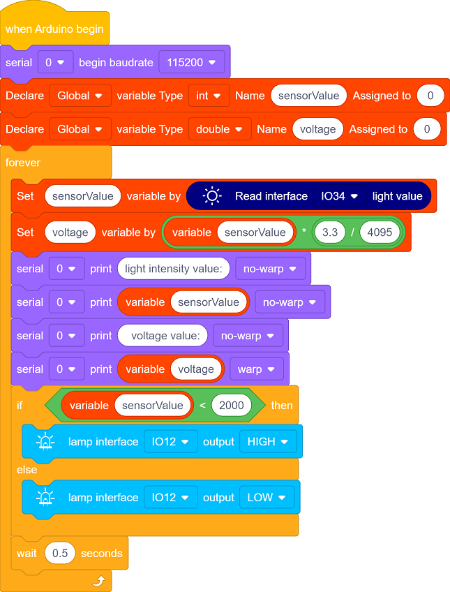

#### Code Explanation

**1.   Initialization**

- Initialize the serial communication and set the baud rate to 115200.
- Define an int type variable sensorValue and a double type variable voltage.

 

**2.  Main loop**

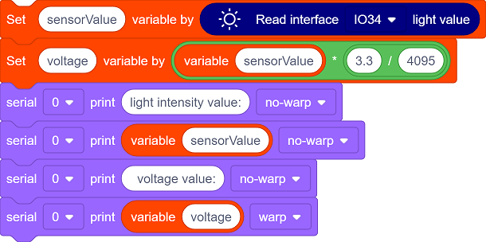

- Read the analog value of the photoresistor, convert the analog value into a voltage value, and print these values to the serial monitor.

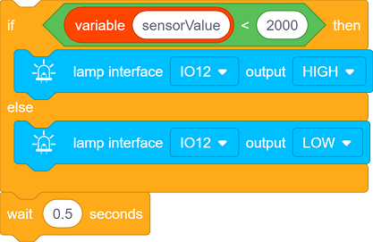

   - This is a simple conditional control statement, which is used to compare the value read by the sensor(`sensorValue`) with the set threshold(200), thereby controlling the on/off of the LED. The threshold can be adjusted according to the actual situation. Make a comparison every 0.5 seconds.
     - When the light intensity is below the threshold, the LED will automatically light up.
     - When it exceeds the threshold, the LED will automatically turn off.

#### Test Result

After uploading the code, turn on the LED when the light intensity  is below the threshold; Turn off the LED when the light intensity exceeds the threshold, so as to save energy.

==动图==

The smart energy-saving street lamp is now complete. Let’s combine technology to green school together and contribute to environment protection!