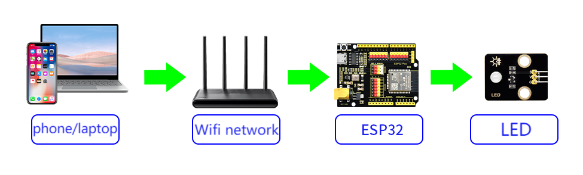

## 10. Web Page Remote Control LED

In this project, we remotely control an LED by web page as a micro-practice of the Internet of Things in smart school. A Web server is built through ESP32 to enable remote control of LED by a browser, directly mapping real scenarios such as intelligent lighting and equipment management in the school.

We will lead you to explore the wonderful world of the Internet of Things! By writing code through the ESP32 development board, you can remotely control the on/off of LED via a mobile web page. Now let’s do your first “Smart school” Internet of Things project!

==补手机页面和结构的图==

#### Principle

**Note: Here covers extracurricular knowledge of HTML, CSS, and JS, so we only provide a brief introduction.**

**Key steps:**

**(1) ESP32 as a mini server**

- After connecting to WiFi, ESP32 can be considered as a **mini Web server** (just like a super mini computer).
- It will be assigned with a local area network IP address (like `172.23.131.16`). All devices connected to the **same WiFi** can access it.

**(2) Web interaction**

- ESP32 hosts a simple web page with two buttons:
	“ON” button → click to send `/ON` request
	“OFF” button → click to send `/OFF` request

**(3) Request processing**

1. Click the web page button → The browser sends a request to ESP32
2. The ESP32 receives the request
3. After receiving the request, ESP32 controls the LED by the GPIO pins:
	- Turn on: The pin outputs a high level → LED is powered on and emits light
	- Turn off: The pin output a low level → LED is powered off and goes out

**(4) Real-time feedback**

The web page dynamically updates their status through JavaScript without refreshing the page (like the instant response when you browse your phone).

#### Code Flow

#### Test Code

Please replace the WiFi name and password in the code with yours.

#### Code Explanation

**Here covers extracurricular knowledge of HTML, CSS, and JS, so we only provide a brief introduction.**

A Web library needs to be added before it can be used.

Click  to choose an extension, and search `Web Page Editing PRO` to load it. Back to the edition area after it is loaded.

- Initialize the OLED and serial port.

- Set the WiFi name and password, connect to WiFi. After connecting, print the IP address on the OLED and the serial monitor.

  Please replace the WiFi name and password in the code with yours.

- There is a button component on the page: **LED**
- Click the button to control the on and off of the LED.

#### Test Result

1. After uploading the code, open the serial monitor and set the baud rate to 115200. You can see the printed IP information:

   

   The IP address will also be printed on the OLED at the same time.

   

2. Enter the IP address into your mobile phone/computer browser and you will see a simple control page.

   Note: Make sure your mobile phone/computer and ESP32 are connected to the same WiFi.

   Mobile phone:

   

   Computer:

   

3. Tap  to turn on the LED.

   

#### FAQ

1. If nothing is printed on the serial monitor, please press the reset button on the board.

   

2. If the ESP32 has not been able to obtain an IP address, it is usually because the WiFi connection has failed. Solutions:
   - Make sure that the WiFi name and password in the code have been replaced with yours.
   - Make sure your WiFi network is 2.4GHz. ESP32 does not support 5GHz WiFi.
   
3. If there is no page when entering the IP address,
   - Make sure the IP address is entered correctly.
   - Check whether your mobile phone/computer is on the same network as the ESP32.

