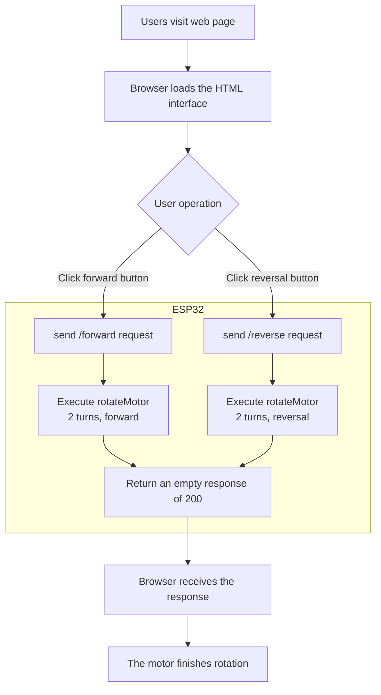
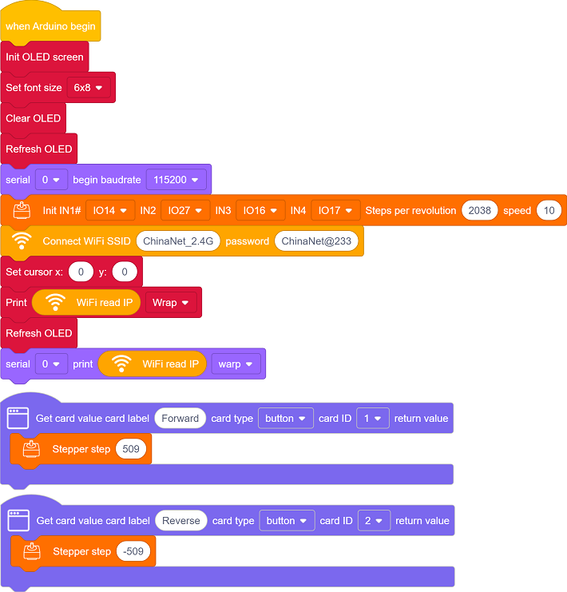
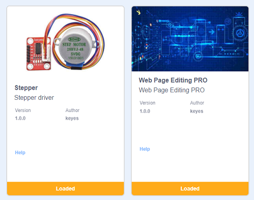
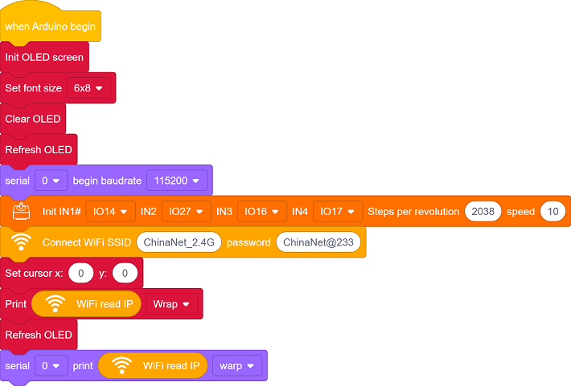
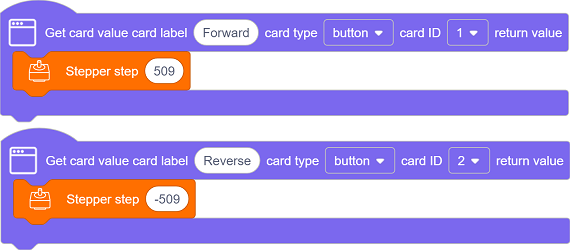
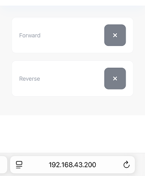

## 11. Web Page Remote Control Curtain

In the construction of smart school, Internet of Things is gradually changing the traditional management model. Here we do a practical project of web page remote control curtain to explore the application of Internet of Things in school life.

Through this project, you will not only be able to create a “compliant” curtain, but also master the core logic of the IoT system - “perception - decision - execution”, opening a window for the innovation of smart school.

==补手机页面和结构的图==

#### Principle

**Mobile browser → WiFi → ESP32 → Control the motor to rotate 2 turns → curtain open/close**

==补图==

1. **Mobile/Computer** Open the web page (enter the IP address of ESP32)
2. **Click the button** (forward/reverse)
3. **ESP32 receives instructions** (via WiFi)
4. **Motor rotation** (Rotate 2 turns, the curtain moves a corresponding distance)
5. **Curtain movement** (The motor drives the curtain through gears)

#### Code Flow

#### Test Code

#### Code Explanation

**Here covers extracurricular knowledge of HTML, CSS, and JS, so we only provide a brief introduction.**

Click  to choose extensions. Search the following two extensions to load them.

Back to the editing area after they are loaded.

- Initialize the OLED , serial port and stepper motor.

- Set the WiFi name and password, and connect to WiFi. Then print the IP address on the OLED and the serial monitor.

  Please replace the WiFi name and password in the code with yours.

- There are two components on the page: **Forward** and **Reverse**
  - Forward button: Each press rotates the motor to forward 509 steps
  - Reverse button: Each press rotates the motor to reverse 509 steps

#### Test Result

1. After uploading the code, open the serial monitor and set the baud rate to 115200. You can see the printed IP information:

   

   The IP address will also be printed on the OLED at the same time.

   

2. Enter the IP address on the serial monitor into your mobile phone/computer browser and you will see a simple control page.

   Note: Make sure your mobile phone/computer and ESP32 are connected to the same WiFi.

   

3. Each time you press the Forward , the motor will forward rotate 509 steps.

   Each time you press the Reverse , the motor will reversely rotate 509 steps.

#### FAQ

1. If nothing is printed on the serial monitor, please press the reset button on the board.

   

2. If the ESP32 has not been able to obtain an IP address, it is usually because the WiFi connection has failed. Solutions:

	- Make sure that the WiFi name and password in the code have been replaced with yours.
	- Make sure your WiFi network is 2.4GHz. ESP32 does not support 5GHz WiFi.

3. If there is no page when entering the IP address,

	- Make sure the IP address is entered correctly.
	- Check whether your mobile phone/computer is on the same network as the ESP32.