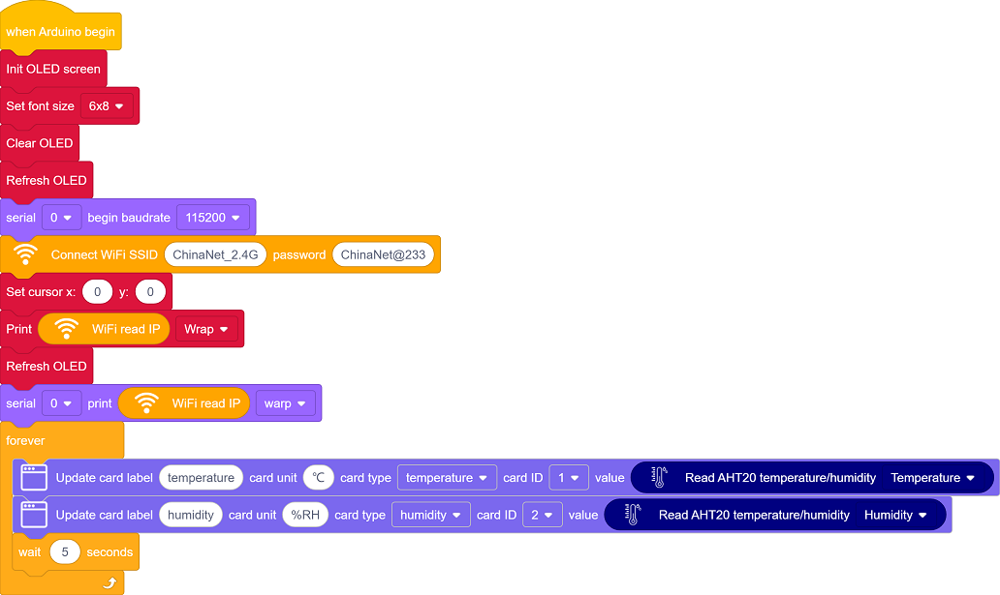
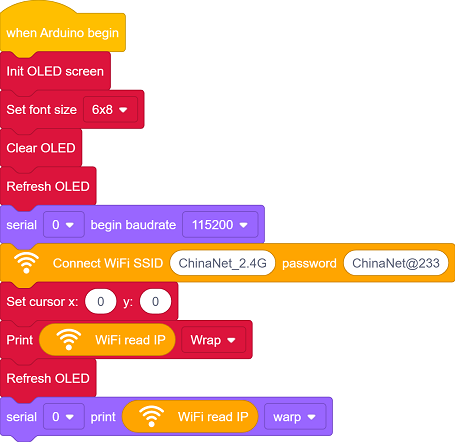
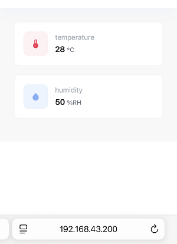

## 12. Web Page Remote Monitor Temperature and Humidity

In smart school, environment perception is an important foundation for green, comfortable and intelligent teaching spaces. Here we will guide you to develop a lightweight monitoring system that enables remote supervision of classroom environment quality by ESP32 and AHT20 sensor.

Let’s make school environment management smarter!

==补手机页面和结构的图==

#### Principle

1. Data collection

	AHT20 sensor → ESP32 (via I2C)

2. Data transmission

	ESP32 → Router → Mobile phone/Computer

3. Data display

	Browser request → Server response → Update web page

#### Code Flow

```mermaid
graph LR
    A[Sensor AHT20] --I2C--> B[ESP32]
    B --WiFi--> C[Router]
    C --HTTP--> D[Mobile phone/Computer]
    D --Refresh request--> C
    C --Data request--> B
    B --Read data--> A

```

#### Test Code

#### Code Explanation

**Here covers extracurricular knowledge of HTML, CSS, and JS, so we only provide a brief introduction.**

Click  to choose the extension. Search the following extension to load it.

Back to the editing area after it is loaded.

- Initialize the OLED and serial port

- Set the WiFi name and password, and connect to WiFi. Then print the IP address on the OLED and the serial monitor.

  Please replace the WiFi name and password in the code with yours.

- There are two components on the page: **temperature** and **humidity**
  - temperature: Display the current temperature value in real time
  - humidity: Display the current humidity value in real time
- Update the data every 5 seconds.

#### Test Result

1. After uploading the code, open the serial monitor and set the baud rate to 115200. You can see the printed IP information:

   

   The IP address will also be printed on the OLED at the same time.

   

2. Enter this IP address in the browser of your mobile phone or computer to access the temperature and humidity monitoring page.

   Data is obtained immediately when the page is opened, and it is refreshed every 5 seconds.
   
   Note: Make sure your mobile phone/computer and ESP32 are connected to the same WiFi.

#### FAQ

1. If nothing is printed on the serial monitor, please press the reset button on the board.

   

2. If the ESP32 has not been able to obtain an IP address, it is usually because the WiFi connection has failed. Solutions:

   - Make sure that the WiFi name and password in the code have been replaced with yours.
   - Make sure your WiFi network is 2.4GHz. ESP32 does not support 5GHz WiFi.

3. If there is no page when entering the IP address,

	- Make sure the IP address is entered correctly.
	- Check whether your mobile phone/computer is on the same network as the ESP32.
