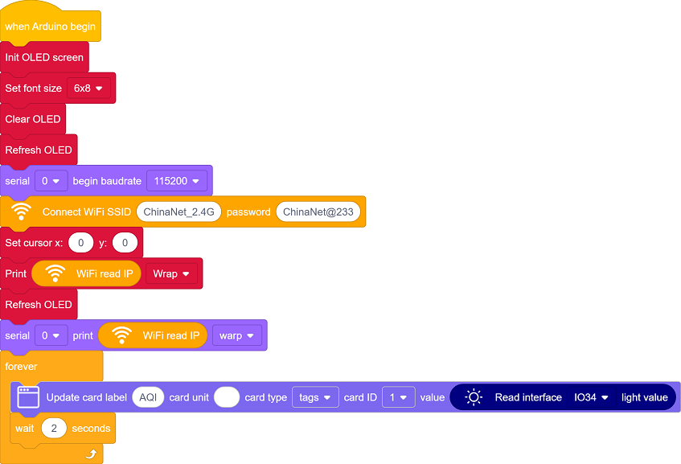
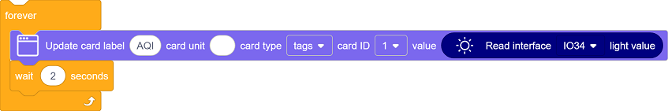
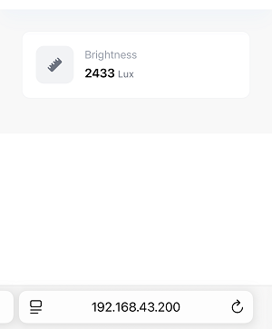

## 14. Web Page Remote Monitor Light Value

Environment monitoring is a crutial part to enhance the comfort of the teaching and optimize energy management. Thereinto, intensity of light directly affects students’ learning efficiency and visual health. So ,reasonable regulation of classroom lighting can not only save energy and reduce emissions but also create a more suitable learning environment.

In this project, we will monitor and visualize indoor light conditions in real time through Internet of Things, which provides basic solutions for applications such as intelligent lighting and energy-saving management, and contributes to the construction of green and smart school.

==补手机页面和结构的图==

#### Principle

1. Data collection

	Voltage division by photoresistor → The ADC pins of ESP32 (analog-to-digital)

2. Data processing

	ESP32 → Router → Mobile phone/Computer

3. Web page interaction

	Browser request → Server response → Return the light value and refresh the display

#### Code Flow

#### Test Code

#### Code Explanation

**Here covers extracurricular knowledge of HTML, CSS, and JS, so we only provide a brief introduction.**

Click  to choose the extension. Search the following extension to load it.

Back to the editing area after it is loaded.

- Initialize the OLED and serial port

- Set the WiFi name and password, and connect to WiFi. Then print the IP address on the OLED and the serial monitor.

	Please replace the WiFi name and password in the code with yours.

- There is one components on the page: **Brightness** 
  - Brightness: Display the indoor light intensity value in real time
- Update the data every 2 seconds.

#### Test Result

1. After uploading the code, open the serial monitor and set the baud rate to 115200. You can see the printed IP information:

   

   The IP address will also be printed on the OLED at the same time.

   

2. Enter this IP address in the browser of your mobile phone or computer to access the indoor light value monitoring page. 

   Data is obtained immediately when the page is opened, and it is refreshed every 2 seconds.

   Note: Make sure your mobile phone/computer and ESP32 are connected to the same WiFi.
   
   

#### FAQ

1. If nothing is printed on the serial monitor, please press the reset button on the board.

   

2. If the ESP32 has not been able to obtain an IP address, it is usually because the WiFi connection has failed. Solutions:

   - Make sure that the WiFi name and password in the code have been replaced with yours.
   - Make sure your WiFi network is 2.4GHz. ESP32 does not support 5GHz WiFi.

3. If there is no page when entering the IP address,

	- Make sure the IP address is entered correctly.
	- Check whether your mobile phone/computer is on the same network as the ESP32.

