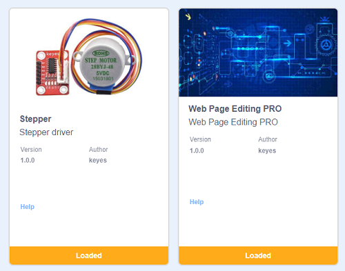
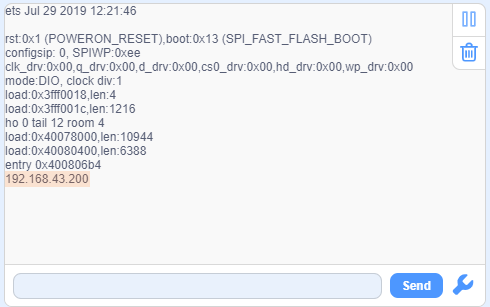
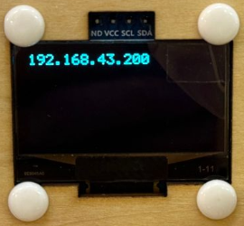

## 15. Smart School

In this smart school, we will guide you to develop an Internet of Things application system that integrates environmental monitoring and equipment control. In this system, we can monitor environment conditions such as temperature, humidity and light intensity in the classroom in real time through the web. It also supports remote control of the opening/closing of curtain, the on/off of classroom light and street lamp, as well as the status of the school gate. Now let’s join hands to contribute to the construction of green and smart school!

#### Code Flow

#### Test Code

#### Code Explanation

**Here covers extracurricular knowledge of HTML, CSS, and JS, so we only provide a brief introduction.**

Click  to choose extensions. Search the following two extensions to load them.

Back to the editing area after it is loaded.

- Initialize the OLED, serial port, RGB LED, LED, and servo

- Set the WiFi name and password, and connect to WiFi. Then print the IP address on the OLED and the serial monitor.

  Please replace the WiFi name and password in the code with yours.

- There are three components on the page: Component 1, 2, and 3
  - Component 1: Display the current temperatur value in real time
  - Component 2: Display the current humidity value in real time
  - Component 3: Display the current light intensity value in real time
- Update the data every 2 seconds.

- Component 4: Click the button to turn on/off the street lamp.

- Component 5: Click the button to turn on/off the classroom light.

- Component 6: Each time press button to open the curtain for 509 steps.
- Component 7: Each time press button to close the curtain for 509 steps.

- Component 8: Click the button to open/close the school gate.

#### Test Result

1. After uploading the code, open the serial monitor and set the baud rate to 115200. You can see the printed IP information:

   

   The IP address will also be printed on the OLED at the same time.

   

2. Enter **your IP address** in the browser of your mobile phone/computer to access the smart school page.

   Note: Make sure your mobile phone/computer and ESP32 are connected to the same WiFi.

You can see the real-time display of temperature values, humidity values and indoor light values, which is convenient for you to monitor the situation in the classroom.

Tap  to slowly open the curtain.

Tap  to slowly close the curtain.

Tap  to turn on the classroom light.

Tap  to turn on the street lamp.

Tap  to open/close the school gate.校园大门的开关。

#### FAQ

1. If nothing is printed on the serial monitor, please press the reset button on the board.

   

2. If the ESP32 has not been able to obtain an IP address, it is usually because the WiFi connection has failed. Solutions:

   - Make sure that the WiFi name and password in the code have been replaced with yours.
   - Make sure your WiFi network is 2.4GHz. ESP32 does not support 5GHz WiFi.

3. If there is no page when entering the IP address,

	- Make sure the IP address is entered correctly.
	- Check whether your mobile phone/computer is on the same network as the ESP32.

