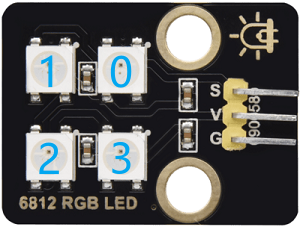
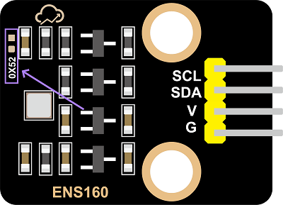

## 2. Classroom Smart Air Quality Monitoring System

Let’s build an intelligent air quality monitoring system by a ENS160 sensor module and a 6812 RGB LED. When the air quality is poor, the RGB will issue an alarm, so we can create a healthy and comfortable learning environment for teachers and students!

### 2.1 6812 RGB LED Module

Our 6812 RGB LED module integrates four programmable RGB LEDs, supporting multiple colors and dynamic effects, so it can achieve rich lighting effects by simple signal control.

#### Parameters

Operating voltage: DC 3.3-5V

Maximum power: 1W

IC model: 4 pixels /SK6812

Gray scale level: 25

Emission Angle: 180°

Emission colors: Adjustable colors of white, red, yellow, blue, green, etc. through the controller

Operating temperature: -10°C to +50°C

Dimensions: 32 x 23 x 8mm

Positioning hole: Diameter of 4.8mm

Interface: 3-pin curved pin interface spacing 2.54mm

#### Principle

The 6812 RGB LED module adopts a single-line serial communication protocol. Each LED pixel is equipped with an internal driver IC, which transmits signals step by step through data lines, so their brightness can be independently controlled, creating dynamic light effects.

Each LED pixel contains three colors: red (R), green (G), and blue (B). Any color can be mixed by adjusting the brightness of the three.

Serial number of LED pixels:

#### Test Code

#### Code Explanation

**1.   Initialization**

- Define signal control pin to IO4 of the board, and set the number of LED pixels to 4.
- Set the brightness of the LED pixels to 5, within the range of 0 (darkest) to 255 (brightest).

 

**2.  Main Loop**

- Set the color of the lamp pixels with the specified serial number. The serial number of pixels starts from 0. This code block sets the first LED pixel to red.

- Set the colors of multiple consecutive LED pixels, and light up 4 LED continuously starting from Number 0 to Number 3.

- Update to the pixels

	This code block must be called!

	All lighting color code blocks only remain in memory and are not sent to the hardware. They will only be actually updated and displayed after this code block is called.

- Set the 4 LED to light up red, green, blue and white in sequence for 1 second, and then go off for 1 second.

#### Test Result

After uploading the code, you can see a loop:

- Four LEDs will light up in sequence as red, green, blue and white for one second. Due to its changing speed, human eyes may not be able to see the process of them lighting up one by one.
- Then all the LED pixels turn off for 1 second.

==动图==

---

### 2.2 ENS160 Air Quality Sensor

ENS160 is a high-precision digital air quality sensor capable of real-time detection of volatile organic compounds (VOCs), carbon dioxide (CO₂), and air quality index (IAQ) in the air. It is widely used in environment monitoring, smart homes, and health devices.

#### Parameters

Operating voltage: DC 3.3-5V

Operating current: 29 mA

Preheating time: <3 minutes

Communication interface: I2C

I2C address: 0x53 by default, can be modified to 0x52

Operating temperature: -10°C to +50°C

Operating humidity: 5% RH to 95% RH

eCO₂ measurement range: 400 ppm~65000 ppm

TVOC measurement range: 0 ppb~65000 ppb

Dimensions: 32 x 23 x 8mm

Positioning hole: Diameter of 3.2mm

Interface: 4-pin curved pin interface spacing 2.54mm

#### Principle

**Working Principle of ENS160**

The ENS160 detects the gas composition in the air through its built-in metal oxide semiconductor sensor. Its working principle is as follows:

**VOCs detection**:

- **Detection principle**

	The metal oxide on the sensor surface undergoes a chemical reaction with VOCs in the air, causing a change in its resistance. The concentration of VOCs can be detected by measuring the resistance change.

	However, it cannot distinguish exactly which type of VOCs it is. Instead, it **converts** all detectable VOCs mixed signals into **total volatile organic compounds(TVOC) concentrations** (in ppb) for output.

	Therefore, ENS160 directly provides **TVOC data** rather than individual VOCs components, which is suitable for quickly assessing the overall air pollution level and cannot precisely analyze specific gas types.

- **TVOC detection range**

	Output unit: ppb(parts per billion)

	Detection range: 0~65,000 ppb (The actual effective accuracy is usually 0~10,000 ppb)

- **TVOC level reference**

	| **TVOC concentration (ppb)** | **Level**              | **Health impacts and suggestions**                           |
	| ---------------------------- | ---------------------- | ------------------------------------------------------------ |
	| 0-250                        | Great                  | The air quality is excellent and has no impact on the human body, and is suitable for a long stay |
	| 250-500                      | Good                   | The air quality is good, but sensitive people may experience mild discomfort. It is recommended to ventilate moderately |
	| 500-1000                     | Mild pollution         | The air quality is acceptable. Long-term exposure may cause headaches and fatigue, so ventilation needs to be enhanced |
	| 1000-3000                    | Middle level pollution | Poor air quality may cause eye and throat irritation and drowsiness. It is recommended to reduce exposure and investigate pollution sources |
	| >3000                        | Severe pollution       | Severe pollution may cause damage to the nervous system and liver and kidney toxicity. Immediate ventilation or evacuation is necessary |

 

**CO₂ estimation**:

- **Estimation principle**

	ENS160 cannot directly measure CO₂. Instead, it estimates eCO₂(equivalent carbon dioxide) by detecting the concentration of VOCs(volatile organic compounds) in the air with a built-in algorithm. eCO₂ is an indirect approximation of CO₂. It is suitable for trend monitoring, yet its accuracy is not as good as that of professional CO₂ sensors.

- **eCO₂ output range**

	Unit: ppm(parts per million)

	Detection range: 400~65,000 ppm (The actual effective accuracy is usually 400~5,000 ppm)

- **eCO₂ level reference**

	| eCO₂      | Level            | Suggestions                                                  |
	| --------- | ---------------- | ------------------------------------------------------------ |
	| 400-600   | Great            | The air quality is excellent with good ventilation.  It is suitable for a long stay |
	| 600-800   | Good             | The air quality is acceptable.  It is recommended to ventilate moderately |
	| 800-1000  | Mild pollution   | Air quality has declined and ventilation needs to be enhanced |
	| 1000-1500 | Severe pollution | There is a distinct sense of oppression and turbidity.  It is recommended to reduce the density of people or enforce ventilation |
	| >1500     | Dangerous        | It is a severely oxygen-deficient environment.  Ventilation or evacuation must be carried out immediately |

**IAQ calculation**:

- **Calculation principle**

	Based on the concentrations of TVOC and eCO₂, calculate the indoor air quality Index (IAQ) by the built-in algorithm.

- **AQI level reference**

	| AQI  | AQI level     | Health impact                                                |
	| ---- | ------------- | ------------------------------------------------------------ |
	| 1    | Great         | The air is fresh and there are no health risks               |
	| 2    | Good          | It's basically safe here. Sensitive people may feel mild discomfort |
	| 3    | Middle level  | An unpleasant smell can be detected, which may cause headaches and fatigue |
	| 4    | Bad           | It obviously irritates the eyes and throat, and long-term exposure is harmful to health |
	| 5    | Extremely bad | It causes intense discomfort and has a high risk of acute health problems |

 

**ENS160 control principle**

The control principle of ENS160 is based on the **I²C communication protocol**, which controls the sensor and reads the measurement results by sending and receiving specific commands and data.

**I²C communication address**

I²C communication address is `0x53` by default.

If you need to change it to `0x52`, solder a 0603 package 0Ω resistor at `0X52` empty pad of the module, and **modify the device address in the code** at the same time.

#### Test Code

#### Code Explanation

**1.   Initialization**

- Initialize the serial communication and set the baud rate to 115200.

 

**2.  Main Loop**

- Read the three key parameters in sequence:

  Obtain the comprehensive IAQ of levels 1 to 5

  Detect the concentration of VOCs

  Measure the eCO2 value

- All the data are displayed on the serial monitor and they are collected per second, forming a complete air quality monitoring cycle.

#### Test Result

After uploading the code, open the serial monitor and set the baud rate to 115200.

The sensor needs to be preheated for 3 ~5 minutes after being powered on for the first time for stabilization. After that, the values are printed on the serial monitor.

#### FAQ

1. After uploading the code, nothing was printed on the serial monitor?

	- Make sure the module is wired correctly, and then press the reset button on the main board:

		

---

### 2.3 Smart Air Quality Monitoring System

In the previous sections, we have already mastered the color control principle of the 6812 RGB module and the data acquisition method of the ENS160 air quality sensor. Now, let’s make an smart air quality monitoring system for our classroom!

Here we will implement an intelligent device capable of monitoring the eCO₂ concentration in the classroom in real time. When the air quality deteriorates (eCO₂ concentration is too high), the system will trigger a red alert on the RGB to remind that teachers and students need to exchange air in time to ensure a healthy learning environment.

Let's build this practical and technological monitoring system together!

#### Code Flow

#### Test Code

#### Code Explanation

- Initialize the serial port and RGB LED

- Read the eCO₂ concentration value from the ENS160 sensor and output on the serial monitor.

- Select different display effects based on eCO₂ concentration. Four display modes correspond to four air quality levels:

	Excellent/Good (Green always on)

	Normal (blue always on)

	Bad (yellow always on)

	Extremely bad (red always on)

#### Test Result

After uploading the code, the ENS160 sensor reads the eCO₂ concentration value every 2 seconds.

According to the eCO₂ concentration value, it is divided into four levels, and the current air quality can be visually displayed through RGB LED:

- Excellent/Good(≤800ppm): Green always on
- Normal(≤1000ppm): blue always on
- Bad(≤1500ppm): yellow always on
- Extremely bad(>1500ppm): red always on

You can simulate changes in air quality by taking a deep breath and then exhaling slowly onto the ENS160 sensor. At this time, the eCO₂ concentration value will rise, and you can observe the color of the RGB LED changing accordingly.

==动图==

#### FAQ

1. The RGB LED does not light up after uploading the code?

	- Make sure the ENS160 sensor and the RGB LED are wired correctly, and then press the reset button on the main board:

		
