## 3. Classroom Smart Temperature & Humidity Meter

Let’s build an intelligent temperature and humidity monitoring system with an AHT20 temperature and humidity sensor and an OLED. It will display environment data in real time to create a comfortable and healthy learning environment for teachers and students!

### 3.1 AHT20 Temperature and Humidity Sensor

Based on the principles of capacitive humidity and thermistor temperature measurement, the AHT20 can detect the environment temperature and humidity in real time and then output the data through the I²C interface, which provides precise data support for environment monitoring and smart control.

#### Parameters

Operating voltage: DC 3.3-5V

Communication interface: I2C

I2C address: 0x38

Temperature range: -10°C ~ +50°C

Humidity range: 0% ~ 100% RH

Dimensions: 32 x 23 x 8mm

Positioning hole: Diameter of 3.2mm

Interface: 4-pin curved pin interface spacing 2.54mm

#### Principle

AHT20 principles of **capacitive humidity** and **thermistor temperature** measurement:

- Humidity measurement: The humidity changes in the air are detected by capacitive sensor, and the capacitance value will vary with the humidity.
- Temperature measurement: The ambient temperature is detected by a thermistor, and the resistance value changes with the temperature.
- Digital output: The sensor integrates an ADC (analog-to-digital converter) and a calibration circuit, which converts analog signals into digital signals and outputs them by I²C interface.

#### Test Code

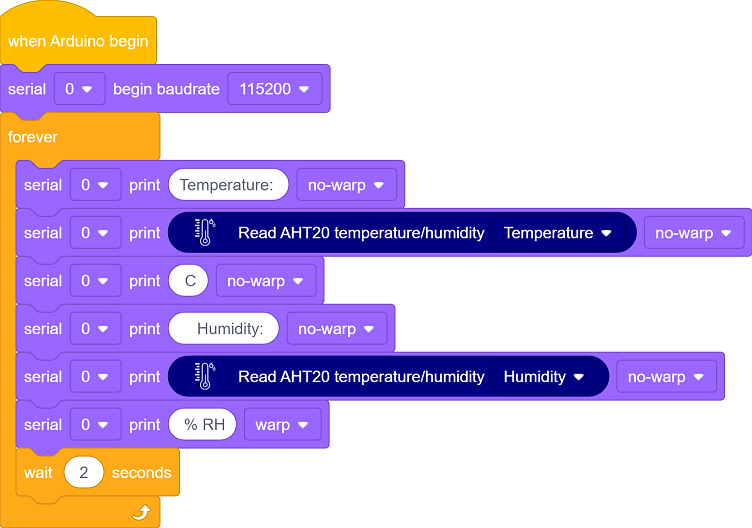

#### Code Explanation

**1.   Initialization**

 

**2.  Main loop**

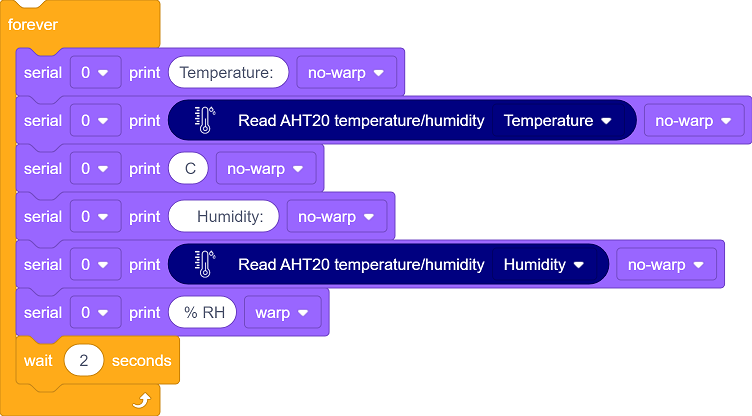

- Read the current temperature and humidity value and return a floating-point number.

- Output the data through the serial monitor.

- Delay 2 seconds (the minimum read interval recommended in the sensor data manual).

#### Test Result

After uploading the code,  to open the serial monitor and set the baud rate to 115200.

The temperature and humidity values will be updated every two seconds.

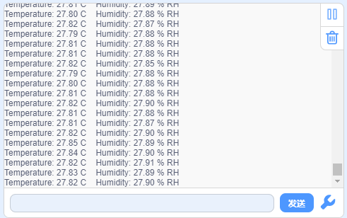

---

### 3.2 1.3-inch  IIC  OLED Display

OLED display adopts a self-luminous display DS technology. It features high contrast, wide viewing Angle and low power consumption and can show clear images and text. So it is widely used in smart devices, wearable devices and industrial control and so on.

==图==

#### Parameters

Operating voltage: DC 3.3-5V

Driver chip: SH1106

Communication interface: I2C

Resolution: 128*64

Dimensions: 37 x 34 x 6mm

Positioning hole: 30.5mm(length) * 29mm (width)

Interface: 4-pin curved pin interface spacing 2.54mm

#### Principle

**OLED working principle**

- **Self-luminescence** : Each pixel of the OLED is composed of organic luminescent materials. When current passes through, pixels emit light without backlighting.
- **Pixel Control** : By controlling the current of each pixel, their brightness can be adjusted, thereby achieving image display.
- **Driver Chip** : Built-in driver chip SH1106 is responsible for receiving control signals and driving pixels.

**OLED control principle**

The control principle of OLED is based on **video memory(GRAM)** and **communication protocols**:

- **Video memory(GRAM)**:
	- The OLED is equipped with video memory for storing the current displayed image data.
	- The screen content can be updated by writing data to the video memory.
- **Communication protocol**:
	- Commands and data are sent through the I²C interface to control the working mode and video memory content of the OLED.
	- Common commands include initialization, screen clearing, cursor position setting, data writing, etc.

#### Test Code

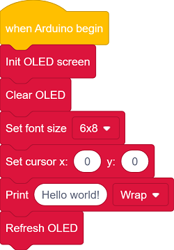

#### Code Explanation

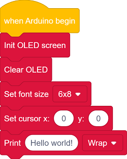

- Initialize OLED display
- Clear the display
- Set text size
- Set the position where the text begins to display
- Input “Hello world!” to the buffer zone

- Update to the display

  This code block must be called!

  All drawing block instructions only remain in memory and are not sent to the hardware. They will only be actually updated and displayed after this code block is called.

#### Test Result

After uploading the code, you can see “Hello world!” in the middle of the OLED screen.

==图==

#### FAQ

1. The code upload failed?
	- Make sure the IIC wiring is correct

---

### 3.3 Smart Temperature & Humidity Meter

In the previous study, we have become familiar with the text display of OLED and mastered the data acquisition method of the AHT20 sensor. Now, let’s deeply integrate these two to create a temperature and humidity meter!

Herein, we will build an intelligent monitoring station that can track the classroom temperature and relative humidity in real time. This system will clearly display them on the OLED:

- Real-time temperature value (℃)
- Current humidity percentage (%)

Now, let’s embark on this practical journey of environment perception!

#### Code Flow

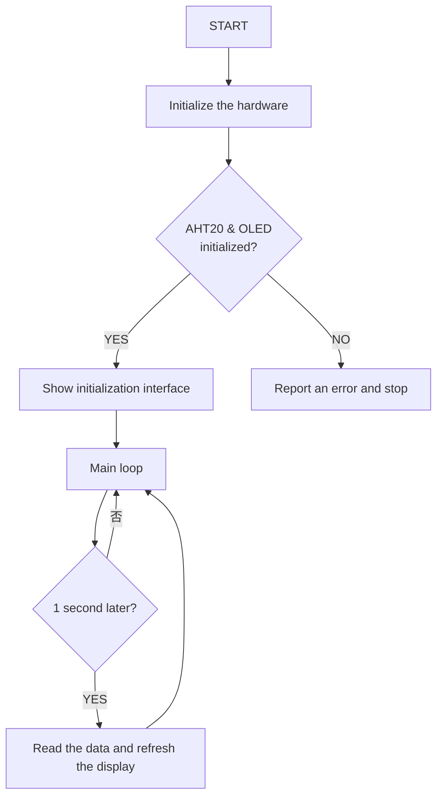

#### Test Code

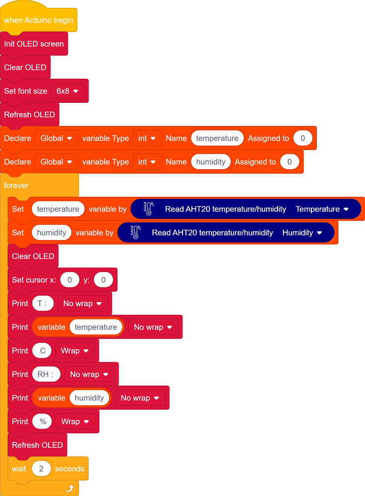

#### Code Explanation

**1.   Initialization**

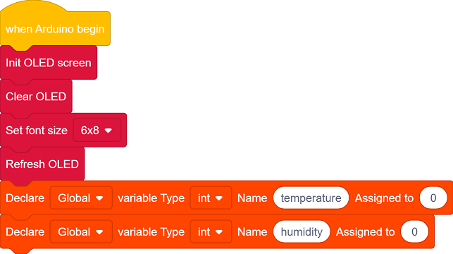

- Initialize OLED display, clear the OLED and set the text size.
- Define the variables temperature and humidity

 

**2.  Main loop**

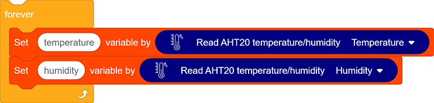

- The sensor collects temperature and humidity values.

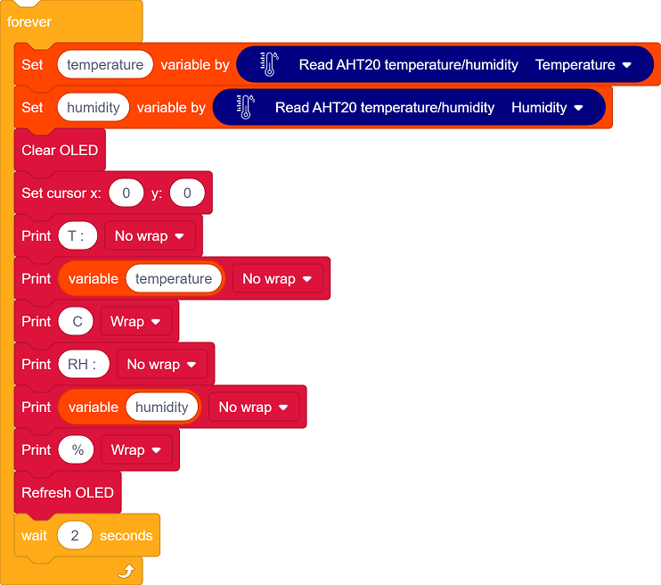

- Clear the display, set the text position, and show the temperature and humidity values.
- Refresh the display every 2 seconds.

#### Test Result

After uploading the code, AHT20 sensor reads the temperature and humidity values every 2 seconds and displays them on the OLED.

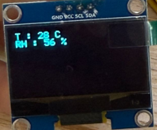
