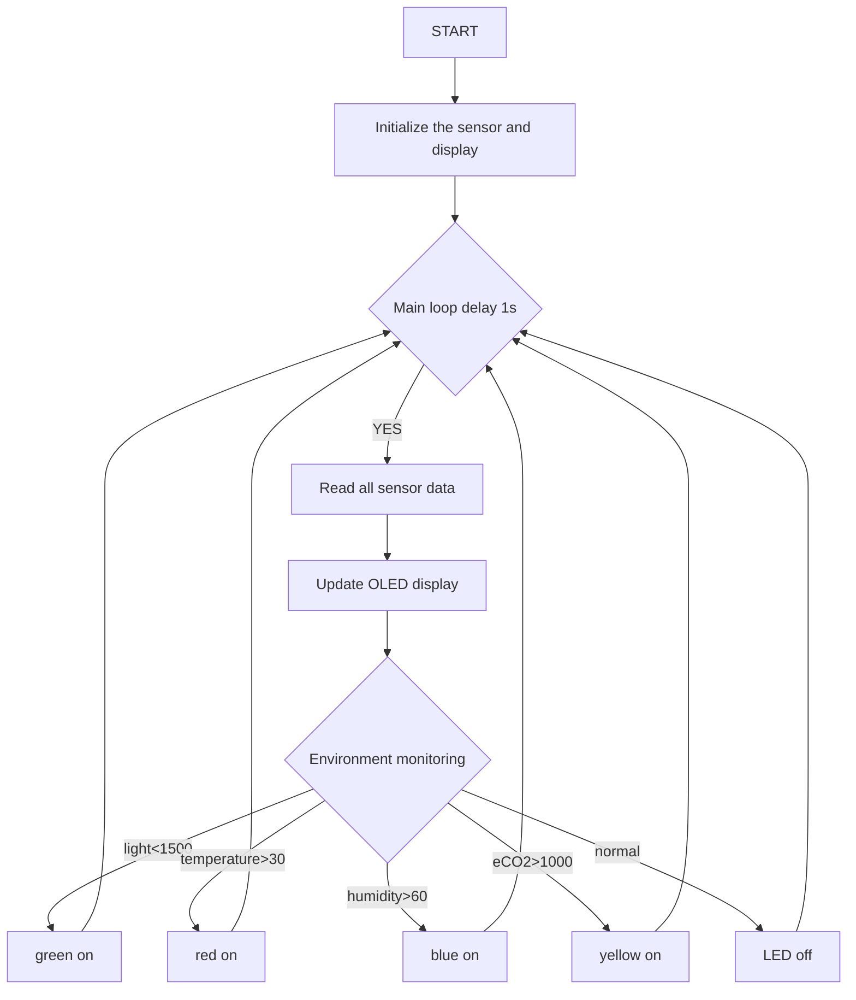
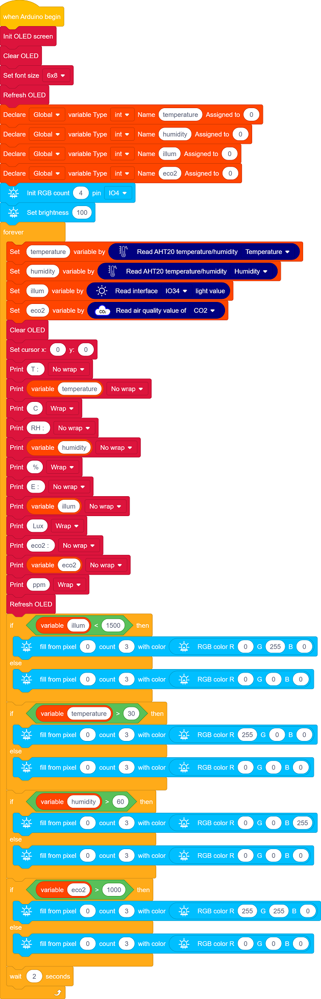
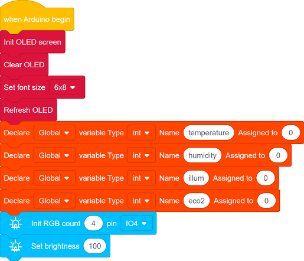
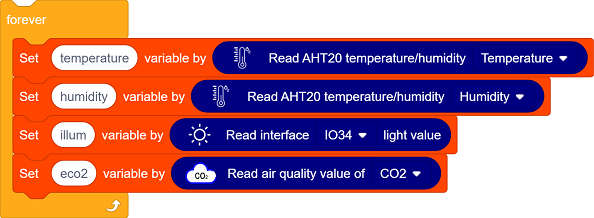
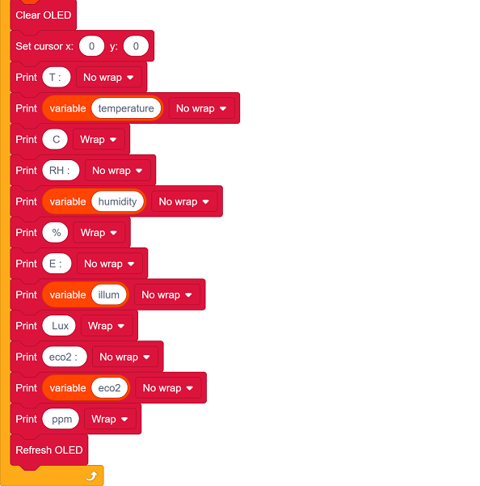
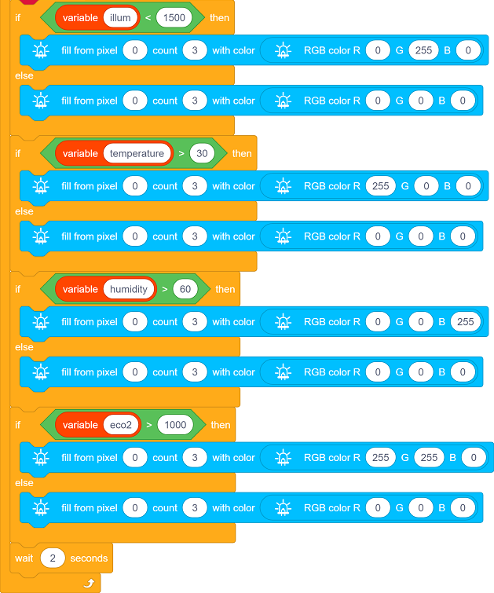

## 4. Classroom Environment Monitoring Display and Alarm

### 4.1 Environment Monitoring Display and Alarm

Previously, we have learned the usage methods of photoresistor, ENS160 air quality sensor, 6812 RGB module and OLED. Now, let’s integrate them to develop a smart environment monitoring system for our classroom!

Functions:

- Real-time monitoring: Display light, temperature and humidity, and air quality (eCO₂) on OLED
- Intelligent alarm: When parameters are abnormal, the RGB automatically switches colors to prompt:
	- Abnormal lighting → green
	- Increasing temperature → red
	- Excessive humidity → blue
	- Excessive concentration of eCO₂ → yellow

Since this system integrates monitoring, display and intelligent alarm, it can reveal the classroom conditions by visual alarms by colors, helping teachers and students quickly identify environment problems. Now, let’s do it!

#### Code Flow

#### Test Code

#### Code Explanation

**1.   Initialization**

- Initialize OLED display, clear the OLED and set the text size
- Define the variables temperature, humidity, illum, eco2
- Set the RGB pin, the number of LED pixels and their brightness

 

**2.  Main Loop**

- Sensor data reading:

  - AHT20 sensor collects temperature and humidity values.

  - Photoresistor reads the light values.

  - ENS160 sensor measures eCO2 values.

- OLED updates the display: clear the display and show the temperature and humidity value, light value and eCO2 value.

- RGB LED status feedback:

  - Dark light (<1500) → green on
  - High temperature (>30℃) → red on
  - High humidity (>60%) → blue on
  - High eCO2 (>1000ppm) → yellow on
  
- Read the sensor values every 2 seconds. 

#### Test Result

After uploading the code, the environment data is collected in real time by the AHT20 sensor, ENS160 sensor and photoresistor and updated on the OLED display every 2 seconds, while visual feedback is provided by RGB LED.

- Dark light (<1500) → green on
- High temperature (>30℃) → red on
- High humidity (>60%) → blue on
- High eCO2 (>1000ppm) → yellow on

==动图==
