## 5. Smart Flag Lifting Platform

Let’s set up an intelligent flag lifting platform by a DC motor and a single-channel button module. We use the button to raise and lower the flag. What a perfect combination of technology and engineering!

### 5.1 DC Gear Motor

The DC dual-shaft gear motor is a very common type of motor that composes of a DC motor and a gearbox, and comes with two output shafts.

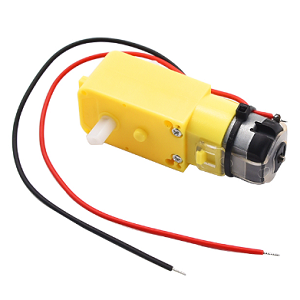

#### Parameters

Operating voltage: DC 3.3-5V

No-load speed: 10-500 RPM

Load speed: 5-300 RPM

Output torque: 0.1-50 kg·cm

Operating temperature: -10°C ~ +50°C

Dimensions: 70 x 22.3 x 19mm

#### Principle

Dc motors convert electrical energy into mechanical energy through brushes and commutators. When directly outputting, they feature high rotational speed (typically several thousand to tens of thousands of RPM) and low torque. The connected reduction gearbox gradually slows down the speed through 3-6 gear sets (reduction ratio 1:10~1:1000), reducing the rotational speed while proportionally amplifying the torque. Eventually, it outputs low-speed and high-torque power through the dual output shafts of synchronous transmission, with the rotation speed and torque of the two shafts remaining highly synchronized (error less than 5%), so as to meet the equipment's demand for precise low-speed and high-torque drive.

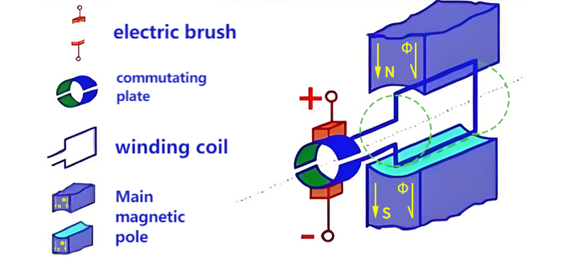

#### L9910S Motor Drive Board

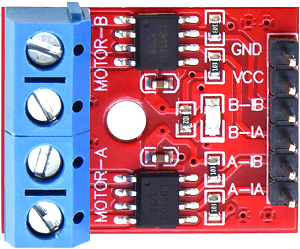

DC motor requires external drive modules because it:

1. requires a large current drive (far exceeding the IO capability of MCU)
2. will generate counter electromotive force (which may damage the control circuit)
3. needs an H-bridge to achieve forward and reverse rotation control

We choose the L9110S driver board, which can perfectly solve these problems because it:

- provides a driving current of 1.8A
- integrates H-bridge and protection circuit
- supports PWM speed regulation
- requires only simple digital signal control

**Parameters**

Operating voltage: DC 5V

Installation hole diameter: 3mm

Dimensions: 25 x 19 x 13mm

**Basic control logic**

The L9910S controls the motor status through two logic input pins (INA and INB), and the table of its true value is as follows:

| INA  | INB  | Motor status | Output mode                 |
| ---- | ---- | ------------ | --------------------------- |
| L    | L    | Stop         | Hi-Z(High-resistance state) |
| H    | L    | Forward      | OUTA=H, OUTB=L              |
| L    | H    | Reverse      | OUTA=L, OUTB=H              |
| H    | H    | Brake        | OUTA=L, OUTB=L              |

**PWM speed control**

The 9910S supports PWM speed control and has two deceleration modes:

- Fast deceleration mode: Just like suddenly release the pedal of a bicycle, it slides by inertia and then stops (Free sliding stop)
	- One PWM input and the other input at a low level
- Slow deceleration mode: Just like gently press the brake pedal of a bicycle to slow down slowly (Decelerate under control)
	- One PWM input and the other input at a high level

| Control mode                  | INA  | INB  | Applicable scenarios                    |
| ----------------------------- | ---- | ---- | --------------------------------------- |
| Forward PWM fast deceleration | PWM  | 0    | Fast deceleration, fast response        |
| Forward PWM slow deceleration | PWM  | 1    | Smooth speed regulation to reduce shake |
| Reverse PWM fast deceleration | 0    | PWM  | Rapid reverse braking                   |
| Reverse PWM slow deceleration | 1    | PWM  | Smooth reverse braking                  |

#### Test Code

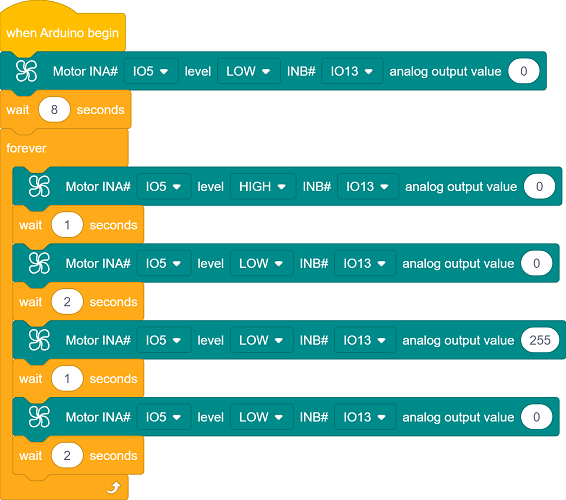

#### Code Explanation

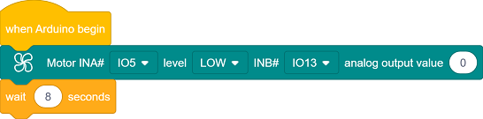

- Initialization. Wait for 8 seconds for adjusting the flag; If it is too short, you can set a longer time.

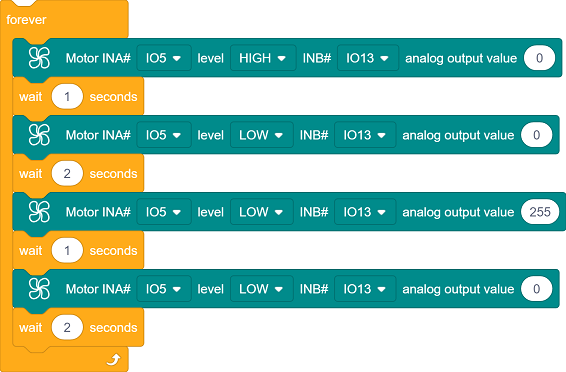

- Execute in a loop: **forward rotation for 1 second → stop for 2 seconds → reverse rotation for 1 second → stop for 2 seconds**. 
  - **Forward/Reverse rotation** : Control the direction (HIGH/LOW) through the combination of INA/INB high and low levels.
  - **Stop** : Two low levels cut off power, and the motor stops freely.

- Motor status control

  Forward rotation: `INA=HIGH`, `INB=PWM(0%)` → `INB=LOW`

  Reverse rotation: `INA=LOW`, `INB=PWM(100%)` → `INB=HIGH`

  Stop: `INA=LOW`, `INB=PWM(0%)` → `INB=LOW`

  

#### Test Result

After uploading the code, wait for 8 seconds for adjusting the flag to the following position:

Then the motor cyclically performs the following actions:

forward rotation for 1s → stop for 2s → reverse rotation for 1s → stop for 2s

You can see the flag rise/fall every two seconds.

Note: As the friction of the rubber ring that fixes the rotating shaft gradually weakens with use, slippage may occur after a long-term work. At that time, the position of the flag may shift slightly each time it is raised to the top, just like when a bicycle chain slips and the pedals spin idly.

---

### 5.2 Single-channel Button

The single-channel button module is a simple and practical input device that outputs high and low level signals by pressing or releasing. It is often used in scenarios such as controlling switches, state switching, and user interaction.

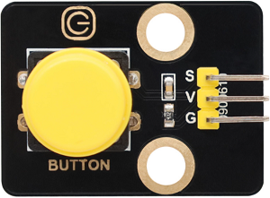

#### Parameters

Operating voltage: DC 3.3-5V

Operating current: 1.1 mA

Maximum power: 0.0055W

Operating temperature: -10°C ~ +50°C

Output signal: Digital signal

Dimensions: 32 x 23 x 15mm

Positioning hole: Diameter of 4.8mm

Interface: 3-pin curved pin interface spacing 2.54mm

#### Principle

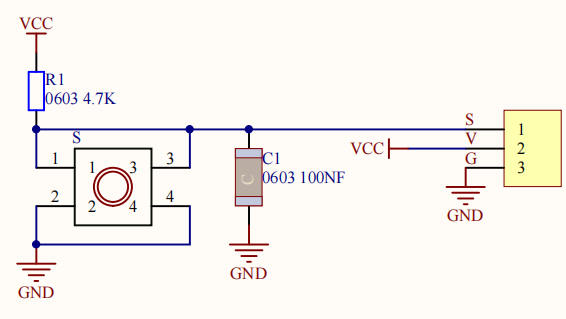

The core of the button module is a mechanical key that works based on **level change**:

- Button is not pressed
	- The output pin of the button module is maintained at a high level (5V) by pull-up resistors.
- Button is pressed
	- When the button is closed, the output pin is grounded and the level changes to a low level (0V).
- Button is released
	- The button is disconnected and the output pin returns to a high level.

**Precautions**

The button may shake when pressed or released, leading to false triggering. This can be solved by software (such as delay).

#### Test Code

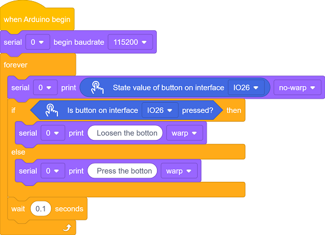

#### Code Explanation

- Serial port initialization

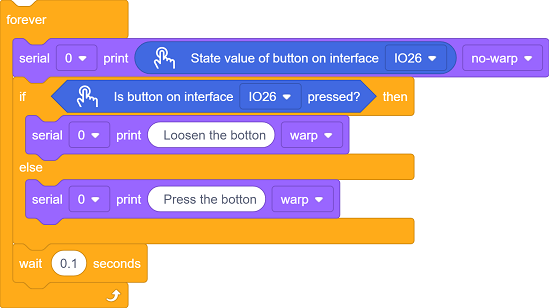

- Detect the status of the button connected to GPIO 26
- Print the real-time status of the button on the serial port
  - press
  - release

#### Test Result

After uploading the code,  to open the serial monitor and set the baud rate to 115200.

Repeated detection:

- Constantly read the status of the button pins.
- If the button is released (read high level), output `Loosen the botton`.
- If the button is pressed (read low level), output `Press the botton`.
- Delay each detection 100 milliseconds to prevent button jitters.

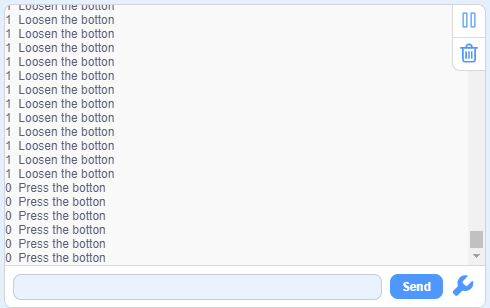

---

### 5.3 Smart Flag Lifting Platform

In the previous two sections, we have learned the basic principles and usage methods of DC gear motor and button module. Let’s make an intelligent flag lifting platform with them! Next, we will set up a system that can automatically raise and lower flag by pressing button. Don’t you think how convenient, efficient and technological it is!

We need to complete the hardware connection, code writing and function debugging before creating a practical flag lifting platform. Let’s embark on this journey full of creativity and challenges together!

#### Code Flow

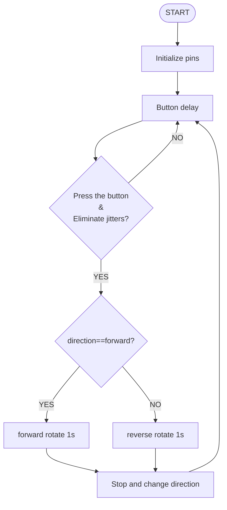

#### Test Code

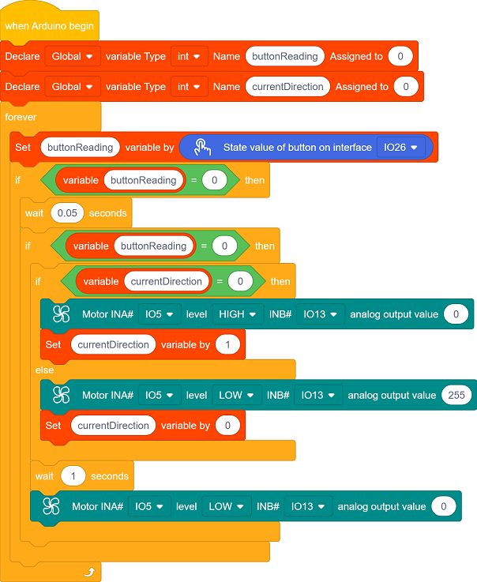

#### Code Explanation

- Define a variable `buttonReading` to determine the button status.
- Define a variable `currentDirection` to determine the current direction.

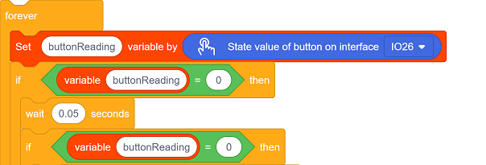

- Button detection and jitter elimination. Only when the button is at a low level (pressed) for more than 50ms is it considered effective. This avoids false triggering caused by contact jitters.

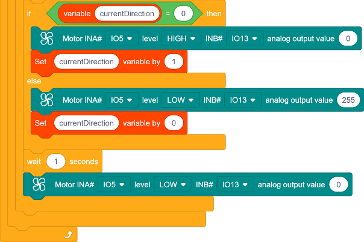

The code implements the function of **alternately controlling the motor direction with a button**:

Press for the first time → forward rotation for 1 second → stop → Press for the second time → reverse rotation for 1 second → stop → loop...

Each time the motor stops rotating, the program will switch the direction indicator (`currentDirection`), so that the next time the button is pressed, the motor will rotate in the opposite direction.

`currentDirection`:

- `0` → forward → lower the flag
- `1` → reverse → raise the flag

#### Test Result

After uploading the code, the single-channel button module alternately controls the lifting action:

- Press once to raise the flag
- Press again to fall the flag
- Repeat

==动图==