## 6. Smart Basketball Scoreboard

Let’s make a basketball scoreboard with infrared obstacle avoidance sensor and OLED. It will accurately detect goals and display the score in real time. What a perfect combination of technology and sports!

### 6.1 Infrared Obstacle Avoidance Sensor

This infrared obstacle avoidance sensor is a detection device based on infrared principles, which is capable of perceiving the distance of obstacles ahead in real time. It is widely used in robots, smart cars and automatic obstacle avoidance systems.

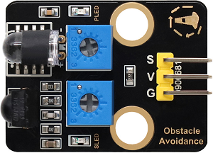

#### Parameters

Operating voltage: DC 5V

Current: 50 mA

Maximum power: 0.3W

Operating temperature: -10°C ~ +50°C

Output signal: Digital signal

Sensing distance: 2 ~ 40 cm

Dimensions: 32 x 23 x 12mm

Positioning hole size: Diameter of 4.8mm

Interface: 3-pin curved pin interface spacing 2.54mm

#### Principle

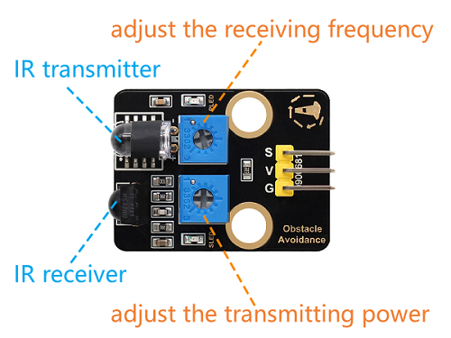

**Working principle:**

1. Emit infrared light:
	  - An infrared emitter emits a beam of infrared light.

2. Receive reflected light:
	  - If there is an obstacle ahead, the infrared light will be reflected back and received by the infrared receiver.

3. Signal processing:

	  - The circuit inside the sensor determines the distance of the obstacle based on the intensity of the reflected light received.

	  - The output signal is a digital signal (high or low level).

Infrared obstacle avoidance sensor is greatly disturbed by ambient light and have a relatively short detection distance (usually 2cm ~ 30cm).

**调节传感器灵敏度：**

The potentiometer on the module can be used to change its sensitivity and detection distance. Here are the adjustment steps and precautions.

Before adjusting, place the ball collection box under the basket first.

First, adjust the two potentiometers to the middle position (default state).

Adjust the transmission power: Turn the potentiometer clockwise to the end, and then slowly turn it counter-clockwise just till the SLED is going to be on (it is off finally).

Set the receiving frequency: Similarly, turn the potentiometer clockwise to the end, and then slowly turn it counter-clockwise just till the SLED is going to be on (it is still off finally). At this time the detection distance is the farthest.

After that, we can put it into use. Test it by your hand and you can see the SLED lights on.

When adjusting, keep the front of the sensor probe **away from obstacles** or **no obstacles** blocking it, so that you can adjust the detection distance to the **maximum**.

#### Test Code

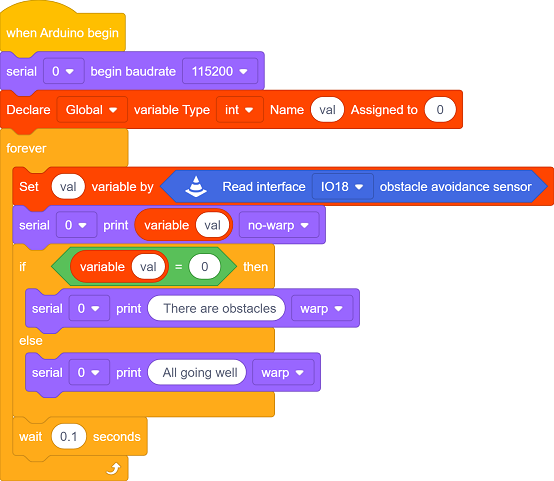

#### Code Explanation

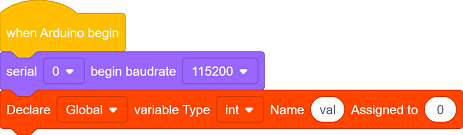

- Initialize the serial port and define a variable `val` to record the output signals of the obstacle avoidance sensor.

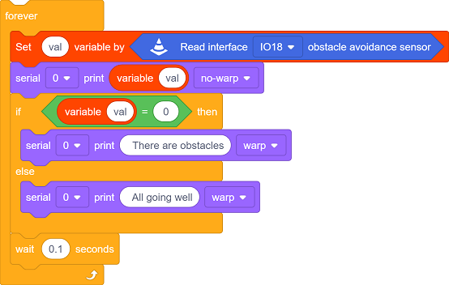

- Read the output signal of the infrared obstacle avoidance sensor:
  - `0`: An obstacle is detected.

  - `1`: No obstacle is detected.
- Determine whether there are obstacles based on the signal:

	- If an obstacle is detected, output `There are obstacles`.
	- If no obstacle is detected, output `All going well`.

- The detection results are refreshed every 0.1 seconds.

#### Test Result

After uploading the code, click  to set the baud rate to 115200.

- If no obstacle is detected, output `1` and `All going well`.
- If an obstacle is detected, output `0` and `There are obstacles`.

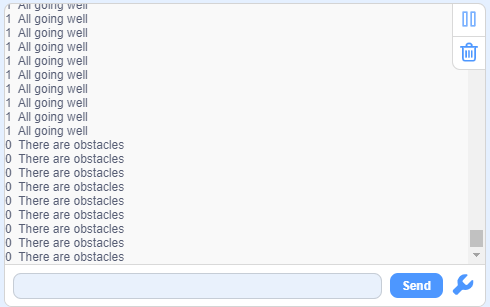

---

### 6.2 Smart Basketball Scoreboard

In the last experiment, we have already learned the basic principles and usage methods of infrared obstacle avoidance sensor and OLED. Now, let’s make a basketball scoreboard! It can accurately detect goals and display the score in real time, which not only enhances the game experience but also is full of a sense of technology.

Next, we will connect hardware, write code and debug, and ultimately create a basketball scoreboard. Now let’s embark on this journey full of creativity and challenges together!

#### Code Flow

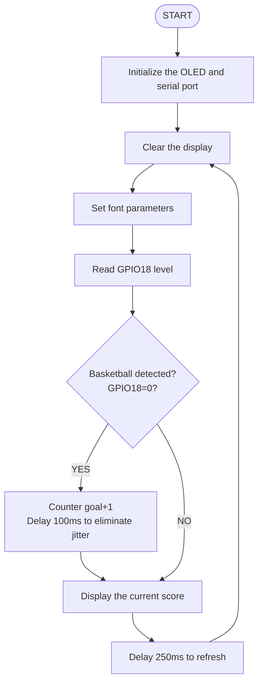

#### Test Code

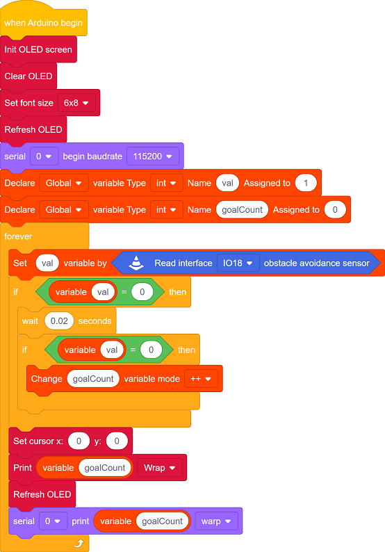

#### Code Explanation

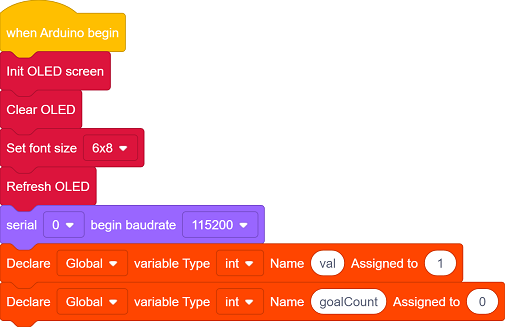

- Initialize OLED, clear the screen, define the font size, and refresh the display
- Initialize the serial port.
- Define a variable `val` to record the output signals of the obstacle avoidance sensor.
- Define a variable `goalCount` to record the values.

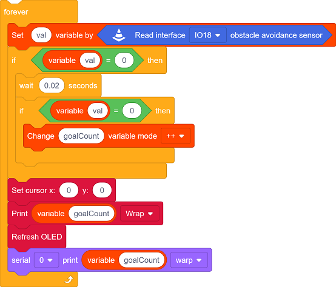

- When the sensor detects an object, it generates a falling edge signal (level 1→0).

  Eliminate the jitters through **time difference** (20ms interval):

  - If the interval between two triggers is > 20ms → it is valid, and `goalCount` adds 1.
  - Otherwise, it is regarded as jitter noise and this trigger will be ignored

- Reveal the value of `goalCount` on the OLED.

- Display the value of `goalCount` on the serial monitor.

#### Test Result

After uploading the code, we throw the basketball into the basket. When the goal is scored:

- Add 1 to the score.

- The OLED displays the current score in real time.

**ATTENTION**: Infrared obstacle avoidance sensor is sensitive to ambient light. Please use them in an environment with stable light.

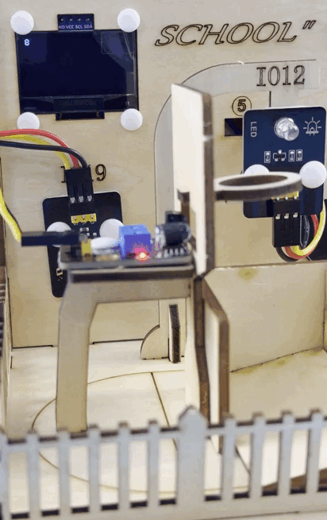

---

