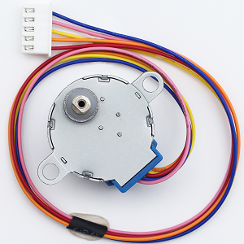
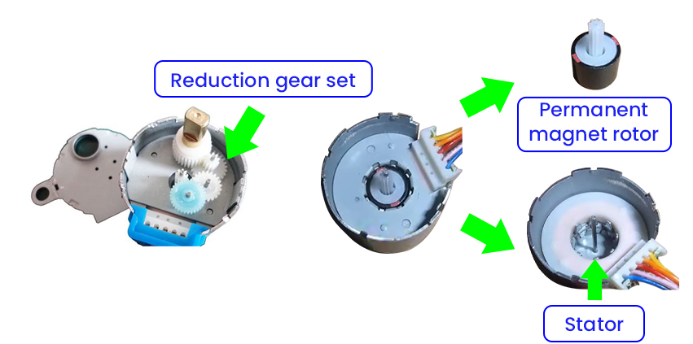
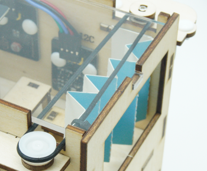

## 9. Light Control Automatic Curtain

In this project, we are going to make a light-controlled automatic curtain system. When the light becomes brighter, the photoresistor will detect the change like sharp eyes, and the stepper motor will open the curtain. When the light dims, it will quietly close the curtains, just like a considerate little light butler!

### 9.1 Stepper Motor

28BYJ-48 is an economical and practical 5-wire 4-phase reduction stepper motor with a built-in 1/64 reduction gearbox. It is able to provide high torque and precise stepper control, so is often used in smart homes, teaching experiments, and small automation projects.

#### Parameters

Operating voltage: DC 5V

Phase: 4 phases (5-wire system: 4 phases +1 common terminal)

Winding resistance: 50Ω±10% (per phase)

Drive mode: Unipolar drive

Reduction ratio: 1:64

Output shaft step angle: 5.625°

Theoretical steps: 64 steps (input shaft) →4096 steps per turn (output shaft)

Actual common number of steps: 2038 steps per turn (engineering approximation due to gear clearance)

Motor diameter: 28mm

Shaft length: 8mm (output shaft)

Weight: Approximately 30g

Wire sequence: Red(COM), orange(A), yellow(B), pink(C), blue(D)

#### Principle

**1. The basic structure of the motor**

28BYJ-48 is a unipolar permanent magnet stepper motor (with a reduction gear set), including:

- Stator: 4 groups of coils (8 wires)
- Rotor: Permanent magnet (Decelerated output through gear set)
- Reduction ratio: 1:64 (For each full rotation of the actual output shaft, the rotor needs to rotate 64 times.)
- Step angle: 5.625°/64 ≈ 0.088°/step (After deceleration)

**2. Core of the driving principle**

Generate a rotating magnetic field by alternately exciting the stator coils, so the permanent magnet rotor is attracted to rotate:

**Coil connection method (unipolar 5-wire) :**

There are a total of 5 wires: 4 coil ends + 1 common end.

**Working mode:**

Full-step mode: Only one coil is activated each time(2048 steps/turn), with a step angle of 5.625°, 64 steps/turn(rotor).

- e.g. A → B → C → D → A... (Forward rotation)

	e.g. A → D → C → B → A... (Reverse rotation)

1. Avoid blockage: It may burn out the coil
2. Minimum speed limit: Vibration may occur if below 5RPM
3. It requires a circuit for jitter elimination: There is hysteresis in the mechanical gears
4. Do not directly (un)plug the wires: it may generate a counter electromotive force

#### ULN2003 Drive Module

Since driving the 28BYJ-48 stepper motor requires a large current of over 300mA, while the GPIO pins of the ESP32 board can only output a maximum current of 40mA, the ULN2003 drive board is adopted to amplify the current signal and protect the main board.

#### Test Code

#### Code Explanation

A stepper motor library needs to be added before it can be used.

Click  to choose an extension, and search `Stepper` and load it. Back to the editing area after it is loaded.

The extension is loaded: 

- Initialize the stepper motor and define pins IN1-IN3-IN2-IN4, actual steps/turn, and rotational speed(RPM). It is recommended to set this speed at 5-12. If it exceeds 15, it is very likely to get stuck.

- First, forward rotate 2 turns and pause for 1 second
- Then, reversely rotate 2 turns and pause for 1 second
- Execute the above process in a loop

#### Test Result

Please adjust the curtain to the position shown below before uploading the code.

After uploading the code, the following operations will be executed in a loop:

- The stepper motor rotates to open the curtain, with a pause of 1 second.
- The stepper motor rotates to close the curtain, with a pause of 1 second.

==动图==

#### FAQ

1. The motor does not rotate.
	- Check whether the power supply is sufficient and whether the pins are correctly connected
2. The motor shakes.
	- Appropriately reduce the rotation speed
3. The motor is overheating seriously.
	- Reduce the continuous operation time

### 9.2 Light Control Automatic Curtain

In the previous section, we have mastered how photoresistor detect light intensity and how stepper motor rotates. Next, we will build an intelligent light-controlled curtain system! We use the photoresistor to monitor the real-time light intensity in the classroom. When strong sunlight is detected, the system will control the stepper motor to close the curtain. If the light weakens, the curtain will then open. 

Don’t you think it is like a considerate classroom administrator, which can not only protect teachers and students from strong light interference, but also manage the indoor lighting conditions. So what are you waiting for? Let’s create this practical and technological system together!

#### Code Flow

#### Test Code

#### Code Explanation

A stepper motor library needs to be added before it can be used.

Click  to choose an extension, and search `Stepper` and load it. Back to the editing area after it is loaded.

The extension is loaded: 

- Define a variable `isCurtainOpen` to record the current physical state of the curtain, with an initial value of 1.
- Define a variable `lightValue ` to store the real-time light intensity values read by the photoresistor.
- Initialize the serial monitor.
- Initialize the stepper motor.

- Read the real-time light intensity value.
- Two conditions ensure that the action is taken only when the state needs to change:
  - Only when the light intensity value is less than 2000 and `isCurtainOpen` = 1 will the motor forward rotate by 2 turns. At this time, `isCurtainOpen` will be updated to 0, ensuring that the software status is synchronized with the actual physical one.
  - Only when the light intensity value is greater than 2000 and `isCurtainOpen` = 0 will the motor reversely rotate by 2 turns. At this time, `isCurtainOpen` will be updated to 1, ensuring that the software status is synchronized with the actual physical one.
- Refresh every 2 seconds.

#### Test Result

Before uploading the code, please adjust the position of the curtain as shown in the following picture.

After uploading the code, the curtain will close or open according to the light value of the classroom:

- When there is insufficient light and the curtain is closed, open the curtain.
- When there is sufficient light and the curtain is opened, close the curtain.