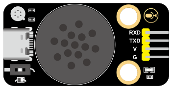
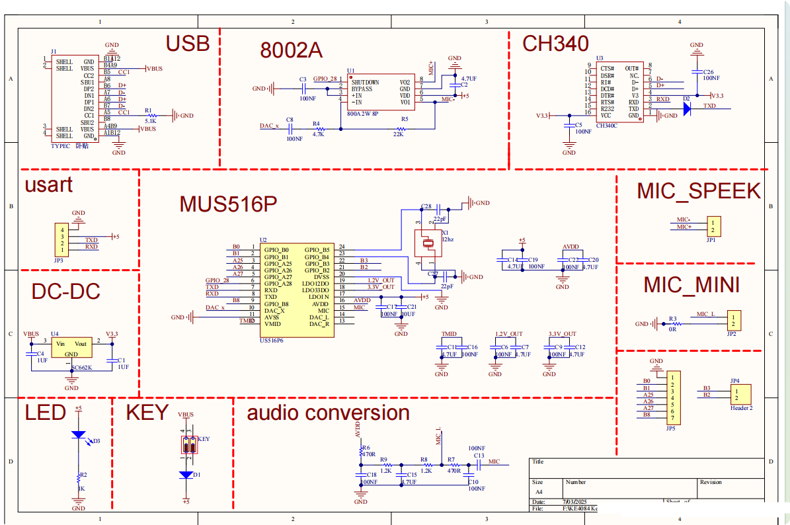
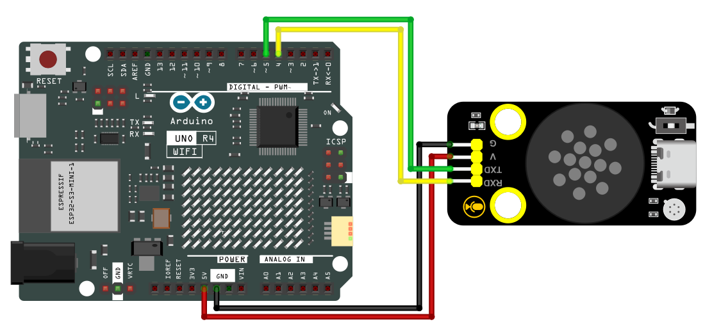
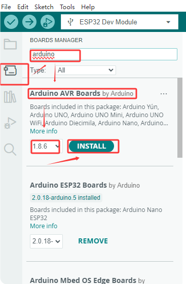
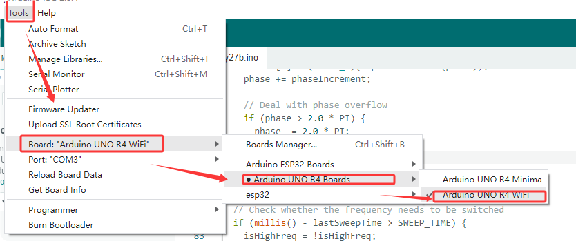

# KS6084 keyestudio DIY Electronic Building Blocks Xiaozhi English Voice Module



[TOC]

## Description

With MUS516P6 as its main control chip, the Xiaozhi voice module is a low-cost, low-power, and small-sized offline voice recognition module that can be quickly applied to smart home devices and small household appliances, 86 boxes, toys, lamps, and so on.


## Parameters

- Operating voltage: 3.3V~5.5V
- Load: LDO output 3.3V; The external load must not exceed150MA
- Power supply and standby: 500MA/60MA
- Hardware: 10 IO ports / 1 uart / 5 ADC / 2 PWM / 1 I2S / 1 SPI / 1 I2C
- Audio output: 1 MONO power amplifier output interface
- FLASH: 2M
- Speaker power: 8Ω1W
- Language: English
- Operating temperature: 0~80℃   
- Dimensions: 47.73*23.93mm
- Weight: 8.96g


## Special Interface Description/Precautions

- BO and B1 are the basic firmware burning points

- The serial ports RXD and TXD can also be used as I2C

- B2 and B3 are PWM ports


## Schematic Diagram

  


## Product Instructions
The following is the default firmware of the module. 

**Voice Recognition Commands**  

| Command ID | Command Aliases | Response Message |
|:----------:|:----------------------------------:|:----------------:|
| 1 | turn on the table lamp|please turn on the light|
| 2 | turn off the table lamp|please turn off the light|
| 3 | brighten up|a bit brighter |
| 4 | dim down|a bit darker |
| 5 | turn on the fan|please turn on the fan|
| 6 | turn off the fan|please turn off the fan|
| 7 | increase fan speed|make it windier |
| 8 | decrease fan speed|make it less windy |
| 9 | water|please water |
| 10 | stop watering|please stop watering |
| 11 | play music | Music has been played for you |
| 12 | stop music | Music has been stopped for you |
| 13 | turn on the red light | The red light has been turned on for you |
| 14 | turn off the red light | The red light has been turned off for you |
| 15 | turn on the green light | The green light has been turned on for you |
| 16 | turn off the green light | The green light has been turned off for you |
| 17 | turn on the blue light | The blue light has been turned on for you |
| 18 | turn off the blue light | The blue light has been turned off for you |
| 19 | turn on the lattice | The lattice has been turned on for you |
| 20 | turn off the lattice | The lattice has been turned off for you |
| 21 | someone is here|someone is approaching|
| 22 | no one is here|people are away |
| 23 | it is raining | It is raining now |
| 24 | the rain has stopped|the rain stopped |
| 25 | move forward | Moving forward |
| 26 | move backward | Moving backward |
| 27 | turn left | Turning left |
| 28 | turn right | Turning right |
| 29 | tracking | Tracking mode activated |
| 30 | following | Following mode activated |
| 31 | obstacle avoidance | Obstacle avoidance mode activated |
| 32 | light seeking | Light seeking mode activated |
| 33 | stop | Stopped |
| 34 | start feeding|feed |
| 35 | stop feeding | Feeding has stopped |
| 36 | turn on the RGB light | The RGB light has been turned on for you |
| 37 | turn off the RGB light | The RGB light has been turned off for you |
| 38 | turn on the buzzer|the buzzer starts to beep |
| 39 | turn off the buzzer|the buzzer stops beeping |
| 40 | increase volume | Volume has been increased |
| 41 | decrease volume | Volume has been decreased |
| 42 | maximum volume | Volume has been set to maximum |
| 43 | medium volume | Volume has been set to medium |
| 44 | minimum volume | Volume has been set to minimum |
| 45 | increase servo angle | Servo angle has been increased |
| 46 | decrease servo angle | Servo angle has been decreased |
| 47 | what is the current temperature|how much is the current temperature |
| 48 | what is the current humidity|how much is the current humidity |
| 49 | what is the current rainfall|how much is the current rainfall |
| 50 | what is the current light intensity|how much is the light intensity |
| 51 | what is the current soil humidity|how much is the soil humidity |
| 52 | what is the current water level|how much is the water level |
| 53 | What's the time?|What time is it ? |
| 54 | what is the current distance | Reading the current distance for you |
| 55 | power on | Powered on |
| 56 | power off | Powered off |

**Voice Broadcasting Commands**  

| Message ID | Command Description |
|:----------:|:---------------:|
| 1 | Current temperature is |
| 2 |              degree              |
| 3 | Current rainfall is percent |
| 4 | Current humidity is percent |
| 5 | Current light intensity is |
| 6 | Current soil humidity is percent |
| 7 | Current water level is |
| 8 | Current distance is |
| 9 | Current time in Beijing is |


## Wiring Diagram
Here we take of the main  board arduino uno R4 as an example.
The following table displays the GPIOs of the expansion board/development board and the module.

| Module | Board |
| :----: | :---: |
|  GND   |  GND  |
|  VCC   |  5V   |
|   RX   |  D4   |
|   TX   |  D5   |

**Wiring Diagram**



## Environment Configuration & Sample Code

**Arduino IDE (Windows)**

Arduino official: https://www.arduino.cc/

Download the latest version of the arduino. After entering the website, as shown below:

There are many versions of Arduino, including those for Windows,mac and linux systems, as well as older ones. You just need to download a version that suits your system.


Here, we take the Windows system as an example to introduce the steps of downloading and installing. There are also two versions of the Windows system: one for installation, one for download(no need to install and just unzip it to use).


Click JUST DOWNLOAD.

**Environment Configuration**

First, open the Arduino IDE and install the corresponding development board platform.



Select Development Board, the port number and the corresponding development board platform.




Then copy the following code to the editing box and upload it to the board.

```C
#include <SoftwareSerial.h>

// Define the software serial port pins (RX, TX)
SoftwareSerial mySerial(4, 5); // pin 4 is RX，pin 5 is TX
int pin = 8; //LED pin
 


void setup() {
  Serial.begin(9600); // Hardware serial port (communicate with the computer)
  mySerial.begin(9600); // Software serial port (communicate with peripheral devices)
  mySerial.println("Software Serial Test");
  pinMode(pin, OUTPUT); // Set the pin to output mode
  
}

void loop() {
  if(mySerial.available()) { // Receive peripheral device data
    int c = mySerial.read();// Assign values to the received peripheral data
    Serial.print("From device: ");// Print the received peripheral data
    Serial.println(c);//Print the received peripheral data
    if(c==1)// Make a judgment. If the received data is 1
    {
        digitalWrite(pin, HIGH);// light on
    }
    if(c==2)// Make a judgment. If the received data is 2
    {
      digitalWrite(pin, LOW);// light off
    }
  
  }
}
```

4. After burning program into the development board, say the wake-up word to trigger the module. Say “Turn on the light” and the orange LED light will light up; when you say “Turn off the light”, the orange LED light will go out.


