# 1. Download code file

[Click to download](./Makecode_Codes.zip)

# 2.Getting started with micro:bit

## 2.1 Introduction

The micro:bit is a pocket sized computer that has sensors and outputs built in. You can use it to create physical computing

projects that interact with the real world, from robots to musical instruments and more.

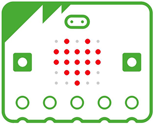

**What you will need to prepare now?**

**Hardware**

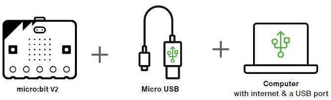

**Software**

A browser to run the MakeCode editor:[https://makecode.micro:bit.org/](https://makecode.micro:bit.org/)

## 2.2 Meet The Micro:bit

**New micro:bit (V2)**

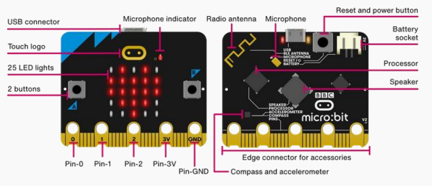

**Original micro:bit (V1)**

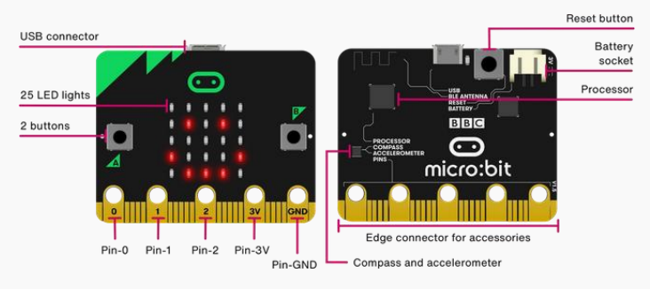

**The following content is borrowed from Kitronik University micro:bit resources and guides.**

The table below lists all of the features for both boards for much easier comparison, new or improved features are highlighted in green.

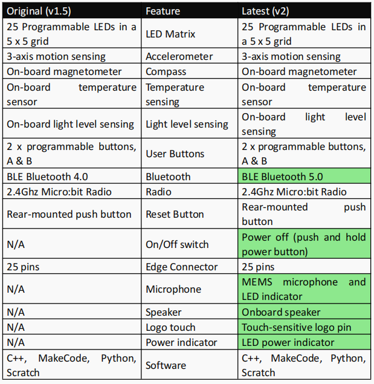

The V2 board also features a number of usability enhancements, they are;

**Notched edge connector.** To make it easier to connect things like crocodile clips and also conductive thread. 

**Power LED indicator.** In addition to the USB activity indicator. 

**Gold plated antenna.** To easily identify the radio and Bluetooth component.

The new micro:bit speaker works the same as it does when you currently connect a speaker to the micro:bit and the sound output will be on both the speaker and the edge connector. The new microphone blocks in the MakeCode editor will allow you to write code that reacts to sound.

**The Tech' Spec's of micro:bit V1 and micro:bit V2:**

Much of the onboard tech has also been enhanced. The processor and memory has been upgraded which has also allowed upgrades to other on-board technologies.

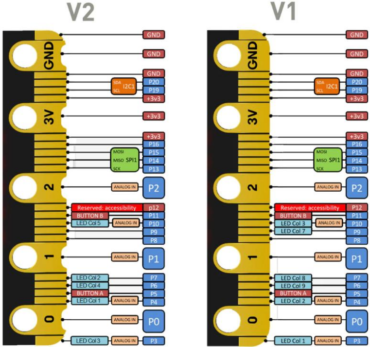

The table below lists key technical specifications for both boards for much easier comparison, new orimproved features are highlighted in green.

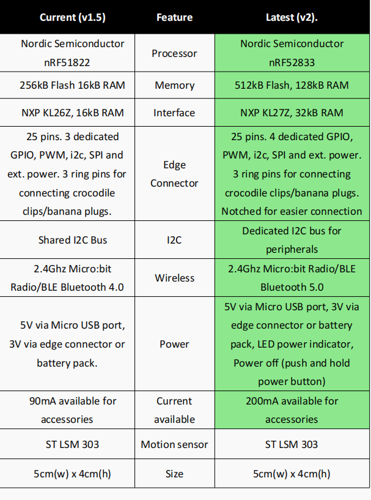

**Coding and MakeCode Compatibility:**

Users will not need to select which version of the device they have before using MakeCode or the Python Editor. 

Every program that could run on a micro:bit version 1 can be re-built to run on micro:bit V2. 

The editors will support both versions simultaneously for features common to both boards. 

To convert an old HEX file into a universal HEX file, drag it into the editor it was created in and then export it back to your computer where it can be dragged and dropped onto the micro:bit. If you attempt to use an old .Hex file without updating it, the micro:bit will display a compatibility error.

## 2.3 Create Your First Project in the MakeCode Editor

In this step you will take a tour of the MakeCode editor, and create your

first program for the micro:bit. 

Open the MakeCode editor at [https://makecode.micro:bit.org/](https://makecode.micro:bit.org/)

**The homepage of the MakeCode**

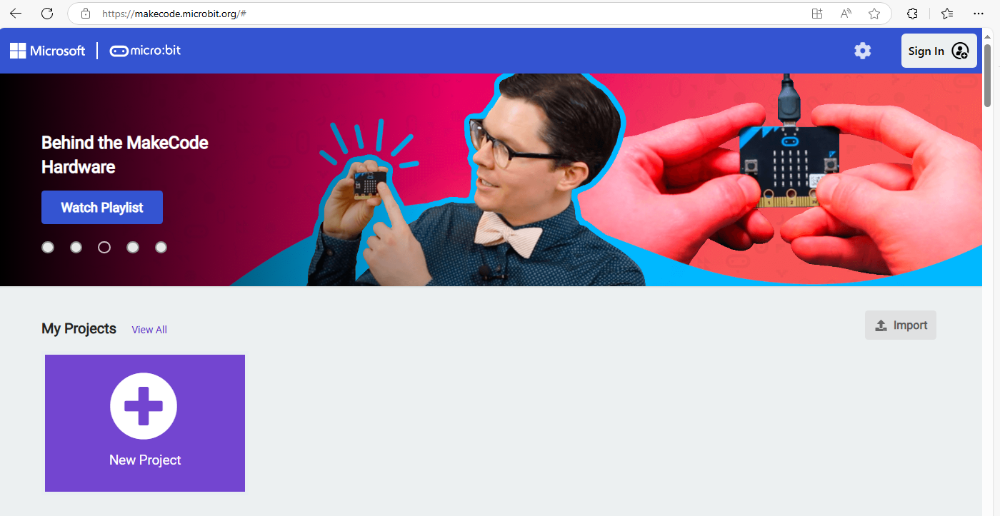

**Create a new project**

Click on the **New Project** button.


Give your project a name - we are going with **heartbeat**. 

Click **Create** to get started with your project.

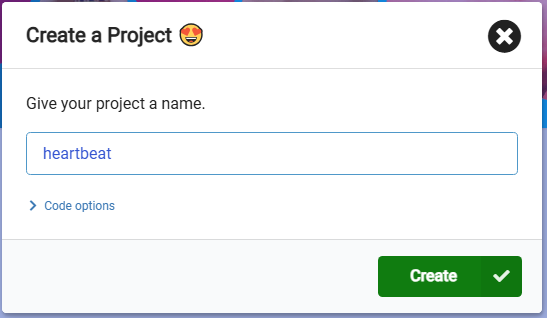

**Introduce to the MakeCode editor**

Now you are presented with the MakeCode editor, this is the screen you will use to program your micro:bit. 

Below is a quick reminder of the different parts of the editor, to help you better understand the interface.

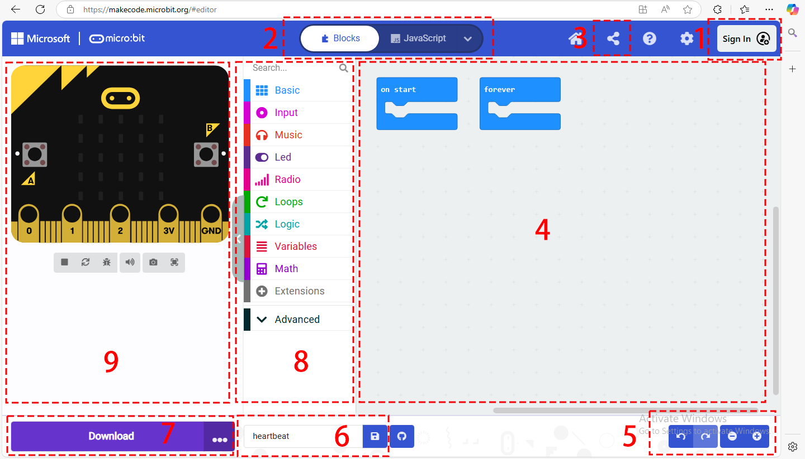

| #    | Describ                                                      |
| ---- | :----------------------------------------------------------- |
| 1    | **Sign in** --- Sign in to save your progress and access your work anytime, anywhere |
| 2    | **Blocks/JavaScript/Python** --- Choose your own adventure by programming in blocks (default) or in JavaScript. Not shown in the image,  Microsoft also eventually added an additional option to use convert the code to MicroPython. |
| 3    | **Share** --- Allows you to share your project code in a number of different ways with your friends! |
| 4    | **Program Space** --- This is where the magic happens and where you build your program...where you "make code." |
| 5    | **Zoom/Undo-Redo** --- Sometimes you need to undo things, or zoom out and look around; these are the buttons for that. |
| 6    | **Name & Save** --- Name your program and save it (download it) to your computer as a .hex file. You can drag this file to your micro:bit using your computer's file explorer. |
| 7    | **Download** --- Transfer the code directly to your micro:bit using webUSB. Or similar to Save, download your program as a .hex file and drag it into your micro:bit. |
| 8    | **Block Library** --- The toolbox is where you get the blocks that make up your program. It is split into categories that are colour coded. |
| 9    | **Simulator** --- You don't need hardware! MakeCode has a real-time simulator! As you change your program, you can see what it will do on this virtual micro:bit! |

**Creating your heartbeat program**

In the code area, there are two fixed blocks “**on start**” and “**forever**”. 

The code in the “**on start**” block will be executed only once after power-on or reset, while the code in **“forever”** block will be executed circularly.

You only need the **forever** block for this program. 

Grab the **on start** and drag it over the **Toolbox**.You should see a rubbish bin appear when you do this. Release the block

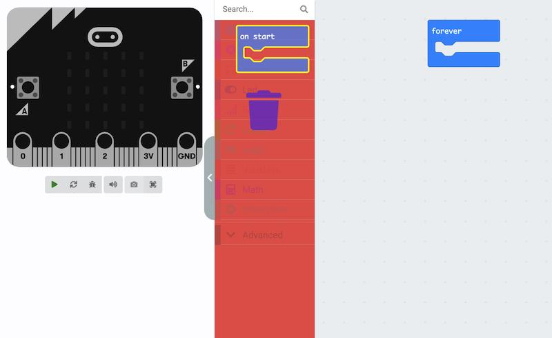

You can also **right-click** **on start** and click **Delete block** to remove it.

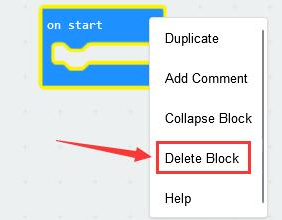

Click the **Basic menu** in the T**oolbox**. Grab a **show icon** block. 

Place the **show icon** inside the **forever** block in the **program space**. The blocks will fit together like puzzle pieces.

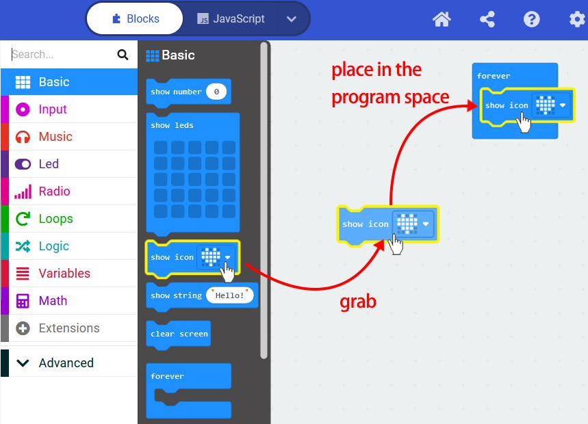

The **simulator** will immediately run your program, you will see the heart pattern displayed on the LEDs.

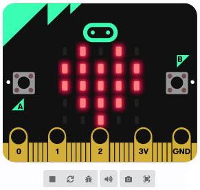

Click on the heart icon at the end of the **show icon** block. You will see a drop down, with all the available pre-made icons.

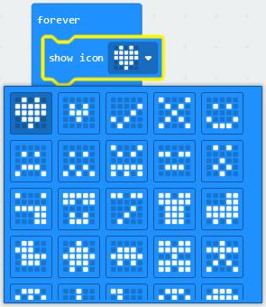

Click **Basic** again and drag the **show icon** block to place it underneath the **show icon** block you just created. 

Or you can right click the **show icon** and click **Duplicate**, the same **show** **icon** block will appear in the program space. 

Choose a smaller heart from drop down.

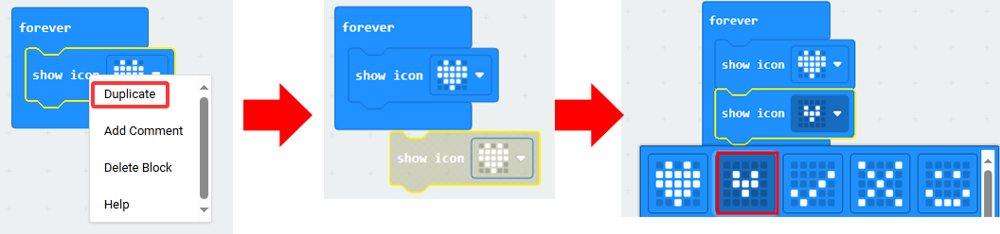

You should notice that when you make a change to your code, the simulator restarts. 

The simulator will display a beating heart.

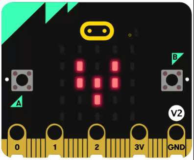

In the next step you will learn how to download your program onto your physical micro:bit.

## 2.4 Transfer Code to The Micro:bit

The official provides detailed tutorials on how to transferring a program from **multiple devices** to the micro:bit.

[Transfer code to the micro:bit | micro:bit](https://microbit.org/get-started/user-guide/transfer-code-to-the-microbit/)

**It covers:**

Transferring a program from MakeCode or the micro:bit Python Editor

​	from a computer

​	from an Apple device (iPad or iPhone)

​	from an Android device

Transferring a program that has been downloaded as a file

We will introduce you two methods to transfer the program :

### 2.4.1 Method 1: Flashing the Micro:bit with WebUSB

**WebUSB**

WebUSB is a developing web feature that allows you to access a micro:bit directly from a web page. With MakeCode this enables you to flash your micro:bit straight from the browser without the need to save the .hex file first, and use serial communication between the micro:bit and the editor.

**WebUSB support for Your Micro:bi**

<span style="color:red;">If you’re not using a current version of the Chrome or Microsoft Edgebrowsers, make sure they are this version or newer:</span>

Chrome (version 61 and newer) browser for Android, Chrome OS, Linux, macOS and Windows 10. 

Microsoft Edge (version 79 and newer) browser for Android, Chrome OS, Linux, macOS and Windows 10. 

Also, if you have a micro:bit V1 board, make sure that it is running version 0249 or above of the firmware.

**Pair Your Micro:bit**

The first time you pair your micro:bit with your computer you’ll need to go through a few easy steps to get setup. Here’s how to get paired with WebUSB:

Connect your micro:bit to your computer with a USB cable. 

Open the MakeCode editor at [Microsoft MakeCode for micro:bit](https://makecode.microbit.org/#editor)

Click on the **Download** button below the simulator.


Click **Next**

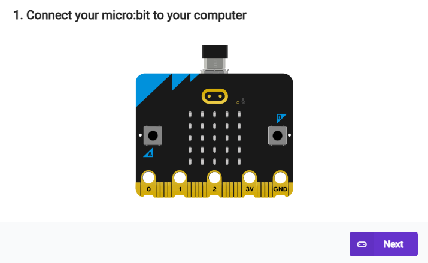

Click **Pair** and select the micro:bit device and click **Connect**.

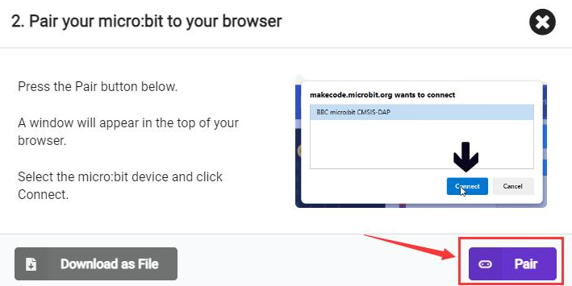

**Note:** If your micro:bit isn’t showing up, try unplugging it and plugging it back in. You can also try a different USB port or USB cable if they are available.

You will see another box telling you the pairing was successful. Your micro:bit is connected!

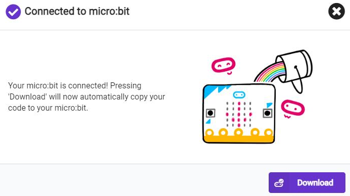

Once your micro:bit is paired, MakeCode will use WebUSB to transfer the code directly and you won’t have to drag and drop .hex files from a folder. Just click the Download button in the editor and your project code will just transfer to the micro:bit. 

The yellow light on the back of the micro:it will flash really fast to let you know the program is transferring, then your program will start automatically.

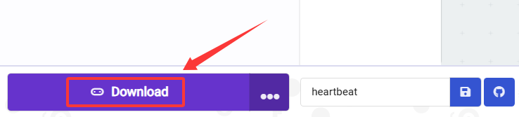

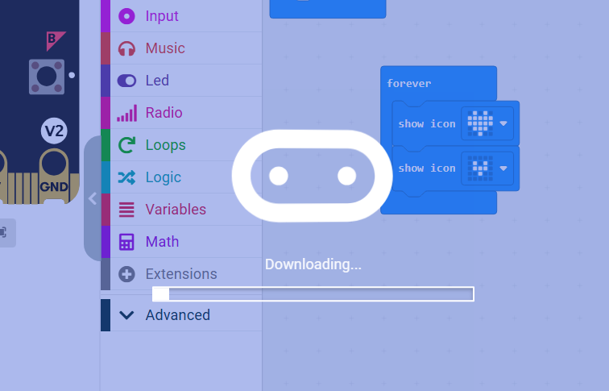

<span style="color:red;">This method does not save a version of your code to your localmachine</span>, if you wish to keep a copy of the program you have written, click the save icon (looks like a floppy disk and is located next to your project name in the MakeCode Editor) to save a copy of the hex file to your local machine.

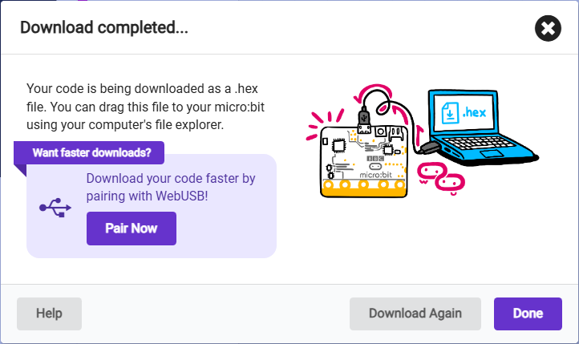

This will download your program file to your standard download location, probably the Downloads folder on your computer, or whatever location you have set in your download preference. You can copy or move it somewhere safe if you need to keep it to reload into the editor.

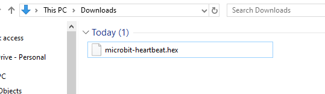


**Using Safari/Firefox/Other**

**Note:** If you are using any browser other than Chrome or Edge. It may not support WebUSB so you can't pair your micro:bit with your computer.  Every time you click on the 'Download' button, your program won’t transfer directly to your micro:bit, your code will be downloaded as a .hexfile. Just like click the save icon to save a copy of the hex file to your computer.You can drag this file to your micro:bit using your computer's file explorer.

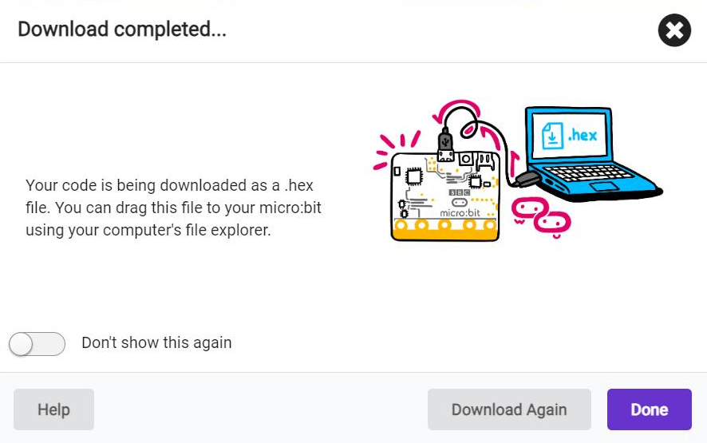

Next step, we will learn how to transfer a program that has been downloaded as a hex file.

### 2.4.2 Method 2: Transfer a program that has been downloaded asa hex file

In the previous chapter, we have learned how to download the program to your local computer as a hex file.

Connect your micro:bit to your computer with a USB cable

Open Finder (Mac) / File explorer (Windows) and notice that your micro:bit is listed like a USB drive called micro:bit.

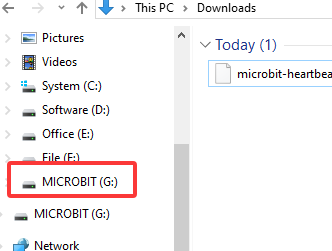

Find the downloaded program hex file (e.g. in your local downloads folder) and drag and drop this on to the micro:bit drive.

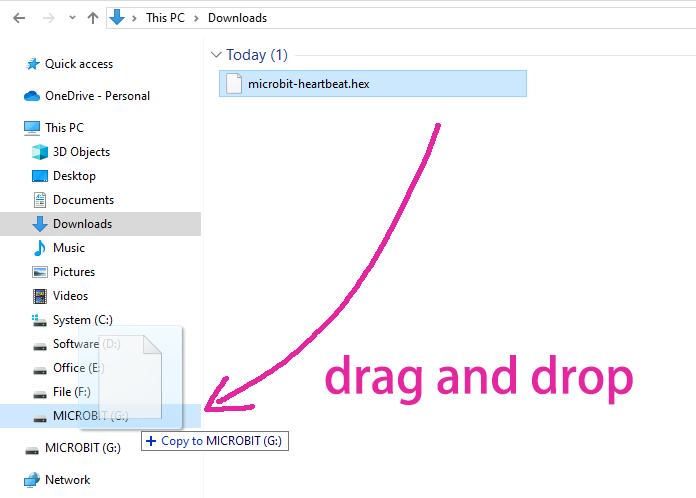

Or you can right click and choose "Send to→micro:bit."

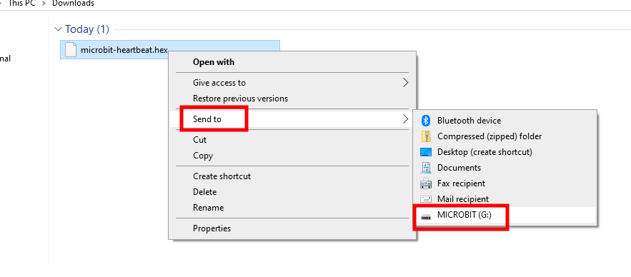

The yellow light on the back of the micro:it will flash really fast to let you know the program is transferring. Once the transfer is completed then your program will start automatically.

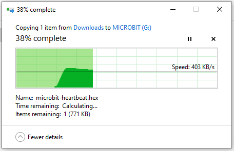

After you transfer your .hex file, the micro:bit drive will disconnect and reconnect as the micro:bit resets. If you look at the contents of the micro:bit drive, you will not see the .hex file listed, this is normal, but your hex file will be run.

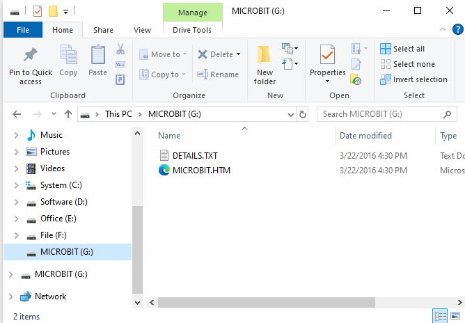

**Note:** In the lessons we offered, the micro:bit can only receive hex files and won't store anything else!

## 2.5 Import Files from Your Computer with the Makecode.

Steps：

1. In a new browser window open https://makecode.micro:bit.org
2. There are two ways to import or update a saved hex file in the Makecode editor. 

Drag the HEX file from your computer into the home page or edit window.

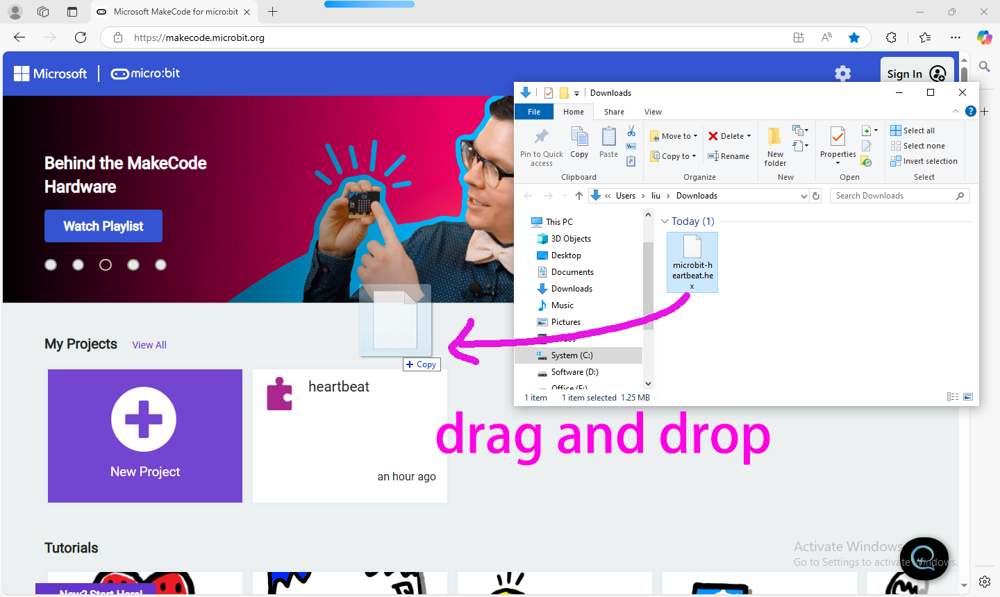

**Note:** The micro:bit can only run one program at a time - every time you drag-and-drop a hex file onto the device over USB it will erase the current program and replace it with the new one.

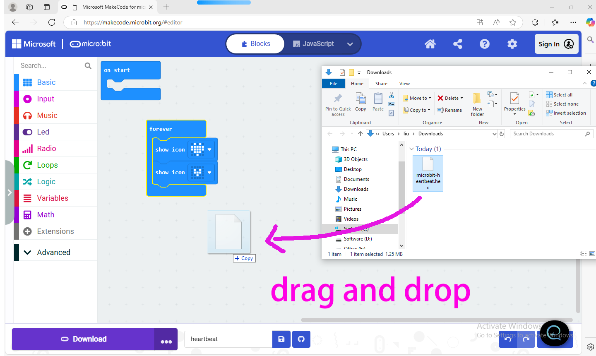

Click “Import” button on the right side of HOME page.

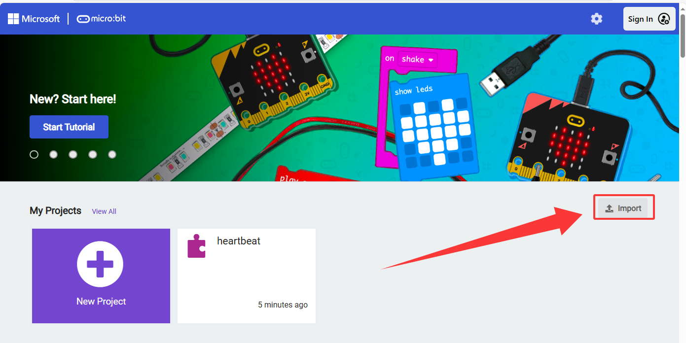

In the pop-up dialog box, click "Import File".

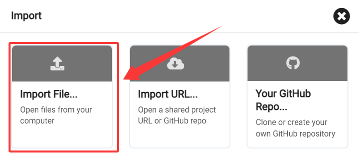

Select file you saved. Then click "Go ahead"

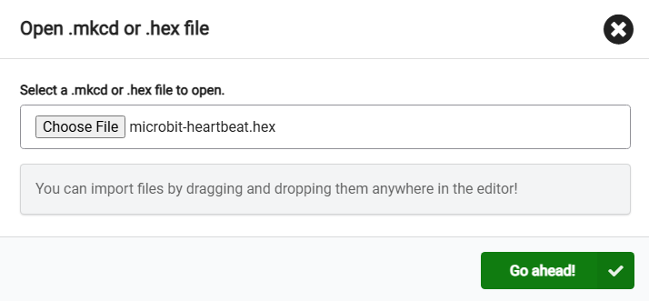

The file will open in the Makecode editor.

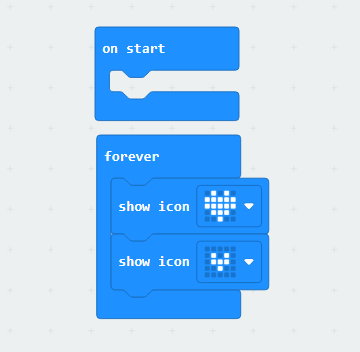


## 2.6 Micro:bit Project

**What you will learn?**

We have learned how to use the MakeCode editor

We have learned how to connect your micro:bit to your computer and download a MakeCode program to it

Now we start learning how to use the micro:bit’s components like;the LEDs, sensors, buttons and the speaker.

### 2.6.0 Prepare:

Make sure you have downloaded the files we provided that are required to run the robot car.

Link to download:[Click to download the code file](./Codes.zip)

Download the tutorial package and save it in the folder you want, and

unzip it to use.

### 2.6.1 LED Matrix

There are 25 LEDs on the front face that you can use to show pictures, numbers, and words.

<span style="color:red;font-size:30px;">1 </span>In this step, we will download a code to micro:bit to light up the LEDs at coordinates (1,0) and coordinates (3,4).

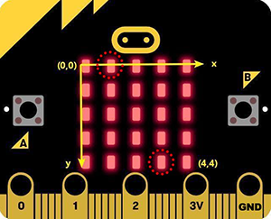

The upper left corner is (0,0) point, the lower right corner is (4,4) point, the horizontal direction (from left to right) is the x-axis direction,increasing in sequence [0-4], and the vertical direction (from top to bottom) is y-axis direction, increasing in sequence [0-4].

**Steps**：

Connect your micro:bit to your computer with a USB cable. 

Find the downloaded micro:bit-LED-Matrix-1.hex file, drag it in the Makecode to view and analyze, and use WebUSB to flash it to the micro:bit from inside editor. 

-Or you can right-click on it and choose "Send to→micro:bit".

| File Type | Path  |          File Name          |
| :-------: | :---: | :-------------------------: |
| hex file  | Codes | 2.6.1micro:bit-LED-Matrix-1 |

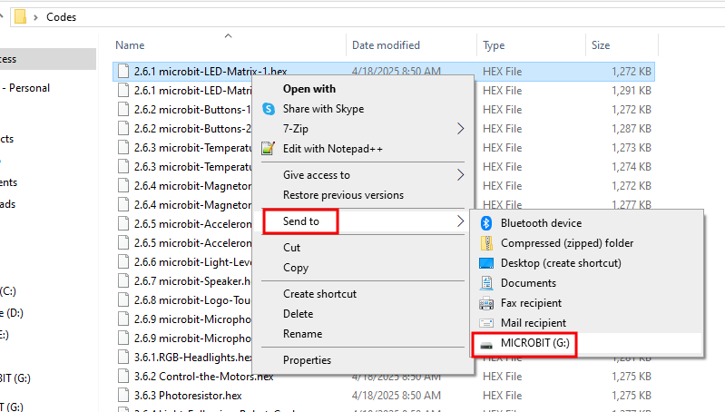

Result：LEDs at coordinates (1,0) and coordinates (3,4) of the micro:bit will flash alternately.

-----

<span style="color:red;font-size:30px;">2 </span>Next we will use the micro:bit to display the numbers 1, 2, 3, 4, 5, and then cycle through the following patterns in the following order: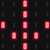,"Hello!",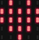,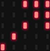,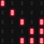,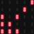,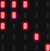

**Steps**：

Connect your micro:bit to your computer with a USB cable. 

Find the downloaded micro:bit-LED-Matrix-2.hex file, drag it in the Makecode to view and analyze, and use WebUSB to flash it to the micro:bit from inside editor. 

Or you can right-click on it and choose "Send to→micro:bit."

| File Type | Path  |          File Name          |
| :-------: | :---: | :-------------------------: |
| hex file  | Codes | 2.6.1micro:bit-LED-Matrix-2 |

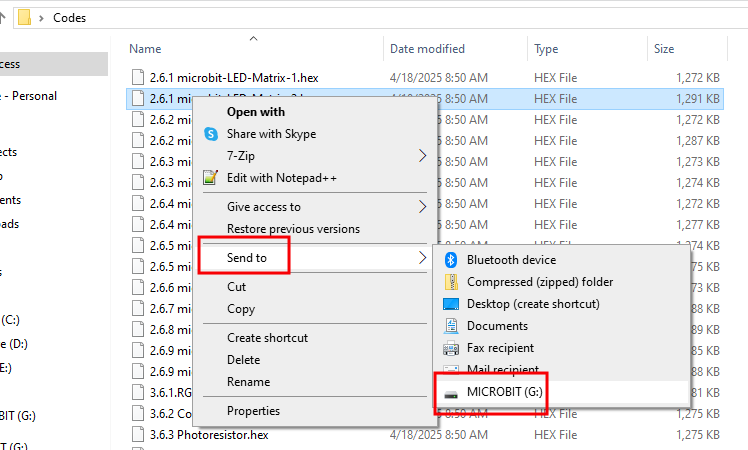


### 2.6.2 Programmable Buttons, A & B

Buttons are a very common input device. All micro:bit have two buttons you can program, and a reset button. The programmable buttons, A & B can trigger pieces of code in your programs.

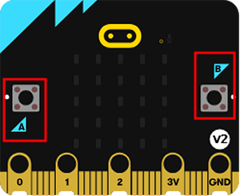

<span style="color:red;font-size:30px;">1 </span>We will make buttons A,B of the micro:bit work with the LED matrix.

**→**Press button A, the LED matrix displays A

**→**Press button B, the LED matrix displays B

**→**Press button AB at the same time, the LED matrix displays AB

**Steps**：

Connect your micro:bit to your computer with a USB cable. 

Find the downloaded micro:bit-Buttons-1.hex file, drag it in the Makecode to view and analyze, and use WebUSB to flash it to the micro:bit from inside editor. 

Or you can right-click on it and choose "Send to→micro:bit."

| File Type | Path  |        File Name         |
| :-------: | :---: | :----------------------: |
| hex file  | Codes | 2.6.2 microbit-Buttons-1 |

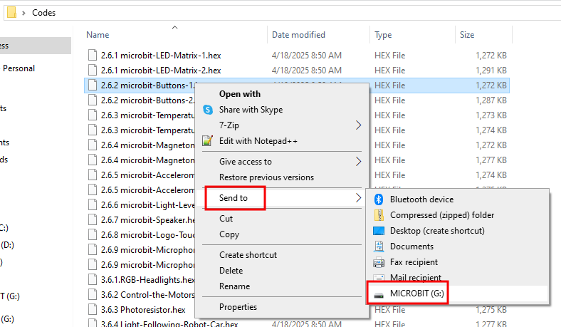

-------

<span style="color:red;font-size:30px;">2 </span>Now let's send another code to micro:bit to realize the following function:

**→**When you press button A, the LED matrix is lit with more LEDs upwards, and when you press button B, LEDs of the mircrobit turn off downward.

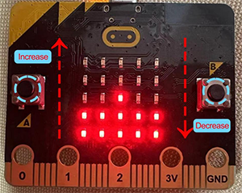

**Steps**：

Connect your micro:bit to your computer with a USB cable. 

Find the downloaded micro:bit-Buttons-2.hex file, drag it in the Makecode to view and analyze, and use WebUSB to flash it to the micro:bit from inside editor. 

Or you can right-click on it and choose "Send to→micro:bit.

| File Type | Path  |        File Name         |
| :-------: | :---: | :----------------------: |
| hex file  | Codes | 2.6.2 microbit-Buttons-2 |

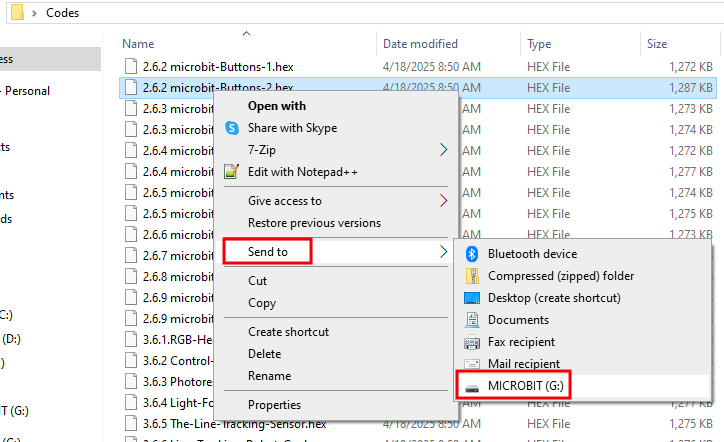

### 2.6.3 Temperature Sensor

The micro:bit does not actually have a temperature sensor. It uses the temperature sensor built into the NFR51822 chip for temperature detection. Therefore, the detected temperature is closer to the temperature of the chip and may have a certain error with the ambient temperature.

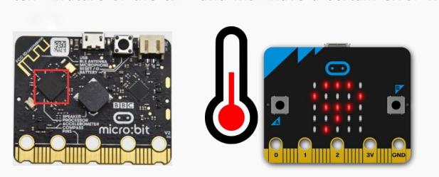

<span style="color:red;font-size:30px;">1 </span>In this step we will shows how hot or cold your micro:bit is by taking a reading from the temperature sensor in its processor or CPU (central processing unit).

**Steps**：

Connect your micro:bit to your computer with a USB cable. 

Find the downloaded micro:bit-Temperature-Sensor-1 .hex file, drag it in the Makecode to view and analyze, and use WebUSB to flash it to the micro:bit from inside editor.

| File Type | Path  |              File Name              |
| :-------: | :---: | :---------------------------------: |
| hex file  | Codes | 2.6.3 microbit-Temperature-Sensor-1 |


The "Show Data Device" button will appear below the simulator


If you press the Show data button, the editor will switch from theBlocks or JavaScript view to display a charting window and a text console. 

The Data view window will display the temperature value read by the temperature sensor in the micro:bit's processor chip.


**Return:** The Go back button switches the view back to previous code window (either Blocks or JavaScript).


**Source:** Tells you where the data is coming from. If the code writing the data is running in the simulator, then the source is Simulator. If your code is running on the micro:bit and connected by USB, the source is Device.


**Pause:** The pause button will stop the display of new values and stop scrolling. When you resume, the chart starts again with the current value written.


**Resume:** The resume button willstart displaying new values after the Pause button was pressed.


**Download:** The download button collectsthe data your code has written and downloadsit to your computer as a file called something like data-11-2018-23-00-0700.csv. The numbersin the filename are the date and time when the file is created. The file may automatically open in an editor orspreadsheet if one of those programsis associated with csv files.


---

<span style="color:red;font-size:30px;">2 </span>Now let's send another code to micro:bit to make LED matrix of the micro:bit display the temperature detected by the temperature sensor. 

**Steps**：

Connect your micro:bit to your computer with a USB cable. 

Find the downloaded micro:bit-Temperature-Sensor-2.hex file, drag it in the Makecode to view and analyze, and use WebUSB to flash it to the micro:bit from inside editor. 

Or you can right-click on it and choose "Send to→micro:bit."

| File Type | Path  |              File Name              |
| :-------: | :---: | :---------------------------------: |
| hex file  | Codes | 2.6.3 microbit-Temperature-Sensor-2 |


**Result**：When your micro:bit turns on, the temperature reading in Celsius will be displayed and scrolled across the LED array followed by the temperature reading in Fahrenheit.

--------

### 2.6.4 Magnetometer

The micro:bit's built-in magnetometer chip is intended for use as compass to detect magnetic north. Like the compass app on your phone, this requires calibration.

<span style="color:red;font-size:30px;">1 </span>We first need to calibrate the compass of the micro:bit. Then make the led matrix display direction value read by the compass. North, east, south, and west correspond to 0°, 90°, 180°, and 270°. 

**Steps**：

Connect your micro:bit to your computer with a USB cable. 

Find the downloaded micro:bit-Magnetometer-1.hex file, drag it in the Makecode to view and analyze, and use WebUSB to flash it to the micro:bit from inside editor. 

Or you can right-click on it and choose "Send to→micro:bit."

| File Type | Path  |           File Name           |
| :-------: | :---: | :---------------------------: |
| hex file  | Codes | 2.6.4 microbit-Magnetometer-1 |


After the code is downloaded to micro:bit, the LED matrix of the micro:bit prompts: "TILT TO FILL SCREEN", and then it enters calibration mode.

**The calibration method is:**

When you tilt the micro:bit in a certain direction, the LED matrix will light up more LEDs in that direction.Keep tilting the micro:bit in all directions until all LEDs are lit, and a smiley face appears indicating calibration is complete!


**Test Result:** Each time you press button A, position value read by the compass will be displayed on the LED matrix. Change the orientation of the micro:bit and you will notice that the position value changes accordingly.


-----

<span style="color:red;font-size:30px;">2 </span>Here, we will download a new code to make the arrow on the LED matrix of the micro:bit always point to the north. 

**Steps**：

Connect your micro:bit to your computer with a USB cable. 

Find the downloaded micro:bit-Magnetometer-2.hex file, drag it in the Makecode to view and analyze, and use WebUSB to flash it to the micro:bit from inside editor. 

Or you can right-click on it and choose "Send to→micro:bit."

| File Type | Path  |           File Name           |
| :-------: | :---: | :---------------------------: |
| hex file  | Codes | 2.6.4 microbit-Magnetometer-2 |


After the code is downloaded to micro:bit, the LED matrix of the micro:bit prompts: "TILT TO FILL SCREEN", and then it enters calibration mode.

**The calibration method is:**

When you tilt the micro:bit in a certain direction, the LED matrix will light up more LEDs in that direction. 

Keep tilting the micro:bit in all directions until all LEDs are lit, and a smiley face appears indicating calibration is complete!


**Test Result:** Place the micro:bit's LED matrix horizontally facing up and change its orientation horizontally, you will find that no matter how you change its orientation, the arrow displayed by its LED matrix points in the same direction. If you have a compass app on your phone, turn the compass app on, hold your micro:bit horizontally in the same direction as your phone and you will see that the arrow of the micro:bit is pointing at North9(0 degree).


### 2.6.5 Accelerometer

An accelerometer is a motion sensor that measures movement. The accelerometer in your BBC micro:bit detects when you tilt it left to right, backwards and forwards and up and down.

If you imagine the micro:bit sitting flat on a desk, the x dimension is left to right; the y dimension front to back and the z dimension into and out of the desk. We can use an accelerometer to detect the orientation of the micro:bit, since gravity will always be acting in the same downwards direction.


X: acceleration in the left and right direction. 

Y: acceleration in the forward and backward direction. 

Z: acceleration in the up and down direction. 

Strength: the resulting strength of acceleration from all three dimensions (directions).

**A number that means the amount of acceleration**

When the micro:bit is lying flat on a surface with the screen pointing up, 

-x is 0, 

-y is 0, 

-z is -1023, 

-and strength is 1023.


<span style="color:red;font-size:30px;">1 </span>In this step we will use the Data View Window to display the values of the x, y, and z axes detected by accelerometer.

**Steps**：

Connect your micro:bit to your computer with a USB cable. 

Find the downloaded micro:bit-Accelerometer-1.hex file, drag it in the Makecode to view and analyze, and use WebUSB to flash it to the micro:bit from inside editor.

| File Type | Path  |           File Name            |
| :-------: | :---: | :----------------------------: |
| hex file  | Codes | 2.6.5 microbit-Accelerometer-1 |


Click the "Show Data Device" under the simulator


You will see the values of the X, Y, and Z axes detected by the accelerometer in the Data View Window.


<span style="color:red;font-size:30px;">2 </span>Now let us upload new code so that when the accelerometer detects the posture of the micro:bit change, the micro:bit will display the corresponding number on the LED matrix.

**Steps**：

Connect your micro:bit to your computer with a USB cable. 

Find the downloaded micro:bit-Accelerometer-2.hex file, drag it in the Makecode to view and analyze, and use WebUSB to flash it to the micro:bit from inside editor. 

Or you can right-click on it and choose "Send to→micro:bit."

| File Type | Path  |           File Name            |
| :-------: | :---: | :----------------------------: |
| hex file  | Codes | 2.6.5 microbit-Accelerometer-2 |


**Test result:**

Shake the micro:bit: LED matrix shows number 1

Logo up: LED matrix shows number 2

Logo down: LED matrix shows number 3

Screen up: LED matrix shows number 4

Screen down: LED matrix shows number 5

Tilt left: LED matrix shows number 6

Tilt right: LED matrix shows number 7

Free fall: LED matrix shows number 8

### 2.6.6 Light Level Sensor

Find the light level (how bright or dark it is) where you are. The light level 0 means darkness and 255 means bright light. The micro:bit measures the light around it by using some of the LEDs on the LED screen. 

The first time you use it, this function will say 0. After that, it will say the real light level. This is because the light sensor (the part that can find the light level) has to be turned on first.

In this step we will use the Data View Window to display the values of the light intensity detected by light level sensor.

**Steps**：

Connect your micro:bit to your computer with a USB cable. 

Find the downloaded micro:bit-Light-Level-Sensor.hex file, drag it in the Makecode to view and analyze, and use WebUSB to flash it to the micro:bit from inside editor.

| File Type | Path  |             File Name             |
| :-------: | :---: | :-------------------------------: |
| hex file  | Codes | 2.6.6 microbit-Light-Level-Sensor |

Click the "Show Data Device" under the simulator

You will see the values of light intensity in the Data View Window


----

### 2.6.7 Speaker (V2 only)

The micro:bit can make sounds, play tunes and the new micro:bit has a built-in speaker to make it even easier to make expressive and useful projects. 

Any micro:bit sound project will work with the speaker, but with the new micro:bit you can also express yourself with some new sounds: make your micro:bit giggle, greet you or let you know when it's sleepy or sad. 

You can also mute the speaker and sound will still come out of the pins so you can still enjoy micro:bit music on headphones connected to GND and pin 0. In MakeCode, use the music block 'set on-board speaker off'.

In this step we're going to make the micro:bit produce interesting sounds. 

**Steps**：

Connect your micro:bit to your computer with a USB cable. 

Find the downloaded micro:bit-Speaker. hex file, drag it in the Makecode to view and analyze, and use WebUSB to flash it to the

micro:bit from inside editor. 

Or you can right-click on it and choose "Send to→micro:bit."

| File Type | Path  |       File Name        |
| :-------: | :---: | :--------------------: |
| hex file  | Codes | 2.6.7 microbit-Speaker |


Result: the speaker of the micro:bit makes interesting sounds and the LED dot matrix displays the music logo pattern.

--------

### 2.6.8 Logo Touch (V2 only)

The gold logo is a touch sensor that works a bit like a touch screen on a mobile phone, measuring tiny changes in electricity. This is also called a capacitive touch sensor, because it uses measurements of electrical capacitance to work.

Light up your micro:bit with a heart - but only while you touch it!

**Steps**：

Connect your micro:bit to your computer with a USB cable. 

Find the downloaded micro:bit-Logo-Touch.hex file, drag it in the Makecode to view and analyze, and use WebUSB to flash it to the

micro:bit from inside editor. 

Or you can right-click on it and choose "Send to→micro:bit."

| File Type | Path  |         File Name         |
| :-------: | :---: | :-----------------------: |
| hex file  | Codes | 2.6.8 microbit-Logo-Touch |


Result: Show a ‘❤’ icon on the LEDs while the logo is pressed. When you release your finger from the "Logo" mark, number will appear.


---------

### 2.6.9 Microphone (V2 only)

The new micro:bit with sound has a built-in microphone sensor. It can react to loud and quiet sounds, and also measure how loud your environment is. 

The microphone is on the back of the new micro:bit, and on the front you'll find a new microphone LED next to the hole that lets the sound in. It lights up to show you when your micro:bit is measuring sound levels.

<span style="color:red;font-size:30px;">1 </span>We will make the LED matrix of micro:bit display a large heart when the microphone detects sound, and a small heart when the surroundings are quiet. 

**Steps**：

Connect your micro:bit to your computer with a USB cable. 

Find the downloaded micro:bit-Microphone-1.hex file, drag it in the Makecode to view and analyze, and use WebUSB to flash it to the micro:bit from inside editor. 

Or you can right-click on it and choose "Send to→micro:bit."

| File Type | Path  |          File Name          |
| :-------: | :---: | :-------------------------: |
| hex file  | Codes | 2.6.9 microbit-Microphone-1 |


Result: After the code is downloaded, a small heart will be displayed in the center of the LED matrix of the micro:bit. You can try to clap your hands near the micro:bit. Each time you clap, the small heart on the LED matrix will turn into a big heart.

----

<span style="color:red;font-size:30px;">2 </span>Next we will download the new code to the Micro Bit and display the volume of the sound on the LED matrix. 

**Steps**：

Connect your micro:bit to your computer with a USB cable. 

Find the downloaded micro:bit-Microphone-2.hex file, drag it in the Makecode to view and analyze, and use WebUSB to flash it to the micro:bit from inside editor. 

Or you can right-click on it and choose "Send to→micro:bit."

| File Type | Path  |          File Name          |
| :-------: | :---: | :-------------------------: |
| hex file  | Codes | 2.6.9 microbit-Microphone-2 |


Result: After the code is downloaded, You'll notice that the louder the sound around the micro:bit, the more LEDs will light up, from bottom to top.


--------

# 3. Introduction to the Mini Robot Car

Keyestudio Mini Robot Car is a multifunctional car based on BBC micro:bit. It is equipped with a wealth of sensors and peripherals to help you understand how to use the micro:bit and learn more about electronics.

In addition, it leaves lot of universal jacks of building block holes for easy connection to other peripheral devices, you can use your experience and imagination to create more interesting inventions.

## 3.1 Hardware

**Note:** the two colored headlights, two photosensitive sensors, the IR receiver and two motors are already integrated in the car baseplate.


## 3.2 Parameters

Connector port input: DC 4.5V

Operating voltage of sensors: 3V

Motor speed: 200RPM

Working temperature range: 0-50℃

Dimension: 99*78*58mm

Environmental protection attributes: ROHS

The motor speed can be adjusted via the PWM

Due to the small number of IO ports of micro:bit, the micro:bit board sends control instructions to STC8G1K08 via the IIC, and then ST8G1K08 sends PWM to control HR8833 motor to drive IC, thus controlling the motor to rotate. LED RGB is controlled in the same way as above.

**3.3 About Battery**

The Keyestudio micro:bit mini Robot Car is powered by three AAA batteries. This product does not contain any AAA battery. You need to buy them yourself to run this robot car.


## 3.4 Adding Extension for the Robot Project

We have created a dedicated extension to simplify coding tasks for the mini robot car. 

Extensions are functional code modules that are installed from outside the MakeCode editor and plug new blocks into the Toolbox. If you have used Arduino before, you probably know about a thing called a library; which is a collection of code that extends the functionality of the core programming language. MakeCode extensions work the same way. 

Drag the hex files we provided into the Makecode editor or use the "Import" button to open the hex files we provided. You can see two additional extensions in the Toolbox list, which are already included in our code.


That is to say, if you use the hex file we provided, you do not need to add these extensions to the Makecode editor.

<span style="color:red;font-size:25px;">Note:</span>

<span style="color:red;">1. If you want to drag and drop blocks to Create a New Project to control this robot car, you will need to add the extension we provide to use new blocks to complete the code. </span>

<span style="color:red;">2.For every new MakeCode project that you make, you will have to load extensions over again.</span>

**How to add an extension**

You can add an extension by going to Toolbox and clicking on the Extensions category.


This will open a window giving you a place to search for extensions. Also, a selection of recommended extensions is shown for you to choose from. 

Copy and paste the following link into the search box and press the "**Enter**" to search.

```c
https://github.com/keyestudio2019/MiniCar
```

Click the **“Mini Car**” extension


After the extension is added, you should see the **Mini Car,** and **IrRemote** extension category appear in the Toolbox. The extension will contain the new blocks, ready for you to use in the project’s code.


**How to Update or Delete an Extension**

1.Click the "JavaScript" button to switch to text code.


2.Find the Explorer button below the simulator


3.Find **Mini Car** in the extended list. 

Click on the trash can icon to delete the extension. 

Click on the refresh icon to update the extension.


## 3.5 Assemble the Robot Car

Before assembly, please tear off the protective film on the acrylic boards.


1.Install the wheels to the car base


Couple the protruding end of the wheel with the motor shaft


2.Install acrylic board and battery case


3.Install the universal wheel


4.Install the ultrasonic module and the micro:bit


Micro:bit’s LED matrix faces forward


## 3.6 Robot Project

**Things to Note Before Starting the Robot Project：**

1. To avoid poor contact between micro:bit and robot, please make sure that the Microbit is correctly inserted into the Microbit interface of the car body. The connector need to cover the edge of the Microbit round hole. 

The LED matrix of the micro:bit facing forward.


2. Put AAA batteries into the battery case and connect the case to the VCC connector of the car base.


3. Turn off the slide switch that controls the power from the batteries.


### 3.6.1 RGB Headlights


Let’s light up the two RGB headlights of the robot car and make it

flash every second in the order of red, green, blue, cyan, oxblood red, 

yellow and white. 

**Steps**：

Connect the micro:bit on the robot car to your computer with a USB cable.

Find the downloaded RGB-Headlights.hex file, drag it in the Makecode to view and analyze, and use WebUSB to flash it to the

micro:bit from inside editor. 

Or you can right-click on it and choose "Send to→micro:bit.

| File Type | Path  |      File Name      |
| :-------: | :---: | :-----------------: |
| hex file  | Codes | 3.6.1RGB-Headlights |


**Result:** After downloading the code, the RGB headlights of the robot car will switch every second in the order of red, green, blue, cyan, oxblood red, yellow and white. If you disconnect the microbit's USB power supply, you can turn on the power slide switch of the robot car and power it from the batteries.

**Schematic Diagram**


Working Principle: Micro:bit, as the host, sends instructions to the slave STC8G1K08 through the IIC, then the slave outputs PWM to control RGB LED lights. This greatly savesthe IO ports of the microbit board, for the IIC enables to control two motors and two RGB LED light.

### 3.6.2 Control the Motors

The robot car is equipped with two DC geared motors, which are developed on the ordinary DC motors. It enjoys a matching gear reduction box, which provides a lower speed but a larger torque. Furthermore, different reduction ratios of the box can provide different speeds and torques. 

The reduction motor is the integration of gearmotor and motor, which is applied widely in steel and machine industry.

Moreover, the car boasts a STC8G1K08 and a HR8833MTE chip. To save the IO ports, we send instructions to the STC8G1K08 chip through the IIC of the micro:bit, then the STC8G1K08 chip controls the HR8833MTE chip according to the corresponding instructions to control the rotation direction and speed of the two DC reduction motors (the control process is as follows).


**Circuit Diagram**


Let's download a new code to make the robot car go forward for 1s, backward for 1s, turn left for 1s, turn right for 1s and stop for 1s. 

**Steps**：

Connect your micro:bit to your computer with a USB cable. 

Turn off the POWER Slide switch on the robot car base to prevent it from moving and falling off the table after the code download is complete. 

Find the downloaded Control-the-Motors.hex file, drag it in the Makecode to view and analyze, and use WebUSB to flash it to the

micro:bit from inside editor. 

Or you can right-click on it and choose "Send to→micro:bit."

| File Type | Path  |        File Name         |
| :-------: | :---: | :----------------------: |
| hex file  | Codes | 3.6.2 Control-the-Motors |


**Result:** Disconnect the microbit's USB power supply, put it on the ground and turn on the power slide switch of the robot car, the robot car will go forward for 1s, backward for 1s, turn left for 1s, turn right for 1s and stop for 1s.

### 3.6.3 Photoresistor


A photocell or photoresistor is a sensor that changes its resistance when light shines on it. The resistance generated varies depending on the light striking at his surface.


Working Principle: It is a resistor made by the photoelectric effect of a semiconductor, which is very sensitive to ambient light, thus its resistance value will vary with different light intensity. 

We seek to use this feature to design a circuit and generate a photoresistor module. The signal end of the module is connected to the analog port of the microcontroller.

When the light intensity increases, the resistance decreases, and the voltage of the analog port rises, that is, the analog value of the microcontroller goes up. Otherwise, when the light intensity decreases, the resistance increases, and the voltage of the analog port declines, that is, the analog value of the microcontroller becomes smaller. Therefore, we can use the photoresistor to read the corresponding analog value and sense the light intensity in the environment.

It is commonly applied to light measurement, control and conversion, light control circuit as well.

Now let's use Data View Window of the Makecode to display the light value detected by the photoresistor

**Steps**：

Connect your micro:bit to your computer with a USB cable. 

Find the downloaded Photoresistor.hex file, drag it in the Makecode to view and analyze, and use WebUSB to flash it to the micro:bit from inside editor.

| File Type | Path  |      File Name      |
| :-------: | :---: | :-----------------: |
| hex file  | Codes | 3.6.3 Photoresistor |

**Result:** After the code is downloaded, click the "**Show data Device**" button and the **Data View Window** will display the value detected by the left and right photosensitive sensors.


### 3.6.4 Light Following Robot Car

In this Step, we are going to guide you to make an Microbit Light Following Robot Car.


**Steps**：

Connect your micro:bit to your computer with a USB cable. 

Turn off the POWER Slide switch on the car base to prevent the robot from moving and falling from the table after the code is downloaded successfully. 

Find the downloaded Light-Following-Robot-Car.hex file, drag it in the Makecode to view and analyze, and use WebUSB to flash it to the micro:bit from inside editor. 

Or you can right-click on it and choose "Send to→micro:bit."

| File Type | Path  |            File Name            |
| :-------: | :---: | :-----------------------------: |
| hex file  | Codes | 3.6.4 Light-Following-Robot-Car |


**Result:** After downloading the code, turn on the power switch on the rear of the car, you can use your phone's built-in flashlight to make it follow the light source. It is best to conduct this experiment in a relatively dark environment. When the ambient light intensity is higher than 650, the car will continue to move.


### 3.6.5 The Line Tracking Sensor

The car base board of Keyestudio micro:bit Mini Robot Car V2.0 contains two line tracking sensor module, and it also integrates two potentiometers on the top to allow you to adjust the sensitivity of the line tracking sensor.


The line tracking sensor is an infrared sensor that uses the TCRT5000 infrared tube. The TCRT5000 Infrared sensor mainly includes an IR Tx (transmitter) & and IR Rx (receiver), the IR Tx generates an infrared signal continuously then reflects through an obstacle and is detected through the IR receiver.

This sensor module is frequently used in different robots like object sorting and line following because this module detects the surface whether that is black or white. Black objects absorb infrared signals, and white objects reflect infrared signals. Once this module is activated through power, then the IR diode will emit the IR signal frequently. 

Digital Outputs HIGH (1) when black objects are detected. 

Digital Outputs LOW (0) when white objects are detected.


In this step, we will display the digital value detected by the line traking sensor in the Data View Window. 

**Steps**：

Connect your micro:bit to your computer with a USB cable. 

Find the downloaded The-Line-Tracking-Sensor.hex file, drag it in the Makecode to view and analyze, and use WebUSB to flash it to the micro:bit from inside editor.

| File Type | Path  |           File Name            |
| :-------: | :---: | :----------------------------: |
| hex file  | Codes | 3.6.5 The-Line-Tracking-Sensor |

**Result:** You can use a black and white object or hold your finger close to the sensor. Click the "**Show data Device**" button and the simulator will display the digital value detected by each sensor.


### 3.6.6 Line Tracking Robot Car

Now let's make a line tracking robot. 

The robot car takes different actions based on the digital values outputs from the line tracking sensor.

**Steps**：

Connect your micro:bit to your computer with a USB cable. 

**Turn off the POWER Slide switch** on the car base to prevent the robot from moving and falling from the table after the code is

downloaded successfully. 

Find the downloaded Line-Tracking-Robot-Car.hex file, drag it in the Makecode to view and analyze, and use WebUSB to flash it to the micro:bit from inside editor. 

Or you can right-click on it and choose "Send to→micro:bit."

| File Type | Path  |           File Name           |
| :-------: | :---: | :---------------------------: |
| hex file  | Codes | 3.6.6 Line-Tracking-Robot-Car |


**Result:**

After the code is downloaded, place the robot on the paper and align the line tracking sensor with the black line. 

**Turn on the power switch** on the car base, the robot car will move following the black line.


**Note:**

Avoid performing this experiment in strong sunlight. Sunlight contains a large amount of invisible light, such as infrared rays and ultraviolet rays, which will affect the work of the line tracking sensor.

**What if the robot doesn't work or doesn't follow the line?**

1. Please check whether the battery has sufficient power. 
2. You can use the slotted screwdriver to rotate the two potentiometers on the top to adjust the sensitivity of the sensor. When a finger is close to the sensor, its onboard LED lights up, indicating that the sensor's sensitivity is good.


### 3.6.7 Ultrasonic Sensor


Let’s look at the picture of the ultrasonic sensor module. There are two things like eyes, one is the signal transmitter (TRIG) and the other is the signal receiver (ECHO).

**working principle:**


(1) We first pull TRIG (T) low, and then give at least 10us of high-level signal to trigger;

(2) After triggering, the module will automatically transmit 8 40KHZ square waves and automatically detect whether there is a signal return;

(3) If a signal returns, a high level is output through ECHO (E). The duration of the high level is the time from transmission to reception of the ultrasonic wave. 

`Then the test distance = the duration of high level *340m/s * 0.5`

**Specifications:**

Working voltage: 3-5.5V (DC)

Working current: 50mA－100mA，normally is 65mA

Maximum power：0.5W

Maximum detection distance: about 3m

Blind spot：less than 4cm

Sensing angle: no more than 15 degrees

Interface: 4pin interface with a spacing of 2.54mm

Positioning hole: 3mm diameter

Working temperature： -10℃ - +60℃

Dimension：49mmX22mmX19mm

Now, let's use the ultrasonic sensor to measure the distance of an object

in front of the robot. 

**Steps**：

Connect your micro:bit to your computer with a USB cable. 

Turn on the POWER Slide switch on the car base Find the downloaded Ultrasonic-Sensor.hex file, drag it in the Makecode to view and analyze, and use WebUSB to flash it to the micro:bit from inside editor.

| File Type | Path  |        File Name        |
| :-------: | :---: | :---------------------: |
| hex file  | Codes | 3.6.7 Ultrasonic-Sensor |


**Result:** Click the "**Show data Device**" button under the simulator. The distance of the object in front measured by the ultrasonic sensor will be.


### 3.6.8 Obstacle Avoidance Robot Car

An Obstacle Avoidance Robot is an intelligent robot, which can automatically sense and overcome obstacles on its path. 

Let's make an obstacle avoidance robot！

**working principle：**


**Steps**：

Connect your micro:bit to your computer with a USB cable. 

Turn off the POWER Slide switch to prevent the robot from moving and falling from the table after the code is downloaded successfully. 

Find the downloaded Obstacle-Avoidance-Robot-Car.hex file, drag it in the Makecode to view and analyze, and use WebUSB to flash it to the micro:bit from inside editor. 

Or you can right-click on it and choose "Send to→micro:bit.

| File Type | Path  |             File Name              |
| :-------: | :---: | :--------------------------------: |
| hex file  | Codes | 3.6.8 Obstacle-Avoidance-Robot-Car |


**Result:** Place the robot on the ground and **turn on the power switch** on the car base, the robot car will will move forward and avoid obstacles.


### 3.6.9 Obstacle Following Robot Car

Contrary to the previous chapter, we will make an ultrasonic following car in this step. The surface of the obstacle in front should be flat and large enough to return ultrasonic signals to the ultrasonic module.

**Working principle：**


**Steps**：

Connect your micro:bit to your computer with a USB cable. 

Turn off the POWER Slide switch on the car base to prevent the robot from moving and falling from the table after the code is downloaded successfully. 

Find the downloaded  Obstacle-Following-Robot-Car.hex file, drag it in the Makecode to view and analyze, and use WebUSB to flash it to the micro:bit from inside editor. 

Or you can right-click on it and choose "Send to→micro:bit."

| File Type | Path  |             File Name              |
| :-------: | :---: | :--------------------------------: |
| hex file  | Codes | 3.6.9 Obstacle-Following-Robot-Car |


**Result:** Place the robot on the ground and **turn on the power switch** on the car base, place your phone or palm in front of the ultrasound and the robot will follow it.


### 3.7.0 IR Remote Control

Infrared remote controls are used to control various home appliances such as televisions, stereos, video recorders, and satellite receivers. The infrared remote control is composed of an infrared remote control, an infrared receiver module, and a microcontroller that can decode.


When a button on the remote control is pressed, the remote control sends out an infrared carrier signal. When the infrared receiver receives the signal, the program decodes the carrier signal and determines which button is pressed based on the difference in data code. The microcontroller decodes the received 0 and 1 signals to determine which key is pressed on the remote control.

The infrared receiving module is integrated into the car base and is controlled by the P16 of micro:bit.


In this step, we will use View Data Window to display the key values sent from the infrared remote control.

**Steps**：

Connect your micro:bit to your computer with a USB cable. 

Find the downloaded IR-Remote-Control.hex file, drag it in the Makecode to view and analyze, and use WebUSB to flash it to the

micro:bit from inside editor.

| File Type | Path  |        File Name        |
| :-------: | :---: | :---------------------: |
| hex file  | Codes | 3.7.0 IR-Remote-Control |

**Result:**

1.Click the "**Show data Device**" button under the simulator. 

2.Pull out the plastic insulation film from the infrared remote control.


3. Make sure there's a battery inside. 
4. Press the button towards the infrared receiver of the robot, the View Data Window will display the value corresponding to the key of the IR remote control.


### 3.7.1 IR Remote Control Robot Car

We are going to make an IR Remote Control Robot. The robot car receives the infrared signal and decodes it to obtain specific values from the IR remote control, and the car performs tasks based on the corresponding values.

**Working principle：**


**Steps**：

Connect your micro:bit to your computer with a USB cable. 

Turn on the POWER Slide switch on the car base. 

Find the downloaded IR-Remote-Control-Robot.hex file, drag it in the Makecode to view and analyze, and use WebUSB to flash it to the micro:bit from inside editor. 

Or you can right-click on it and choose "Send to→micro:bit."

| File Type | Path  |             File Name             |
| :-------: | :---: | :-------------------------------: |
| hex file  | Codes | 3.7.1 IR-Remote-Control-Robot-Car |


**Result:** After the code is downloaded successfully, we can use the four direction keys of the infrared remote control to control the

movement of the robot. Press the **OK** button and the robot will stop moving.


### 3.7.2 Install Bluetooth APP and Read Bluetooth Data


We can use the built-in Bluetooth on the micro:bit to communicate with the Bluetooth APP of the mobile phone, and use the Bluetooth APP of the mobile phone to control the external devices of the micro:bit. The built-in Bluetooth on Micro:bit supports both Android phones and IOS devices(mobile phones or iPads).

In this step, we mainly introduce the Bluetooth APP we developed and read the data of the Bluetooth APP.

First we need to download the code to the micro:bit. 

**Steps**：

Connect your micro:bit to your computer with a USB cable. 

Find the downloaded Read-Bluetooth-Data.hex file, drag it in the Makecode to view and analyze, and use WebUSB to flash it to the

micro:bit from inside editor.

| File Type | Path  |         File Name         |
| :-------: | :---: | :-----------------------: |
| hex file  | Codes | 3.7.2 Read-Bluetooth-Data |

Next we will need to download the Bluetooth App for our phone and connect it to the micro:bit.

**Download APP and connect the bluetooth：**

**For iOS system device**

1. Open App Store


2.Search **keyes mini car** in the Apple Store and click download


3.Click **Settings**, and turn on the **Bluetooth** and **location** services.


4.Click **Settings,** scroll through the list and find **mini car**. Click it and allow **mini car APP** to access Bluetooth.


5.Click to open **mini car** app.


6.Click the **CONNECT** button in the upper left corner of the APP homepage.


7. After clicking the **CONNECT** button, a Bluetooth list will pop up, scroll through the list and find **BBC Micro:bit**, click on the **Connect**.

**Note:** If a pop-up window prompts "**failed to connect**", please ignore it. This is a small bug in the APP. We will try to fix it. In fact, the Bluetooth has been successfully connected in this step.


7. If after clicking the **CONNECT** button, the pop-up page is blank and shows that Bluetooth not turned on, please exit the APP and restart it and try again. 

You also need to make sure you have completed the following steps. 

1).Code has been downloaded to the micro:bit

2).The battery power is sufficient and the power switch on the car base has been turned on. 

4).Turn on the Bluetooth and location services on phone. 

5).Allow the **mini car APP** to access Bluetooth.


**For Android system device**

1. Search **keyes mini car** in Google Play


The APP file is provided in our tutorial package, you can also transfer it to your phone and install it.


2. Click **INSTALL**

A security warning pop-up will appear. We guarantee that the APP is safe, please use it with confidence. 

-**Select** l understand that this app hasn't been tested and may pose a risk


4.Click **Settings** of the mobile phone, and turn on the Bluetooth. 

Click **Privacy**, and turn on the location services.


5.Click **Settings** > **Apps & services** > **Permission manager**


6. Find the **keyes mini car** Bluetooth app, click on the permission options of the app, and enable Location and nearby device permissions.(**Note:** Some mobile phones do not have nearby device permissionsfunction.)


7.Click to open **keyes mini car** APP.


8.Click the **CONNECT** button in the upper left corner of the APP homepage.


9.After clicking the **CONNECT** button, a Bluetooth list will pop up, scroll through the list and find **BBC Micro:bit**, click on the **Connect**. After "is connected" is displayed, click on the **blank space outside the pop-up box** to return to the APP main interface.


After downloading the code to the Microbit and connecting Bluetooth to the phone. 

Click the "**Show Data Device**" under the simulator on Makecode Editor.


Click the button on the Bluetooth APP, the **Data View Window** will display its corresponding letter value, and "S" will be displayed when releasing a button.


### 3.7.3 Multi-purpose Smart Car

In the previous chapter, we learned how to install and use Bluetooth APP.In this step, we will use Bluetooth APP to control the mini robot car

**Steps**：

Connect your micro:bit to your computer with a USB cable.

Turn on the POWER Slide switch on the car base. 

Find the downloaded Multi-purpose-Smart-Car.hex file, drag it in the Makecode to view and analyze, and use WebUSB to flash it to the micro:bit from inside editor. 

Or you can right-click on it and choose "Send to→micro:bit."

| File Type | Path  |           File Name           |
| :-------: | :---: | :---------------------------: |
| hex file  | Codes | 3.7.3 Multi-purpose-Smart-Car |


**Result:**

Place the robot on the ground and turn on the power switch on the car base, connect the Bluetooth APP to the micro:bit, then you can use the Bluetooth APP to control the robot.


The following are the functions corresponding to the buttons on the Bluetooth APP interface.


