# 1.MU IDE

## 1. 1Install MU IDE

Official website of Mu：https://codewith.mu/

Mu is a Python code editor for beginning programmers based on teachers and students. The easiest way to get Mu is through the official installer for Windows or Mac OSX (Mu no longer supports 32-bit Windows). The current recommended version is Mu 1.0-beta 2.

### Step 1- Determine the version and download the Mu installer

Find out if your computer runs Windows or Mac OSX, and open the Explorer, click "This PC", then select Properties to know your Windows system is 32-bit or 64-bit.

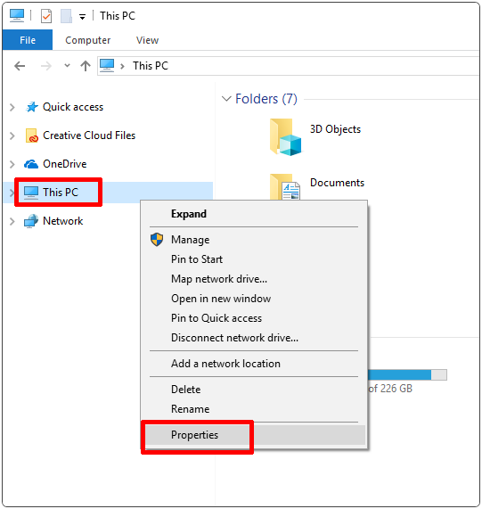

**View the system type:**

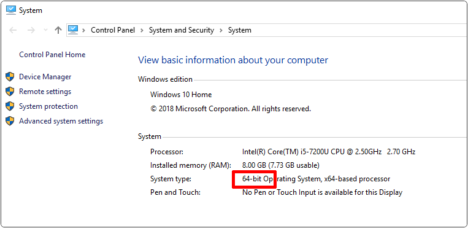

Open the link：[https://codewith.mu/en/download](https://codewith.mu/en/download) to download the corresponding Mu software version. 

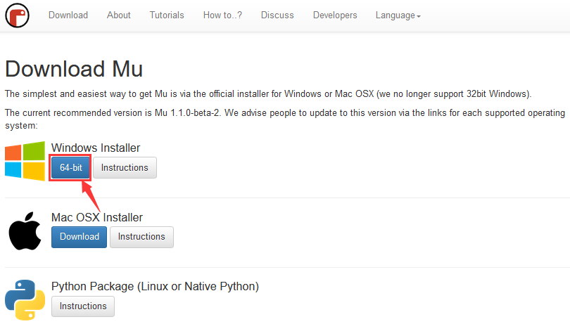

### Step 2-Run the installer

Locate the installer you just downloaded (it may be in your download folder) and double-click to open the installer file.

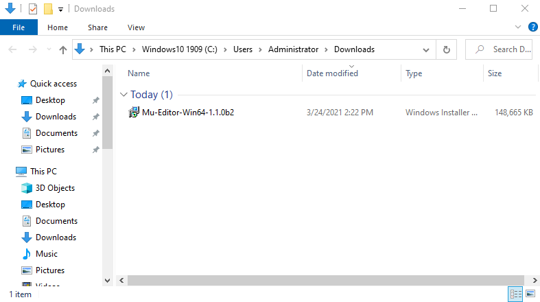

Download Link of Mac OSX System：[https://codewith.mu/en/howto/1.1/install_macos](https://codewith.mu/en/howto/1.1/install_macos)

**Windows 10 System** 

Tap“More info”

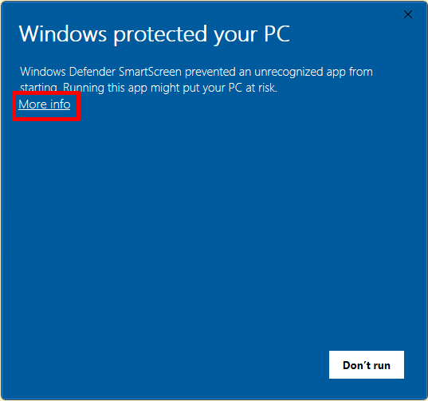

Enter“Run anyway”

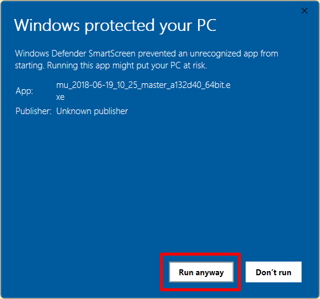

### Step 3-Protocol

Check the license, then click Install.


### Step 4-Installation

It will take a few seconds to install the Mu on your computer.

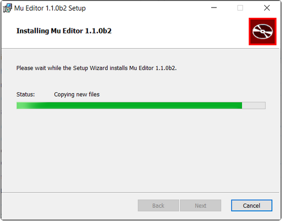

### Step 5-Finish

Tap Finish

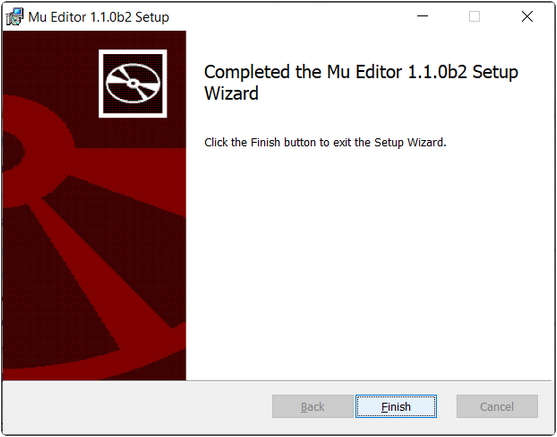

### Step 6-Start the Mu

You can launch Mu by clicking on the icon in the Start menu, or by typing Mu in the search box (both methods are shown below). 

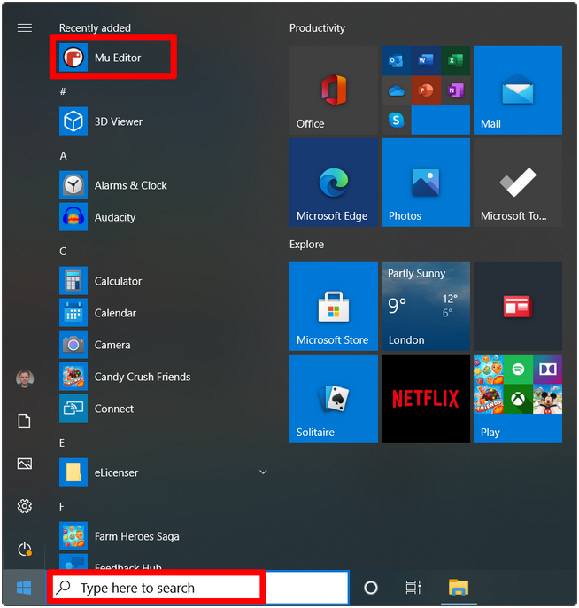

The main interface of Mu is shown below:

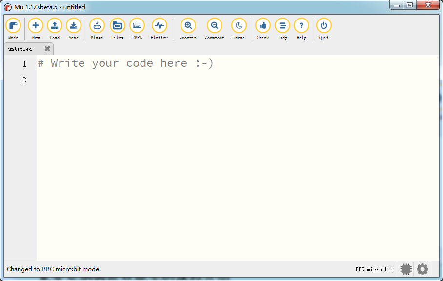

## 1.2 Install the Driver

First of all, connect the micro:bit to your computer using a USB cable，then double-click  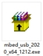to install.

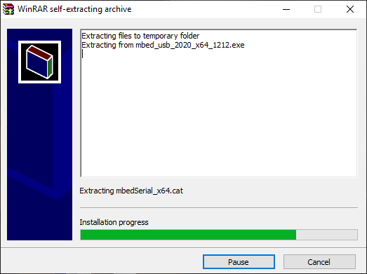

After downloading the driver, then click“Next”

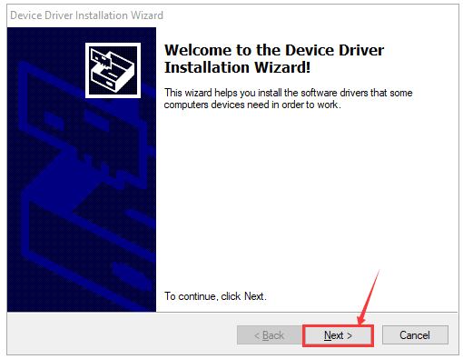

Click“Install”and “Finish”

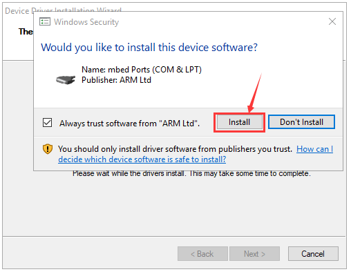

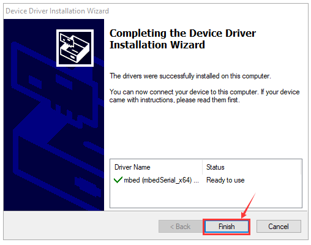

Then click“Computer”—>“Properties”—>“Device manager”, as shown below.

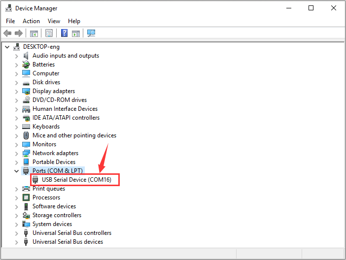

## 1.3 Compiler Setup and Toolbar Introduction

Set“mode”to micro bit first

Open the Mu software, click the Mode button in the menu bar and select "BBC micro: bit" , then tap "OK".

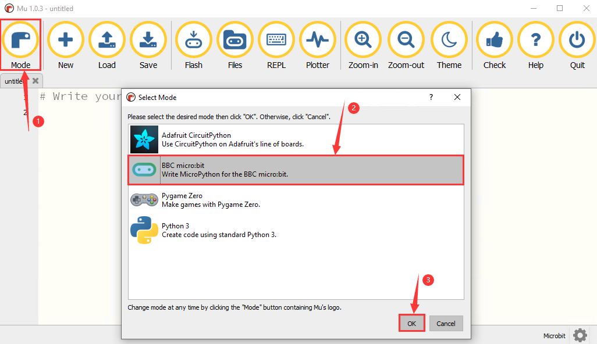

Details about the Mu operation page：[https://codewith.mu/en/tutorials/1.1/start](https://codewith.mu/en/tutorials/1.1/start)

More tutorials on using Mu：[https://codewith.mu/en/tutorials/](https://codewith.mu/en/tutorials/1.1/start)

## 1.4 Install the Library File

Before importing the library, you need to upload a.py code to microbit. Here we take the RGB module "code_1.py" in the tutorial as an example.

Import“keyes_MiniCar.py“file

The default directory for saving Mu is "Mu_code" file, which is located in the root of the user directory. 

Reference links:https://codewith.mu/en/tutorials/1.0/files

For example, in windows, if your system is installed on the C drive of your computer and the user name is Administrator, the path to the mu_code directory is C:\Users\Administrator\mu_ code. On Linux, the path is ~/home/mu_code.

**Enter the“mu_code”file**

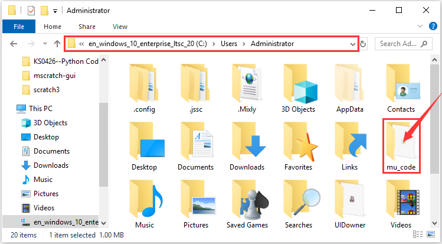

Replicate "keyes_MiniCar.py" library file to "mu_code" folder. The code path is as follows:

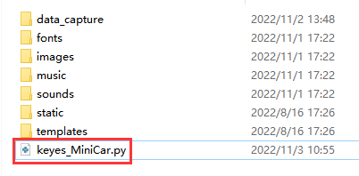

Open the Mu software and connect the micro:bit to your computer, then click the "Files" button and drag the "keyes_MiniCar.py" library file into the micro:bit.

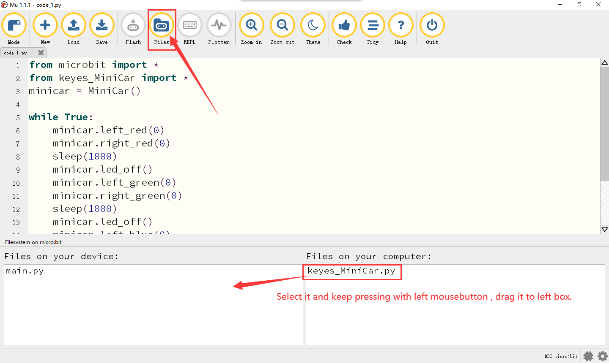

After the import is successful, you will see it in the left box.

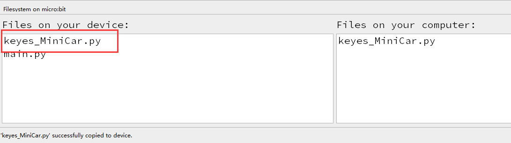

Tap “Check”to check the code for errors. If a line appears with a cursor or an underscore, there is an error in the program for that line.

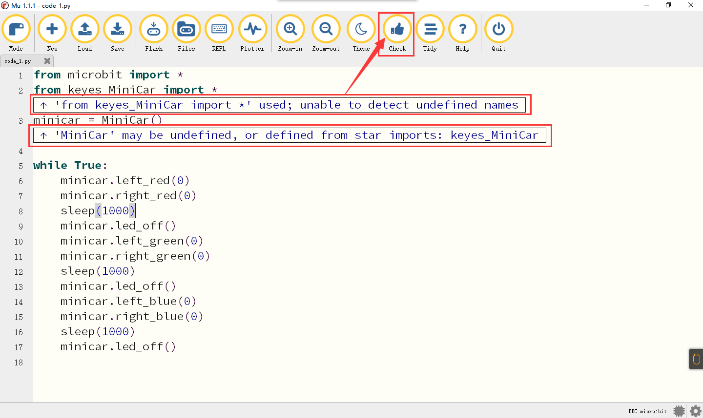

These tips are just warnings, not code error tips.

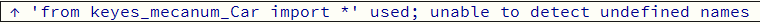

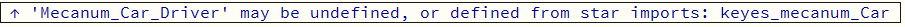

You also need to make sure that the micro USB cable is connected to the micro:bit and the computer, and then click the "Flash" button to download the code to the micro:bit.

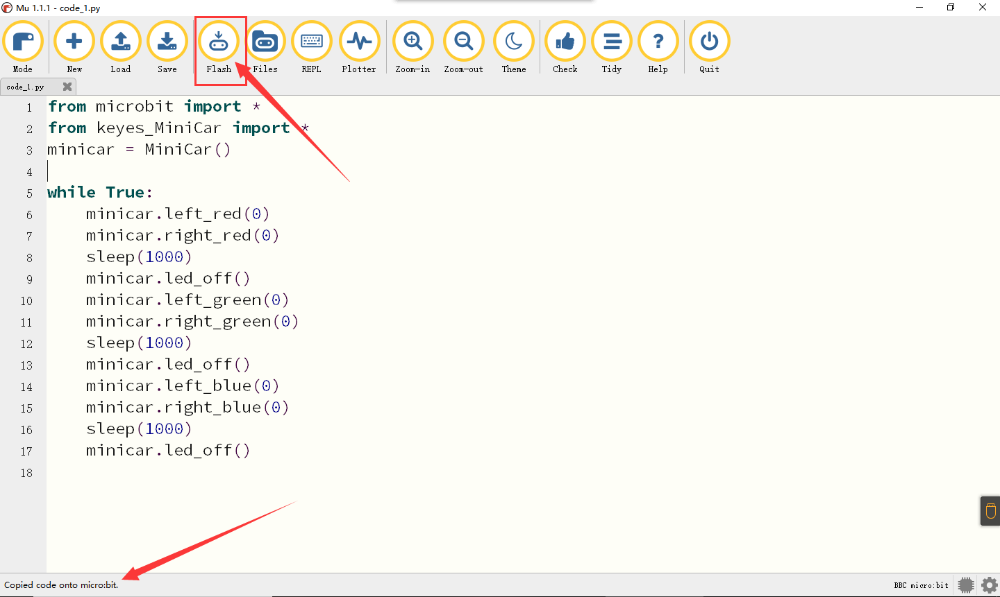

If there is an error after clicking the "Flash" button, please confirm whether you have imported the library file to micro:bit.

Note:

If you have downloaded other programs on the micro:bit board, except the "keyes_MiniCar.py" library file. Before programming in Micropython, you need to import the library file into the micro: bit. 

If you always use the same micro: bit board for Micropython programming, you do not need to send the it to the micro: bit again.

## 1.5 Add Code to Compiler

We take the first project of the basic tutorial "Heartbeat" as an example, open the "Program" folder in the first project folder and locate the file "microbit-Heartbeat.

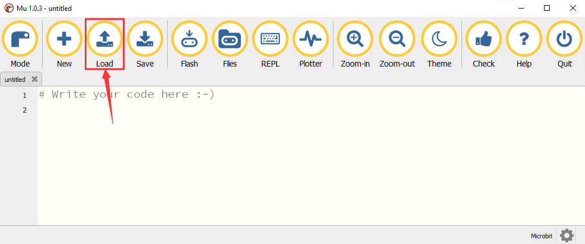

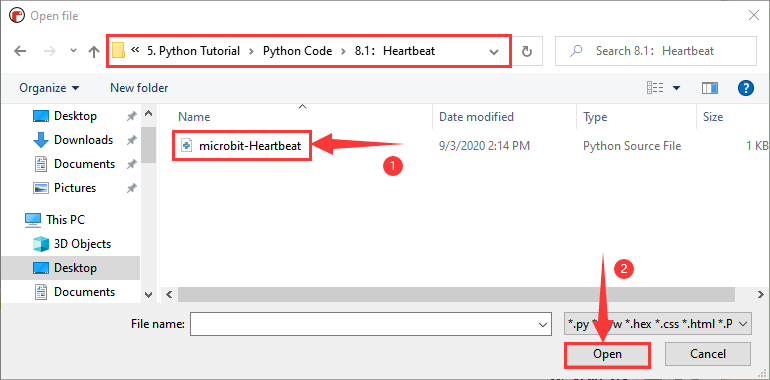

Or open the Mu software and tap“microbit-Heartbeat.py”file, then drag it to the Mu software:

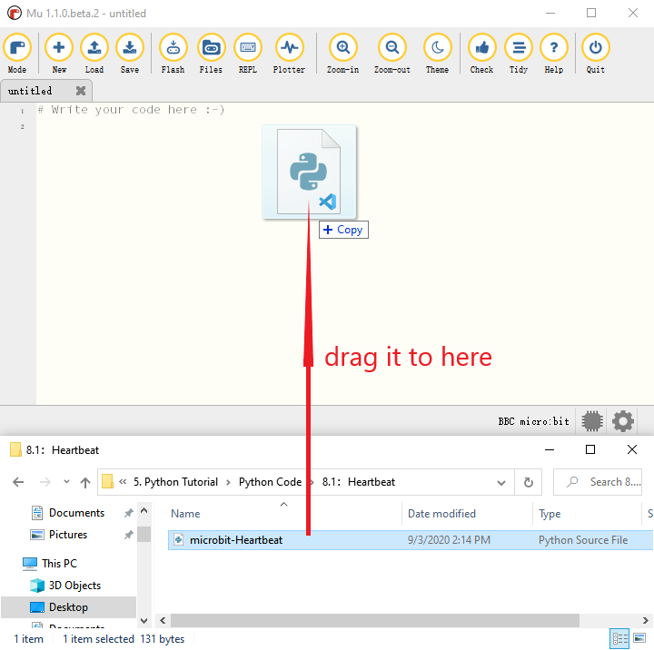

as shown below:

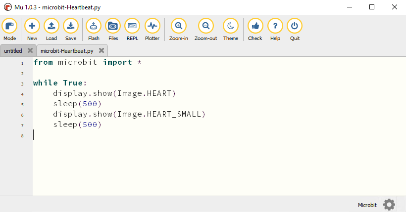

## 1.6 Download Code to Micro:bit

Connect the micro：bit board and the computer via the micro USB cable.

Tap “Flash” to download the code to micro：bit.

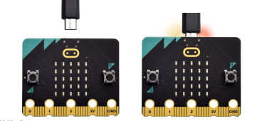

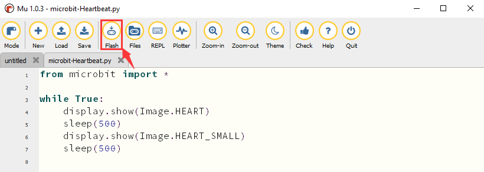

If there is an error in code, you can download the code to the micro: bit successfully, but it won't work. If sleep is sleeps, click "Flash" , and the code will also be downloaded to micro: bit.

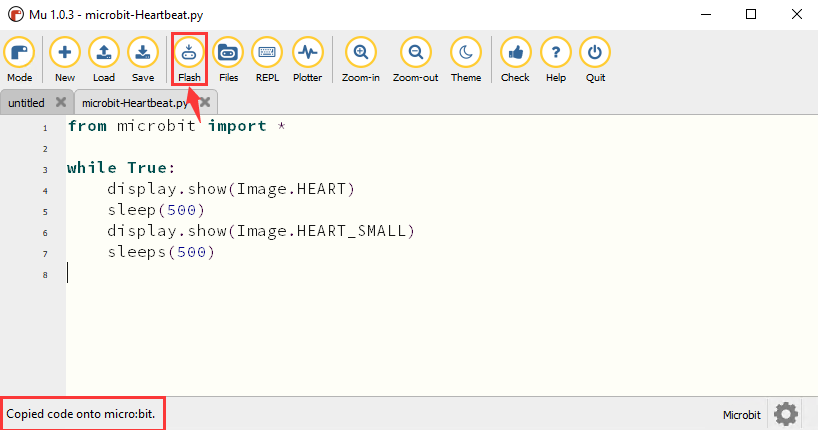

After downloading, if the led matrix prompts some error messages, tap the "REPL" button, then press the reset button of the micro: bit (not the A and B keys) and the error message will be displayed in the REPL box as follows:

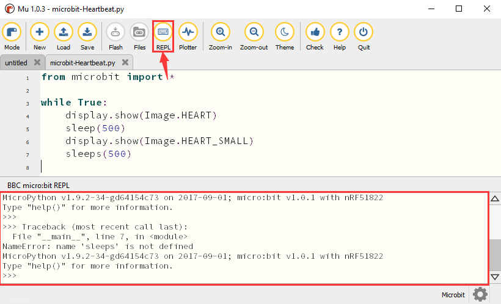

Click the“REPL”again, the REPL mode will be turned off, and you can refresh the new code. To make sure the code is correct, tap "Check" when you are done to check the code for errors, as shown below, then Mu will indicate the error in the code.

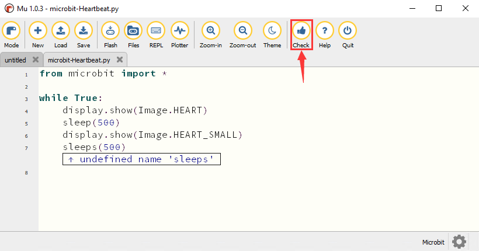

Correct the code according to the error prompt. Then click "Check" again and Mu shows no problem on the bar below:

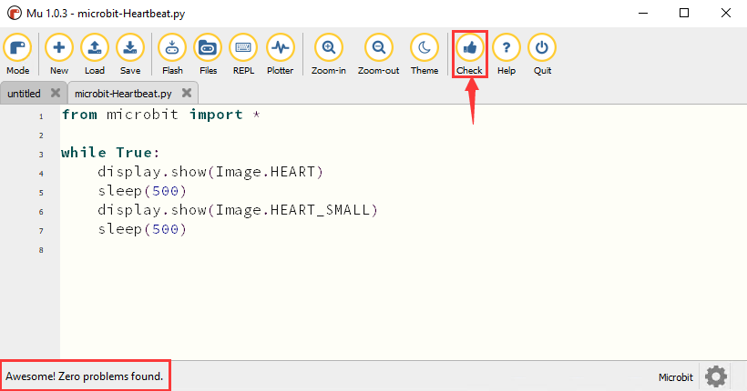

For more tutorials on using Mu, refer to the link：https://codewith.mu/en/tutorials/

# 2. Basic Projects

## 2.1 Heart Beat

### 2.1.1 Description

The sensor modules and LED dot matrix of the Microbit basic project comes with the micro: bit mainboard. 

Prepare a Micro:bit board and a USB cable. Next we will conduct a basic experiment that a heartbeat pattern flashes on the micro:bit board.

### 2.1.2 Components Needed

| 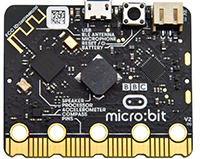 | 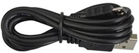 |
| :-------------------------------: | :---------------------: |
|           Micro:bit * 1           |      Micro:bit * 1      |

### 2.1.3 Test Code

You can upload the code directly from the tutorial (read the "Development Environment Configuration" file if in doubt).

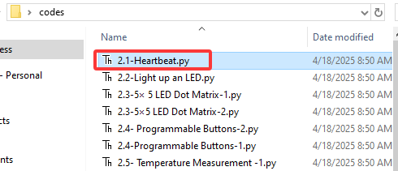

```python
from microbit import *
while True:
display.show(Image.HEART)
sleep(500)
display.show(Image.HEART_SMALL)
sleep(500)
```

### 2.1.4 Code Explanation

This is a permanent loop that make the micro: bit execute the code in the loop forever.

| code                            | Explanation                                                  |
| :------------------------------ | :----------------------------------------------------------- |
| from microbit import *          | Import the library file of micro：bit                        |
| while True:                     | This is a permanent loop that make the micro: bit execute the code in the loop forever. |
| display.show(Image.HEART)       | LED dot matrix displays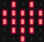 |
| sleep(500)                      | Delay in 500ms                                               |
| display.show(Image.HEART_SMALL) | LED dot matrix displays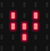 |

### 2.1.5 Test Result

Upload the code to the micro:bit and plug in it via a USB cable, then the LED dot matrix displaysand 

If download unsuccessfully, disconnect the micro:bit and reboot it

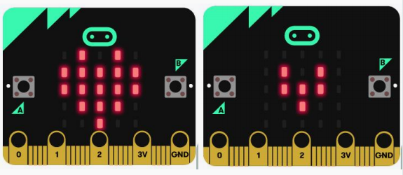

### 2.1.6 Expanded Knowledge

You can see that "Image.HEART" is equal to;Image.HEART_SMALL" is

equal toThis is actually written in microbit, you can directly use it. 

The following is a list of built-in images. If you are interested, you can replace "Image.HEART" in the function show () with one of the following images.

• Image.HEART

• Image.HEART_SMALL

• Image.HAPPY

• Image.SMILE

• Image.SAD

• Image.CONFUSED

• Image.ANGRY

• Image.ASLEEP

• Image.SURPRISED

• Image.SILLY

• Image.FABULOUS

• Image.MEH

• Image.YES

• Image.NO

• Image.CLOCK12, Image.CLOCK11, Image.CLOCK10, Image.CLOCK9, 

Image.CLOCK8, Image.CLOCK7, Image.CLOCK6, Image.CLOCK5, 

Image.CLOCK4, Image.CLOCK3, Image.CLOCK2,Image.CLOCK1

• Image.ARROW_N, Image.ARROW_NE, Image.ARROW_E, 

Image.ARROW_SE, Image.ARROW_S, Image.ARROW_SW, Image.ARROW_W, 

Image.ARROW_NW

• Image.TRIANGLE

Image.TRIANGLE_LEFT

• Image.CHESSBOARD

• Image.DIAMOND

• Image.DIAMOND_SMALL

• Image.SQUARE

• Image.SQUARE_SMALL

• Image.RABBIT

• Image.COW

• Image.MUSIC_CROTCHET

• Image.MUSIC_QUAVER

• Image.MUSIC_QUAVERS

• Image.PITCHFORK

• Image.PACMAN

• Image.TARGET

• Image.TSHIRT

• Image.ROLLERSKATE

• Image.DUCK

• Image.HOUSE

• Image.TORTOISE

• Image.BUTTERFLY

• Image.STICKFIGURE

Image.GHOST

• Image.SWORD

• Image.GIRAFFE

• Image.SKULL

• Image.UMBRELLA

• Image.SNAKE，Image.ALL_CLOCKS，Image.ALL_ARROWS

## 2.2 Light Up A Single LED

### 2.2.1 . Description

Micro:bit motherboard consists of 25 light-emitting diodes, 5 pcs in a group,  which correspond to x and y axis, forging a 5*5 matrix. Moreover, every diode locates at the point of x and y axis. 

Virtually, we could control an LED by setting coordinate points. For instance, set coordinate point（0，0）to turn on the LED at row 1 and column 1; light up LED at the row 1 and column 3, we could set （2，0) and so on.

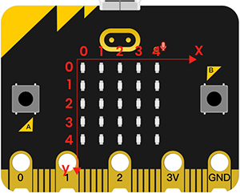

### 2.2.2 Components Needed

|  |  |
| :-------------------------------: | :---------------------: |
|           Micro:bit * 1           |      Micro:bit * 1      |

### 2.2.3 Test Code

You can upload the code directly from the tutorial (read the "Development Environment Configuration" file if in doubt).

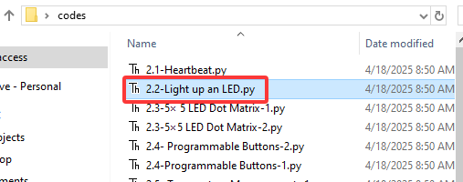

```python
from microbit import *
val1 = Image("09000:""00000:""00000:""00000:""00000:")
val2 = Image("00000:""00000:""00000:""00000:""00090:")
val3 = Image("00000:""00000:""00000:""00000:""00000:")

while True:
display.show(val1)
sleep(500)
display.show(val3)
sleep(500)
display.show(val2)
sleep(500)
display.show(val3)
sleep(500)
```

### 2.2.4 Code Explanation

| code                                                         | Explanation                                                  |
| ------------------------------------------------------------ | ------------------------------------------------------------ |
| from microbit import *                                       | Import the library file of micro：bit                        |
| val1 = Image("09000:""00000:""00000:""00000:""00000:")<br />val2 = Image("00000:""00000:""00000:""00000:""00090:")<br />val3 = Image("00000:""00000:""00000:""00000:""00000:") | Set pixel of LED on micro:bit to the value in 0~9<br />Pixel of each LED on micro:bit can be set in one of ten values<br />If set pixel to 0 (zero) ，which means in close state, literally, 0 is brightness, 9 is best brightness <br />Set Image() to val2<br />Set Image() to val3 |
| while True:                                                  | This is a permanent loop that makes micro:bit execute the code of it. |
| display.show(val1)<br/>sleep(500)<br/>display.show(val3)<br/>sleep(500) | LED at (1,0) blinks for 0.5s                                 |
| display.show(val2)<br/>sleep(500)<br/>display.show(val3)<br/>sleep(500) | LED at (3,4) flashes for 0.5s                                |

### 2.2.5 Test Result

After downloading code, plug in power with a USB cable, you will see the LED at(1,0) flashes for 0.5s then the LED at (3,4) blinks for 0.5s, in loop way.

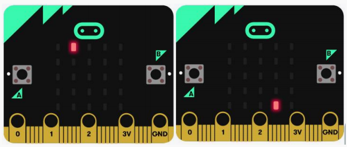

## 2.3 5 x 5 LED Dot Matrix

### 2.3.1 Description

Dot matrix gains popularity in our life, such as LED screen, bus station and the mini TV in the lift.

The dot matrix of Micro:bit board consists of 25 light emitting diodes. In previous lesson, we control LED of Micro:bit board to form patterns, numbers and character strings by setting the coordinate points. Moreover, we could adopt another way to complete the display of patterns, numbers and character strings.

### 2.3.2  Components Needed

|  |  |
| :-------------------------------: | :---------------------: |
|           Micro:bit * 1           |      Micro:bit * 1      |

### 2.3.3 Test Code

You can upload the code directly from the tutorial (read the "Development Environment Configuration" file if in doubt).

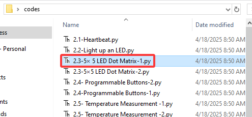

```python
from microbit import *
val = Image("00900:""00900:""90909:""09990:""00900")
display.show(val)
```

**Test Result：**Upload `2.3-5× 5 LED Dot Matrix-1.py` to micro:bit, then a downward arrow will appear.

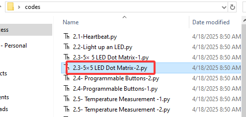

```python
from microbit import *
val = Image("00900:""00900:""90909:""09990:""00900")
display.show('1')
sleep(500)
display.show('2')
sleep(500)
display.show('3')
sleep(500)
display.show('4')
sleep(500)
display.show('5')
sleep(500)
display.show(val)
sleep(500)
display.scroll("hello!")
sleep(200)
display.show(Image.HEART)
sleep(500)
display.show(Image.ARROW_NE)
sleep(500)
display.show(Image.ARROW_SE)
sleep(500)
display.show(Image.ARROW_SW)
sleep(500)
display.show(Image.ARROW_NW)
sleep(500)
display.clear()
```


### 2.3.4 Code Explanation

| code                                                         | Explanation                                                  |
| ------------------------------------------------------------ | ------------------------------------------------------------ |
| from microbit import *                                       | import the library file of micro:bit                         |
| val =<br/>Image("09000:""00000:""00000:""0000<br/>0:""00000:") | Set Image() to variable val                                  |
| display.show(val)                                            | micro:bit shows“→”                                           |
| display.show('1')                                            | display.show('1')                                            |
| sleep(500)                                                   | sleep(500)                                                   |
| display.scroll("hello!")                                     | micro:bit scrolls to show“hello!”                            |
| display.show(Image.HEART)                                    | micro:bit displays“❤”                                        |
| display.show(Image.ARROW_NE)<br/>display.show(Image.ARROW_SE)<br/>display.show(Image.ARROW_SW)<br/>display.show(Image.ARROW_NW) | micro:bit shows“Northeast”arrow<br/>micro:bit displays“Southeast”arrow<br/>micro:bit shows“Southwest”arrow<br/>micro:bit displays“Northwest”<br/>arrow |
| display.clear()                                              | The LED dot matrix of micro:bit clears                       |

### 2.3.5 .Test Result

Download `2.3-5×5 LED Dot Matrix-2.py` to micro:bit, then the LED dot matrix will display“1”,“2”, 

“3”,“4”,“5”,“↓”,“hello!”,“❤”,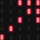,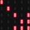,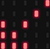,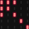patterns. Each interval is 500ms.

## 2.4 Programmable Buttons

### 2.4.1 Description

The button can control the on and off of the circuit, which is attached to the circuit. The circuit is disconnected when the button is not pressed. The circuit is connected as soon as it is pressed, but it is disconnected after being released. 

Both ends of button are like two mountains. There is a river in between. The internal metal piece connect the two sides to let the current pass, just like building a bridge to connect the two mountains.

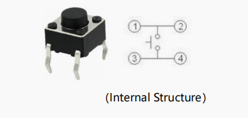

**Working Principle**：Before pressing the button, 1, 2 , 3 and 4 are switched on, but 1, 3 or 1, 4 or 2, 3 or 2, 4 is disconnected (blocked), which will be on when the button is pressed. 

Micro:bit board has three buttons, the reset button is on the back and two programmable buttons are on the front. Press A, B and AB at the same time respectively, and the corresponding screen displays them respectively.

### 2.4.2 Components Needed

|  |  |
| :-------------------------------: | :---------------------: |
|           Micro:bit * 1           |      Micro:bit * 1      |

### 2.4.3 Test Cod

You can upload the code directly from the tutorial (read the "Development Environment Configuration" file if in doubt). 

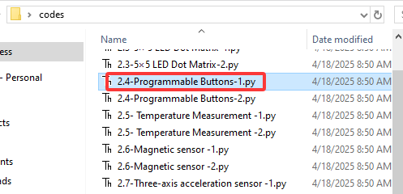

```python
from microbit import *
while True:
if button_a.is_pressed():
display.show("A")
elif button_a.is_pressed() and button_b.is_pressed():
display.scroll("AB")
elif button_b.is_pressed():
display.show("B")
```

**Test Result：**Upload `2.4-Programmable Buttons-1.py` and plug in micro:bit via USB cable, press“A” on Micro:bit board, character“A”will be displayed；in case that B is pressed，letter“B”will appear. “AB”will be displayed if you press A and B buttons simultaneously.

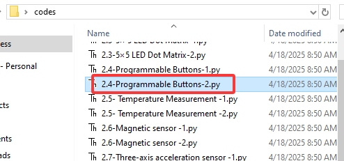

```python
from microbit import *
a = 0
b = 0
val1 = Image("00000:""00000:""00000:""00000:""00900")
val2 = Image("00000:""00000:""00000:""00900:""99999")
val3 = Image("00000:""00000:""00900:""99999:""99999")
val4 = Image("00000:""00900:""99999:""99999:""99999")
val5 = Image("00900:""99999:""99999:""99999:""99999")
val6 = Image("99999:""99999:""99999:""99999:""99999")
display.show(val1)
while True:
while button_a.is_pressed() == True:
sleep(10)
if button_a.is_pressed() == False:
a = a + 1
if(a >= 5):
a = 5
break
while button_b.is_pressed() == True:
sleep(10)
if button_b.is_pressed() == False:
a = a - 1
if(a <= 0):
a = 0
break
if a == 0:
display.show(val1)
if a == 1:
display.show(val2)
if a == 2:
display.show(val3)
if a == 3:
display.show(val4)
if a == 4:
display.show(val5)
if a == 5:
display.show(val6)
```

**Test Result：**Upload `2.4-Programmable Buttons-2.py` and plug in board via USB cable. Press button A, the number of rows lit by the LED dot matrix will increase, when B is pressed, the number of rows lit by the LED dot matrix will decrease.

### 2.4.4 Code Explanation

| code                                                         | Explamation                                                  |
| ------------------------------------------------------------ | ------------------------------------------------------------ |
| from microbit import *                                       | mport the library file of micro:bit                          |
| while True:                                                  | This is a permanent loop that makes micro:bit<br /> execute the code of it. |
| **if** button_a.is_pressed():<br/>display.show("A")<br/>**elif** button_a.is_pressed() **and**<br/>button_b.is_pressed():<br/>display.scroll("AB")<br/>**elif** button_b.is_pressed():<br/>display.show("B") | If button A is pressed<br/>micro:bit shows“A”<br/>If button A and B are pressed at<br/>same time<br/>micro:bit displays“AB”<br/>If button B is pressed<br/>micro:bit shows“B” |
| **while** button_a.is_pressed() == **True**:<br/>sleep(10)<br/>**if** button_a.is_pressed() == **False**:<br/>a = a + 1<br/>**if**(a >= 5):<br/>a = 5<br/>break<br/>**while** button_b.is_pressed() == **True**:<br/>sleep(10)<br/>**if** button_b.is_pressed() == **False**:<br/>a = a - 1<br/>**if**(a <= 0):<br/>a = 0<br/>break<br/>**if** a == 0:<br/>display.show(val1)<br/>**if** a == 1:<br/>display.show(val2)<br/>**if** a == 2:<br/>display.show(val3)<br/>**if** a == 3:<br/>display.show(val4)<br/>**if** a == 4:<br/>display.show(val5)<br/>**if** a == 5:<br/>display.show(val6) | When the button A is pressed<br/>Delay in 10ms to eliminate the<br/>shaking of button A<br/>when button A is released, <br/>Variable a adds 1<br/>If variable a≥5<br/>Variable a=5<br/>exit the loop<br/>when button B is pressed<br/>Delay in 10ms to eliminate the<br/>shaking of button B<br/>When the button B is released<br/>Variable a reduces 1 gradually<br/>When a≤0<br/>Variable a=0<br/>exit the loop<br/>When a=0<br/>micro:bit shows pattern val1<br/>When a=1<br/>micro:bit displays pattern val2<br/>When a=2<br/>micro:bit shows pattern val3<br/>If a=3<br/>micro:bit displays pattern val4<br/>If a=4<br/>micro:bit shows pattern val5<br/>If a=5<br/>micro:bit displays pattern val6 |


## 2.5 Temperature Measurement

### 2.5.1 Description

Micro:bit main board doesn’t come with temperature sensor actually, but detect temperature through built-in temperature of NFR51822 chip.  Thereby, the detected temperature is more close to chip’s temperature. In this project, we will use the sensor to test the temperature in the current environment, and display the test results in the display data (equipment),  then set the temperature range detected by the sensor in a way that controls the LED dot matrix to display different patterns.

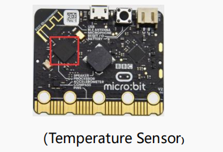

###  2.5.2 Components Needed

|  |  |
| :-------------------------------: | :---------------------: |
|           Micro:bit * 1           |      Micro:bit * 1      |

### 2.5.3 Test Code

You can upload the code directly from the tutorial (read the "Development Environment Configuration" file if in doubt). 

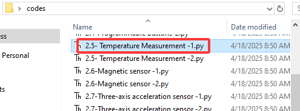

```python
from microbit import *
while True:
Temperature = temperature()
print("Temperature:", Temperature, "C")
sleep(500)
```

**Test Result：**After downloading test`2.5- Temperature Measurement -1.py` to micro:bit board, keep USB connected and click**“REPL”and press the reset button on micro:bit.** Then REPL window will show the ambient temperature value, as shown below:(C stands for temperature unit)

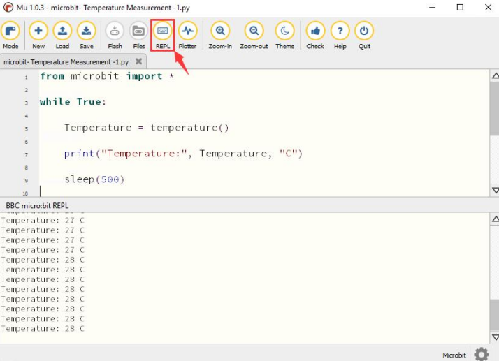

------

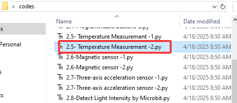

```python
from microbit import *
while True:
if temperature() >= 35:
display.show(Image.HEART)
else:
display.show(Image.HEART_SMALL)
```

**Test Result：**Upload the`2.5- Temperature Measurement -2.py` plug in micro:bit via USB cable, when the ambient temperature is less than 35℃, 5*5LED will show. When the temperature is equivalent to or greater than 35℃, the pattern  will appear.

### 2.5.4 Code Explanation

| code                                                         | Explanation                                                  |
| ------------------------------------------------------------ | ------------------------------------------------------------ |
| from microbit import *                                       | Import the library file of micro:bit                         |
| while True:                                                  | This is a permanent loop that<br/>makes micro:bit execute the code of it. |
| Temperature = temperature()                                  | Set temperature() to Temperature                             |
| print("Temperature:", Temperature, "C")                      | BBC micro:bit REPL prints<br/>temperature value              |
| sleep(500)                                                   | Delay in 500ms                                               |
| **if** temperature() >= 35:<br/>display.show(Image.HEART)<br/>**else**:<br/>display.show(Image.HEART_SMALL) | If temperature value ≥35℃ <br/>micro:bit shows“ ”<br/>If temperature value<35℃<br/>micro:bit displays“ ” |

## 2.6 Compass

### 2.6.1 Description

This project mainly introduces the use of the Micro:bit’s compass. It can be used to determine the direction. We need to calibrate the Micro:bit board when magnetic sensor works. The correct calibration method is to rotate the Micro:bit board.

<span style="color:red;">In addition, the objects nearby may affect the accuracy of readings and calibration.</span>

### 2.6.2 Components Needed

|  |  |
| :-------------------------------: | :---------------------: |
|           Micro:bit * 1           |      Micro:bit * 1      |

### 2.6.3 Test Code

You can upload the code directly from the tutorial (read the "Development Environment Configuration" file if in doubt). 

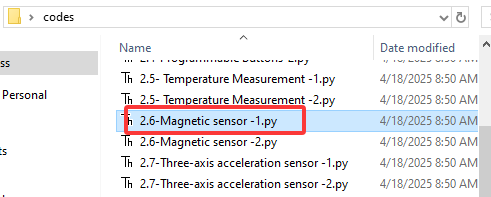

```python
from microbit import *
compass.calibrate()
while True:
if button_a.is_pressed():
display.scroll(compass.heading())
```

**Code Explanation：**We need to calibrate micro：bit due to different magnetic field in different areas. Micro:bit will prompt you to calibrate when you use it first time. 

Transfer `2.6-Magnetic sensor-1.py` to micro:bit, plug in micro:bit via USB cable and press button A. “TILT TO FILL SCREEN”appears on micro:bit. Then enter the calibration interface, the calibration method is to rotate the micro:bit board and display a full square pattern(25 LEDs are on), as shown in the following figure:

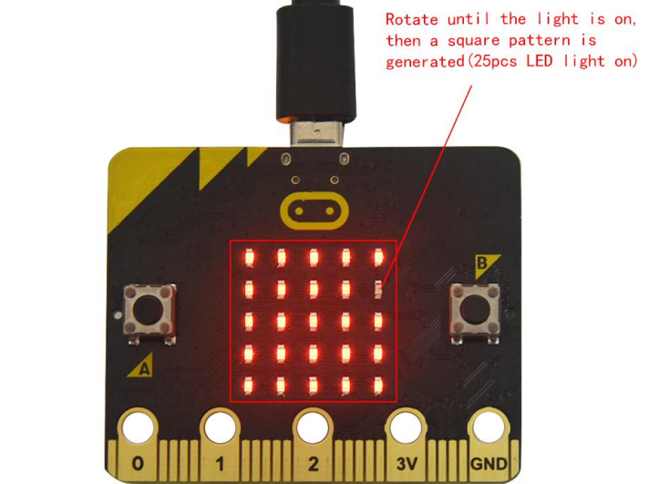

The calibration is finished until you view the smile pattern 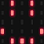. 

The serial monitor will show 0°, 90°, 180°and 270° when pressing A.

--------

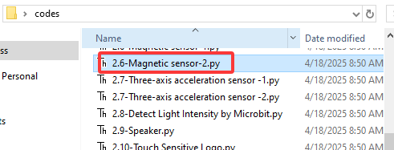

```python
from microbit import *
compass.calibrate()
x = 0
while True:
x = compass.heading()
if x >= 293 and x < 338:
display.show(Image("00999:""00099:""00909:""09000:""90000"))
elif x >= 23 and x < 68:
display.show(Image("99900:""99000:""90900:""00090:""00009"))
elif x >= 68 and x < 113:
display.show(Image("00900:""09000:""99999:""09000:""00900"))
elif x >= 113 and x < 158:
display.show(Image("00009:""00090:""90900:""99000:""99900"))
elif x >= 158 and x < 203:
display.show(Image("00900:""00900:""90909:""09990:""00900"))
elif x >= 203 and x < 248:
display.show(Image("90000:""09000:""00909:""00099:""00999"))
elif x >= 248 and x < 293:
display.show(Image("00900:""00090:""99999:""00090:""00900"))
else:
display.show(Image("00900:""09990:""90909:""00900:""00900"))
```

Make micro: bit board point to the north, south, east and west horizontally , LED dot matrix displays the corresponding direction patterns. 

As shown below, the arrow pointing to the upper right when the value ranges from 292.5 to 337.5. 0.5 can’t be input in the code, thereby, the values we get are 293 and 338.

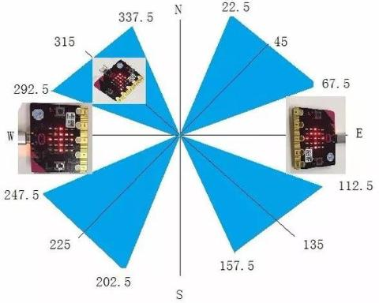

Upload `2.6-Magnetic sensor-2.py` onto micro:bit board and don’t plug off USB cable. After calibration, tilt Micro:bit board, the LED dot matrix displays the direction signs.

### 2.6.4 Code Explanation

| code                                                         | Explanation                                                  |
| ------------------------------------------------------------ | ------------------------------------------------------------ |
| from microbit import *                                       | Import the library file of micro:bit                         |
| compass.calibrate()                                          | Compass calibration                                          |
| while True:                                                  | This is a permanent loop, which makes<br/>micro:bit execute the code of i |
| **if** button_a.is_pressed():<br/>display.scroll(compass.heading()) | When the button A is pressed<br/>Micro:bit scrolls to show the value of<br/>compass |
| x = 0                                                        | Set variable x=0                                             |
| x = compass.heading()                                        | Set the value of compass to variable x                       |
| **if**...**elif**...**else**                                 | Set the value of compass to variable x                       |
| display.show(Image("00999:""0009<br/>9:""00909:""09000:""90000"))<br/>display.show(Image("99900:""9900<br/>0:""90900:""00090:""00009"))<br/>display.show(Image("00900:""0900<br/>0:""99999:""09000:""00900"))<br/>display.show(Image("00009:""0009<br/>0:""90900:""99000:""99900"))<br/>display.show(Image("00900:""0090<br/>0:""90909:""09990:""00900"))<br/>display.show(Image("90000:""0900<br/>0:""00909:""00099:""00999"))<br/>display.show(Image("00900:""0009<br/>0:""99999:""00090:""00900"))<br/>display.show(Image("00900:""0999<br/>0:""90909:""00900:""00900")) | Micro:bit shows the Northeast arrow sign<br/>Micro:bit shows the Northwest arrow sign<br/>Micro:bit shows the west arrow sign<br/>Micro:bit shows the Southwest arrow sign<br/>Micro:bit shows the Southeast arrow sign<br/>Micro:bit shows the South arrow sign<br/>Micro:bit shows the East arrow sign<br/>Micro:bit shows the North arrow sign |

## 2.7 Accelerometer

### 2.7.1 Description

The Micro:bit board has a built-in LSM303AGR acceleration sensor (accelerometer). It has a resolution of 8,10 and 12 bits, and the program sets the measuring range to 1g, 2g, 4g, and 8g. 

We often use the accelerometer to detect the attitude of machines. In this project, we will introduce the detection of several special postures by the accelerometer, then view the triaxial raw data output by the it.

### 2.7.2 Components Needed

|  |  |
| :-------------------------------: | :---------------------: |
|           Micro:bit * 1           |      Micro:bit * 1      |

### 2.7.3 Test Code

You can upload the code directly from the tutorial (read the "Development Environment Configuration" file if in doubt).

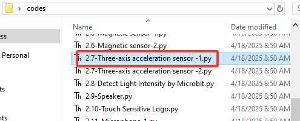

```python
from microbit import * while True:
gesture = accelerometer.current_gesture()
if gesture == "shake":
display.show("1")
if gesture == "up":
display.show("2")
if gesture == "down":
display.show("3")
if gesture == "face up":
display.show("4")
if gesture == "face down":
display.show("5")
if gesture == "left":
display.show("6")
if gesture == "right":
display.show("7")
if gesture == "freefall":
display.show("8")
```

**Test Result**：Download `2.7-Three-axis acceleration sensor-1.py` to micro:bit board and plug in power with USB cable, then shake the Micro:bit board, the number 1 appears.

When the logo is up, the number 2 is displayed:

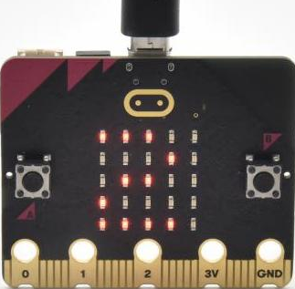

When the logo is down, the number 3 is displayed:

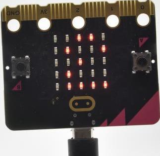

When the screen is up, the number 4 is shown.

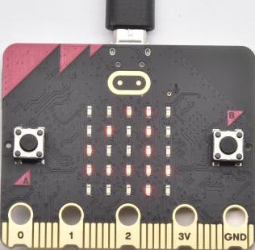

On the contrary, the number 5 is displayed when the screen is down.  When Micro:bit board is tilt to the left, number 6 is shown.

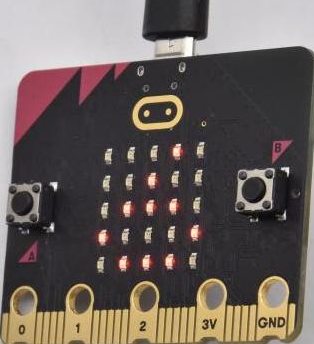

When Micro:bit board is inclined to the right, number 7 is displayed.

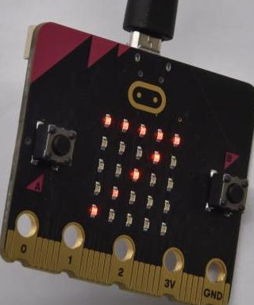

When it is free fall, number 8 will appear on dot matrix.（Note：we don’t recommend you to make it free fall, it will cause board damage)

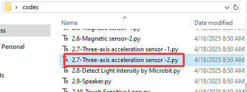

```python
from microbit import *
while True:
x = accelerometer.get_x()
y = accelerometer.get_y()
z = accelerometer.get_z()
print("x, y, z:", x, y, z)
sleep(100)
```

**Test Result**：Download `2.7-Three-axis acceleration sensor-2.py` to micro:bit board and plug in power with USB cable, click**“REPL”and press the reset button on micro:bit.** Then REPL window will show the breakdown of the micro: bit acceleration along the X, Y, and Z axes, as shown below:

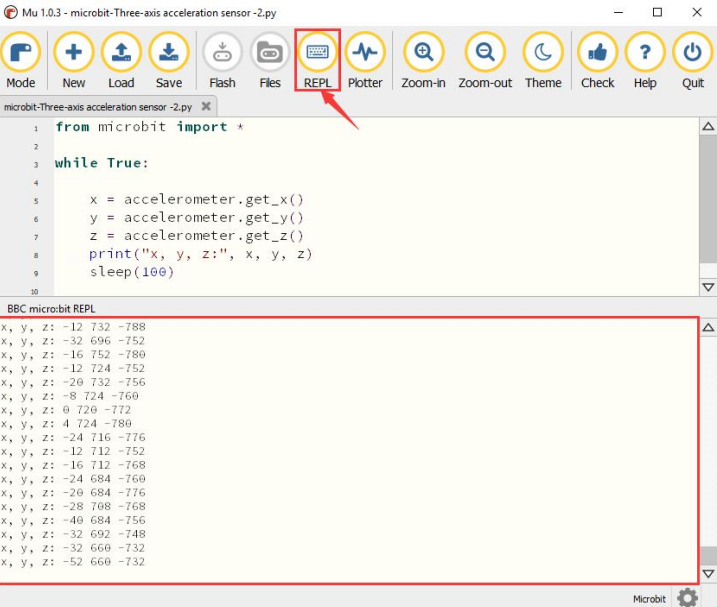

### 2.7.4 Code Explanation

| code                                                         | Explanation                                                  |
| ------------------------------------------------------------ | ------------------------------------------------------------ |
| from microbit import *                                       | Import the library file of micro:bit Set                     |
| gesture =<br/>accelerometer.current_gesture()                | Set accelerometer.current_gesture() to gesture               |
| while True:                                                  | This is a permanent loop that makes<br/>micro:bit execute the code of it. |
| **if** gesture == "shake":<br/>display.show("1")<br/>**if** gesture == "up":<br/>display.show("2")<br/>**if** gesture == "down":<br/>display.show("3")<br/>**if** gesture == "face up":<br/>display.show("4")<br/>**if** gesture == "face down":<br/>display.show("5")<br/>**if** gesture == "left":<br/>display.show("6")<br/>**if** gesture == "right":<br/>display.show("7")<br/>**if** gesture == "freefall":<br/>display.show("8") | Shaking micro:bit board, number 1<br/>will appear<br/>When log points to the North, <br/>number 2 will show up. <br/>When log points to the South, <br/>number 3 will be shown<br/>When the LED dot matrix is upward, <br/>the number 4 is shown. <br/>the number 5 is displayed when the<br/>LED dot matrix is downward. <br/>When Micro:bit board is tilt to the<br/>left, number 6 is shown. <br/>When micro:bit is tilt to the right<br/>When Micro:bit board is inclined to<br/>the right, number 7 is displayed.<br/>When it is free fall(accidentally<br/>making it fall), number 8 appears on<br/>dot matrix. |
| x = accelerometer.get_x()<br/>y = accelerometer.get_y()<br/>z = accelerometer.get_z() | Read the acceleration value on x axis，<br/>the return value is integer, and set x=<br/>the read value on x axis<br/>Read the acceleration value on y axis，<br/>the return value is integer, and set y=<br/>the read value on y axis<br/>Read the acceleration value on z axis，<br/>the return value is integer, and set z=<br/>the read value on z axis |
| print("x, y, z:", x, y, z)                                   | The value of acceleration will be shown                      |
| sleep(100)                                                   | sleep(100)                                                   |

## 2.8 Detect Light Intensity

### 2.8.1 Description

This project will introduce how Micro:bit detects the external light intensity. Since Micro:bit doesn’t come with a photosensitive sensor, the detection of light intensity is completed through the LED matrix. 

The LED matrix is used to sense the surrounding light and repeatedly converts the LED into input and samples the voltage decay time. The light intensity detected is a relative value.

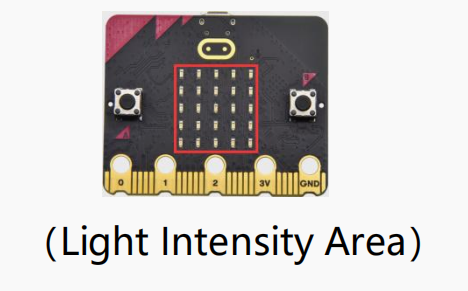

### 2.8.2 Components Needed

|  |  |
| :-------------------------------: | :---------------------: |
|           Micro:bit * 1           |      Micro:bit * 1      |

### 2.8.3 Test Code

You can upload the code directly from the tutorial (read the "Development Environment Configuration" file if in doubt). 

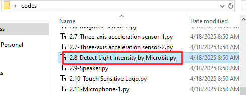

```python
from microbit import *
while True:
Lightintensity = display.read_light_level()
print("Light intensity:", Lightintensity)
sleep(100)
```

### 2.8.4 Code Explanation

| code                                        | Explanation                                                 |
| ------------------------------------------- | ----------------------------------------------------------- |
| from microbit import *                      | Import the library file of micro:bit                        |
| gesture = accelerometer.current_gesture()   | Set accelerometer.current_gesture() to gesture              |
| while True:                                 | This is permanent loop, and micro bit executes the code     |
| Lightintensity = display.read_light_level() | Set display.read_light_level() to Lightintensity            |
| print("Light intensity:", Lightintensity)   | BBC microbit REPL prints the detected light intensity value |
| sleep(100)                                  | Delay in 100ms                                              |

### 2.8.5 Test Result

Download code onto micro:bit board, don’t plug off USB cable. Click “REPL”and press the reset buttons, the light intensity value will be displayed, as shown below. 

Covering the LED dot matrix, the intensity value is 0; on the contrary, the intensity value increases when placing micro:bit board under the sun.

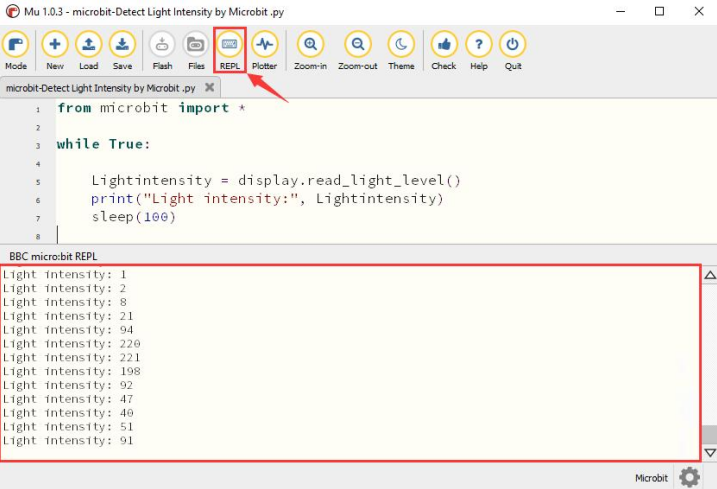

## 2.9 Speaker

### 2.9.1 Description

The micro:bit motherboard has a built-in speaker, which makes it very easy to add a sound to your project. The speaker can be programmed to emit a variety of tones, such as writing a song: Ode to Joy, and play it.

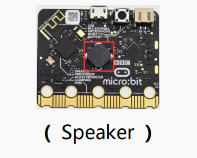

### 2.9.2 Components Needed

|  |  |
| :-------------------------------: | :---------------------: |
|           Micro:bit * 1           |      Micro:bit * 1      |

### 2.9.3 Test Code

You can upload the code directly from the tutorial (read the "Development Environment Configuration" file if in doubt).

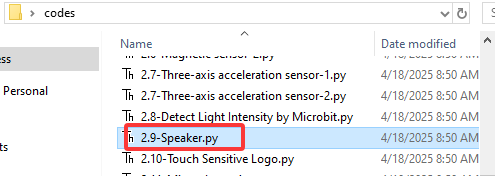

```python
from microbit import *
import audio
display.show(Image.MUSIC_QUAVER)
while True:
audio.play(Sound.GIGGLE)
sleep(1000)
audio.play(Sound.HAPPY)
sleep(1000)
audio.play(Sound.HELLO)
sleep(1000)
audio.play(Sound.YAWN)
sleep(1000)
```

### 2.9.4 Code Explanation

| code                     | Explanation                                             |
| ------------------------ | ------------------------------------------------------- |
| from microbit import *   | Import the library file of micro:bit                    |
| import audio             | audio library file                                      |
| while True:              | This is permanent loop, and micro bit executes the code |
| audio.play(Sound.GIGGLE) | Make a giggle sound                                     |
| sleep(1000)              | Delay in 1000ms                                         |

### 2.9.5 Test Result

Download code onto micro:bit board, don’t plug off USB cable, then the speaker will emit a sound and the LED dot matrix will display a music logo pattern.

## 2.10 Touch-sensitive Logo

### 2.10.1 Description

If you have a micro:bit mainboard, it makes sense to use a gold touch-sensitive logo as another input in your project, which is like an extra button. It uses a capacitive touch sensor that detects small changes in electric fields when you press (or touch) it with your finger. When you touch it, you can control the micro:bit board to perform certain functions.

### 2.10.2 Components Needed

|  |  |
| :-------------------------------: | :---------------------: |
|           Micro:bit * 1           |      Micro:bit * 1      |

### 2.10.3 Test Code

You can upload the code directly from the tutorial (read the "Development Environment Configuration" file if in doubt).

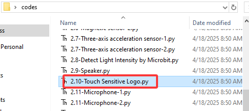

```python
from microbit import *
time = 0
start = 0
running = False
while True:
if button_a.was_pressed():
running = True
start = running_time()
if button_b.was_pressed():
if running:
time += running_time() - start
running = False
if pin_logo.is_touched():
if not running:
display.scroll(int(time/1000))
if running:
display.show(Image.HEART)
sleep(300)
display.show(Image.HEART_SMALL)
sleep(300)
else:
display.show(Image.ASLEEP)
```

### 2.10.4 Code Explanation

（1）Micro:bit records the time in ms (thousands of minutes per second) when it is started. This is called the running time. 

（2）When you press button A, a variable called start is set to the current running time. 

（3）When you press button B, the start time will be subtracted from the new running time to figure out how much time has passed since you started the stopwatch. This difference is added to the total time, which is stored in a variable called time. 

（4）If you press the gold LOGO icon, the program displays the total time elapsed on the LED display. It converts time from ms (thousandths of a second) to seconds by dividing by 1000. It uses the integer division operator to give the result of an integer. 

（5）The program also uses a Boolean variable named running to control the program. Boolean variables only boast two values :true or false. If running is true, the stopwatch is started. If running is false, the stopwatch is not started or stopped. 

（6）If running is true, the beating heart is displayed on the LED dot screen. 

（7）If the stopwatch has stopped, if "running" is false, it will only show the time when you press the gold LOGO icon. 

（8）If the stopwatch is already started, if "running" is true, the code also prevents false readings by ensuring that the time variable changes only when button B is pressed.

### 2.10.5 Test Result

Upload the code and plug in micro:bit via a USB cable. Press button A to start the stopwatch. When the timer is timed, the LED dot matrix displays a beating heart, tap button B can stop it. It will keep adding time, like a real stopwatch. 

Press the gold LOGO logo on the front of the micro:bit can display the measured time in seconds. To reset the time to zero, press the Reset button on the back of the micro:bit board.

## 2.11 Microphone

### 2.11.1 Description

The micro:bit motherboard boasts a built-in microphone, which can be used to measure the ambient sound level. When you clap, the LED indicator on the micro:bit motherboard will turn on. It can measure the intensity of sound. In this connection, you can make a sound level chart or disco lights that are in tune with the music.

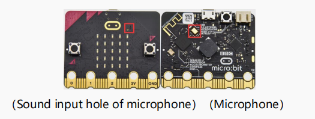

### 2.11.2 Components Needed

|  |  |
| :-------------------------------: | :---------------------: |
|           Micro:bit * 1           |      Micro:bit * 1      |

### 2.11.3 Test Code

You can upload the code directly from the tutorial (read the "Development Environment Configuration" file if in doubt).

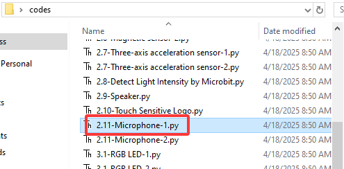

```python
from microbit import *
while True:
if microphone.current_event() == SoundEvent.LOUD:
display.show(Image.HEART)
sleep(200)
if microphone.current_event() == SoundEvent.QUIET:
display.show(Image.HEART_SMALL)
```

**Test Result:** Download `2.11-Microphone-1.py` to micro:bit board and keep the USB cable connected, when applauding, the LED dot matrix displays the ❤ pattern. When the outside world is quiet, it will display the pattern.

-----------

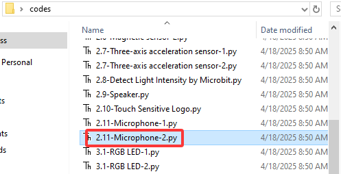

```python
from microbit import *
maxSound = 0
lights = Image("11111:"
"11111:"
"11111:"
"11111:"
"11111")
# ignore first sound level reading
soundLevel = microphone.sound_level()
sleep(200)
while True:
if button_a.is_pressed():
display.scroll(maxSound)
else:
soundLevel = microphone.sound_level()
display.show(lights * soundLevel)
if soundLevel > maxSound:
maxSound = soundLevel
```

**Test Result:** Download `2.11-Microphone-2.py` to micro:bit board and keep the USB cable connected. When you press the A button on the micro:bit motherboard, the LED dot matrix displays the detected maximum sound level value in the environment at this time (<span style="color:red;">Note: reset the maximum value by pressing the reset button on the back of the micro:bit</span>). When applauding, the louder the detected sound, the brighter the 25 LEDs.

### 2.11.4 Code Explanation

| code                                                         | Explanation                                                  |
| ------------------------------------------------------------ | ------------------------------------------------------------ |
| from microbit import *                                       | Import the library file of micro:bit                         |
| while True:                                                  | This is permanent loop, and micro bit executes the code      |
| **if** microphone.current_event() == SoundEvent.LOUD:<br/>display.show(Image.HEART)<br/>sleep(200)<br/>**if** microphone.current_event() == SoundEvent.QUIET:<br/>display.show(Image.HEART_SMALL) | If the microphone detects the sound, LED dot matrix displays ❤<br/>Delay in 200ms If it detects the outside world is quiet,<br/> LED dot matrix displays |
| print("Light intensity:", Lightintensity)                    | BBC microbit REPL window prints the value of the light brightness detected by the light sensor |
| maxSound = 0                                                 | maxSound has an initial value of 0                           |
| lights =Image("11111:""11111:""11111:"" 11111:""11111")      | Set Image() to variable lights                               |
| soundLevel = microphone.sound_level()<br/>**if** button_a.is_pressed():<br/>display.scroll(maxSound)<br/>**else:**<br/>soundLevel = microphone.sound_level()<br/>display.show(lights * soundLevel) | Set microphone.sound_level() to variable soundLevel<br/>If button A is pressed, LED dot matrix<br/>displays the value of the sound level. <br/>Otherwise, Set microphone.sound_level() to<br/>variable soundLevel<br/>The 25 LEDs are like breathing lights as<br/>the sound level changes |

## 2.12 Bluetooth Wireless Communication

### 2.12.1 Description

Although the micro:bit enjoys a low-power Bluetooth module that can make Bluetooth connections and send data, it only boasts 16k RAM. The BLE stack takes up 12k RAM, which means there is not enough space to run microPython, thus only one microPython or Bluetooth service can be running at a time.

https://microbit-micropython.readthedocs.io/en/latest/ble.html

The above projects uses the built-in modules of micro: bit and LED dot matrix, however, the following are all extended experiments between the sensor modules on the micro:bit and smart car such as an IR remote control (microPython is not currently supported), an ultrasonic, a servo, WS2812 RGB lights and seven-color lights.

<span style="color:red;">（Note：Disconnect the USB cable from the micro:bit and turn off the power on the bottom board (flip the POWER switch to the OFF end) before installing the micro:bit on the expansion board so as to prevent burning out the micro:bit board. Similarly, do the same before removing the micro: bit from the expansion board.)</span>


# 3. Robot Car Project

## 3.1 RGB Module

### 3.1.1  Description

The RGB color mode is a color standard in the industry. It obtains various colors by changing the three color channels of red (R), green (G), and blue (B) and integrating them. RGB denotes the three colors of red, green and blue.

The monitors mostly adopt the RGB color standard, and all the colors on the computer screen are composed of the three colors of red, green and blue mixed in different proportions. A group of red, green and blue is the smallest display unit. Any color on the screen can be recorded and expressed by a set of RGB values.

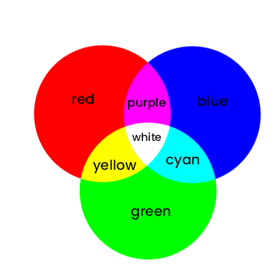

RGB color mixing is like having red, green and blue lamps. When their light is superimposed on each other, the colors are mixed, while the brightness is equal to the sum of the brightness of the three lamps. The more mixed, the higher the brightness, therefore, it is often called seven-color LED.

| Color  | RGB value（R,G,B） | Color    | RGB value（R,G,B） |
| ------ | ------------------ | -------- | ------------------ |
| Black  | 255,255,255        | Red      | 0,255,255          |
| Green  | 255,0,255          | Blue     | 255,255,0          |
| Cyan   | 255,0,0            | Dark red | 0,255,0            |
| Yellow | 0,0,255            | White    | 0,0,0              |
| ...... | .......            | ......   | ......             |

<span style="color:red;">Since our LED lights are common anode, 255 is the lowest value and 0 is the brightest value.</span>

In this project, we are going to make two experiments. One is to make two RGB lights light up three colors of red, green and blue, the other is to make two RGB lights gradually display different colors.

### 3.1.2 Preparation

（1）Insert the micro: bit correctly into the expansion board

（2）Connect the battery holder to the expansion board

（3）Turn on the power switch（<span style="color:red;">Slide the POWER switch to ON end</span>） 

（4）Connect the micro：bit and computer via a micro USB cable

（5）Open the MU IDE 

If you want to add the Mini car extension library(you can refer to the "1.4 Install the Library File "file).

### 3.1.3 Schematic Diagram


**Working Principle:** Microbit, as the host, sends instructions to the slave STC8G1K08 through the IIC, then the slave outputs PWM to control RGB LED lights. This greatly saves the IO ports of the microbit board, for the IIC enables to control two motors and two RGB LED lights.

### 3.1.4 Code Explanation

Functions of RGB LEDs in Keyes_MiniCar.py file:

Left.red(0-255): Set the left RGB to red，0 is the brightest and 255 is the darkest.

Left.green（0-255): Set the left RGB to green，0 is the brightest and 255 is the darkest.

Left.blue（0-255）: Set the left RGB to blue，0 is the brightest and 255 is the darkest.

right.red（0-255）: Set the right RGB to red，0 is the brightest and 255 is the darkest.

right.green（0-255）: Set the right RGB to green，0 is the brightest and 255 is the darkest.

right.blue（0-255）: Set the right RGB to blue，0 is the brightest and 255 is the darkest.

### 3.1.5 Test Code

You can upload the `3.1-RGB LED-1.py` file directly from the tutorial (read the "Development Environment Configuration" file if in doubt).

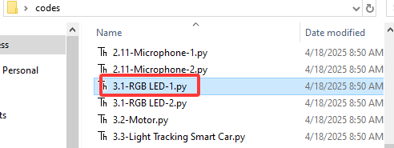

```python
from microbit import *
from keyes_MiniCar import *
minicar = MiniCar()

while True:
    minicar.left_red(0)
    minicar.right_red(0)
    sleep(1000)
    minicar.led_off()
    minicar.left_green(0)
    minicar.right_green(0)
    sleep(1000)
    minicar.led_off()
    minicar.left_blue(0)
    minicar.right_blue(0)
    sleep(1000)
    minicar.led_off()
```

**Test Result:** After uploading the code, the RGB LED will switch every second in the order of red, green and blue.

-------

Import the `3.1-RGB LED-2.py`file

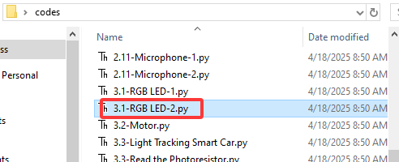

```python
from microbit import *
from keyes_MiniCar import *
minicar = MiniCar()

while True:
    for num in range(0 , 255):  		#It is a loop statement, the range is 0 to 255
        num += 1					#It is equal to num = num + 1 
        minicar.left_red(255 - num)
        minicar.right_red(255 - num)
        sleep(10)
        
    for num in range(0 , 255):
        num += 1
        minicar.left_green(255 - num)
        minicar.right_green(255 - num)
        sleep(10)
        
    for num in range(0 , 255):
        num += 1
        minicar.left_red(num)
        minicar.right_red(num)
        sleep(10)
        
    for num in range(0 , 255):
        num += 1
        minicar.left_blue(255 - num)
        minicar.right_blue(255 - num)
        sleep(10)
    
    for num in range(0 , 255):
        num += 1
        minicar.left_red(255 - num)
        minicar.right_red(255 - num)
        sleep(10)
    
    for num in range(0 , 255):
        num += 1
        minicar.left_green(num)
        minicar.right_green(num)
        sleep(10)
        
    for num in range(0 , 255):
        num += 1
        minicar.left_red(num)
        minicar.right_red(num)
        sleep(10)
    
    for num in range(0 , 255):
        num += 1
        minicar.left_blue(num)
        minicar.right_blue(num)
        sleep(10)
```

**Test Result:** After uploading the code, the RGB LED will be red, and then green, then a mixture of red and green will appear. When the red light is off, the blue light will be on, then a mixture of blue and green will be displayed. 

However, when the green light is off, the red light will be on, then a mixture of blue and red will be shown. In closing the red and blue lights will be off.

### 3.1.6 Expanded Knowledge

1s = 1000ms ； 1ms = 1000us ；1us = 1000nm

Then the 1000 ms we used in the project is 1 s

Maybe you are capable of configuring the light color you want by yourself. You solely need to configure the red, green and blue PWM for the RGB.

## 3.2 Motor Driving

### 3.2.1 Description

The robot car is equipped with two DC geared motors, which are developed on the ordinary DC motors. It enjoys a matching gear reduction box, which provides a lower speed but a larger torque. Furthermore, different reduction ratios of the box can provide different speeds and torques.

The reduction motor is the integration of gearmotor and motor, which is applied widely in steel and machine industry.

Moreover, the car boasts a STC8G1K08 and a HR8833MTE chip. To save the IO ports, we send instructions to the STC8G1K08 chip through the IIC of the micro:bit, then the STC8G1K08 chip controls the HR8833MTE chip according to the corresponding instructions to control the rotation direction and speed of the two DC reduction motors (the control process is as follows).

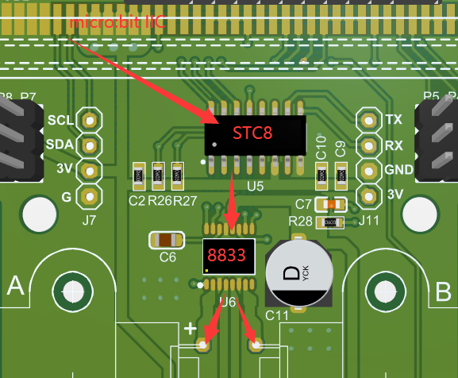

### 3.2.2 Preparation

（1）Insert the micro: bit correctly into the expansion board

（2）Connect the battery holder to the expansion board

（3）Turn on the power switch（<span style="color:red;">Slide the POWER switch to ON end</span>） 

（4）Connect the micro：bit and computer via a micro USB cable

（5）Open the MU IDE 

If you want to add the Mini car extension library(you can refer to the "1.4 Install the Library File "file).

### 3.2.3 Circuit Diagram


### 3.2.4 Code Explanation

Functions in Keyes_MiniCar.py file：

Motor_L(1, 70): The left wheels will advance with a speed of PWM70

Motor_L(0, 70): The left wheels will move back with a speed of PWM70

Motor_R(1, 70): The right wheels will advance with a speed of PWM70

Motor_R(0, 70): The right wheels will move back with a speed of PWM70

Motor_stop(): The car will stop

### 3.2.5 Test Code

You can upload the `3.2-Motor.py` code directly from the tutorial (read the "Development Environment Configuration" file if in doubt). 

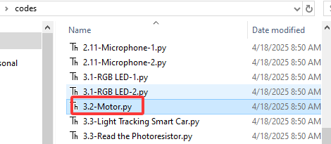

```python
from microbit import *
from keyes_MiniCar import *
minicar = MiniCar()

while True:
    #Forward
    minicar.Motor_L(0, 70)
    minicar.Motor_R(1, 70)
    sleep(1000)
    #back
    minicar.Motor_L(1, 70)
    minicar.Motor_R(0, 70)
    sleep(1000)
    #turn left
    minicar.Motor_L(1, 70)
    minicar.Motor_R(1, 70)
    sleep(1000)
    #turn right
    minicar.Motor_L(0, 70)
    minicar.Motor_R(0, 70)
    sleep(1000)
    #stop
    minicar.Motor_stop()
    sleep(1000)
```

### 3.2.6 Test Result

Upload the code to the micro:bit board, then turn on the switch at the back of the car, then the car will go forward for 1s, backward for 1s, turn left for 1s, turn right for 1s and stop for 1s.

### 3.2.7 Expanded Knowledge

**How to make the motor turn left?**

①Set the A motor to backward, the B motor to forward, which is a left turn at the center of the distance between the two wheels.

②Set the A motor to stop, the B motor to forward, which is a left turn at the center of the left motor.

③Set the AB motors to forward, then set the speed of the motor on the left to be smaller than that on the right. In this way, the car will move to the left when moving forward due to the speed difference, and the greater the speed difference, the greater the deviation.

④Set the AB motors to backward, then set the speed of the motor on the left to be greater than that on the right. In this way, the car will move to the left when moving backward due to the speed difference, and the greater the speed difference, the greater the deviation.

<span style="color:red;">The principle of making the car turn right is the same, you only need to switch the motor.</span>

## 3.3 Light Tracking Smart Car

### 3.3.1 Description

Do you find that the street lights outside will light up when it gets dark and  goes off at dawn? Next, we will learn the main component that causes this circumstance, which is "photoresistor".

**Working Principle**: It is a resistor made by the photoelectric effect of a semiconductor, which is very sensitive to ambient light, thus its resistance value will vary with different light intensity.

We seek to use this feature to design a circuit and generate a photoresistor module. The signal end of the module is connected to the analog port of the microcontroller. 

When the light intensity increases, the resistance decreases, and the voltage of the analog port rises, that is, the analog value of the microcontroller goes up. Otherwise, when the light intensity decreases, the resistance increases, and the voltage of the analog port declines, that is, the analog value of the microcontroller becomes smaller. Therefore, we can use the photoresistor to read the corresponding analog value and sense the light intensity in the environment.

It is commonly applied to light measurement, control and conversion, light control circuit as well.

In this project, we will use the left and right photoresistors to control the car to find the light source.

### 3.3.2 Preparation

（1）Insert the micro: bit correctly into the expansion board

（2）Connect the battery holder to the expansion board

（3）Turn on the power switch（<span style="color:red;">Slide the POWER switch to ON end</span>） 

（4）Connect the micro：bit and computer via a micro USB cable

（5）Open the MU IDE 

If you want to add the Mini car extension library(you can refer to the "1.4 Install the Library File "file).

### 3.3.3 Circuit Diagram

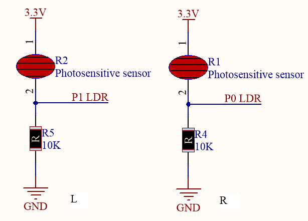

### 3.3.4 Read the Photoresistor

You can upload the code `3.3-Light Tracking Smart Car.py` directly from the tutorial (read the "Development Environment Configuration" file if in doubt). 

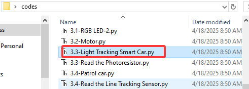

```python
from microbit import *

while True:
    LDR_L = pin1.read_analog()  #Read the analog of P1and set it to LDR_L 
    LDR_R = pin0.read_analog()
    print("LDR_L:", LDR_L)     #Print the value of LDR_L
    print("LDR_R:", LDR_R)
    sleep(1000)
```

**Test Result:** Download code 1 onto micro:bit board, don’t plug off USB cable. Click“REPL”and press the reset button, then the BBC microbit REPL window displays the ambient light intensity detected by the photoresistor on the expansion board. As the external light intensity and gradually decreases, the analog value gradually decreases. On the contrary, the analog value is gradually increasing.

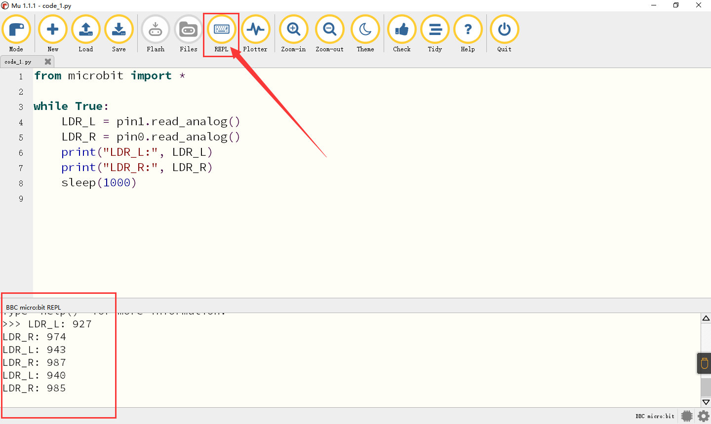

### 3.3.6 Flow Chart

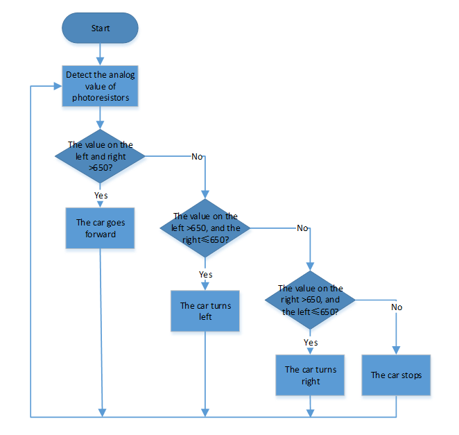

### 3.3.7 Light Tracking Smart Car

You can upload the code `3.3-Read the Photoresistor.py` directly from the tutorial (read the "Development Environment Configuration" file if in doubt). 

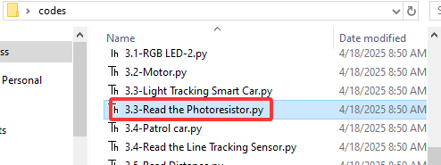

```python
from microbit import *
from keyes_MiniCar import *     #Load the library file of keyes_MiniCar
minicar = MiniCar()             #Instantiate an object MiniCar()as minicar

while True:
    LDR_L = pin1.read_analog()   #Read the value of the photoresistor
    LDR_R = pin0.read_analog()
    if LDR_L > 650 and LDR_R > 650:   #Judge if brightness of both sides＞650
        minicar.Motor_L(1, 70)			#It is a code of advance
        minicar.Motor_R(1, 70)
    elif LDR_L > 650 and LDR_R <= 650: #Judge if the left brightness＞650，right≤650
        minicar.Motor_L(0, 70)			#Left turn code
        minicar.Motor_R(1, 70)
    elif LDR_L <= 650 and LDR_R > 650: #Judge if the left side of the car≤650，right＞650
        minicar.Motor_L(1, 70) 			#The car turns right
        minicar.Motor_R(0, 70)
    else:
        minicar.Motor_stop()           #The car stops
```

### 3.3.8 Test Result

After uploading the code, turn on the switch on the rear of the car, then you can use the flashlight to play with the car. It’s best used in a relatively dark environment. When the ambient light intensity is above 650, the car will keep moving.

## 3.4 Line Tracking Smart Car

### 3.4.1 Description

The car comes with two line tracking sensors and two potentiometers.

Besides, it adopts a TCRT5000 IR tube, which contains an IR emitting tube and an IR receiving tube. When the infrared signals of the emitting tube is received by the receiving tube through reflection, the resistance of the receiving tube will change, which is generally reflected in the voltage change on the circuit. 

The resistance varies depending on the intensity of the infrared signals received by the receiving tube, which is often in the color of the reflecting surface and its distance of the receiving tube. At the time of detection, black is high level active and white is low level active. 

**Working Principle:** When the car runs above a white road, the IR emitting tube installed under the car emits infrared signals to detect the road and the receiving tube will receive signals sending back. Then the output end outputs low level(0). When it detects black lines, it outputs high level(1).

 Send the detected signal to the I/O port of the microcontroller. When it is high level (1), then the car is on the black line. Similarly, when it is low level (0), then the car is on the white ground.

<span style="color:red;">The two line tracking sensors on the expansion board are controlled by P12 and P13 of the micro bit control board, the left one is controlled by P13, and the right is controlled by P12. Adjust the line tracking sensors, and place the car on a black ground, twist the potentiometers until the LED (D3,D2) is on, then adjust them until it is off.</span>

### 3.4.2 Preparation

（1）Insert the micro: bit correctly into the expansion board

（2）Connect the battery holder to the expansion board

（3）Turn on the power switch（<span style="color:red;">Slide the POWER switch to ON end</span>） 

（4）Connect the micro：bit and computer via a micro USB cable

（5）Open the MU IDE 

If you want to add the Mini car extension library(you can refer to the "1.4 Install the Library File "file).

### 3.4.3 Circuit Diagram

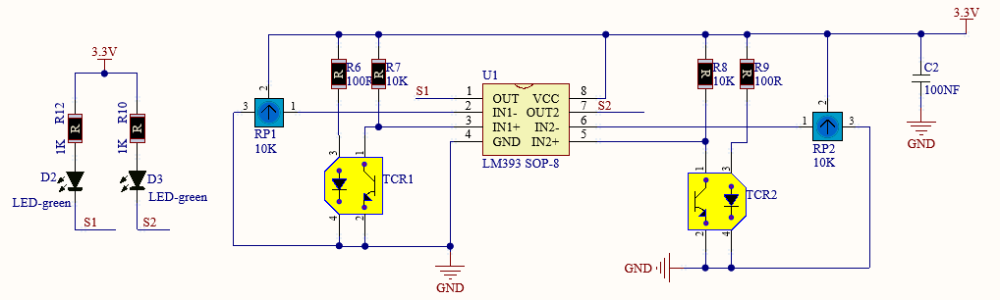

### 3.4.4 Read the Line Tracking Sensor

You can upload the code `3.4-Patrol car.py` directly from the tutorial (read the "Development Environment Configuration" file if in doubt). 

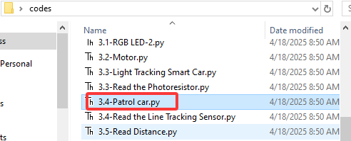

```python
from microbit import *
pin12.set_pull(pin12.PULL_UP)
pin13.set_pull(pin13.PULL_UP)
sensor_L = 0
sensor_R = 0

while True:
    sensor_L = pin13.read_digital()
    sensor_R = pin12.read_digital()
    print("sensor_L:", sensor_L)
    print("sensor_R:", sensor_R)
    sleep(1000)
```

**Test Result:** Download code onto micro:bit board, don’t plug off USB cable. Click“REPL”and press the reset button, the readings detected by the  line tracking sensor will be displayed on monitor.

When the line tracking sensor detects white object, 0 will be shown and D2, D3 will be on; when no white objects and only black object are detected, 1 will be displayed and D2, D3 will be off, as shown below.

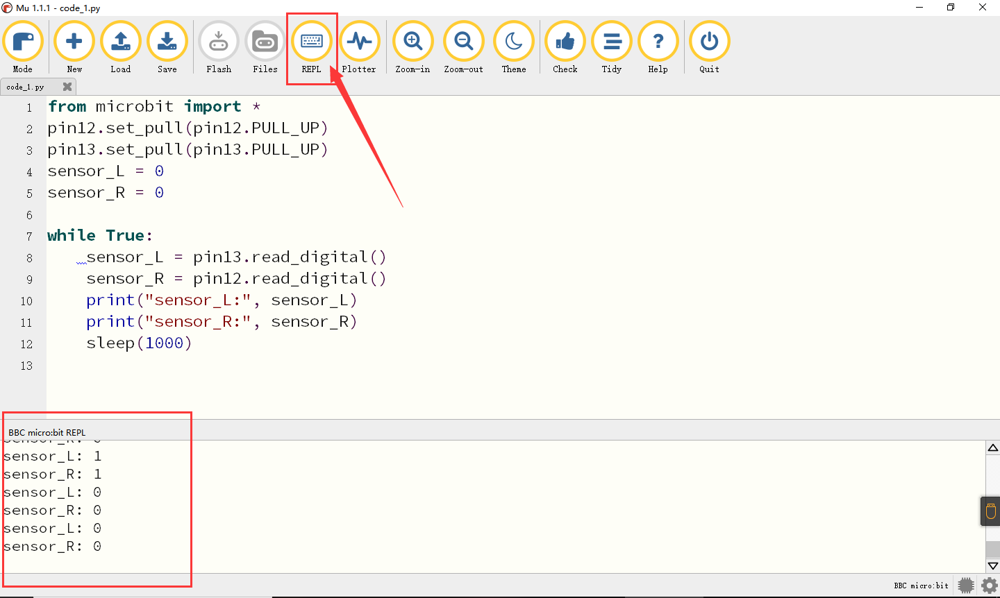

### 3.4.5 Flow Chart

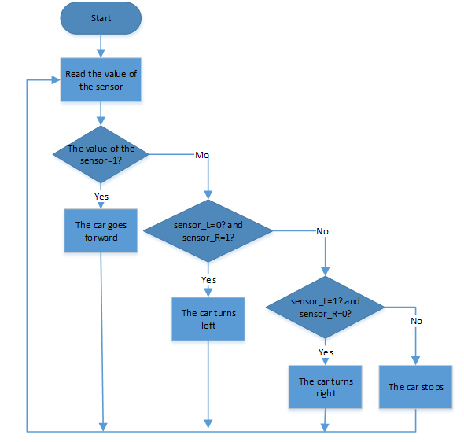

### 3.4.6  Test Code

You can upload the code `3.4-Read the Line Tracking Sensor.py` directly from the tutorial (read the "Development Environment Configuration" file if in doubt). 

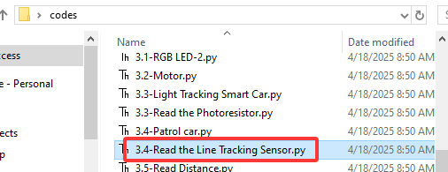

```python
from microbit import *
from keyes_MiniCar import *		#Import the library file
minicar = MiniCar()				#Instantiate an object MiniCar（）as minicar
pin12.set_pull(pin12.PULL_UP)      #Set pin12 to pull up
pin13.set_pull(pin13.PULL_UP)
sensor_L = 0
sensor_R = 0

while True:
    sensor_L = pin13.read_digital()    #Read the value of the sensor
    sensor_R = pin12.read_digital()
    print("sensor_L:", sensor_L)
    print("sensor_R:", sensor_R)
    if sensor_L == 1 and sensor_R == 1: #Judge if sensor_L and sensor_R =1
        minicar.Motor_L(1, 70)			#Advance code
        minicar.Motor_R(1, 70)
    elif sensor_L == 0 and sensor_R == 1: #Judge if sensor_L =0 and sensor_R=1
        minicar.Motor_L(1, 70)			#Right turn code
        minicar.Motor_R(0, 70)
    elif sensor_L == 1 and sensor_R == 0: #Judge if sensor_L=1 and sensor_R=0
        minicar.Motor_L(0, 70)
        minicar.Motor_R(1, 70)
    else:
        minicar.Motor_stop()
```

**Test Result:** Upload the code  and open the power switch on the car. Place the car on the line tracking paper, then it will follow the black line to move.

## 3.5 Ultrasonic Following and Obstacle Avoidance

### 3.5.1 Description

The ultrasonic sensor uses sonar to determine distance to an object like bats do. It will emit the ultrasonic waves after trigger signals. When the ultrasonic waves encounter the object and are reflected back, the module will output an echo signal, thus, it can determine the distance of object from the time difference between trigger signal and echo signal. 

As the picture shown, it is like two eyes. One is transmitting end, the other is receiving end.

In this project, we will learn ultrasonic ranging, ultrasonic following and ultrasonic obstacle avoidance.

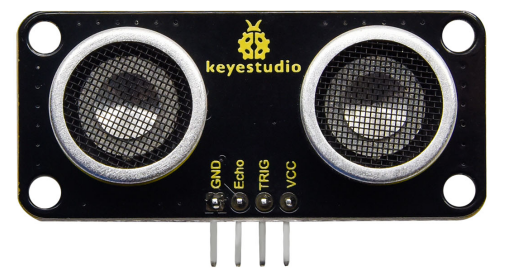

### 3.5.2 Specifications

Working voltage：DC 3.3V-5V

Working current：50mA－100mA，normally is 65mA

Maximum power：0.5W

Maximum detection distance：3m

Blind spot：less than 4cm

Sensing angle：less than 15 degrees

Interface：4-pin interface of a spacing of 2.54mm

Positioning hole ：3mm diameter

Working temperature： -10℃ - +60℃

Dimension：49mm x 22mm x 19mm

Environmental protection attributes: ROHS

### 3.5.3 Working Principle

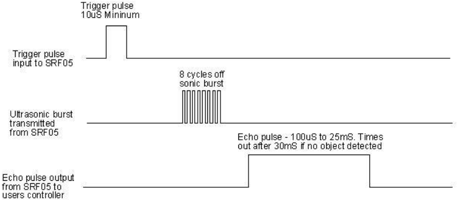

(1)Pull down TRIG then trigger high level signals with least 10us;

(2)After triggering, the module will automatically send eight 40KHz ultrasonic pulses and detect whether there is a signal return;

(3)If there is a signal return, when ECHO outputs a high level, then the duration of the high level is the time from transmission to reception of the ultrasonic waves. Then test distance = high level duration 340m/s x 0.5. 

### 3.5.4 Preparation

（1）Insert the micro: bit correctly into the expansion board

（2）Connect the battery holder to the expansion board

（3）Turn on the power switch（<span style="color:red;">Slide the POWER switch to ON end</span>） 

（4）Connect the micro：bit and computer via a micro USB cable

（5）Open the MU IDE 

If you want to add the Mini car extension library(you can refer to the "1.4 Install the Library File "file).

### 3.5.5  Code for Ultrasonic Ranging

Upload the `3.5-Read Distance.py` file directly from the tutorial 

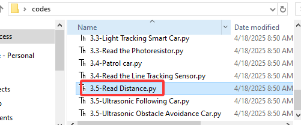

```python
from microbit import *
from keyes_MiniCar import *
minicar = MiniCar()
distance = 0

while True:
    distance = minicar.get_distance()  #Set minicar.get_distance() to distance
    print("distance:", distance)   	#Print the distance
    sleep(1000)
```

After downloading code, keep USB cable connected, click**“REPL”button and press the reset button.** REPL window shows the distance value between the ultrasonic sensor and the obstacle(as shown below):

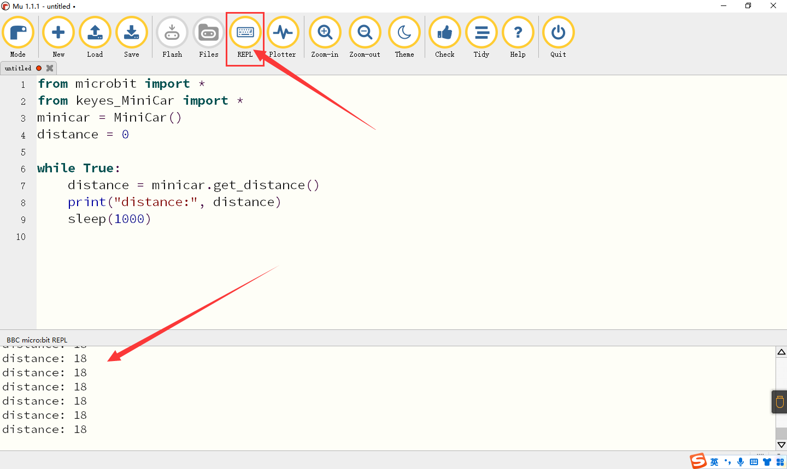

### 3.5.6 Flow Chart of Ultrasonic Following

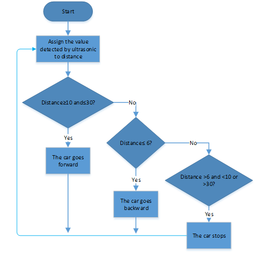

### 3.5.7 Code for Ultrasonic Following

Upload the `3.5-Ultrasonic Following Car.py` file directly from the tutorial 

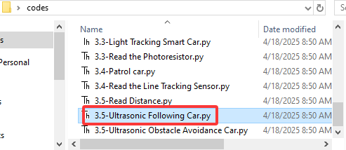

```python
from microbit import *
from keyes_MiniCar import *
minicar = MiniCar()

while True:
    distance = 0
    distance = minicar.get_distance()		#Set bitCar.get_distance() to distance
    if distance >= 10 and distance <= 30:	#Judge if 10≤ distance≤30
        minicar.Motor_L(1, 100)			#The car advance
        minicar.Motor_R(1, 100)
        sleep(50)
    elif distance <= 6:					#Judge if distance≤ 6
        minicar.Motor_L(0, 100)			#The car moves back
        minicar.Motor_R(0, 100)
        sleep(50)
    elif (distance > 6 and distance < 10) or distance > 30: #Judge if 6<distance<10 or >30
        minicar.Motor_stop()			#The car stops
        sleep(50)
```

**Test Result:**Upload the code and open the power switch on the car. If there is an obstacle in the place larger than 10cm and less than 30cm in front of the car, the car moves forward, if the obstacle appears within 6cm, the car will back up, and it stops when it is greater than 6cm and less than 10cm or greater than 30cm.

### 3.5.8 Flow Chart of Ultrasonic Obstacle Avoidance

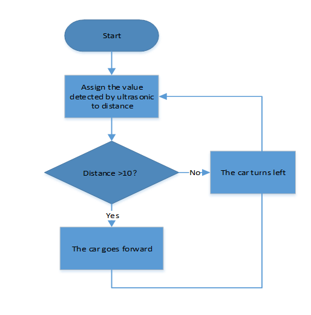

### 3.5.9 Code for Ultrasonic Obstacle Avoidance

Upload the `3.5-Ultrasonic Obstacle Avoidance Car.py` file directly from the tutorial 

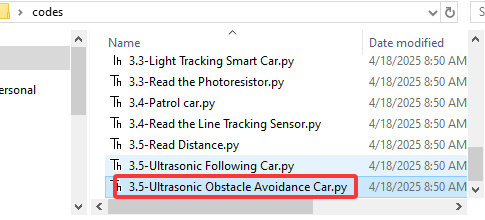

```python
from microbit import *
from keyes_MiniCar import *
minicar = MiniCar()

while True:
    distance = 0
    distance = minicar.get_distance()
    if distance > 10:
        minicar.Motor_L(1, 70)
        minicar.Motor_R(1, 70)
        sleep(50)
    else:
        minicar.Motor_L(0, 70)
        minicar.Motor_R(1, 70)
        sleep(50)
```

**Test Result:** Upload the code and open the power switch on the car. If the distance is larger than 10cm, the car will go forward, if within 10cm, it will turn left.
