# -1744943656577-4.png)

# Read Me First

**Here's what you need to run the mini robot car:**

1). Microbit V2 (you need to buy them yourself)

2). Three AAA Batteries (you need to buy them yourself)

**Support**

KEYESTUDIO provides free and quick technical support, including but not limited to:

1)Quality problems of product

2)Problems encountered while using the product

3)Comments and suggestions

4)Your projects and ideas

If you find a technical or confusing error in a document or file, we would be grateful if you could report it to us. 

Please send email to: service@keyestudio.com

# 1. What's in the package?

|  #   |          Picture          |        Components        | QTY  |
| :--: | :-----------------------: | :----------------------: | :--: |
|  1   | 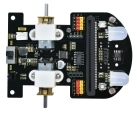  |     Expansion Board      |  1   |
|  2   | 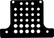  |      Acrylic Board       |  1   |
|  3   | 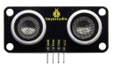  |    Ultrasonic Sensor     |  1   |
|  4   | 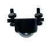  |     Universal Wheel      |  1   |
|  5   | 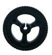  |          Wheels          |  2   |
|  6   |   |   M3*20mm Nylon Column   |  4   |
|  7   | 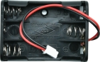  |   3AAA Battery Holder    |  1   |
|  8   | 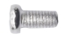  | M3*6MM Flat Head Screws  |  4   |
|  9   | 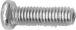  | M3*10MM Flat Head Screws |  6   |
|  10  | 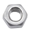 |  M3 Nickle-plated Nuts   |  2   |
|  11  | 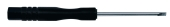 |   Slotted Screwdriver    |  1   |
|  12  | 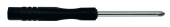 |    Cross Screwdriver     |  1   |
|  13  |  |    IR Remote Control     |  1   |

 

# 2.Tutorial

## 2.1 Makecode Tutorial

[Click to jump to Makecode tutorial](./MakecodeTutorial.md)

## 2.2 MicroPython Tutorial

[Click to jump to MicroPython tutorial](./MicroPythonTutorial.md)

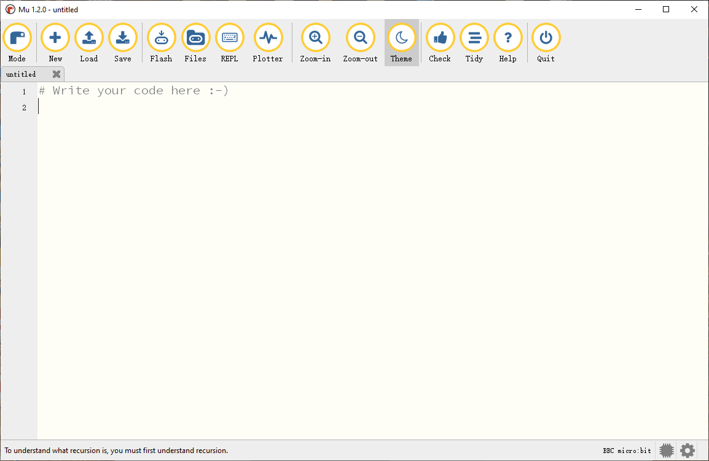

