# Arduino下载以及驱动安装

## 1 Arduino IDE安装

我们先到arduino官方的网站<https://www.arduino.cc/>下载最新版本的arduino开发软件,进入网站之后点击界面上的SOFTWARE,，选择DOWNLOADS进入下载页面，如下图：

Arduino 软件有很多版本，有wodows,mac linux系统的（如下图），而且还有过去老的版本，你只需要下载一个适合系统的版本。这里我们以WINDOWS系统的为例给大家介绍一下下载和安装的步骤。

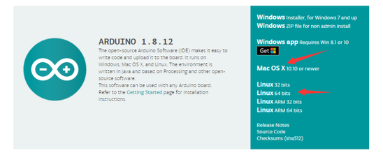

WINDOWS系统的也有两个版本，一个版本是安装版的，一个是下载版的不用安装，直接下载文件到电脑，解压缩就可以用了。

两个版本都可以正常使用，看你自己的喜好了。选择一个版本，然后将Arduino
开发软件下载到我们的电脑。

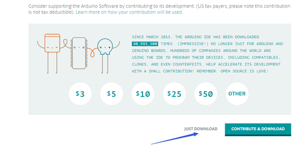

一般情况下，我们点击JUST DOWNLOAD就可以下载了。

## 2 ARDUINO UNO R3开发板

在开始所有的项目之前，我们首先要了解下面这片arduino uno R3开发板，因为这个智能车的核心就是这个开发板。

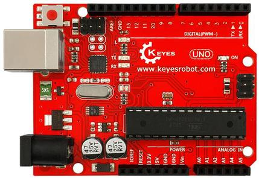

ARDUINO UNO R3开发板是我们最新推出的一款易用型开源控制器，硬件上与Arduino UNO相比并没有大的变动。外观上我们将蓝色换成了红色，给你们一种新的体验。硬件上，我们用ATmega16U2代替了8U2，这个更新为是USB接口芯片服务的，理论上它让UNO能模拟USB HID，比如MIDI/Joystick/Keyboard。

  
它具有14个数字输入/输出引脚（其中6个可用作PWM输出），6个模拟输入，一个16 MHz石英晶体，一个USB连接，一个电源插孔，2个ICSP接头和一个复位按钮。

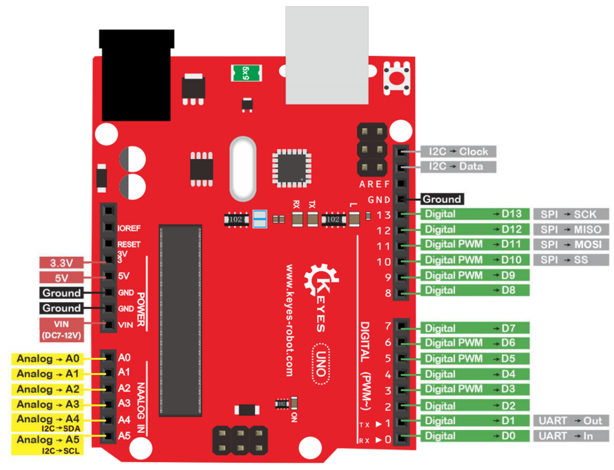  
它包含支持微控制器所需的一切；只需使用USB电缆将其连接到计算机，或使用AC-DC适配器或电池为其供电即可开始使用。

| Microcontroller             | ATmega328P-PU                                            |
| --------------------------- | -------------------------------------------------------- |
| Operating Voltage           | 5V                                                       |
| Input Voltage (recommended) | DC7-12V                                                  |
| 数字引脚                    | 14 (D0-D13) (其中包含6个PWM输出口)                       |
| PWM引脚                     | 6 个(D3, D5, D6, D9, D10, D11)                           |
| 模拟输入引脚                | 6 个(A0-A5)                                              |
| 每个I / O引脚的直流电流     | 20 mA                                                    |
| 3.3V引脚的直流电流          | 50 mA                                                    |
| Flash Memory                | 32 KB (ATmega328P-PU) of which 0.5 KB used by bootloader |
| SRAM                        | 2 KB (ATmega328P-PU)                                     |
| EEPROM                      | 1 KB (ATmega328P-PU)                                     |
| 时钟频率                    | 16 MHz                                                   |
| LED按键                     | D13                                                      |

## 3 安装开发板驱动文件

接下来，我们将介绍UNO R3开发板的驱动程序安装。在不同的计算机系统中，驱动程序的安装可能略有不同。因此，下面我们继续在WIN 7系统中安装驱动程序。Arduino文件夹包含Arduino程序本身和驱动程序，这些驱动程序允许Arduino通过USB电缆连接到您的计算机。在我们启动Arduino软件之前，您将需要安装USB驱动程序。

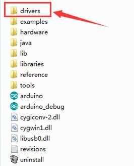

将USB先的一端插入Arduino，另一端插入计算机上的USB插座。第一次将UNO板连接到计算机时，右键单击“计算机”图标-\>“属性”-\>单击“设备管理器”，在“其他设备”下，您应看到“未知设备”旁边带有一个黄色警告三角形。 这是您的Arduino。

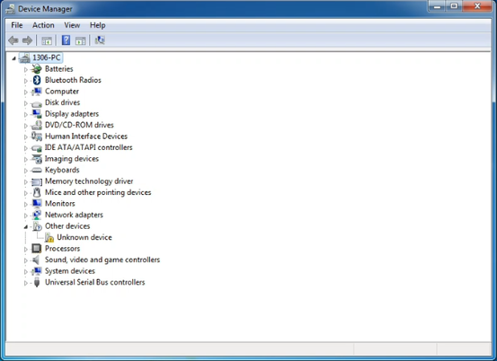

然后右键单击设备，然后选择顶部菜单选项（更新驱动程序软件...），如下图所示。

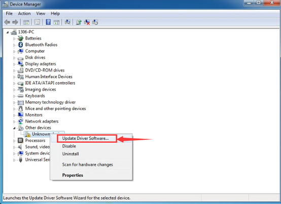

然后将提示您“自动搜索更新的驱动程序软件”或“浏览我的计算机以获取驱动程序软件”。如下图所示。 在此页面中，选择“浏览我的计算机以获取驱动程序软件”。

之后，选择浏览器选项并导航到Arduino安装的“ drivers”文件夹。

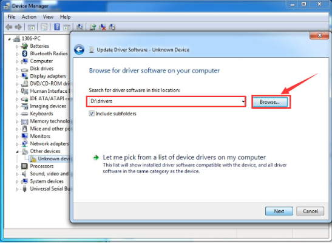

单击“下一步”，您可能会收到安全警告，如果这样，则允许安装该软件。
如下图所示。

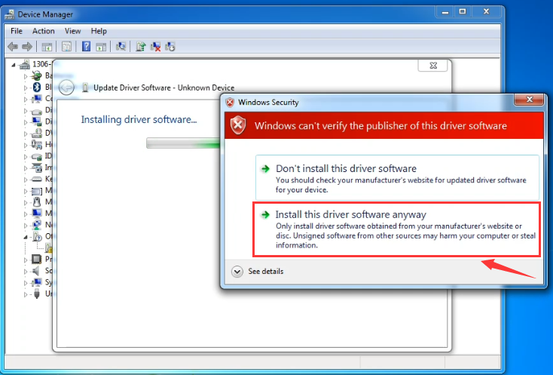

安装软件后，您将收到确认消息。 安装完成后，单击“关闭”。

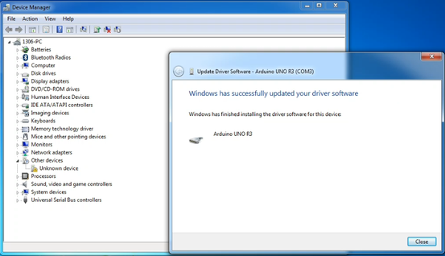

现在驱动程序已经安装好。然后您可以右键单击“计算机”-\>“属性”-\>“设备管理器”，您将看到如下图所示的设备。

## 4 添加库

1.首先复制链接到百度网盘下载我们提供的资料到电脑上，解压之后，找到文件名为“ke0165库文件”的文件，打开文件：

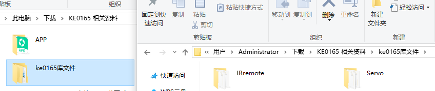 

2.点击Arduino IDE菜单栏的文件（File）>首选项（Preference），弹出如下窗口

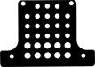 

3.点击“浏览”，选择“Arduino”文件夹，打开“libraries”文件夹，把文件拖进去。

 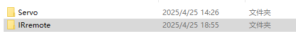

## 5 Arduino IDE设置和工具栏介绍

装好了开发板的驱动，我们下面要了解Arduino开发软件的使用了，首先我们点击电脑桌面上的图标，打开Arduino IDE。

为了避免在将程序上载到板上时出现任何错误，必须选择正确的Arduino板名称，该名称与连接到计算机的电路板相匹配。转到Tools→Board，然后选择你的板。

然后再选择正确的COM口（安装驱动成功后可看到对应COM口）。

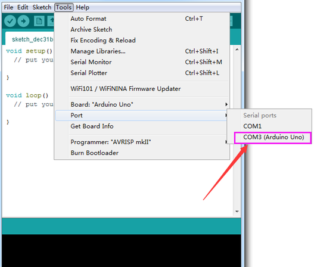

我们的程序上传到板之前，我们必须演示Arduino IDE工具栏中出现的每个符号的功能。

A - 用于检查是否存在任何编译错误。

B - 用于将程序上传到Arduino板。

C - 用于创建新草图的快捷方式。

D - 用于直接打开示例草图之一。

E - 用于保存草图。

F - 用于从板接收串行数据并将串行数据发送到板的串行监视器。

## 6 启动你的第一个程序

上面我们学习了怎么下载软件和安装开发板的驱动，那下面我们就开始正式开始第一个程序，打开文件选择例子，选择第一个文件BASIC里面的BLINK程序

按照前面方法设置板和COM口，IDE右下角显示对应板和COM口。

点击图标开始编译程序，检查错误，检查无误。

点击点击图标开始上传程序，上传成功。

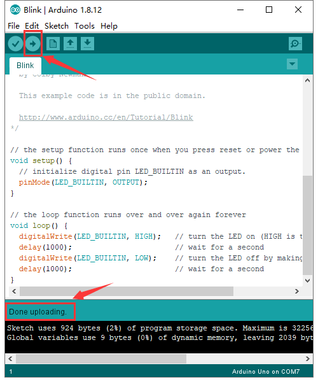

程序上传成功，板载的LED灯亮一秒钟，灭一秒钟，恭喜你的第一个程序完成了！
