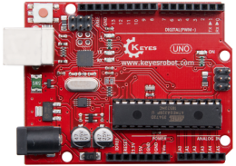

## 第1课 LED灯项目 

### 1.1 项目介绍


前面我们安装了keyes UNO R3开发板的驱动。接下来的项目我们就要由简单到复杂，一步一步探索Arduino的世界了。首先我们要来完成经典的“Arduino点亮LED”，也就是Blink项目。Blink对于学习Arduino的爱好者而言，是最基础的项目是新手必须经历的一个练习。

LED，发光二极管的简称。由含镓（Ga）、砷（As）、磷（P）、氮（N）等的化合物制成。当电子与空穴复合时能辐射出可见光，因而可以用来制成发光二极管。在电路及仪器中作为指示灯，或者组成文字或数字显示。

为了实验的方便，我们将LED发光二极管做成了一个模块，在第一个项目中，我们用一个最基本的测试代码来控制LED，亮一秒钟，灭一秒钟，来实现闪烁的效果。你可以改变代码中LED灯亮灭的时间，实现不同的闪烁效果。LED模块信号端S为高电平时LED亮起，S为低电平时LED熄灭。

### 1.2 原理图及参数


LED模块参数：

控制接口: 数字口

工作电压: DC 3.3-5V

排针间距: 2.54mm

LED显示颜色：红色

### 1.3 项目组件


|keyes UNO R3 for arduino 开发板*1|Keyes brick L298P 电机驱动扩展板 V1*1|keyes 草帽LED白发红模块*1|
|-|-|-|
||||
|USB线*1|3Pin 双母头杜邦线*1|18650双节电池盒*1|18650电池*2 （电池自配）|
||||

### 1.4 接线图


由上图我们可以看到，扩展板是堆叠在开发板上的，LED模块的-接到了扩展板的G,LED模块的+接到了扩展板的5V，LED模块的S已经接到了扩展板上的D9接口，接好线之后我们开始编写代码：

### 1.5 项目代码


```
/*
4WD 蓝牙多功能车
lesson 1.1
Blink
http://www.keyes-robot.com
*/
void setup()
{
  pinMode(9, OUTPUT);// 将数字引脚9初始化为输出
}
void loop() // 循环功能
{ 
  digitalWrite(9, HIGH); // 点亮LED
  delay(1000); // 等待一秒钟
  digitalWrite(9, LOW); // 熄灭LED
  delay(1000); // 等待一秒钟
}
//*******************************************************************
```

### 1.6 项目结果

点击上传程序，你应该看到D9脚接着的LED打开和关闭，而且间隔的时间是一秒钟。

1.7 代码说明:

```
pinMode(9，OUTPUT) 在使用Arduino的引脚之前，你需要告诉开发板它是INPUT还是OUTPUT。我们使用一个内置的“函数”pinMode()来做到这一点。
```

```
digitalWrite(9，HIGH) 当使用引脚作为OUTPUT时，可以将其命令为HIGH（输出5伏）或LOW（输出0伏）。
```

### 1.7 项目拓展

前面我们控制了LED模块亮1秒钟,灭一秒钟，现在我们来拓展一下思路，通过改变delay的时间来改变LED 灯闪烁的频率。

代码如下:


```
/*
4WD 蓝牙多功能车
lesson 1.2
delay
http://www.keyes-robot.com
*/
void setup()
{
  pinMode(9, OUTPUT);// 将数字引脚9初始化为输出
}
void loop() // 循环功能
{
  digitalWrite(9, HIGH); // 点亮LED
  delay(100); // 等待0.1秒钟
  digitalWrite(9, LOW); // 熄灭LED
  delay(100); // 等待0.1秒钟
}
```

怎么样是不是很好理解，就是通过改变delay这个代码的时间，来改变3脚LED亮和灭的频率，不多说，我们上传代码。看看这个LED灯闪烁的频率是不是比之前快了？