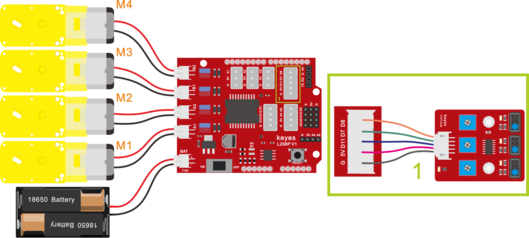

## 第11课 循线智能车 

### 11.1 项目介绍

前面我们详细的介绍了画地为牢智能车的实现方法。在这里我们可以结合前面课程中知识制作一个循迹智能车。实验中，我们还是通过循迹传感器检测智能车底部是否存在黑线，然后根据检测结果控制两个电机的转动，从而控制智能车沿着黑线行走。

### 11.2流程图

循迹智能车具体逻辑如下表格。

|检测|中循迹传感器|检测到黑线：高电平|
|-|-|-|
|检测|中循迹传感器|检测到白线：低电平|
|检测|左循迹传感器|检测到黑线：高电平|
|检测|左循迹传感器|检测到白线：低电平|
|检测|右循迹传感器|检测到黑线：高电平|
|检测|右循迹传感器|检测到白线：低电平|

|条件|条件|状态|
|-|-|-|
|中循迹传感器检测到黑线|左循迹传感器检测到黑线并且 右循迹传感器检测到白线|左旋转（PWM设为200）|
|中循迹传感器检测到黑线|左循迹传感器检测到白线并且 右循迹传感器检测到黑线|右旋转（PWM设为200）|
|中循迹传感器检测到黑线|左循迹传感器检测到白线并且 右循迹传感器检测到白线|前进|
|中循迹传感器检测到黑线|左循迹传感器检测到黑线并且 右循迹传感器检测到黑线|前进|
|中循迹传感器检测到白线|左循迹传感器检测到黑线并且 右循迹传感器检测到白线|左旋转（PWM设为200）|
|中循迹传感器检测到白线|左循迹传感器检测到白线并且 右循迹传感器检测到黑线|右旋转（PWM设为200）|
|中循迹传感器检测到白线|左循迹传感器检测到白线并且 右循迹传感器检测到白线|停止|
|中循迹传感器检测到白线|左循迹传感器检测到黑线并且 右循迹传感器检测到黑线|停止|

按照前面思路设计好智能车后，我们就需要按照设计思路开始制作智能车。我们需要设计对应的接线，测试代码，然后接线上传代码，运行，确保智能车能够实现理想中的功能。

### 11.3 接线图

巡线模块+电机



接线注意：用导线把循迹模块连接到电机驱动扩展板上P1接口的G、V、D11、D7、D8；(M1、M2)和(M3、M4)两对时电机分别对应的连接到电机驱动扩展板上的接口A和接口B，电源接到BAT接口。

### 11.4 测试代码

```
/*
4WD 蓝牙多功能车  
lesson 11
Line Tracking Robot
http://www.keyes-robot.com
*/
int L_pin = 11; //定义左边传感器引脚为D11
int M_pin = 7; //定义中间传感器引脚为D7
int R_pin = 8; //定义右边传感器引脚为D8
int MA = 2; //定义电机A方向控制引脚为D2
int PWMA = 6; //定义电机A速度控制引脚为D6
int MB = 4; //定义电机A方向控制引脚为D4
int PWMB = 5; //定义电机A速度控制引脚为D5
int L_val, M_val, R_val;

void advance() { //小车前进
  digitalWrite(MA, LOW); //电机A正转
  analogWrite(PWMA, 150); //电机A速度为150
  digitalWrite(MB, HIGH); //电机B正转
  analogWrite(PWMB, 150); //电机B速度为150
}

void back() { //小车后退
  digitalWrite(MA, HIGH); //电机A反转
  analogWrite(PWMA, 150); //电机A速度为150
  digitalWrite(MB, LOW); //电机B反转
  analogWrite(PWMB, 150); //电机B速度为150
}

void turnL() { //小车左转
  digitalWrite(MA, HIGH); //电机A反转
  analogWrite(PWMA, 150); //电机A速度为150
  digitalWrite(MB, HIGH); //电机B正转
  analogWrite(PWMB, 150); //电机B速度为150
}

void turnR() { //小车右转
  digitalWrite(MA, LOW); //电机A正转
  analogWrite(PWMA, 150); //电机A速度为150
  digitalWrite(MB, LOW); //电机B反转
  analogWrite(PWMB, 150); //电机B速度为150
}

void stopp() { //小车停止
  analogWrite(PWMA, 0); //电机A速度为0
  analogWrite(PWMB, 0); //电机B速度为0
}
void setup() {
  Serial.begin(9600); //设置波特率为9600
  pinMode(L_pin, INPUT); //循迹传感器引脚都配置为输入模式
  pinMode(M_pin, INPUT);
  pinMode(R_pin, INPUT);
  pinMode(MA, OUTPUT); //配置电机引脚为输出模式
  pinMode(PWMA, OUTPUT);
  pinMode(MB, OUTPUT);
  pinMode(PWMB, OUTPUT);
}
void loop() {
  L_val = digitalRead(L_pin); //读取左边传感器的值
  M_val = digitalRead(M_pin); //读中间传感器的值
  R_val = digitalRead(R_pin); //读取右边传感器的值
  if (M_val == 1) { //中间检测到黑线
    if (L_val == 1 && R_val == 0) { //如果左边检测到黑线，右边没有，左转
      turnL();
    }
    else if (L_val == 0 && R_val == 1) { //否则如果右边检测到黑线，左边没有，右转
      turnR();
    }
    else { //否则前进
      advance();
    }
  }
  else { //中间没检测到黑线
    if (L_val == 1 && R_val == 0) { //如果左边检测到黑线，右边没有，左转
      turnL();
    }
    else if (L_val == 0 && R_val == 1) { //否则如果右边检测到黑线，左边没有，右转
      turnR();
    }
    else { //否则停止
      stopp();
    }
  }
}
```

### 11.5 测试结果

将驱动扩展板堆叠在UNO R3板上，上传好代码，按照接线图接线，将拨码开关拨至ON端后，智能车能够沿着黑线行走。