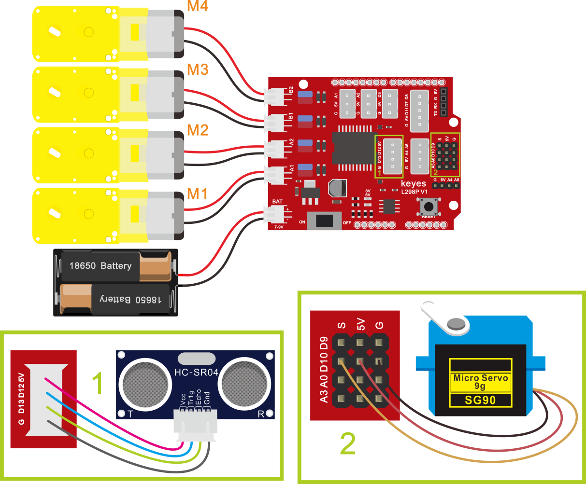

## 第12课 超声波跟随智能车 

### 12.1 项目介绍

我们结合硬件知识-各种传感器，模块，电机驱动器，来制造超声波跟随机器人车！实验中，我们通过避障传感器检测智能车左右两方是否存在障碍物，检测智能车和前方障碍物的距离，然后根据这三个数据控制两个电机的转动，从而控制智能车的运动状态。

### 12.2 流程图

跟随智能车具体逻辑如下表格。

|检测|超声波测试前方物体距离|distance（单位：cm）|
|-|-|-|
|条件|distance<8||
|状态|后退（PWM设为100）||
|条件|8＜distance≤13||
|状态|停止||
|条件|13≤distance≤35并且l_val=1并且r_val=1||
|状态|前进（PWM设为100）||
|条件|distance＞35||
|状态|停止||

按照前面思路设计好智能车后，我们就需要按照设计思路开始制作智能车。我们需要设计对应的接线，测试代码，然后接线上传代码，运行，确保智能车能够实现理想中的功能。

### 12.3 接线图

超声波模块+电机+红外避障传感器



**接线注意：**A、B两电机分别对应的连接电机驱动扩展板上的接口A和接口B；超声波传感器模块的V引脚至V，T（Trig）引脚至数字12(S)，E（Echo）引脚至数字13(S)，G引脚至G；电源接到BAT接口。

### 12.4 测试代码

```
/*
4WD 蓝牙多功能车  
lesson 12
Ultrasonic Follow Robot
http://www.keyes-robot.com
*/
#include <Servo.h>
Servo myservo;  // create servo object to control a servo
int trigPin = 12; //定义TRIG引脚接D12
int echoPin = 13; //定义ECHO引脚接D13
int distance;
int MA = 2; //定义电机A方向控制引脚为D2
int PWMA = 6; //定义电机A速度控制引脚为D6
int MB = 4; //定义电机A方向控制引脚为D4
int PWMB = 5; //定义电机A速度控制引脚为D5

int get_distance() { //超声波测距函数
  digitalWrite(trigPin, LOW);
  delayMicroseconds(2);
  digitalWrite(trigPin, HIGH); //给TRIG引脚至少10us的时间触发
  delayMicroseconds(10);
  digitalWrite(trigPin, LOW);
  distance = pulseIn(echoPin, HIGH) / 58; //检测脉冲宽度，并计算出距离
  delay(20);  //延时20ms
  Serial.print("distance:");  //串口打印出距离
  Serial.print(distance);
  Serial.println("cm");
}

void setup() {
  Serial.begin(9600);  //设置波特率为9600
  myservo.attach(10);  // attaches the servo on pin 10 to the servo object
  pinMode(trigPin, OUTPUT); //定义TRIG为输出模式
  pinMode(echoPin, INPUT); //定义ECHO为输入模式
  pinMode(MA, OUTPUT); //配置电机引脚为输出模式
  pinMode(PWMA, OUTPUT);
  pinMode(MB, OUTPUT);
  pinMode(PWMB, OUTPUT);

}

void loop() {
  get_distance();  //调用测距函数

  if (distance < 8 ) {//如果距离小于8
    back();//后退
  }
  else if (distance >= 8 && distance < 13) { //如果距离大于等于8，小于13
    stopp();//停止
  }
  else if (distance >= 13 && distance <= 35 ) { //如果距离大于等于13，小于35
    advance();//跟随
  }
  else {//如果以上都不是
    stopp();//停止
  }
}

void advance() { //小车前进
  digitalWrite(MA, LOW); //电机A正转
  analogWrite(PWMA, 100); //电机A速度为100
  digitalWrite(MB, HIGH); //电机B正转
  analogWrite(PWMB, 100); //电机B速度为100
}

void back() { //小车后退
  digitalWrite(MA, HIGH); //电机A反转
  analogWrite(PWMA, 100); //电机A速度为100
  digitalWrite(MB, LOW); //电机B反转
  analogWrite(PWMB, 100); //电机B速度为100
}

void turnL() { //小车左转
  digitalWrite(MA, HIGH); //电机A反转
  analogWrite(PWMA, 100); //电机A速度为100
  digitalWrite(MB, HIGH); //电机B正转
  analogWrite(PWMB, 100); //电机B速度为100
}

void turnR() { //小车右转
  digitalWrite(MA, LOW); //电机A正转
  analogWrite(PWMA, 100); //电机A速度为100
  digitalWrite(MB, LOW); //电机B反转
  analogWrite(PWMB, 100); //电机B速度为100
}

void stopp() { //小车停止
  analogWrite(PWMA, 0); //电机A速度为0
  analogWrite(PWMB, 0); //电机B速度为0
}

```


好了，桌面迷你蓝牙智能车跟随功能效果的代码全部编写好了，上传程序，看看精彩的效果！（在上传程序代码前，需要把蓝牙模块取下，否则代码会上传失败。需要上传代码成功后，再连接蓝牙模块。）

### 12.5 测试结果

将驱动扩展板堆叠在UNO R3板上，上传好代码，按照接线图接线，将拨码开关拨至ON端后，智能车能够随着前方障碍物的移动而移动。