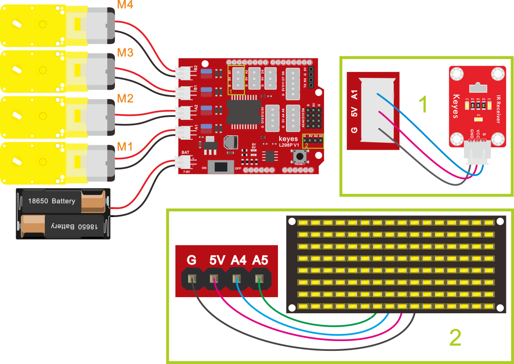

## 第14课 红外遥控智能车 

### 14.1 项目介绍

前面的学习中我们详细的介绍了智能车上各个传感器、模块、扩展板的使用方法。在这里我们可以再结合前面课程中知识制作一个红外控制智能车。在传感器项目第四课中，我们已经测试出红外遥控器各个按键对应的键值。实验中，我们可以通过代码设置（键值），让对应的按键控制智能车对应的运动状态，且相应的状态模式显示在8X16 LED矩阵上。

### 14.2 流程图

循迹智能车具体逻辑如下表格：


|按键：|键值：FF629D|状态：前进|
|-|-|-|
|按键：|键值：FFA857|状态：后退|
|按键：|键值：FF22DD|状态：左转|
|按键：|键值：FFC23D|状态：右转|
|按键：|键值：FF02FD|状态：停止|

按照前面思路设计好智能车后，我们就需要按照设计思路开始制作智能车。我们需要设计对应的接线，测试代码，然后接线上传代码，运行，确保智能车能够实现理想中的功能。

### 14.3 接线图

电机+红外接收模块

**接线注意：**由于红外接收传感器输入的数字信号，将红外接收传感器模块用导线连接到电机驱动扩展板上的G、V、A1，A、B两组电机分别对应的连接到堆叠在UNO R3板上的电机驱动扩展板上的接口A和接口B，电源接到BAT接口。



### 14.4 测试代码

```
/*
4WD 蓝牙多功能车  
lesson 14
Remote Control Robot
http://www.keyes-robot.com
*/
#include <IRremote.h>
int RECV_PIN = A1; //定义红外IO口A1
IRrecv irrecv(RECV_PIN);
decode_results results;//声明一个IRremote库函数独有的变量类型
int IR_val;
//数组，用于储存图案的数据，可以自己算也可以从取摸工具中得到
unsigned char start01[] = {0x01, 0x02, 0x04, 0x08, 0x10, 0x20, 0x40, 0x80, 0x80, 0x40, 0x20, 0x10, 0x08, 0x04, 0x02, 0x01};
unsigned char front[] = {0x00, 0x00, 0x00, 0x00, 0x00, 0x24, 0x12, 0x09, 0x12, 0x24, 0x00, 0x00, 0x00, 0x00, 0x00, 0x00};
unsigned char back01[] = {0x00, 0x00, 0x00, 0x00, 0x00, 0x24, 0x48, 0x90, 0x48, 0x24, 0x00, 0x00, 0x00, 0x00, 0x00, 0x00};
unsigned char left[] = {0x00, 0x00, 0x00, 0x00, 0x00, 0x00, 0x44, 0x28, 0x10, 0x44, 0x28, 0x10, 0x44, 0x28, 0x10, 0x00};
unsigned char right[] = {0x00, 0x10, 0x28, 0x44, 0x10, 0x28, 0x44, 0x10, 0x28, 0x44, 0x00, 0x00, 0x00, 0x00, 0x00, 0x00};
unsigned char STOP01[] = {0x2E, 0x2A, 0x3A, 0x00, 0x02, 0x3E, 0x02, 0x00, 0x3E, 0x22, 0x3E, 0x00, 0x3E, 0x0A, 0x0E, 0x00};
unsigned char clear[] = {0x00, 0x00, 0x00, 0x00, 0x00, 0x00, 0x00, 0x00, 0x00, 0x00, 0x00, 0x00, 0x00, 0x00, 0x00, 0x00};
#define SCL_Pin  A5  //设置时钟引脚为 A5
#define SDA_Pin  A4  //设置数据引脚为 A4
int MA = 2; //定义电机A方向控制引脚为D2
int PWMA = 6; //定义电机A速度控制引脚为D6
int MB = 4; //定义电机B方向控制引脚为D4
int PWMB = 5; //定义电机B速度控制引脚为D5

void advance() { //小车前进
  digitalWrite(MA, LOW); //电机A正转
  analogWrite(PWMA, 200); //电机A速度为200
  digitalWrite(MB, HIGH); //电机B正转
  analogWrite(PWMB, 200); //电机B速度为200
}

void back() { //小车后退
  digitalWrite(MA, HIGH); //电机A反转
  analogWrite(PWMA, 200); //电机A速度为200
  digitalWrite(MB, LOW); //电机B反转
  analogWrite(PWMB, 200); //电机B速度为200
}

void turnL() { //小车左转
  digitalWrite(MA, HIGH); //电机A反转
  analogWrite(PWMA, 200); //电机A速度为200
  digitalWrite(MB, HIGH); //电机B正转
  analogWrite(PWMB, 200); //电机B速度为200
}

void turnR() { //小车右转
  digitalWrite(MA, LOW); //电机A正转
  analogWrite(PWMA, 200); //电机A速度为200
  digitalWrite(MB, LOW); //电机B反转
  analogWrite(PWMB, 200); //电机B速度为200
}

void stopp() { //小车停止
  analogWrite(PWMA, 0); //电机A速度为0
  analogWrite(PWMB, 0); //电机B速度为0
}

void setup() {
  Serial.begin(9600);  //设置波特率为9600
  pinMode(MA, OUTPUT); //配置电机引脚为输出模式
  pinMode(PWMA, OUTPUT);
  pinMode(MB, OUTPUT);
  pinMode(PWMB, OUTPUT);
  pinMode(SCL_Pin, OUTPUT);
  pinMode(SDA_Pin, OUTPUT);
  irrecv.enableIRIn();// 使能红外接收
  matrix_display(clear);//清屏
  matrix_display(start01);
}

void loop() {
  if (irrecv.decode(&results)) { //是否接收到红外遥控信号
    IR_val = results.value;
    Serial.println(IR_val, HEX); //串口打印数据
    switch (IR_val) {
      case 0xFF629D:  advance();  matrix_display(front);  break;
      case 0xFFA857:  back();     matrix_display(back01); break;
      case 0xFF22DD:  turnL();    matrix_display(left);   break;
      case 0xFFC23D:  turnR();    matrix_display(right);  break;
      case 0xFF02FD:  stopp();    matrix_display(STOP01); break;
    }
    irrecv.resume();// 接收下个数据
  }
}


//这个函数用于点阵屏显示
void matrix_display(unsigned char matrix_value[])
{
  IIC_start();  //调用数据传输开始条件的函数
  IIC_send(0xc0);  //选择地址
  for (int i = 0; i < 16; i++) //图案数据有16个字节
  {
    IIC_send(matrix_value[i]); //传输图案的数据
  }
  IIC_end();   //结束图案数据传输
  IIC_start();
  IIC_send(0x8A);  //显示控制，选择脉宽为4/16
  IIC_end();
}
//传输数据开始的条件
void IIC_start()
{
  digitalWrite(SCL_Pin, HIGH);
  delayMicroseconds(3);
  digitalWrite(SDA_Pin, HIGH);
  delayMicroseconds(3);
  digitalWrite(SDA_Pin, LOW);
  delayMicroseconds(3);
}
//传输数据
void IIC_send(unsigned char send_data)
{
  for (char i = 0; i < 8; i++) //每个字节有8位
  {
    digitalWrite(SCL_Pin, LOW); //将时钟引脚SCL_Pin拉低，才可以改变SDA的信号
    delayMicroseconds(3);
    if (send_data & 0x01) //根据字节的每一位是1还是0来设置SDA_Pin的高低电平
    {
      digitalWrite(SDA_Pin, HIGH);
    }
    else
    {
      digitalWrite(SDA_Pin, LOW);
    }
    delayMicroseconds(3);
    digitalWrite(SCL_Pin, HIGH); //将时钟引脚SCL_Pin拉高，停止数据的传输
    delayMicroseconds(3);
    send_data = send_data >> 1;  //一位一位的检测，所以将数据右移一位
  }
}
//数据传输结束的标志
void IIC_end()
{
  digitalWrite(SCL_Pin, LOW);
  delayMicroseconds(3);
  digitalWrite(SDA_Pin, LOW);
  delayMicroseconds(3);
  digitalWrite(SCL_Pin, HIGH);
  delayMicroseconds(3);
  digitalWrite(SDA_Pin, HIGH);
  delayMicroseconds(3);
}
```


好了，上传程序，红外遥控器对准红外接收器，按下红外遥控器对应按键，看看效果吧！**（注意：在上传测试代码前，需要把蓝牙模块取下，否则测试代码会上传失败。需要上传代码成功后，再连接蓝牙模块。）**

### 14.5 测试结果

将驱动扩展板堆叠在UNO R3板上，上传好代码，按照接线图接线，将拨码开关拨至ON端后，我们就能用红外遥控控制智能车运动了。