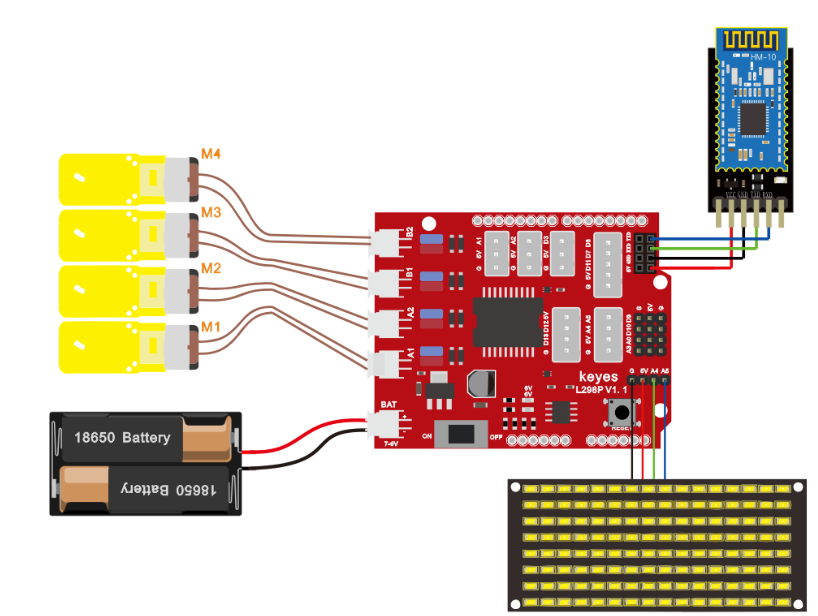

## 第16课 蓝牙调速智能车 

### 16.1 项目介绍

前面课程中，我们利用蓝牙控制智能车，在这课程中我们做一个蓝牙可以控制速度的智能车。既然要控制智能车速度，我们可以将速度定义一个变量speeds来表示。项目中我们只要改变这是变量speeds就可以改变智能车的速度啦。下面让我们通过代码来实现。

流程图：

按照前面思路设计好智能车后，我们就需要按照设计思路开始制作智能车。我们需要设计对应的接线，测试代码，然后接线上传代码，运行，确保智能车能够实现理想中的功能。

### 16.2 接线图

蓝牙+电机



接线跟上一课一样

### 16.4 测试代码

```
/*
4WD 蓝牙多功能车  
lesson 16
Bluetooth control speed
http://www.keyes-robot.com
*/
//数组，用于储存图案的数据，可以自己算也可以从取摸工具中得到
unsigned char start01[] = {0x01, 0x02, 0x04, 0x08, 0x10, 0x20, 0x40, 0x80, 0x80, 0x40, 0x20, 0x10, 0x08, 0x04, 0x02, 0x01};
unsigned char front[] = {0x00, 0x00, 0x00, 0x00, 0x00, 0x24, 0x12, 0x09, 0x12, 0x24, 0x00, 0x00, 0x00, 0x00, 0x00, 0x00};
unsigned char back01[] = {0x00, 0x00, 0x00, 0x00, 0x00, 0x24, 0x48, 0x90, 0x48, 0x24, 0x00, 0x00, 0x00, 0x00, 0x00, 0x00};
unsigned char left[] = {0x00, 0x00, 0x00, 0x00, 0x00, 0x00, 0x44, 0x28, 0x10, 0x44, 0x28, 0x10, 0x44, 0x28, 0x10, 0x00};
unsigned char right[] = {0x00, 0x10, 0x28, 0x44, 0x10, 0x28, 0x44, 0x10, 0x28, 0x44, 0x00, 0x00, 0x00, 0x00, 0x00, 0x00};
unsigned char STOP01[] = {0x2E, 0x2A, 0x3A, 0x00, 0x02, 0x3E, 0x02, 0x00, 0x3E, 0x22, 0x3E, 0x00, 0x3E, 0x0A, 0x0E, 0x00};
unsigned char speed_a[] = {0x00, 0x40, 0x20, 0x10, 0x08, 0x04, 0x02, 0xff, 0x02, 0x04, 0x08, 0x10, 0x20, 0x40, 0x00, 0x00};
unsigned char speed_d[] = {0x00, 0x02, 0x04, 0x08, 0x10, 0x20, 0x40, 0xff, 0x40, 0x20, 0x10, 0x08, 0x04, 0x02, 0x00, 0x00};
unsigned char clear[] = {0x00, 0x00, 0x00, 0x00, 0x00, 0x00, 0x00, 0x00, 0x00, 0x00, 0x00, 0x00, 0x00, 0x00, 0x00, 0x00};
#define SCL_Pin  A5  //设置时钟引脚为 A5
#define SDA_Pin  A4  //设置数据引脚为 A4
int MA = 2; //定义电机A方向控制引脚为D2
int PWMA = 6; //定义电机A速度控制引脚为D6
int MB = 4; //定义电机A方向控制引脚为D4
int PWMB = 5; //定义电机A速度控制引脚为D5
int speeds = 150; //初始化速度为150
char blue_val;

void setup() {
  Serial.begin(9600);  //设置波特率为9600
  pinMode(MA, OUTPUT); //配置电机引脚为输出模式
  pinMode(PWMA, OUTPUT);
  pinMode(MB, OUTPUT);
  pinMode(PWMB, OUTPUT);
  //设置引脚为输出
  pinMode(SCL_Pin, OUTPUT);
  pinMode(SDA_Pin, OUTPUT);
  //清屏
  matrix_display(clear);
  matrix_display(start01);
}
void loop() {
  if (Serial.available() > 0) { //接收到蓝牙信号
    blue_val = Serial.read(); //接收到的信号赋给blue_val
    Serial.println(blue_val);  //串口监视器显示蓝牙信号
    switch (blue_val) {
      case  'F':  advance();  matrix_display(front);  break;  //接收到‘F’前进
      case  'B':  back();     matrix_display(back01); break;  //接收到‘B’后退
      case  'L':  turnL();    matrix_display(left);   break;  //接收到‘L’左旋转
      case  'R':  turnR();    matrix_display(right);  break;  //接收到‘R’右旋转
      case  'S':  stopp();    matrix_display(STOP01); break;  //接收到‘S’停止
      case  'a':  speeds_a(); matrix_display(speed_a); break;  //接收到‘a’加速
      case  'd':  speeds_d(); matrix_display(speed_d); break; //接收到‘d’减速
    }
  }
}

void advance() { //小车前进
  digitalWrite(MA, LOW); //电机A正转
  analogWrite(PWMA, speeds); //电机A速度为speeds
  digitalWrite(MB, HIGH); //电机B正转
  analogWrite(PWMB, speeds); //电机B速度为speeds
}

void back() { //小车后退
  digitalWrite(MA, HIGH); //电机A反转
  analogWrite(PWMA, speeds); //电机A速度为speeds
  digitalWrite(MB, LOW); //电机B反转
  analogWrite(PWMB, speeds); //电机B速度为speeds
}

void turnL() { //小车左旋转
  digitalWrite(MA, HIGH); //电机A反转
  analogWrite(PWMA, speeds); //电机A速度为speeds
  digitalWrite(MB, HIGH); //电机B正转
  analogWrite(PWMB, speeds); //电机B速度为speeds
}

void turnR() { //小车右旋转
  digitalWrite(MA, LOW); //电机A正转
  analogWrite(PWMA, speeds); //电机A速度为speeds
  digitalWrite(MB, LOW); //电机B反转
  analogWrite(PWMB, speeds); //电机B速度为speeds
}

void stopp() { //小车停止
  analogWrite(PWMA, 0); //电机A速度为0
  analogWrite(PWMB, 0); //电机B速度为0
}

void speeds_a() { //增速函数
  while (1) {
    Serial.println(speeds);  //显示速度
    if (speeds < 255) { //最大增到255
      speeds++;
      delay(10);  //调节增速的速度
    }
    blue_val = Serial.read();
    if (blue_val == 'S')break; //接收到‘S’停止加速
  }
}

void speeds_d() { //减速函数
  while (1) {
    Serial.println(speeds);  //显示速度
    if (speeds > 0) { //最小减到0
      speeds--;
      delay(10);    //调节减速的速度
    }
    blue_val = Serial.read();
    if (blue_val == 'S')break; //接收到‘S’停止减速
  }
}

//这个函数用于点阵屏显示
void matrix_display(unsigned char matrix_value[])
{
  IIC_start();  //调用数据传输开始条件的函数
  IIC_send(0xc0);  //选择地址
  for (int i = 0; i < 16; i++) //图案数据有16个字节
  {
    IIC_send(matrix_value[i]); //传输图案的数据
  }
  IIC_end();   //结束图案数据传输
  IIC_start();
  IIC_send(0x8A);  //显示控制，选择脉宽为4/16
  IIC_end();
}
//传输数据开始的条件
void IIC_start()
{
  digitalWrite(SCL_Pin, HIGH);
  delayMicroseconds(3);
  digitalWrite(SDA_Pin, HIGH);
  delayMicroseconds(3);
  digitalWrite(SDA_Pin, LOW);
  delayMicroseconds(3);
}
//传输数据
void IIC_send(unsigned char send_data)
{
  for (char i = 0; i < 8; i++) //每个字节有8位
  {
    digitalWrite(SCL_Pin, LOW); //将时钟引脚SCL_Pin拉低，才可以改变SDA的信号
    delayMicroseconds(3);
    if (send_data & 0x01) //根据字节的每一位是1还是0来设置SDA_Pin的高低电平
    {
      digitalWrite(SDA_Pin, HIGH);
    }
    else
    {
      digitalWrite(SDA_Pin, LOW);
    }
    delayMicroseconds(3);
    digitalWrite(SCL_Pin, HIGH); //将时钟引脚SCL_Pin拉高，停止数据的传输
    delayMicroseconds(3);
    send_data = send_data >> 1;  //一位一位的检测，所以将数据右移一位
  }
}
//数据传输结束的标志
void IIC_end()
{
  digitalWrite(SCL_Pin, LOW);
  delayMicroseconds(3);
  digitalWrite(SDA_Pin, LOW);
  delayMicroseconds(3);
  digitalWrite(SCL_Pin, HIGH);
  delayMicroseconds(3);
  digitalWrite(SDA_Pin, HIGH);
  delayMicroseconds(3);
}
```

### 16.5 测试结果

按下按钮，小车加速；按下按钮，小车减速.