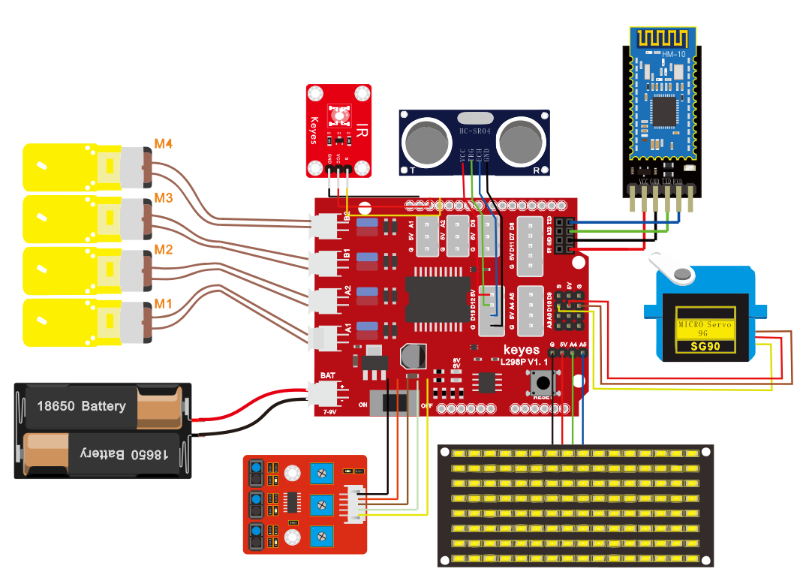

## 第17课 多功能智能小车 

### 17.1 项目介绍

在前面课程中，我们只是让智能车实现单个功能，那我们能不能把所有功能合在一起呢？能，在这一课程中，我们利用一个代码测试智能车，智能车包含前面课程中讲到的所有功能，我们利用手机蓝牙APP上按钮自动切换各种功能,简单方便。

### 17.2 流程图

按照前面思路设计好智能车后，我们就需要按照设计思路开始制作智能车。我们需要设计对应的接线，测试代码，然后接线上传代码，运行，确保智能车能够实现理想中的功能。

### 17.3 接线图

**接线注意：**

循迹模块连接到电机驱动扩展板上P1接口的G、V、D11、D7、D8；超声波传感器模块的VCC引脚连接至连接到电机驱动扩展板上，V引脚至V，T（Trig）引脚至数字12(S)，E（Echo）引脚至数字13(S)，G引脚至G；红外接收传感器模块用导线连接到电机驱动扩展板上的G、V、A1；（M1、M2），（M3、M4）B两组电机分别对应的连接到电机驱动扩展板上的接口A和接口B；舵机接数字口10；LED点阵屏接A4、A5管脚（不一定要接IIC引脚）；蓝牙模块的RXD、TXD、GND、VCC分别对应的接到电机驱动扩展板上的TX、RX、-（GND）、+（VCC），而蓝牙模块的STATE和BRK两引脚不需要接，电源接到BAT接口。



### 17.4 测试代码


```
/*
  keyes 4WD Multifunctional Smart Car
  lesson 17
  Bluetooth control multifunctional 4WD robot
  http://www.keyes-robot.com
*/
#include <IRremote.h>  //导入红外的库
int RECV_PIN = A1; //定义IO口A1
IRrecv irrecv(RECV_PIN);
decode_results results;//声明一个IRremote库函数独有的变量类型
#include <Servo.h>
Servo myservo;  // create servo object to control a servo
//数组，用于储存图案的数据，可以自己算也可以从取摸工具中得到
unsigned char start01[] = {0x01, 0x02, 0x04, 0x08, 0x10, 0x20, 0x40, 0x80, 0x80, 0x40, 0x20, 0x10, 0x08, 0x04, 0x02, 0x01};
unsigned char front[] = {0x00, 0x00, 0x00, 0x00, 0x00, 0x24, 0x12, 0x09, 0x12, 0x24, 0x00, 0x00, 0x00, 0x00, 0x00, 0x00};
unsigned char back01[] = {0x00, 0x00, 0x00, 0x00, 0x00, 0x24, 0x48, 0x90, 0x48, 0x24, 0x00, 0x00, 0x00, 0x00, 0x00, 0x00};
unsigned char left[] = {0x00, 0x00, 0x00, 0x00, 0x00, 0x00, 0x44, 0x28, 0x10, 0x44, 0x28, 0x10, 0x44, 0x28, 0x10, 0x00};
unsigned char right[] = {0x00, 0x10, 0x28, 0x44, 0x10, 0x28, 0x44, 0x10, 0x28, 0x44, 0x00, 0x00, 0x00, 0x00, 0x00, 0x00};
unsigned char STOP01[] = {0x2E, 0x2A, 0x3A, 0x00, 0x02, 0x3E, 0x02, 0x00, 0x3E, 0x22, 0x3E, 0x00, 0x3E, 0x0A, 0x0E, 0x00};
unsigned char speed_a[] = {0x00, 0x40, 0x20, 0x10, 0x08, 0x04, 0x02, 0xff, 0x02, 0x04, 0x08, 0x10, 0x20, 0x40, 0x00, 0x00};
unsigned char speed_d[] = {0x00, 0x02, 0x04, 0x08, 0x10, 0x20, 0x40, 0xff, 0x40, 0x20, 0x10, 0x08, 0x04, 0x02, 0x00, 0x00};
unsigned char clear[] = {0x00, 0x00, 0x00, 0x00, 0x00, 0x00, 0x00, 0x00, 0x00, 0x00, 0x00, 0x00, 0x00, 0x00, 0x00, 0x00};
#define SCL_Pin  A5  //设置时钟引脚为 A5
#define SDA_Pin  A4  //设置数据引脚为 A4
int IR_val;
char blue_val;

int L_pin = 11; //定义左边传感器引脚为D11
int M_pin = 7; //定义中间传感器引脚为D7
int R_pin = 8; //定义右边传感器引脚为D8
int L_val, M_val, R_val;

int MA = 2; //定义电机A方向控制引脚为D2
int PWMA = 6; //定义电机A速度控制引脚为D6
int MB = 4; //定义电机A方向控制引脚为D4
int PWMB = 5; //定义电机A速度控制引脚为D5
int speeds = 150; //初始化速度为150

int trigPin = 12; //TRIG引脚接D12
int echoPin = 13; //ECHO引脚接D13
int distance, distance_l, distance_r;

void setup() {
  Serial.begin(9600); //设置波特率为9600
  myservo.attach(10);  // attaches the servo on pin 10 to the servo object
  myservo.write(90);  //舵机角度为90
  delay(500);
  pinMode(L_pin, INPUT); //循迹传感器引脚都配置为输入模式
  pinMode(M_pin, INPUT);
  pinMode(R_pin, INPUT);
  //设置引脚为输出
  pinMode(SCL_Pin, OUTPUT);
  pinMode(SDA_Pin, OUTPUT);
  pinMode(trigPin, OUTPUT); //定义TRIG为输出模式
  pinMode(echoPin, INPUT); //定义ECHO为输入模式
  pinMode(MA, OUTPUT); //配置电机引脚为输出模式
  pinMode(PWMA, OUTPUT);
  pinMode(MB, OUTPUT);
  pinMode(PWMB, OUTPUT);
  irrecv.enableIRIn();// 使能红外接收
  //清屏
  matrix_display(clear);
  matrix_display(start01);
}

void loop() {
  if (Serial.available() > 0) { //接收到蓝牙信号
    blue_val = Serial.read(); //接收到的信号赋给blue_val
    Serial.println(blue_val);  //串口监视器显示蓝牙信号
    switch (blue_val) {
      case  'F':  advance();  matrix_display(front);   break;  //接收到‘F’前进
      case  'B':  back();     matrix_display(back01);  break;  //接收到‘B’后退
      case  'L':  turnL();    matrix_display(left);    break;  //接收到‘L’左旋
      case  'R':  turnR();    matrix_display(right);   break;  //接收到‘R’右旋
      case  'S':  stopp();    matrix_display(STOP01);  break;  //接收到‘S’电机停止转动，功放停止
      case  'a':  speeds_a(); matrix_display(speed_a); break;  //接收到‘a’加速
      case  'd':  speeds_d(); matrix_display(speed_d); break; //接收到‘d’减速
      case  'U':  follow();  break; //接收到‘U’，进入跟随模式
      case  'Y':  avoid();   break;  //接收到‘Y’，进入避障模式
      case  'G':  prison();  break;  //接收到‘G’，画地为牢模式
      case  'X':  track();   break;  //接收到‘X’，巡黑线模式
    }
  }
  if (irrecv.decode(&results)) { //是否接收到红外遥控信号
    IR_val = results.value;
    Serial.println(IR_val, HEX); //串口打印数据
    switch (IR_val) {
      case 0xFF629D:  advance();  matrix_display(front);  break;  //前进
      case 0xFFA857:  back();     matrix_display(back01); break;  //后退
      case 0xFF22DD:  turnL();    matrix_display(left);   break;  //左转
      case 0xFFC23D:  turnR();    matrix_display(right);  break;  //右转
      case 0xFF02FD:  stopp();    matrix_display(STOP01); break;  //停止
    }
    irrecv.resume();// 接收下个数据
  }
}

void advance() { //小车前进
  digitalWrite(MA, LOW); //电机A正转
  analogWrite(PWMA, speeds); //电机A速度为speeds
  digitalWrite(MB, HIGH); //电机B正转
  analogWrite(PWMB, speeds); //电机B速度为speeds
}

void back() { //小车后退
  digitalWrite(MA, HIGH); //电机A反转
  analogWrite(PWMA, speeds); //电机A速度为speeds
  digitalWrite(MB, LOW); //电机B反转
  analogWrite(PWMB, speeds); //电机B速度为speeds
}

void turnL() { //小车左旋转
  digitalWrite(MA, HIGH); //电机A反转
  analogWrite(PWMA, speeds); //电机A速度为speeds
  digitalWrite(MB, HIGH); //电机B正转
  analogWrite(PWMB, speeds); //电机B速度为speeds
}

void turnR() { //小车右旋转
  digitalWrite(MA, LOW); //电机A正转
  analogWrite(PWMA, speeds); //电机A速度为speeds
  digitalWrite(MB, LOW); //电机B反转
  analogWrite(PWMB, speeds); //电机B速度为speeds
}

void stopp() { //小车停止
  analogWrite(PWMA, 0); //电机A速度为0
  analogWrite(PWMB, 0); //电机B速度为0
}

void speeds_a() { //增速函数
  while (1) {
    Serial.println(speeds);  //显示速度
    if (speeds < 255) { //最大增到255
      speeds++;
      delay(10);  //调节增速的速度
    }
    blue_val = Serial.read();
    if (blue_val == 'S')break; //接收到‘S’停止加速
  }
}

void speeds_d() { //减速函数
  while (1) {
    Serial.println(speeds);  //显示速度
    if (speeds > 0) { //最小减到0
      speeds--;
      delay(10);    //调节减速的速度
    }
    blue_val = Serial.read();
    if (blue_val == 'S')break; //接收到‘S’停止减速
  }
}

int get_distance() {
  int distance = 0;
  digitalWrite(trigPin, LOW);     // 通过Trig/Pin 发送脉冲，触发 HC-SR04 测距，使发出发出超声波信号接口低电平2μs
  delayMicroseconds(2);
  digitalWrite(trigPin, HIGH);    // 使发出发出超声波信号接口高电平10μs，这里是至少10μs
  delayMicroseconds(10);
  digitalWrite(trigPin, LOW);     // 保持发出超声波信号接口低电平
  distance = pulseIn(echoPin, HIGH) / 58; // 读出脉冲时间,将脉冲时间转化为距离（单位：厘米）
  Serial.println(distance);        //输出距离值
  return distance;
}

void follow() {
  int follow_flag = 1;
  while (follow_flag) {
    distance = get_distance(); //调用测距函数
    if (distance < 8 ) {//如果距离小于8
      back();//后退
    }
    else if (distance >= 8 && distance < 13) { //如果距离大于等于8，小于13
      stopp();//停止
    }
    else if (distance >= 13 && distance <= 35 ) { //如果距离大于等于13，小于35
      advance();//跟随
    }
    else {//如果以上都不是
      stopp();//停止
    }
    blue_val = Serial.read();
    if (blue_val == 'S') { //接收到‘S’退出循环，小车停止
      follow_flag = 0;
      stopp();
    }
  }
}

void avoid() {
  int avoid_flag = 1;
  while (avoid_flag) {
    distance = get_distance(); //调用测距函数

    if (distance > 0 && distance < 20) { //如果距离小于20且大于0
      stopp();//停止
      matrix_display(STOP01);   //点阵显示停止图案
      delay(100);
      myservo.write(180); //舵机转到180度
      delay(500);
      distance_l = get_distance(); //获取左边的距离
      delay(100);
      myservo.write(0); //舵机转到0度
      delay(500);
      distance_r = get_distance(); //获取右边的距离
      delay(100);
      if (distance_l > distance_r) { //比较距离，如果左边大于右边
        turnL();  //向左转
        matrix_display(left);   //点阵显示向左图案
        delay(1000);
        myservo.write(90);//舵机回到90度
        matrix_display(front);   //点阵显示前进图案

      }
      else { //否则如果右边大于左边
        turnR();//向右转
        matrix_display(right);   //显示右转图案
        delay(1000);
        myservo.write(90);//舵机回到90度
        matrix_display(front);   //显示前进图案
      }

    }
    else { //前方距离小于等于10cm时
      advance();//前进
      matrix_display(front);   //显示前进图案

    }
    blue_val = Serial.read();
    if (blue_val == 'S') { //接收到‘S’退出循环，小车停止
      avoid_flag = 0;
      stopp();
    }
  }
}

void prison() {
  int prison_flag = 1;
  while (prison_flag) {
    L_val = digitalRead(L_pin); //读取左边传感器的值
    M_val = digitalRead(M_pin); //读中间传感器的值
    R_val = digitalRead(R_pin); //读取右边传感器的值
    if ( L_val == 0 && M_val == 0 && R_val == 0 ) { //当没有检测到黑线时前进
      advance();
    }
    else { //否则任一巡线传感器检测到黑线就后退再左转
      back();
      delay(500);
      turnL();
      delay(800);
    }
    blue_val = Serial.read();
    if (blue_val == 'S') { //接收到‘S’退出循环，小车停止
      prison_flag = 0;
      stopp();
    }
  }
}

void track() {
  int track_flag = 1;
  while (track_flag) {
    L_val = digitalRead(L_pin); //读取左边传感器的值
    M_val = digitalRead(M_pin); //读中间传感器的值
    R_val = digitalRead(R_pin); //读取右边传感器的值
    if (M_val == 1) { //中间检测到黑线
      if (L_val == 1 && R_val == 0) { //如果左边检测到黑线，右边没有，左转
        turnL();
      }
      else if (L_val == 0 && R_val == 1) { //否则如果右边检测到黑线，左边没有，右转
        turnR();
      }
      else { //否则前进
        advance();
      }
    }
    else { //中间没检测到黑线
      if (L_val == 1 && R_val == 0) { //如果左边检测到黑线，右边没有，左转
        turnL();
      }
      else if (L_val == 0 && R_val == 1) { //否则如果右边检测到黑线，左边没有，右转
        turnR();
      }
      else { //否则停止
        stopp();
      }
    }
    blue_val = Serial.read();
    if (blue_val == 'S') { //接收到‘S’退出循环，小车停止
      track_flag = 0;
      stopp();
    }
  }
}

//这个函数用于点阵屏显示
void matrix_display(unsigned char matrix_value[])
{
  IIC_start();  //调用数据传输开始条件的函数
  IIC_send(0xc0);  //选择地址
  for (int i = 0; i < 16; i++) //图案数据有16个字节
  {
    IIC_send(matrix_value[i]); //传输图案的数据
  }
  IIC_end();   //结束图案数据传输
  IIC_start();
  IIC_send(0x8A);  //显示控制，选择脉宽为4/16
  IIC_end();
}
//传输数据开始的条件
void IIC_start()
{
  digitalWrite(SCL_Pin, HIGH);
  delayMicroseconds(3);
  digitalWrite(SDA_Pin, HIGH);
  delayMicroseconds(3);
  digitalWrite(SDA_Pin, LOW);
  delayMicroseconds(3);
}
//传输数据
void IIC_send(unsigned char send_data)
{
  for (char i = 0; i < 8; i++) //每个字节有8位
  {
    digitalWrite(SCL_Pin, LOW); //将时钟引脚SCL_Pin拉低，才可以改变SDA的信号
    delayMicroseconds(3);
    if (send_data & 0x01) //根据字节的每一位是1还是0来设置SDA_Pin的高低电平
    {
      digitalWrite(SDA_Pin, HIGH);
    }
    else
    {
      digitalWrite(SDA_Pin, LOW);
    }
    delayMicroseconds(3);
    digitalWrite(SCL_Pin, HIGH); //将时钟引脚SCL_Pin拉高，停止数据的传输
    delayMicroseconds(3);
    send_data = send_data >> 1;  //一位一位的检测，所以将数据右移一位
  }
}
//数据传输结束的标志
void IIC_end()
{
  digitalWrite(SCL_Pin, LOW);
  delayMicroseconds(3);
  digitalWrite(SDA_Pin, LOW);
  delayMicroseconds(3);
  digitalWrite(SCL_Pin, HIGH);
  delayMicroseconds(3);
  digitalWrite(SDA_Pin, HIGH);
  delayMicroseconds(3);
}
```


好了，蓝牙多功能控制智能车的程序都已经编写好了，上传程序，实际操作下看看效果。（在上传程序代码前，需要把蓝牙模块取下，否则代码会上传失败。需要上传代码成功后，再连接蓝牙模块。）

### 17.5 测试结果

将驱动扩展板堆叠在UNO R3板上，上传好代码，按照接线图接线，将拨码开关拨至ON端后，手机APP连接蓝牙成功后，我们就能用手机APP控制智能车运动了。我们可以通过按下对应按钮实现对应功能，通过停止钮来停止功能。

注意：利用安卓系统手机APP点击，测试语音控制时，不能实现语音控制功能。
