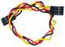
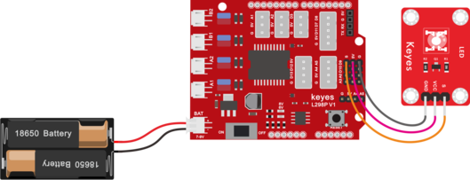

## 第2课 LED 亮度的调节 

### 2.1 项目介绍

前面课程中，我们详细的介绍了通过代码控制LED亮灭，实现闪烁的效果。这节课我们使用PWM来控制LED亮度不断地变化，模拟我们呼吸的效果。

PWM是使用数字手段来控制模拟输出的一种手段。使用数字控制产生占空比不同的方波（一个不停在高电平与低电平之间切换的信号)来控制模拟输出。一般来说端口的输入电压只有两个0V与5V。如果想要改变灯的亮度怎么办呢个？有同学说串联电阻，对，这个方法是正确的。但是，如果想要得到不同的亮度，且在不同亮度之间来回变动怎么办呢？不可能不停地切换电阻吧。这种情况下就需要使用PWM了，那它是怎么控制的呢？


对于Arduino的数字端口输出只有LOW与HIGH两个，对应的就是0V与5V的电压输出，可以把LOW定义为0，HIGH定义为1，1秒内让Arduino输出500个0或者1的信号。如果这500个全部为1，那就是完整的5V，如果全部为0，那就是0V。如果010101010101这样输出，刚好一半，端口输出的平均电压就为2.5V了。这个和放映电影是一个道理，咱们所看的电影并不是完全连续的，它其实是每秒输出25张图片。在这种情况下，人的肉眼是分辨不出来的，看上去就是连续的了。PWM也是同样的道理，如果想要不同的电压，就控制0与1的输出比例控制就可以了。当然这和真实的连续输出还是有差别的，单位时间内输出的0,1信号越多，控制的就越精确。

### 2.2 项目组件


|keyes UNO R3 for arduino 开发板*1|Keyes brick L298P 电机驱动扩展板 V1*1|keyes 草帽LED白发红模块*1|
|-|-|-|
||||
|USB线*1|3Pin 双母头杜邦线*1|18650双节电池盒*1|18650电池*2 （电池自配）|
||||

### 2.3 接线图

Arduino的PWM引脚在3，5，6，9，10，11,上一小节的接线刚刚好在9脚，所以我们这个接线不用变



### 2.4 项目代码

```
/*
4WD 蓝牙多功能车  
lesson 2.1
PWM
http://www.keyes-robot.com
*/
int ledPin = 9; // 定义LED引脚在D9
int value;
void setup () {
  pinMode (ledPin, OUTPUT); // 将ledpin初始化为输出
}
void loop () {
  for (value = 0; value < 255; value = value + 1) {
    analogWrite (ledPin, value); // LED灯逐渐点亮
    delay (5); // 延迟5毫秒
  }
  for (value = 255; value > 0; value = value - 1) {
    analogWrite (ledPin, value); // LED逐渐熄灭
    delay (5); // 延迟5毫秒
  }
}
```

### 2.5 项目结果

代码下载完成后，我们可以看到LED会有个逐渐由亮到灭的一个缓慢过程，而不是直接的亮灭，如同呼吸一般，均匀变化。

### 2.6 代码说明

当我们需要重复执行某句话时，我们可以使用for语句。

for语句格式如下：


```
for循环顺序如下：

第一轮：1 → 2 → 3 → 4

第二轮：2 → 3 → 4

…

直到2不成立，for循环结束。

知道了这么个顺序之后，回到代码中：

for (int value = 0; value \< 255; value=value+1){

...}

for (int value = 255; value \>0; value=value-1){

...}
```


这两个for语句实现了value的值不断由0增加到255，随之在从255减到0，在增加到255……,无限循环下去。

再看下for里面，涉及一个新函数analogWrite()。

我们知道数字口只有0和1两个状态，那如何发送一个模拟值到一个数字引脚呢？就要用到该函数。观察一下Arduino板，查看数字引脚，你会发现其中6个引脚旁标有“~”，这些引脚不同于其他引脚，它们可以输出PWM信号。

函数格式如下：

```
analogWrite(pin,value)
```

**analogWrite()**函数用于给PWM口写入一个0~255的模拟值。所以，value是在0~255之间的值。特别注意的是，**analogWrite()**函数只能写入具有**PWM**功能的数字引脚，也就是**D3，D5，D6，D9，D10，D11**引脚。

PWM是一项通过数字方法来获得模拟量的技术。数字控制来形成一个方波，方波信号只有开关两种状态（也就是我们数字引脚的高低）。通过控制开与关所持续时间的比值就能模拟到一个0到5V之间变化的电压。开（学术上称为高电平）所占用的时间就叫做脉冲宽度，所以PWM也叫做脉冲宽度调制。

通过下面五个方波来更形象的了解一下PWM。


PWM示意图

上图绿色竖线代表方波的一个周期。每个analogWrite(value)中写入的value都能对应一个百分比，这个百分比也称为占空比(Duty Cycle)，指的是高电平在周期内占的时间比值，也就是：占空比=高电平时间 /
周期时间。图中，从上往下，第一个方波，占空比为0%，对应的value为0。LED亮度最低，也就是灭的状态。高电平持续时间越长，也就越亮。所以，最后一个占空比为100%的对应value是255，LED最亮。50%就是最亮的一半了，25%则相对更暗。

PWM比较多的用于调节LED灯的亮度。或者是电机的转动速度，电机带动的车轮速度也就能很容易控制了，在玩一些Arduino机器人时，更能体现PWM的好处。

### 2.7 项目拓展

我们不改变灯的脚位，只是改变程序里面delay的值，看看它如何改变渐变效果。

```
/*
4WD 蓝牙多功能车 
lesson 2.2
PWM
http://www.keyes-robot.com
*/
int ledPin = 9; // 定义LED引脚在D9
int value;
void setup () {
  pinMode (ledPin, OUTPUT); // 将ledpin初始化为输出
}
void loop () {
  for (value = 0; value < 255; value = value + 1) {
    analogWrite (ledPin, value); // LED灯逐渐点亮
    delay (30); // 延迟30毫秒
  }
  for (value = 255; value > 0; value = value - 1) {
    analogWrite (ledPin, value); // LED逐渐熄灭
    delay (30); // 延迟30毫秒
  }
}
//**********************************************************
```

上传代码到开发板，看LED渐变的效果是不是慢了一些。