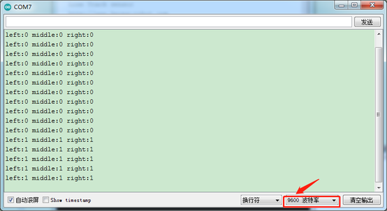

## 第3课 巡线传感器 

### 3.1 项目介绍


循迹传感器实际上是红外传感器。 此处使用的组件是TCRT5000红外管。其工作原理是利用红外光对颜色的不同反射率，然后将反射信号的强度转换为电流信号。在检测过程中，黑色在高电平时处于活动状态，而白色在低电平时处于活动状态。
检测高度为0-3厘米。

KEYES三路循迹模块在一块板上集成了三个TCRT5000红外管，接线和控制更加方便。通过旋转传感器上的可调电位器，可以调节传感器的检测灵敏度。

### 3.2 模块参数

工作电压：3.3-5V（DC）

接口：5PIN

输出信号：数字信号

检测高度：0-3厘米

**特别说明：在测试之前，请旋转传感器上的电位器以调整检测灵敏度。**当将LED调整在ON和OFF之间的阈值时，灵敏度是最好的。


### 3.3 项目组件

|keyes UNO R3 for arduino 开发板*1|Keyes brick L298P 电机驱动扩展板 V1*1|keyes 草帽LED白发红模块*1|Keyes connectors 循迹传感器*1|
|-|-|-|-|
|||||
|XH2.54转PH2.0 5P 连接线*1|3Pin 双母头杜邦线*1|USB线*1|18650双节电池盒*1|18650电池*2 （电池自配）|
|||||

### 3.4 接线图


循迹传感器接扩展板的D11、D7、D8引脚（左11，中7，右8）。

### 3.5 项目代码

```
/*
4WD 蓝牙多功能车 
lesson 3.1
Line Track sensor
http://www.keyes-robot.com
*/
int L_pin = 11;  //定义左边循迹传感器的引脚
int M_pin = 7;  //定义中间循迹传感器的引脚
int R_pin = 8;  //定义右边循迹传感器的引脚
int val_L, val_R, val_M; // 定义三个传感器的变量值
void setup()
{
  Serial.begin(9600); // 设置波特率为9600
  pinMode(L_pin, INPUT); //将L_pin设置为输入模式
  pinMode(M_pin, INPUT); //将m_pin设置为输入模式
  pinMode(R_pin, INPUT); //将R_pin设置为输入模式
}
void loop()
{ 
  val_L = digitalRead(L_pin);//读取L_pin的值:
  val_R = digitalRead(R_pin);//读取M_pin的值
  val_M = digitalRead(M_pin);//读取R_pin的值
  Serial.print("left:");//串口打印left
  Serial.print(val_L);//串口打印L_pin的值
  Serial.print(" middle:");//串口打印middle
  Serial.print(val_M);//串口打印M_pin的值
  Serial.print(" right:");//串口打印right
  Serial.println(val_R);//串口打印R_pin的值
  delay(500);//延时0.5秒
}
//****************************************************************************
```

### 3.6 项目结果

上传代码带开发板，打开串口监视，可以看到左中右三个循迹传感器的状态，如果我们用白纸去遮挡传感器，传感器的状态都是0。在没有接收到信号的时候，三个传感器都是高电平状态，显示的数值是1。



### 3.7 代码说明

```
Serial.begin(9600)-初始化串口,串口通信波特率为9600.

pinMode- 定义单片机PIN脚模式是输入还是输出，input是输入，output是输出.

digitalRead-读取引脚电平状态，一般有两种状态，HIGH或者LOW.
```

### 3.8 项目拓展

上面我们了解了循迹传感器的工作原理，接下来我们在第9脚接上一个LED
灯，然后通过读取循迹传感器的状态，来控制LED的亮和灭。如下图接线：


我们开始来编写代码：


```
/*
4WD 蓝牙多功能车  
lesson 3.2
Line Track sensor
http://www.keyes-robot.com
*/
int L_pin = 11;  //定义左边循迹传感器的引脚
int M_pin = 7;  //定义中间循迹传感器的引脚
int R_pin = 8;  //定义右边循迹传感器的引脚
int val_L, val_R, val_M; // 定义三个传感器的变量值
void setup()
{
  Serial.begin(9600); // 设置波特率为9600
  pinMode(L_pin, INPUT); //将L_pin设置为输入模式
  pinMode(M_pin, INPUT); //将m_pin设置为输入模式
  pinMode(R_pin, INPUT); //将R_pin设置为输入模式
  pinMode(9, OUTPUT);//将第9脚上接的LED灯设置为输入
}
void loop()
{ 
  val_L = digitalRead(L_pin);//读取L_pin的值:
  val_R = digitalRead(R_pin);//读取M_pin的值
  val_M = digitalRead(M_pin);//读取R_pin的值
  Serial.print("left:");//串口打印left
  Serial.print(val_L);//串口打印L_pin的值
  Serial.print(" middle:");//串口打印middle
  Serial.print(val_M);//串口打印M_pin的值
  Serial.print(" right:");//串口打印right
  Serial.println(val_R);//串口打印R_pin的值
  delay(500);//延时0.5秒
 if (val_L == LOW||val_M ==LOW||val_R == LOW)//if line tracking sensor 检测到信号
  {
    digitalWrite(9, HIGH);//LED 灯灭
  }
  else//如果left line tracking sensor 没有检测到信号
  {
    digitalWrite(9, LOW);//LED 灯亮
  }
}
```

上传代码到开发板，用我们的手去一个个的靠近传感器，我们看看LED灯的状态发生了改变没有？当我们用手去遮挡循迹传感器的时候，我们可以看到LED灯亮起来了。