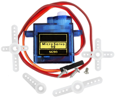
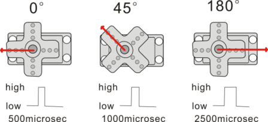
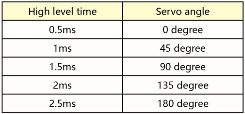
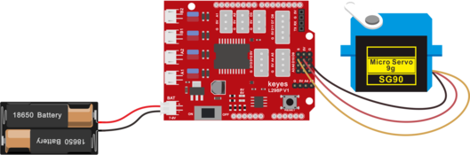
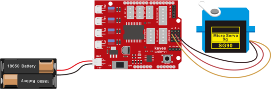

## 第4课 舵机控制



### 4.1 项目介绍

舵机是一种位置伺服的驱动器，主要是由外壳、电路板、无核心马达、齿轮与位置检测器所构成。其工作原理是由接收机或者单片机发出信号给舵机，其内部有一个基准电路，产生周期为20ms，宽度为1.5ms
的基准信号，将获得的直流偏置电压与电位器的电压比较，获得电压差输出。

舵机有很多规格，但所有的舵机都有外接三根线，分别用棕、红、橙三种颜色进行区分，由于舵机品牌不同，颜色也会有所差异，棕色为接地线，红色为电源正极线，橙色为信号线。

舵机的转动的角度是通过调节PWM（脉冲宽度调制）信号的占空比来实现的，标准PWM（脉冲宽度调制）信号的周期固定为20ms（50Hz），理论上脉宽分布应在1ms到2ms
之间，但是，事实上脉宽可由0.5ms 到2.5ms
之间，脉宽和舵机的转角0°～180°相对应。



对应的舵机角度值如下:



### 4.2 舵机参数

工作电压：DC 4.8V〜6V

可操作角度范围：大约 About 180°(在 500→2500 μsec)

脉波宽度范围：500→2500 μsec

空载转速：0.12±0.01 sec/60（DC 4.8V） 0.1±0.01 sec/60（DC 6V）

空载电流：200±20mA（DC 4.8V） 220±20mA（DC 6V）

停止扭力：1.3±0.01kg·cm（DC 4.8V） 1.5±0.1kg·cm（DC 6V）

停止电流：≦850mA（DC 4.8V） ≦1000mA（DC 6V）

待机电流：3±1mA（DC 4.8V） 4±1mA（DC 6V）

### 4.3 项目组件


|keyes UNO R3 for arduino 开发板*1|Keyes brick L298P 电机驱动扩展板 V1*1|Keyes SG90 9G 舵机*1|Keyes SG90 9G 舵机*1|
|-|-|-|-|
||||
|USB线*1|USB线*1|18650双节电池盒*1|18650电池*2 （电池自配）|
||||

### 4.4 接线图



接线注意：舵机连接到G（GND）、V（VCC）、10，舵机的棕色线是与Gnd(G)相连，红色线与5v(V)相连，橙色线是与数字10相连的。接舵机的时候必须要外接供电，因为驱动舵机的电流要求比较大，一般峰值的情况下接近1A，开发板的电流远远不够。如果不接外接电源，很有可能烧坏开发板。

### 4.5 项目代码1

```
/*
4WD 蓝牙多功能车  
lesson 4.1
Servo
http://www.keyes-robot.com
*/
#define servoPin 10  //servo Pin
int pos; //舵机的角度变量
int pulsewidth; //舵机的脉宽变量
void setup() 
{
  pinMode(servoPin, OUTPUT);  //舵机引脚设置为输出
  procedure(0); //设置舵机的角度为0度
}
void loop() {
  for (pos = 0; pos <= 180; pos += 1) 
  { 
    procedure(pos);              
    delay(15);   //控制舵机转动的速度
  }
  for (pos = 180; pos >= 0; pos -= 1) 
  {
    procedure(pos);              
    delay(15);
  }
}
//控制舵机的函数
void procedure(int myangle) 
{
  pulsewidth = myangle * 11 + 500;  //计算出脉宽值
  digitalWrite(servoPin, HIGH);
  delayMicroseconds(pulsewidth);   //高电平持续的时间，就是脉宽
  digitalWrite(servoPin, LOW);
  delay((20 - pulsewidth / 1000));  //周期是20ms，所以低电平持续剩下的时间
}
//**********************************************************************************
```

### 4.6 项目结果

在上传代码成功，我们可以看到舵机在0°到180°角度范围来回摆动。

其实我们还可以有一种更简单的方法控制舵机，就是使用Arduino的舵机库文件，可以参考Arduino
官方的使用说明：<https://www.arduino.cc/en/Reference/Servo>，

### 4.7 项目代码2

以下是使用了舵机库文件的程序,接线图不变



项目代码2:

```
/*
4WD 蓝牙多功能车
lesson 4.2 
Servo
http://www.keyes-robot.com
*/
#include <Servo.h>

Servo myservo;  // 创建舵机控制对象
                // 多数控制板最多支持12个舵机对象

int pos = 0;    // 存储舵机位置的变量

void setup()
{
  myservo.attach(10);  // 将舵机连接至10号引脚
}

void loop() 
{
  // 0°→180°正转
  for (pos = 0; pos <= 180; pos += 1) { 
    myservo.write(pos);              // 设定舵机角度
    delay(15);                       // 等待舵机转动到位
  }
  
  // 180°→0°反转
  for (pos = 180; pos >= 0; pos -= 1)
  { 
    myservo.write(pos);              // 设定舵机角度
    delay(15);                       // 等待舵机转动到位
  }
}
```

### 4.8 项目结果2

上传代码成功，上电后，舵机也是在0°到180°角度范围来回摆动。这两个项目的效果是一样的，通常我们使用库文件来控制的比较多。

### 4.9 代码说明

```
#include<Servo.h>是Arduino自带的Servo函数及其语句，下面是舵机函数的几个常用语句：  
1、attach（接口）——设定舵机的接口，只有9或10接口可用。  
2、write（角度）——用于设定舵机旋转角度的语句，可设定的角度范围是0°到180°。  
3、read（）——用于读取舵机角度的语句，可理解为读取最后一条write()命令中的值。  
4、attached（）——判断舵机参数是否已发送到舵机所在接口。  
注：以上语句的书写格式均为“舵机变量名.具体语句（）”例如：myservo.attach(9)。
```

