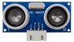
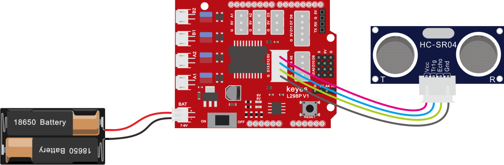
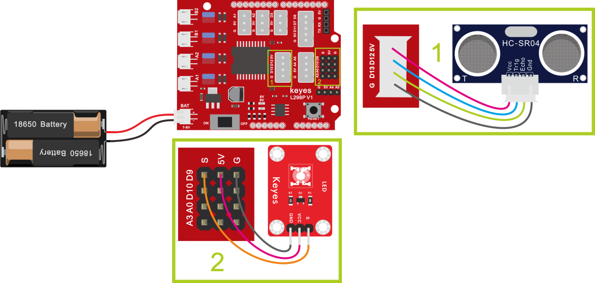

## 第5课 超声波模块项目 

### 5.1 项目介绍


HC-SR04超声波传感器像蝙蝠一样使用声纳来确定到物体的距离。它提供出色的非接触范围检测，具有高精度和稳定的读数。它带有超声波发射和接收模块。HC-SR04或超声波传感器被广泛用于创建障碍物检测和距离测量应用以及其他各种应用的电子项目中。在这里，我们介绍使用arduino和超声传感器测量距离的简单方法.

### 5.2 超声波参数

电源：+ 5V DC

静态电流：\<2mA

工作电流：15mA

有效角度：\<15°

测距范围：2cm – 400 cm

分辨率：0.3厘米

测量角度：30度

触发输入脉冲宽度：10uS

### 5.3 项目组件

|keyes UNO R3 for arduino 开发板*1|Keyes brick L298P 电机驱动扩展板 V1*1|keyes 草帽LED白发红模块*1|HC-SR04超声波传感器*1|
|-|-|-|-|
|||||
|HX-2.54 4P 双头 连接线*1|3Pin 双母头杜邦线*1|USB线*1|18650双节电池盒*1|18650电池*2 （电池自配）|
|||||

### 5.4 超声波模块知识

原理：看超声波的图可知，像是有两个眼睛，其一边是发射超声的，一边是接收超声波的，然后检测从发射遇到障碍物返回被接收到所需的时间t，再根据声音在空气中的传播速度大概是343m/s, **距离 = 速度 \* 时间** ，由于超声波发射返回是两段路程了，所以需要除以2，故超声波测到的**距离=（速度 \* 时间）/2**

```
超声波模块的使用方法及时序图：

1、使用GPIO引脚给SR04的Trig引脚至少10μs的高电平信号，触发SR04模块测距功能；

2、触发后，模块会自动发送8个40KHz的超声波脉冲，并自动检测是否有信号返回。这步会由模块内部自动完成。

3、如有信号返回，Echo引脚会输出高电平，高电平持续的时间就是超声波从发射到返回的时间。
```


### 5.5 超声波模块的电路图


### 5.6 接线图

**接线注意**：超声波传感器模块的VCC引脚连接至keyestudio V5
传感器扩展板的5v(V)，Trig引脚至数字12(S)，Echo引脚至数字13(S)，Gnd引脚至Gnd(G)。



### 5.7 项目代码

```
/*
4WD 蓝牙多功能车  
lesson 5.1
Ultrasonic sensor
http://www.keyes-robot.com
*/
int trigPin = 12;    // 定义超声波发射脚位
int echoPin = 13;    // 定义超声波接收脚位
long duration, cm, inches;
void setup() {
  Serial.begin (9600);  //开始串口打印
  pinMode(trigPin, OUTPUT); //定义超声波发射为输出
  pinMode(echoPin, INPUT); //定义超声波接收为输入
}
void loop() {
 //传感器由10毫秒或更长时间的高电平脉冲触发
 //预先给短的LOW脉冲以确保稳定高电平脉冲
  digitalWrite(trigPin, LOW);
  delayMicroseconds(2);
  digitalWrite(trigPin, HIGH);
  delayMicroseconds(10);
  digitalWrite(trigPin, LOW);
   //读取来自传感器的信号：一个高脉冲
  //持续时间是指从发送到发送的时间（以微秒为单位）
  // ping到接收对象的回声。
  duration = pulseIn(echoPin, HIGH);
//将时间转换为距离
  cm = (duration/2) / 29.1;     // 除以29.1或乘以0.0343
  inches = (duration/2) / 74;   // 除以74或乘以0.0135
  Serial.print(inches);
  Serial.print("in, ");
  Serial.print(cm);
  Serial.print("cm");
  Serial.println();
  delay(200);
}
//**************************************************************************
```

### 5.8 项目结果

上传好测试代码到开发板，打开串口监视器，设置波特率为9600，我们可以看到超声波模块显示的距离，单位是厘米和英寸。用手阻挡超声波模块，我们看到显示距离的数值变小了。


### 5.9 代码说明

```
int trigPin- 这个是定义发射超声波的脚位，通常是输出

int echoPin - 这个是定义接收超声波的脚位，通常是输入

cm = (duration/2) / 29.1

inches = (duration/2) / 74
```

我们可以使用以下公式计算距离：

```
距离=（行驶时间/ 2）x声速
```

**声音速度为：343m / s = 0.0343 cm / uS = 1 / 29.1 cm / uS**

或英寸：13503.9in / s = 0.0135in / uS = 1 / 74in / uS

我们需要将传播时间除以2，因为我们必须考虑到波浪已发送，撞击物体然后返回到传感器。

### 5.10 项目拓展

我们刚刚测出了超声波显示的距离，那我们动动脑筋，能不能用测出的距离来做一些控制呢，如果控制一个LED灯的亮和灭。我们来试一下，在D9脚接上一个LED灯模块。




```
/*
4WD 蓝牙多功能车  
lesson 5.2
Ultrasonic sensor
http://www.keyes-robot.com
*/
int trigPin = 12;    // 定义超声波发射脚位
int echoPin = 13;    // 定义超声波接收脚位
long duration, cm, inches;
void setup() {
  Serial.begin (9600);  //Serial Port begin开始串口打印
  pinMode(trigPin, OUTPUT); //定义超声波发射为输出
  pinMode(echoPin, INPUT); //定义超声波接收为输入
  pinMode(9, OUTPUT);//将第9脚上接的LED灯设置为输入
}
void loop() {
 //传感器由10毫秒或更长时间的高电平脉冲触发
 //预先给短的LOW脉冲以确保稳定高电平脉冲
  digitalWrite(trigPin, LOW);
  delayMicroseconds(2);
  digitalWrite(trigPin, HIGH);
  delayMicroseconds(10);
  digitalWrite(trigPin, LOW);
   //读取来自传感器的信号：一个高脉冲
  //持续时间是指从发送到发送的时间（以微秒为单位）
  // ping到接收对象的回声。
  duration = pulseIn(echoPin, HIGH);
//将时间转换为距离
  cm = (duration/2) / 29.1;     // 除以29.1或乘以0.0343
  inches = (duration/2) / 74;   // 除以74或乘以0.0135
  Serial.print(inches);
  Serial.print("in, ");
  Serial.print(cm);
  Serial.print("cm");
  Serial.println();
  delay(200);
 if (cm >= 2 && cm <= 10)//如果超声波测到的距离大于2小于10CM
{
    digitalWrite(9, HIGH);//点亮LED
  }
  else//如果不是
 {
    digitalWrite(9, LOW);熄灭LED
  }
}
//****************************************************************
```

上传好测试代码到开发板，我们用手去靠近超声波传感器，看LED
灯亮起来了没有。