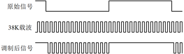
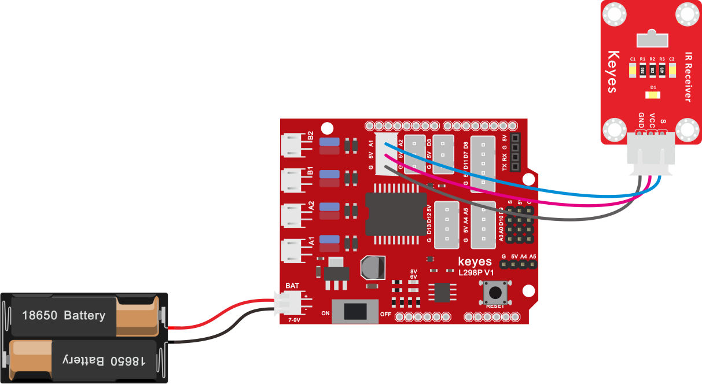
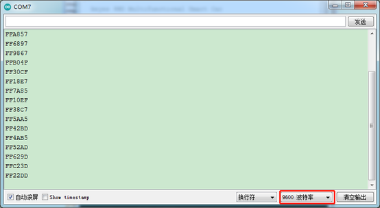
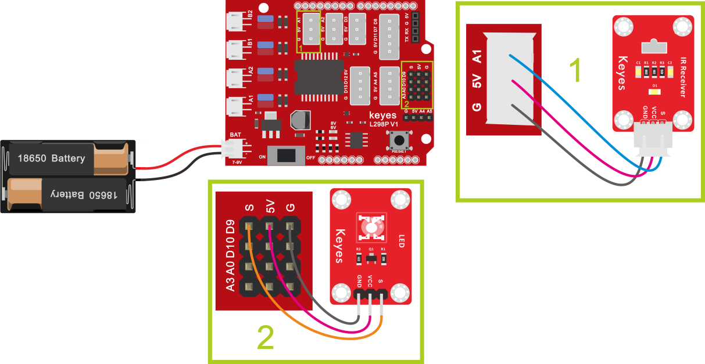

## 第6课 红外接收原理及应用 

### 6.1 项目介绍


红外遥控在日常生活中随处可见，它被用来控制各种家电，如电视、音响、录影机和卫星信号接收器。红外遥控是由红外发射和红外接收系统组成的，也就是一个红外遥控器和红外接收模块和一个能解码的单片机组成的。 



红外发射的遥控器发射的38K红外载波信号是由遥控器里的编码芯片对其进行编码。它是以一段引导码，用户码，数据码，数据反码组成，利用脉冲的时间间隔来区别是0还是1信号(高电平低电平之比约为1:1时被认为是信号0)，而编码就是由这些0、1信号组成。同一个遥控器的用户码是不变的，用数据吗不同来分辨遥控器按的键不同。当按下遥控器按键时，遥控器发送出红外载波信号，红外接收器接收到信号时程序对载波信号进行解码，通过数据码的不同来判断按下的是哪个键。单片机由接收到的01信号进行解码，由此判断遥控器按下的是什么键。

红外接收我们用的是一个红外接收模块，主要由红外接收头组成，它是集接收、放大、解调一体的器件，它内部IC就已经完成了解调，能够完成从红外线接收到输出与TTL电平信号兼容的所有工作，输出的就是数字信号。他适用于红外线遥控和红外线数据传输。接收器做成的红外接收模块只有三个引脚，信号线，VCC，GND。与arduino和其他单片机连接通信非常方便。

### 6.2 红外接收的参数

工作电压：3.3-5V（DC）

接口：3PIN接口

输出信号：数字信号

接收角度：90度

频率：38khz  
接收距离：10米

右图为红外接收模块的实物图和电路图

项目组件：

|        keyes UNO R3 for arduino 开发板*1        |      Keyes brick L298P 电机驱动扩展板 V1*1      |            keyes 草帽LED白发红模块*1            |
| :---------------------------------------------: | :---------------------------------------------: | :---------------------------------------------: |
|  |  |  |
|          keyes brick 红外接收传感器*1           |              JMP-1 17键红外遥控*1               |                     USB线*1                     |
|  |  |  |
|               3Pin 双母头杜邦线*1               |             XH2.54-3Pin+杜邦母双*1              |           18650双节电池盒*1(电池自备)           |
|  |  |  |

### 6.3 接线图

**接线注意：**由于红外接收传感器输入的数字信号，将红外接收传感器模块的“-”、“+”和S引脚分别用导线连接到keyestudio传感器扩展板G（GND）、V（VCC）、A1，模拟口在数字口不够的情况下，模拟口也可以当数字口使用，模拟口A0相当于数字口14，A1相当于数字口15，以此类推。



### 6.4 项目代码

在编写代码之前，要先导入红外的库文件，具体步骤请参考，（3.4 添加库）这个文档。


```
/*
4WD 蓝牙多功能车  
lesson 6.1
IRremote
http://www.keyes-robot.com
*/
#include <IRremote.h>     // IRremote库声明  
int RECV_PIN = A1;        //定义红外接收器的引脚为A1
IRrecv irrecv(RECV_PIN);
decode_results results;   //解码结果放在 decode results结构的 result中
void setup()
{
  Serial.begin(9600);
  irrecv.enableIRIn(); // 启动接收器
}
void loop() {
  if (irrecv.decode(&results))//解码成功，收到一组红外讯号
  {
    Serial.println(results.value, HEX);//以16进制换行输出接收代码
    irrecv.resume(); // 接收下一个值
  }
  delay(100);
}
//*******************************************************
```

### 6.5 项目结果

上传好测试代码，打开串口监视器，设置波特率为9600，拿出遥控器，对准红外接收传感器发送信号，即可看相应按键的键值，如果按键时间过长，容易出现乱码。



我们通过测试得出的数值，做了一个遥控器按键值表，方便以后使用。


### 6.6 代码说明

```
irrecv.enableIRIn()-启动红外解码后，这时候IRrecv对象会在后台接收红外线信号。

decode()-接着就可以利用decode()函数持续检查，看看有没有解码成功。

irrecv.decode(&results)  解码成功，这个函数会返回true，并把结果放在results里面，在解码一个红外线信号之后，要运行resume()函数，这样才会持续接收下一组信号。

```

### 6.7 项目拓展

我们刚刚解码了红外遥控器的按键值，那我们能不能用测出的按键值来做一些控制呢，如果控制一个LED灯的亮和灭。我们来试一下，在9脚接上一个LED灯模块。红外接收器的脚位不变,当有遥控器的按键按下时,接在数字引脚9上的发光LED就会点亮，再按一下按键，led熄灭，接线图如下：




```
/*
4WD 蓝牙多功能车  
lesson 6.2
IRremote
http://www.keyes-robot.com
*/
#include <IRremote.h>
int RECV_PIN = A1;//定义红外接收器的引脚为A1
int LED_PIN = 9; //定义发光LED引脚数字9
int a = 0;
IRrecv irrecv(RECV_PIN);
decode_results results;
void setup()
{
  Serial.begin(9600);
  irrecv.enableIRIn(); // 初始化红外接收器
  pinMode(LED_PIN, OUTPUT); //设置发光LED引脚数字9为输出模式
}
void loop() {
  if (irrecv.decode(&results)) {
    Serial.println(results.value, HEX);
    if (results.value == 0xFF02FD & a == 0) //由上面的键值码，我们用的遥控器上的OK键，如果按下OK键
    {
      digitalWrite(LED_PIN, HIGH); //LED点亮
      a = 1;
    }
    else if (results.value == 0xFF02FD & a == 1) //再按一下
    {
      digitalWrite(LED_PIN, LOW); //LED熄灭
      a = 0;
    }
    irrecv.resume(); // 接收下一个值
  }
}
//**********************************************************************************
```

上传代码带开发板,当遥控器按下OK按键时,LED就会亮，再按一下LED就会灭,同时电脑的串口会出现按键的命令编码.