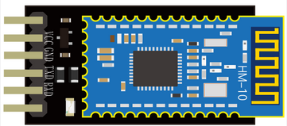
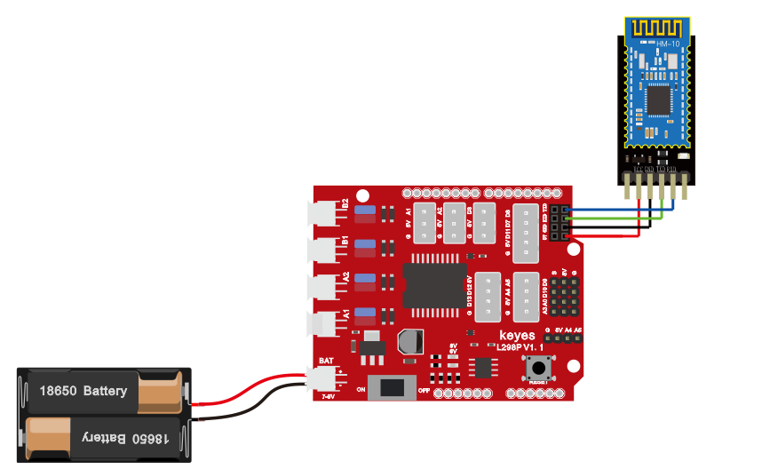
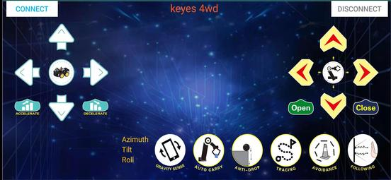
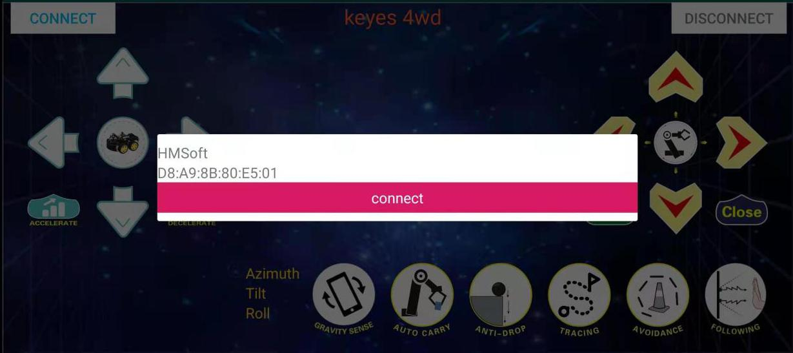
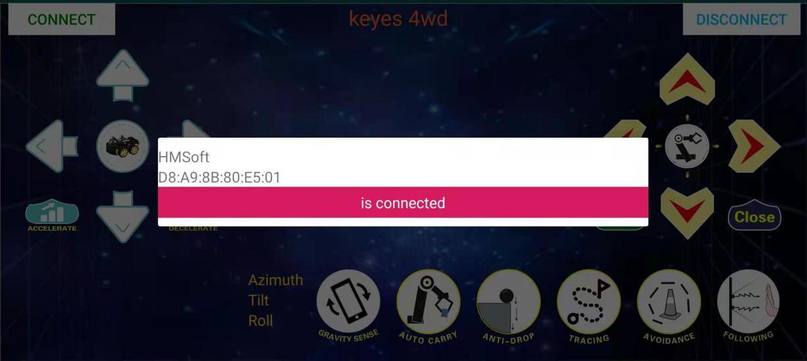
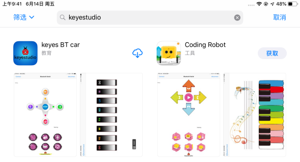
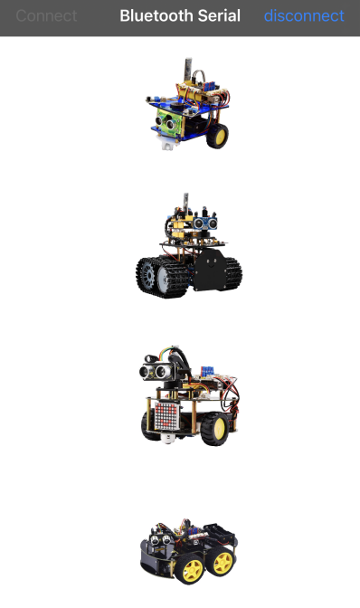
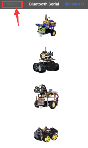
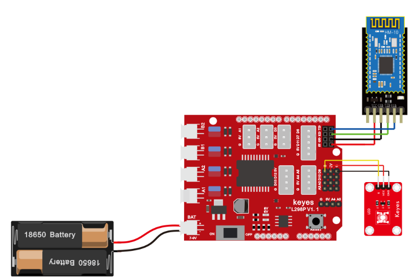
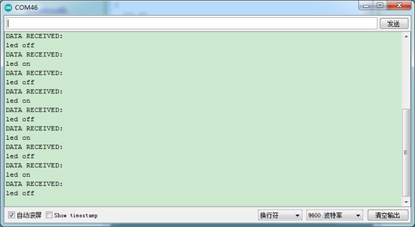

## 第7课 蓝牙遥控的原理及应用 

### 7.1 项目介绍

蓝牙是近几十年来最流行的一种简单的无线通信模块，易于使用，已在大多数电池供电的设备中使用。蓝牙标准进行了许多升级，以不断满足客户和技术的需求。几年来，发生了许多变化，包括数据传输速率，可穿戴设备和IoT设备以及安全系统的功耗。

在这里，我们将学习HM-10 BLE 4.0。 HM-10是一种随时可用的蓝牙4.0模块。
该模块用于建立无线数据通信。
该模块是使用德州仪器（TI）的CC2540或CC2541蓝牙低功耗（BLE）片上系统（SoC）设计的。

### 7.2 蓝牙参

蓝牙协议：蓝牙V4.0 BLE串口收发无字节限制

工作距离：在开放环境中，实现50-100m超远距离通讯

工作频率：2.4GHz ISM频段

调制方式：GFSK（高斯频移键控）

传输功率：-23dbm，-6dbm，0dbm，6dbm，可通过AT命令修改。

灵敏度：0.1％BER时≤-84dBm

传输速率：异步：6K字节； 同步：6k字节

安全功能：身份验证和加密

支持服务：中央和外围UUID FFE0，FFE1

功耗：自动休眠模式，待机电流400uA〜800uA，传输期间为8.5mA。

电源：5V DC

工作温度：–5至+65摄氏度

### 7.3 项目组件


|keyes UNO R3 for arduino 开发板*1|Keyes brick L298P 电机驱动扩展板 V1*1|keyes 草帽LED白发红模块*1|Keyes Bluetooth-4.0 蓝牙4.0 V2*1|
|-|-|-|-|
||||  |
|3Pin 双母头杜邦线*1|USB线*1|18650双节电池盒*1|18650电池*2 （电池自配）|
|||||

### 7.4 接线图



**注意：在上传代码之前不要将蓝牙插在扩展板或UNO板上。烧录完成程序后。烧录完成后，再将蓝牙按上图VCC与扩展板的5V对齐，正确插在扩展板上的串口位置。**

### 7.5 项目代码


```
/*
4WD 蓝牙多功能车  
lesson 7.1
bluetooth
http://www.keyes-robot.com
*/
char ble_val; //字符变量，用于存放蓝牙接收到的值
void setup() {
  Serial.begin(9600);
}
void loop() {
  if (Serial.available() > 0) //判断串口缓存区是否有数据
  {
    ble_val = Serial.read();  //读取串口缓存区的数据
    Serial.println(ble_val);  //打印出来
  }
}
//**********************************************************************
```

**上传代码之前不要连接蓝牙模块，因为代码的上传也是用的串口通信，跟蓝牙的串口通信会有冲突，导致代码上传不成功**

上传代码到开发板，然后再插上蓝牙模块，等待手机发出的指令。

### 7.6 下载蓝牙测试APP

#### 7.6.1 安卓系统手机APP

1. 扫码下载

   或者进入APP下载链接：http://8.210.52.206/keyes_4WD_Car.apk

**注意：当我们扫码下载的时候需要使用浏览器打开，使用微信扫可能无效**。

2.  下载后安装，安装成功，显示图标如下。


3. 点击上图图标，进入APP，显示如下图。



4. REV4板上传代码成功后，连接蓝牙，上电后，蓝牙模块上LED闪烁。点击APP图标，搜索到蓝牙，显示如下图。



5. 点击连接，蓝牙连接成功，显示如下图，蓝牙模块上LED变为常亮。



#### 7.6.2 苹果系统手机APP

1.打开App Store。


2.点击搜索，搜索keyestudio，下载搜索到的keyes BT car。



3.打开keyes BT car。



4.开启手机蓝牙，点击左上角的connect按钮，进行蓝牙搜索和连接。



5.点击桌面小车的图片按钮，进入控制桌面小车的界面


### 7.7 代码说明

```
Serial.available()的意思是：返回串口缓冲区中当前剩余的字符个数。一般用这个函数来判断串口的缓冲区有无数据，当Serial.available()\>0时，说明串口接收到了数据，可以读取。
```

```
Serial.read()指从串口的缓冲区取出并读取一个Byte的数据，比如有设备通过串口向Arduino发送数据了，我们就可以用Serial.read()来读取发送的数据。
```

### 7.8 项目拓展

上面的项目，我们讲解了蓝牙接收到手机发送的信号并且在开发板的串口显示出来，比如我们按下，然后我们就会接收到‘B’，当我们松开的时候又接收到‘S’。那接下来我们就要想一下了，我们可以利用接收到的信号去做一些事情吗，答案是肯定的，我们这里就利用手机发送的命令去打开或者关闭一个LED灯。看接线图，在D9脚接了一个LED。




```
/*
4WD 蓝牙多功能车  
lesson 7.2
bluetooth
http://www.keyes-robot.com
*/
int ledpin = 9;//定义LED灯的脚位在D9
void setup()
{
  Serial.begin(9600);开始串口打印
  pinMode(ledpin, OUTPUT);
}
void loop()
{
  int i;
  if (Serial.available())//判断串口缓存区是否有数据
  {
    i = Serial.read();//读取串口缓存区的数据
    Serial.println("DATA RECEIVED:");
    if (i == 1)//如果串口数据是1
    {
      digitalWrite(ledpin, HIGH);//点亮LED
      Serial.println("led on");//串口打印led on
    }
    if (i == 0)//如果串口数据是0
    {
      digitalWrite(ledpin, LOW);//熄灭LED
      Serial.println("led off");//串口打印led off
    }
  }
}
//*************************************************************************
```

### 7.9  代码说明

上传代码完成后，点击手机APP上以控制LED。当您按下发送\`\`B''时LED将打开，而当您松开发送\`\`S''时，LED将关闭。

