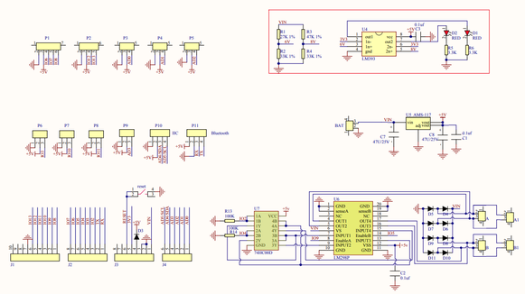
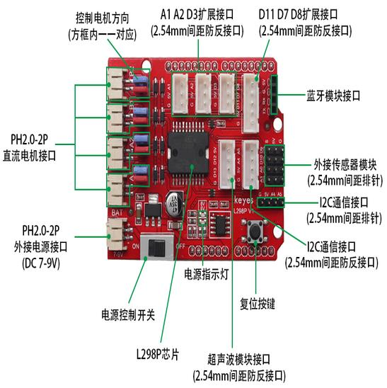
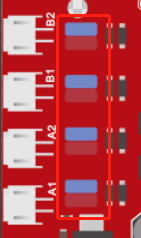
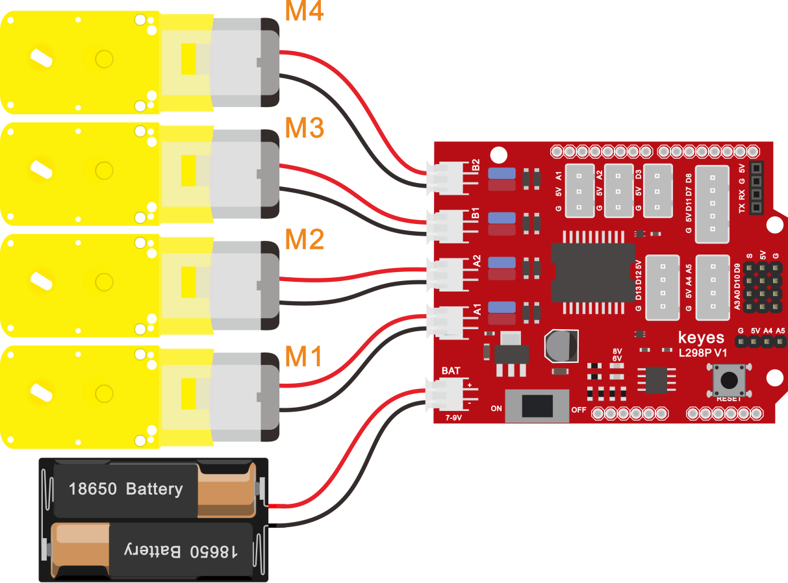

## 第8课 电机的驱动和调速 

### 8.1 项目介绍

驱动电机的方法有很多，我们这个智能车用到的是最常用的L298P这个方案，
L298P是ST意法半导体公司出品的优秀大功率电机专用驱动芯片，可直接驱动直流电机、二相、四相步进电机，驱动电流达2A，电机输出端采用8只高速肖特基二极管作为保护。

我们根据L298P的电路设计了一款扩展板，叠层的设计可直接插接到开发板上使用，降低了用户使用和驱动电机的技术难度。

### 8.2 电路图和示意图







为了调节小车上的4个电机，使得电机电机的驱动方向与后续的课程代码描述一致。驱动板上自带8个跳线帽，也可用于控制电机转向，例如当MA电机接口前方2个跳线帽由横向连接改为纵向连接时，MA电机的转动方向就和原来的转动方向相反。

#### 8.2.1 规格参数

逻辑部分输入电压：DC 5V

驱动部分输入电压：DC 7-12V

逻辑部分工作电流：\<36mA

驱动部分工作电流：\<2A

最大耗散功率：25W（T=75℃）

控制信号输入电平：高电平2.3V\<Vin\<5V  ，低电平-0.3V\<Vin\<1.5V  
工作温度：-25＋130℃

#### 8.2.2 驱动小车运行原理

根据上面电机驱动板的电路图和示意图，我们让MA电机的方向引脚在D2，调速引脚在D6，MB电机的方向引脚在D4，调速引脚在D5，按照以下表格的运动逻辑，我们就可以知道如何通过控制数字口，PWM口控制2个电机转动，从而实现智能小车的行走。其中PWM值范围为0-255，设置数值越大，电机转动越快。（A1接M1电机、A2接M2电机、B1接M3电机、B2接M4电机）

||D2|D6（PWM）|电机组MA（M1、M2）|D4|D5（PWM）|电机组MB （M3、M4）|
|-|-|-|-|-|-|-|
|前进|LOW|200|正转|HIGH|200|正转|
|后退|HIGH|200|反转|LOW|200|反转|
|右旋转|LOW|200|正转|LOW|200|反转|
|左旋转|HIGH|200|反转|HIGH|200|正转|
|停止|/|0|停止|/|0|停止|

### 8.3 项目组件


|keyes UNO R3 for arduino 开发板*1|Keyes brick L298P 电机驱动扩展板 V1*1|4.5V 200转/分 单轴减速箱+双头轴马达+250MM PH2.0mm-2P线材*4|
|-|-|-|
||||
||USB线|18650双节电池盒*1|18650电池*2 （电池自配）|
|||||

### 8.4 接线图



### 8.5 项目代码

```
/*
4WD 蓝牙多功能车  
lesson 8.1
motor driver shield
http://www.keyes-robot.com
*/
int MA = 2; //定义电机M1,M2方向控制引脚为D2
int PWMA = 6; //定义电机M1,M2速度控制引脚为D6
int MB = 4; //定义电机M3,M4方向控制引脚为D4
int PWMB = 5; //定义电机M3,M4速度控制引脚为D5
void setup() {
  pinMode(MA, OUTPUT); //配置电机引脚为输出模式
  pinMode(PWMA, OUTPUT);
  pinMode(MB, OUTPUT);
  pinMode(PWMB, OUTPUT);
}
void loop() {
  //前进1秒
  digitalWrite(MA, LOW); //电机A正转
  analogWrite(PWMA, 200); //电机A速度为200
  digitalWrite(MB, HIGH); //电机B正转
  analogWrite(PWMB, 200); //电机B速度为200
  delay(1000);

  //后退1秒
  digitalWrite(MA, HIGH); //电机A反转
  analogWrite(PWMA, 200); //电机A速度为200
  digitalWrite(MB, LOW); //电机B反转
  analogWrite(PWMB, 200); //电机B速度为200
  delay(1000);

  //左转1秒
  digitalWrite(MA, HIGH); //电机A反转
  analogWrite(PWMA, 200); //电机A速度为200
  digitalWrite(MB, HIGH); //电机B正转
  analogWrite(PWMB, 200); //电机B速度为200
  delay(1000);

  //右转1秒
  digitalWrite(MA, LOW); //电机A正转
  analogWrite(PWMA, 200); //电机A速度为200
  digitalWrite(MB, LOW); //电机B反转
  analogWrite(PWMB, 200); //电机B速度为200
  delay(1000);

  //停止1秒
  analogWrite(PWMA, 0);
  analogWrite(PWMB, 0);
  delay(1000);
}
//***********************************************************************
```

### 8.6 项目结果

上传代码成功，上电后，智能车前进1秒，后退1秒，左转1秒，右转1秒，停止1秒，循环。

### 8.7 代码说明

```
digitalWrite(MB,LOW);电机的正反转是靠高低电平的转换来实现的，控制电机正反转的脚位用一般的数字脚位就可以了。
```

```
analogWrite(PWMB,200);电机的速度调节是靠PWM来实现的，控制电机调速的脚位必须是Arduino的PWM 脚位。
```

### 8.8 项目拓展

我们来通过调整PWM控制电机的速度，为后面我们控制车速做一个铺垫，接线不变


```
/*
4WD 蓝牙多功能车  
lesson 8.2
motor driver shield
http://www.keyes-robot.com
*/
int MA = 2; //定义电机M1,M2方向控制引脚为D2
int PWMA = 6; //定义电机M1,M2速度控制引脚为D6
int MB = 4; //定义电机M3,M4方向控制引脚为D4
int PWMB = 5; //定义电机M3,M4速度控制引脚为D5
void setup() {
  pinMode(MA, OUTPUT); //配置电机引脚为输出模式
  pinMode(PWMA, OUTPUT);
  pinMode(MB, OUTPUT);
  pinMode(PWMB, OUTPUT);

}
void loop() {
  //前进1秒
  digitalWrite(MA, LOW); //电机A正转
  analogWrite(PWMA, 100); //电机A速度为100
  digitalWrite(MB, HIGH); //电机B正转
  analogWrite(PWMB, 100); //电机B速度为100
  delay(1000);

  //后退1秒
  digitalWrite(MA, HIGH); //电机A反转
  analogWrite(PWMA, 100); //电机A速度为100
  digitalWrite(MB, LOW); //电机B反转
  analogWrite(PWMB, 100); //电机B速度为100
  delay(1000);

  //左转1秒
  digitalWrite(MA, HIGH); //电机A反转
  analogWrite(PWMA, 100); //电机A速度为100
  digitalWrite(MB, HIGH); //电机B正转
  analogWrite(PWMB, 100); //电机B速度为100
  delay(1000);

  //右转1秒
  digitalWrite(MA, LOW); //电机A正转
  analogWrite(PWMA, 100); //电机A速度为100
  digitalWrite(MB, LOW); //电机B反转
  analogWrite(PWMB, 100); //电机B速度为100
  delay(1000);

  //停止1秒
  analogWrite(PWMA, 0);
  analogWrite(PWMB, 0);
  delay(1000);
}
//***********************************************************************
```


上传代码成功，怎么样，电机转动的速度是不是慢了很多？