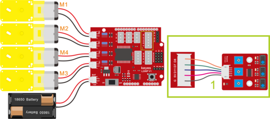
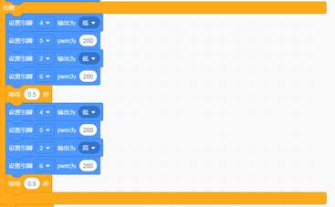
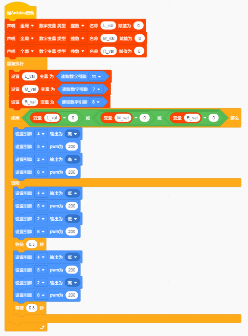

# 第10课 画地为牢智能车 

## （1）项目介绍：

前面我们详细的介绍了智能车上各个传感器、模块、扩展板的使用方法。在这里我们可以结合前面课程中知识制作一个画地为牢智能车。实验中，我们通过循迹传感器检测智能车底部是否存在黑线，然后根据检测结果控制两个电机的转动，从而把智能车关在黑线圈中即画地为牢。

## （2）流程图：

画地为牢智能车具体逻辑如下表格。

|检测|中循迹传感器|检测到黑线：高电平|
|-|-|-|
|检测|中循迹传感器|检测到白线：低电平|
|检测|左循迹传感器|检测到黑线：高电平|
|检测|左循迹传感器|检测到白线：低电平|
|检测|右循迹传感器|检测到黑线：高电平|
|检测|右循迹传感器|检测到白线：低电平|
|条件|状态|
|左循迹传感器没检测到黑线且中循迹传感器没检测到黑线且右循迹传感器没检测到黑线|前进（PWM设为200）|
|左循迹传感器检测到黑线或者中循迹传感器检测到黑线 或者右循迹传感器检测到黑线|后退（PWM设为200） 然后左旋转（PWM设为200）|

按照前面思路设计好智能车后，我们就需要按照设计思路开始制作智能车。我们需要设计对应的接线，测试代码，然后接线上传代码，运行，确保智能车能够实现理想中的功能。

## （3）接线图：循迹模块+电机

## （4）测试代码：

在事件栏拖出Arduino启动

在变量类型栏拖出设置变量模块，分别设置L_val、M_val、R_val三个变量

在控制栏拖出重复执行模块

设置三个变量L_val、M_val、R_val分别赋值11、7、8脚读取的值

设置条件L_val == 0或 M_val == 0 或 R_val == 0时执行前进代码

否则执行后退代码500ms；在执行左转代码800ms

（在上传程序代码前，需要把蓝牙模块取下，否则代码会上传失败。）

完整代码：

## （5）测试结果：

当小车行驶过程中检测到黑线立即后退500毫秒，然后左转800毫秒继续行驶。

