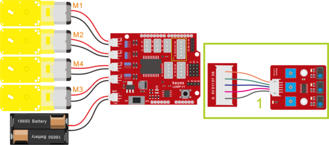
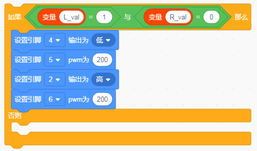
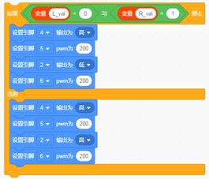
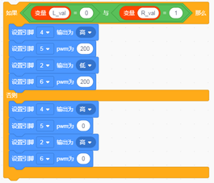
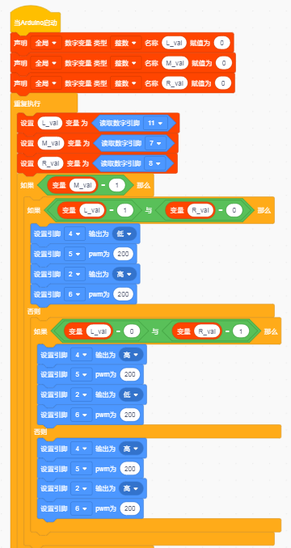
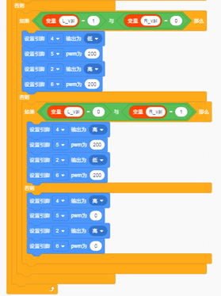

# 第11课 循线智能车

## （1）项目介绍：

前面我们详细的介绍了画地为牢智能车的实现方法。在这里我们可以结合前面课程中知识制作一个循迹智能车。实验中，我们还是通过循迹传感器检测智能车底部是否存在黑线，然后根据检测结果控制两个电机的转动，从而控制智能车沿着黑线行走。

## （2）流程图：

循迹智能车具体逻辑如下表格。

|检测|中循迹传感器|检测到黑线：高电平|
|-|-|-|
|检测|中循迹传感器|检测到白线：低电平|
|检测|左循迹传感器|检测到黑线：高电平|
|检测|左循迹传感器|检测到白线：低电平|
|检测|右循迹传感器|检测到黑线：高电平|
|检测到白线：低电平|
|条件|状态|
|中循迹传感器检测到黑线|左循迹传感器检测到黑线并且右循迹传感器检测到白线|左旋转（PWM设为200）|
|中循迹传感器检测到黑线|左循迹传感器检测到白线并且右循迹传感器检测到黑线|右旋转（PWM设为200）|
|中循迹传感器检测到黑线|左循迹传感器检测到白线并且右循迹传感器检测到白线|前进|
|中循迹传感器检测到黑线|左循迹传感器检测到黑线并且右循迹传感器检测到黑线|前进|
|中循迹传感器检测到白线|左循迹传感器检测到黑线并且右循迹传感器检测到白线|左旋转（PWM设为200）|
|中循迹传感器检测到白线|左循迹传感器检测到白线并且右循迹传感器检测到黑线|右旋转（PWM设为200）|
|中循迹传感器检测到白线|左循迹传感器检测到白线并且右循迹传感器检测到白线|停止|
|中循迹传感器检测到白线|左循迹传感器检测到黑线并且右循迹传感器检测到黑线|停止|

按照前面思路设计好智能车后，我们就需要按照设计思路开始制作智能车。我们需要设计对应的接线，测试代码，然后接线上传代码，运行，确保智能车能够实现理想中的功能。

## （3）接线图：

巡线模块+电机

接线注意：用导线把循迹模块连接到电机驱动扩展板上P1接口的G、V、D11、D7、D8；(M1、M2)和(M3、M4)两对时电机分别对应的连接到电机驱动扩展板上的接口B和接口A，电源接到BAT接口。

## （4）测试代码：

在事件栏拖出Arduino启动

在变量类型栏拖出设置变量模块，分别设置L_val、M_val、R_val三个变量

在控制栏拖出重复执行模块

设置三个变量L_val、M_val、R_val分别赋值11、7、8脚读取的值

在控制栏拖出如果...否则模块，并判断M_val是否等于1

在控制栏拖出如果...否则模块，并判断L_val是否等于1且R_val是否等于0，满足条件则执行左转代码

在控制栏拖出如果...否则模块，并判断L_val是否等于0且R_val是否等于1，满足条件则执行右转代码，不满足条件执行前进代码

在控制栏拖出如果...否则模块，并判断L_val是否等于1且R_val是否等于0，满足条件则执行左转代码

在控制栏拖出如果...否则模块，并判断L_val是否等于0且R_val是否等于1，满足条件则执行右转代码，不满足条件执行停止代码

完整代码：

## （5）测试结果：

将驱动扩展板堆叠在UNO Plus板上，上传好代码，按照接线图接线，将拨码开关拨至ON端后，智能车能够沿着黑线行走。

