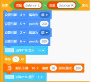
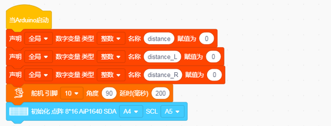
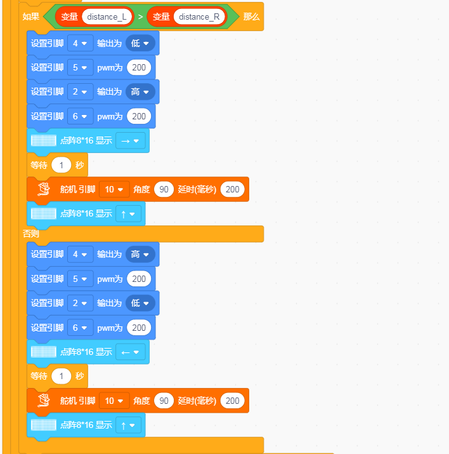
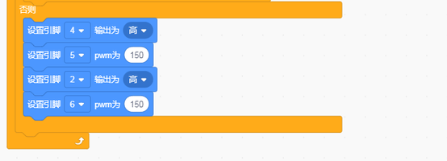

# 第13课 自动避障智能车

## （1）项目介绍：

在上课程中，我们制作了一个跟随智能车。实际上，利用同样的电子元件，同样的接线方法，我们只需要更改一个测试代码就可以将跟随智能车变为避障智能车。

## （2）流程图：

避障智能车具体逻辑如下表格。

|检测|左边障碍物距离|distance_l（单位：cm）|
|-|-|-|
|检测|右边障碍物距离|distance_r（单位：cm）|
|检测|中间障碍物距离|distance（单位：cm）|
|条件|状态|
|0<distance<20|distance_l > distance_r 如果左边大于右边|向左转|
|0<distance<20|distance_l<=distance_r 如果左边不大于右边|向右转|
|distance>=20|前进|

使用的电子元件，接线方法和课程四一样，更换测试代码，运行，确保智能车能够实
现理想中的功能。

## （3）接线图：超声波模块+电机+舵机

接线注意：A、B两电机分别对应的连接电机驱动扩展板上的接口A和接口B；超声波传感器模块的V引脚至V，T（Trig）引脚至数字12(S)，E（Echo）引脚至数字13(S)，G引脚至G；电源接到BAT接口，舵机S接D10。

## （4）测试代码

在事件栏拖出Arduino启动模块

在变量类型栏拖出声明全局变量模块定义distance、distance_R、distance_L三个变量

设置舵机初始化为90度

初始化点阵

在控制栏拖出重复执行模块

将超声波的值赋值给distance

在控制栏拖出如果...否则模块，判断distance是否大于0且小于20

小车停止，点阵显示“STOP”延时100ms

舵机转向180度，延时500ms，然后将超声波的值赋值给distance_L,延时100ms

舵机转向0度，延时500ms，然后将超声波的值赋值给distance_R,延时100ms

在控制栏拖出如果...否则模块，判断distance_L是否大于distance_R，如果是则执行左转代码，点阵显示向左箭头，延时100ms，舵机转回90度，点阵显示向前箭头（由于箭头在封装成代码块的时候是面向自己的，所以左右箭头刚好相反）

如果distance_L不大于distance_R那么执行右转代码，点阵显示向右箭头，延时100ms，舵机转回90度，点阵显示向前箭头（由于箭头在封装成代码块的时候是面向自己的，所以左右箭头刚好相反）

如果以上条件都不满足则执行前进代码，点阵显示向前箭头

完整代码：

## （5）测试结果

将驱动扩展板堆叠在UNO Plus板上，上传好代码，按照课程三接线图接线，将拨码开关拨至ON端后，智能车能够自动避开障碍物行走。

